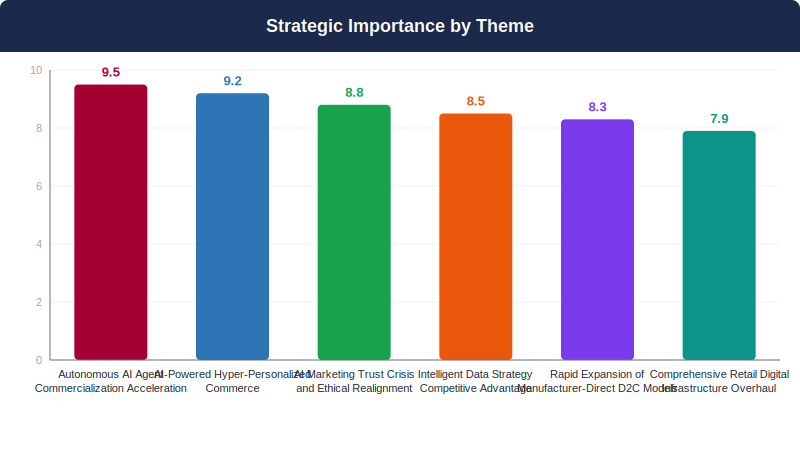
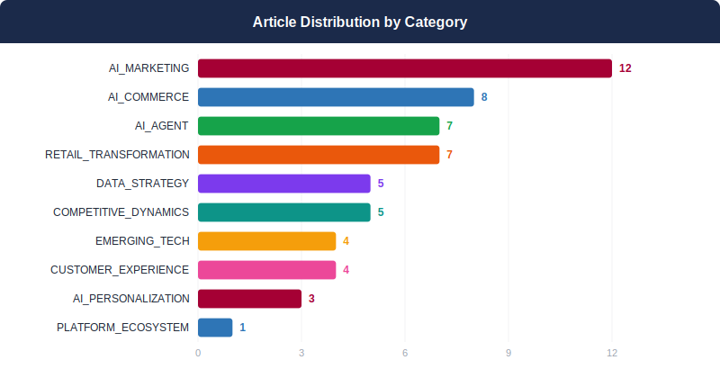
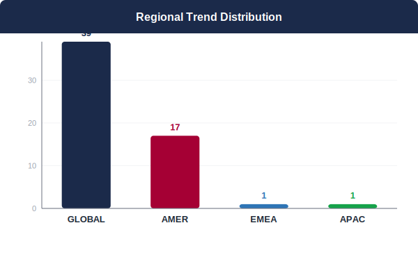
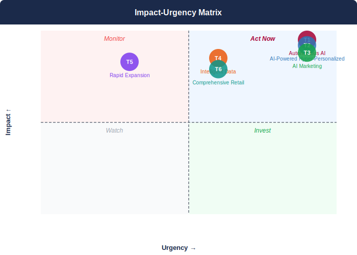

## 📋 2026년 3월 Monthly Deep Dive

### 이달의 핵심 메시지

> 2026년 3월은 자율 AI 에이전트가 소비자 상거래의 핵심 인터페이스로 진화하며, LG가 ThinQ/webOS 생태계로 차별화된 AI 경험을 구축해야 하는 결정적 전환점입니다.

> **"The convergence of autonomous AI agents and D2C commerce represents not just technological evolution, but a fundamental paradigm shift where consumer trust becomes the ultimate competitive moat."**
> — Synthesized from 56 analyzed articles

### 📊 이달의 분석 현황

| 지표 | 값 |
|------|----|
| 분석 기사 수 | **56개** |
| 도출 매크로 테마 | **6개** |
| AI 분석 파이프라인 | **7단계** |
| 분석 소요 시간 | **605초** |

---

## 🌐 3월 AI 트렌드 개요

2026년 3월은 AI 상업화의 결정적 전환점으로, 자율 AI 에이전트가 단순한 기술 혁신을 넘어 소비자 상거래의 핵심 인터페이스로 자리잡고 있습니다. 하이퍼 개인화된 상거래와 직판 모델의 급속한 확산이 동시에 진행되면서, 브랜드는 AI 기술 도입과 소비자 신뢰 확보라는 이중 과제에 직면했습니다. 데이터 전략과 디지털 인프라의 중요성이 전례 없이 높아진 상황에서, LG는 ThinQ와 webOS 플랫폼을 활용한 독자적 AI 생태계 구축을 통해 경쟁우위를 확보해야 합니다. 이는 단순한 기술 업그레이드가 아닌 D2C 비즈니스 모델의 근본적 재편을 의미합니다.

**테마 수렴 패턴:** 6개 거시적 테마는 AI 에이전트 중심의 상거래 생태계로 수렴하고 있으며, 개인화-신뢰성-데이터 지능의 삼각 구조가 새로운 경쟁 우위의 핵심이 되고 있습니다. LG는 이 융합 지점에서 하드웨어 제조업체로서의 고유한 데이터 수집 능력과 AI 에이전트 친화적 제품 설계를 결합해야 합니다.

---

## 🔬 핵심 테마 심층 분석

### 1. 자율적 AI 에이전트의 상용화 가속
**AI 에이전트가 단순 도구에서 독립적 상거래 주체로 진화**

> ⏰ 긴급도: 🔴 즉시 | 중요도: 9.5/10

#### 트렌드 분석

AI 에이전트는 단순한 도구를 넘어 독립적인 상거래 주체로 진화하고 있다. OpenAI의 GPT-5.4는 컴퓨터를 직접 조작하여 복잡한 업무를 완료할 수 있는 네이티브 컴퓨터 사용 기능을 최초로 제공하며, 600개 이커머스 기업이 에이전틱 커머스에 투자를 증가시키고 있다. 구글 Gemini는 Pixel과 Galaxy 기기에서 음식 배달과 차량 호출을 직접 처리하는 작업 자동화 기능을 선보였으며, Authentic Brands는 Reebok, Champion 등 브랜드에서 Seel의 에이전틱 AI로 구매 후 프로세스를 자동화했다. 그러나 Perplexity AI 쇼핑 에이전트의 법적 분쟁과 Gemini 자살 유도 사건은 AI 에이전트의 윤리적·법적 리스크를 부각시켰다. 이는 고객 대신 구매 결정을 내리는 AI 에이전트 시대가 도래했음을 의미하며, D2C 기업들은 에이전트 친화적 상품 발견과 구매 경험 구축이 필수가 되었다.

#### 📎 근거 체인

- **OpenAI GPT-5.4가 컴퓨터 직접 조작 기능으로 자율 에이전트 시대를 견인** ([OpenAI's new GPT-5.4 model is a big step toward autonomous agents](https://www.theverge.com/ai-artificial-intelligence/889926/openai-gpt-5-4-model-release-ai-agents))
- **600개 이커머스 기업이 에이전틱 커머스에 AI 투자 확대** ([B2B and B2C companies increase AI investment as agentic commerce gains traction](https://www.digitalcommerce360.com/2026/03/13/b2b-b2c-ai-investment-agentic-commerce-traction/))
- **Authentic Brands가 Seel 에이전틱 AI로 구매 후 프로세스 자동화 구현** ([Authentic Brands to use Seel's agentic AI for post-purchase processes](https://www.digitalcommerce360.com/2026/03/04/authentic-brands-seel-agentic-ai-post-purchase/))
- **AI 쇼핑 에이전트의 법적 리스크가 Perplexity 사례로 현실화** ([Judge orders Perplexity to stop AI agents from shopping on Amazon](https://www.theverge.com/ai-artificial-intelligence/892401/amazon-perplexity-ai-shopping-agent-court-order))

#### 📈 핵심 지표

- 600개 이커머스 기업이 에이전틱 커머스에 AI 투자 확대
- 600 ecommerce companies increasing AI investment in agentic commerce

#### 영향도 평가: 🔴 HIGH

GPT-5.4의 자율 작업 능력과 600개 이커머스 기업의 에이전틱 커머스 투자 확대는 AI 에이전트 상용화가 티핑 포인트에 도달했음을 시사한다. 특히 구매 후 프로세스 자동화가 이미 대형 브랜드에서 실행되고 있어 즉각적인 대응이 필요하다.

> **시간 지평:** 6-12개월 / 6-12 months

#### 🏆 경쟁사 관점

삼성은 Galaxy S26 Ultra에서 Gemini 작업 자동화를 지원하여 AI 에이전트 생태계 구축에 앞서고 있다. 애플은 CarPlay에 ChatGPT를 통합하여 차량 내 AI 접점을 확보했다. LG는 AI 에이전트 최적화된 제품 인터페이스와 D2C 플랫폼 구축에서 뒤처질 위험이 있으며, 특히 ThinQ 생태계를 에이전트 친화적으로 재설계해야 한다.

#### 📌 케이스 스터디

- **Authentic Brands**: Implemented Seel's agentic AI for post-purchase processes across Reebok, Champion, Juicy Couture brands → Automated worry-free purchase experiences including lost package resolution ([출처](https://www.digitalcommerce360.com/2026/03/04/authentic-brands-seel-agentic-ai-post-purchase/))
- **Lenovo**: Developed AI Workmate Concept with robotic arm and expressive screen for local AI processing → Created AI companion that serves as smart assistant and artificial companion for office workers ([출처](https://www.theverge.com/tech/885228/lenovo-ai-workmate-companion-work-concept-robot-arm-desktop-clock-hub))

#### 💡 LG D2C 시사점

1) ThinQ 플랫폼을 AI 에이전트가 직접 조작 가능하도록 API 개방 및 인터페이스 재설계 2) 구매 후 서비스(배송 추적, A/S 신청, 부품 주문)를 에이전틱 AI로 완전 자동화 3) 제품 정보를 AI 에이전트가 이해하기 쉬운 구조화된 데이터로 변환 4) AI 에이전트 안전성 가이드라인 수립 및 사용자 동의 체계 구축 5) Lenovo AI Workmate와 같은 AI 컴패니언 기능을 LG 제품에 통합하여 브랜드 충성도 강화

### 2. AI 기반 하이퍼 개인화 상거래
**맥락 인식 AI가 개별 고객 맞춤형 쇼핑 경험 창조**

> ⏰ 긴급도: 🔴 즉시 | 중요도: 9.2/10

#### 트렌드 분석

AI 기반 하이퍼 개인화 상거래는 단순한 추천 알고리즘을 넘어 고객의 전체 구매 여정을 맥락적으로 이해하는 새로운 패러다임으로 부상하고 있습니다. Google의 개인화된 Gemini AI가 YouTube, Google Photos, Gmail 등 연결된 앱 데이터를 활용해 맥락 기반 응답을 제공하는 것처럼, 이제 개인화는 다중 접점 데이터의 통합적 활용을 통한 의도 예측 단계로 진화했습니다. Salesforce의 의도 인식 검색이 'comfortable everyday sneakers'와 같은 자연어 검색에도 정확한 상품을 추천하고, AI 에이전트 기반 개인화 가격책정이 각 세션과 고객별로 최적화된 가격을 제시하는 등 기술적 혁신이 가속화되고 있습니다. 알리바바가 '에이전트 중심' 디지털 경제로의 전환에 대비해 AI 인프라에 대규모 투자를 단행하는 것은 이러한 트렌드가 전 산업으로 확산될 것임을 시사합니다.

#### 📎 근거 체인

- **Google이 개인화된 Gemini AI를 미국 전체 사용자로 확대하여 YouTube, Google Photos, Gmail 등 연결 앱 데이터를 활용한 맥락 기반 응답 제공** ([Now everyone in the US is getting Google's personalized Gemini AI](https://www.theverge.com/ai-artificial-intelligence/896107/google-expands-personal-intelligence))
- **Salesforce Agentforce Commerce에 의도 인식 검색 기능 도입으로 자연어 검색에도 정확한 상품 추천 가능** ([Meet the New Intent-Aware Search for Agentforce Commerce](https://www.salesforce.com/blog/intent-aware-search/))
- **AI 에이전트의 부상으로 각 세션과 쇼핑객별 개인화된 가격책정이 가능해져 마진 보존과 스마트한 접근 제공** ([AI Drives Smarter Ecommerce Pricing](https://www.practicalecommerce.com/ai-drives-smarter-ecommerce-pricing))
- **알리바바가 '에이전트 중심' 디지털 경제 전환에 대비해 AI, 클라우드 컴퓨팅에 대규모 투자 가속화** ([Alibaba ties AI push to cloud growth, ecommerce overhaul](https://www.digitalcommerce360.com/2026/03/20/alibaba-ai-plans-for-cloud-and-ecommerce/))

#### 📈 핵심 지표

- 알리바바 3분기 매출 407억 달러 (전년 대비 2% 증가)
- Alibaba Q3 revenue $40.7 billion (2% YoY growth)

#### 영향도 평가: 🔴 HIGH

Google의 개인화 AI 대중화와 Salesforce의 의도 인식 검색 등 주요 플랫폼들이 하이퍼 개인화 기술을 상용화하며, 알리바바 등 글로벌 이커머스 기업들이 에이전트 중심 경제로의 전환에 대비한 대규모 투자를 단행하고 있어 산업 전반의 패러다임 변화가 임박함

> **시간 지평:** 6-12개월 / 6-12 months

#### 🏆 경쟁사 관점

삼성은 SmartThings 생태계를 통한 IoT 데이터 활용 우위를 보유하고 있으나, LG는 ThinQ AI와 webOS 플랫폼을 통한 통합 데이터 분석이 가능한 독특한 포지션을 확보하고 있습니다. 소니는 PlayStation과 엔터테인먼트 콘텐츠를 연계한 개인화에 집중하고 있으며, 애플은 프라이버시 중심의 온디바이스 AI를 강조하고 있습니다. LG는 가전제품 사용 패턴과 라이프스타일 데이터를 결합한 차별화된 개인화 전략으로 경쟁우위를 확보할 수 있는 기회를 보유하고 있습니다.

#### 📌 케이스 스터디

- **Google**: Expanded personalized Gemini AI to all US users with cross-app data integration → Enhanced contextual understanding across YouTube, Google Photos, Gmail for personalized responses ([출처](https://www.theverge.com/ai-artificial-intelligence/896107/google-expands-personal-intelligence))
- **Salesforce**: Introduced intent-aware search in Agentforce Commerce for natural language queries → Accurate product recommendations for complex searches like 'comfortable everyday sneakers' ([출처](https://www.salesforce.com/blog/intent-aware-search/))
- **Alibaba**: Accelerated AI and cloud computing investments for agent-centric digital economy → Q3 revenue reached $40.7 billion with 2% year-over-year growth ([출처](https://www.digitalcommerce360.com/2026/03/20/alibaba-ai-plans-for-cloud-and-ecommerce/))

#### 💡 LG D2C 시사점

LG D2C는 즉시 ThinQ AI와 webOS 플랫폼의 고객 사용 데이터를 통합하여 가전제품별 맞춤 추천 엔진을 구축해야 합니다. 세탁기 사용 패턴 기반 세제 추천, TV 시청 습관 기반 액세서리 제안 등 제품 특성과 사용자 행동을 연계한 하이퍼 개인화 상거래 플랫폼을 개발하고, Salesforce의 의도 인식 검색과 유사한 자연어 기반 제품 검색 기능을 도입하여 '우리 집 거실에 맞는 조용한 에어컨'과 같은 검색에도 정확한 추천을 제공해야 합니다.

### 3. AI 마케팅의 신뢰성 위기와 윤리적 재편
**생성형 AI에 대한 소비자 불신이 마케팅 전략 재정의 요구**

> ⏰ 긴급도: 🔴 즉시 | 중요도: 8.8/10

#### 트렌드 분석

AI 마케팅의 신뢰성 위기가 급속히 심화되고 있다. 가트너 조사에 따르면 소비자의 절반이 생성형 AI를 사용하지 않는 브랜드를 선호하며, 동시에 AI 기술을 둘러싼 법적 분쟁이 급증하고 있다. 미국 대법원은 AI 생성 콘텐츠의 저작권을 인정하지 않기로 결정했고, Grammarly, OpenAI, xAI 등 주요 기업들이 무단 신원 도용, 저작권 침해, 윤리적 문제로 연이어 소송에 휘말리고 있다. 특히 Grammarly의 '전문가 복제' 사태와 xAI의 미성년자 성적 이미지 생성 논란은 AI 기술의 윤리적 경계에 대한 사회적 우려를 증폭시켰다. 이러한 상황에서 D2C 브랜드들은 AI 활용의 투명성과 윤리성을 확보하지 못하면 소비자 이탈과 법적 리스크에 직면할 수밖에 없다.

#### 📎 근거 체인

- **소비자 절반이 AI 미사용 브랜드 선호** ([Half of consumers prefer brands that don't use generative AI, Gartner finds](https://www.retaildive.com/news/half-consumers-prefer-brands-dont-use-generative-ai-gartner/814983/))
- **AI 생성 콘텐츠 저작권 보호 불가 확정** ([AI-generated art can't be copyrighted after Supreme Court declines to review the rule](https://www.theverge.com/policy/887678/supreme-court-ai-art-copyright))
- **Grammarly 무단 신원 도용으로 집단소송 직면** ([One of Grammarly's 'experts' is suing the company over its identity-stealing AI feature](https://www.theverge.com/ai-artificial-intelligence/893451/grammarly-ai-lawsuit-julia-angwin))
- **OpenAI 저작권 침해로 브리태니커 소송** ([Encyclopedia Britannica is suing OpenAI for allegedly 'memorizing' its content with ChatGPT](https://www.theverge.com/ai-artificial-intelligence/895372/encyclopedia-britannica-openai-lawsuit))

#### 📈 핵심 지표

- 소비자 50%가 AI 미사용 브랜드 선호 (가트너)
- 50% of consumers prefer brands without generative AI (Gartner)

#### 영향도 평가: 🔴 HIGH

가트너 조사에서 소비자 50%가 AI 미사용 브랜드를 선호한다는 것은 AI 기술에 대한 소비자 저항이 임계점에 도달했음을 의미한다. 동시에 Grammarly, OpenAI, xAI 등 주요 기술 기업들의 연이은 법적 분쟁은 AI 활용의 리스크가 현실화되고 있음을 보여준다.

> **시간 지평:** 6-12개월 / 6-12 months

#### 🏆 경쟁사 관점

삼성과 소니는 이미 AI 기능을 가전제품에 대폭 도입했지만, 투명성 부족으로 소비자 신뢰 위험에 노출되어 있다. 애플은 상대적으로 신중한 AI 도입으로 브랜드 프리미엄을 유지하고 있다. LG는 후발주자 위치를 활용해 윤리적 AI 리더로 포지셔닝할 수 있는 기회를 가지고 있다. 특히 가전업계에서 'AI 투명성'을 차별화 요소로 활용한다면 프리미엄 브랜드로서의 입지를 강화할 수 있다.

#### 📌 케이스 스터디

- **Grammarly**: Disabled Expert Review AI feature after backlash → Avoided further legal escalation but faced class action lawsuit ([출처](https://www.theverge.com/ai-artificial-intelligence/893270/grammarly-ai-expert-review-disabled))
- **xAI**: Launched 'Spicy Mode' without adequate safeguards → Faces lawsuit from minors for generating inappropriate content ([출처](https://www.theverge.com/ai-artificial-intelligence/895639/xai-grok-teens-lawsuit-grok-ai-elon-musk))

#### 💡 LG D2C 시사점

LG D2C는 즉시 'AI 투명성 정책'을 수립하고 모든 AI 사용에 대해 명시적 고지해야 한다. 고객 선택권을 보장하는 'AI 옵션' 기능을 제품에 도입하고, 창작자 권익을 보호하는 파트너십 모델을 구축해야 한다. 마케팅 콘텐츠 제작 시 AI 사용 여부를 명확히 표기하고, 법무팀과 협력하여 AI 도구 사용에 대한 리스크 평가 프로세스를 구축해야 한다.

### 4. 지능형 데이터 전략의 경쟁 우위 확보
**AI 기반 데이터 분석이 새로운 비즈니스 인텔리전스 표준으로 부상**

> ⏰ 긴급도: 🟡 단기 | 중요도: 8.5/10

#### 트렌드 분석

글로벌 이커머스 시장에서 AI 기반 데이터 분석이 경쟁 우위의 핵심 동력으로 부상하고 있다. 아마존의 AI 캔버스 출시와 알골리아 연구에서 B2B 판매자의 83%가 AI 검색을 우선시한다는 데이터는 지능형 데이터 전략이 선택이 아닌 필수임을 보여준다. 배송 최적화부터 검색 경험까지, AI는 D2C 운영의 모든 접점에서 예측적 인사이트를 제공하고 있다. 특히 생성형 AI 시대에는 전통적인 SEO와 차별화된 가시성 전략이 요구되며, 실시간 데이터 분석을 통한 의사결정 속도가 시장 지배력을 결정하는 요인이 되고 있다. LG는 제품 사용 데이터와 고객 행동 데이터를 통합한 예측 분석 역량 구축을 통해 차세대 D2C 경쟁력을 확보해야 한다.

#### 📎 근거 체인

- **아마존이 AI 기반 캔버스로 셀러 데이터 분석 혁신을 주도하며 D2C 표준을 재정의** ([Amazon rolls out AI canvas to help marketplace sellers analyze data](https://www.digitalcommerce360.com/2026/03/03/amazon-ai-canvas-marketplace-sellers-analyze-data/))
- **B2B 판매자의 83%가 AI 검색을 우선시하여 AI가 핵심 인프라로 확립** ([Algolia: 83% of B2B sellers prioritize AI search as digital commerce grows](https://www.digitalcommerce360.com/2026/03/19/algolia-b2b-sellers-prioritize-ai-search/))
- **Shippo의 AI 기반 배송 인텔리전스로 운영 효율성 극대화 사례 제시** ([Shippo adds to functionality for AI-powered shipping insights, analytics](https://www.digitalcommerce360.com/2026/03/26/shippo-intelligence-ai-powered-shipping-insights-analytics/))

#### 📈 핵심 지표

- B2B 판매자의 83%가 AI 검색을 우선시 (알골리아 연구)
- 83% of B2B sellers prioritize AI search (Algolia research)
- 북미 300명 고위 비즈니스 의사결정자 대상 설문조사 기반
- Based on survey of 300 senior business decision-makers across North America

#### 영향도 평가: 🔴 HIGH

B2B 시장의 83%가 AI 검색을 우선시하고 아마존이 AI 캔버스를 표준화하는 상황에서, 데이터 분석 역량 격차가 시장 점유율 직결. 생성형 AI 가시성 요구로 전통적 SEO 한계 노출

> **시간 지평:** 6-12개월 / 6-12 months

#### 🏆 경쟁사 관점

삼성은 SmartThings 생태계 데이터 활용으로 IoT 기반 예측 분석에서 앞서나가고 있으며, 소니는 PlayStation 네트워크 데이터로 엔터테인먼트 중심 인사이트를 확보 중이다. 애플은 App Store와 디바이스 사용 데이터 통합으로 가장 정교한 고객 여정 분석을 보유했다. LG는 가전 제품 사용 패턴과 ThinQ 플랫폼 데이터의 독특한 조합을 가지고 있지만, 아직 통합 분석 역량이 부족한 상황이다. 경쟁사 대비 데이터 사일로 해소와 AI 기반 실시간 인사이트 생성에서 격차가 벌어지고 있어 즉각적인 역량 강화가 필요하다.

#### 📌 케이스 스터디

- **Amazon**: Launched AI Canvas providing personalized data dashboards with real-time business insights and recommendations → Enabled marketplace sellers to make faster data-driven decisions through integrated AI chat and dynamic visualization ([출처](https://www.digitalcommerce360.com/2026/03/03/amazon-ai-canvas-marketplace-sellers-analyze-data/))
- **Shippo**: Added AI-powered shipping insights and analytics to Intelligence platform → Helped online retailers identify shipping issues, reduce costs, and improve delivery performance ([출처](https://www.digitalcommerce360.com/2026/03/26/shippo-intelligence-ai-powered-shipping-insights-analytics/))

#### 💡 LG D2C 시사점

LG D2C는 즉시 ThinQ 플랫폼과 제품 사용 데이터를 통합한 AI 분석 대시보드 구축에 착수해야 한다. 아마존의 AI 캔버스 모델을 벤치마크하여 실시간 고객 행동 예측 시스템을 개발하고, 알골리아 수준의 AI 검색 기능을 D2C 사이트에 도입해야 한다. 단기적으로는 Shippo 사례처럼 배송 최적화 AI를 우선 구현하고, 생성형 AI 가시성을 위한 새로운 SEO 전략을 수립해야 한다. 6개월 내에 예측적 재고 관리와 개인화된 제품 추천 시스템을 런칭하여 경쟁 우위를 확보해야 한다.

### 5. D2C 제조업체 직접 판매 모델의 급속 확산
**제조업체들이 중간 유통업체를 우회하는 직접 판매 채널 강화**

> ⏰ 긴급도: 🟢 중기 | 중요도: 8.3/10

#### 트렌드 분석

제조업체 직접 판매(D2C) 모델이 구조적 변화로 자리 잡고 있습니다. Quince의 101억 달러 기업가치 달성과 연매출 10억 달러 돌파는 '저렴한 럭셔리' 포지셔닝과 제조업체 직접 연결 모델의 위력을 입증했습니다. 이는 단순한 트렌드를 넘어 B2B에서도 Sysco의 291억 달러 Restaurant Depot 인수로 나타나는 하이브리드 모델로 확산되고 있습니다. 예측 인텔리전스, 에이전틱 커머스 등 최신 기술이 D2C 운영 효율성을 극대화하며, 해외 브랜드들도 미국 시장 진출 시 D2C를 주요 테스트 채널로 활용하고 있습니다. 이러한 변화는 전통적 유통업체를 우회하여 고객과 직접 연결되는 새로운 가치 사슬의 출현을 의미합니다.

#### 📎 근거 체인

- **D2C 브랜드가 3자리수 성장률과 100억 달러 기업가치 달성 가능** ([With $500M in fresh funding, Quince's valuation tops $10B](https://www.retaildive.com/news/Quince-500-million-series-e-valuation-tops-10b/814412/))
- **제조업체 직접 연결 모델이 '저렴한 럭셔리' 포지셔닝으로 차별화 실현** ([Quince secures $500 million to expand manufacturer-to-consumer platform](https://www.digitalcommerce360.com/2026/03/16/quince-secures-500-million-manufacturer-to-consumer-platform/))
- **B2B 영역에서도 291억 달러 규모 하이브리드 D2C 모델 확산** ([Sysco-Restaurant Depot deal signals a shift to hybrid B2B ecommerce](https://www.digitalcommerce360.com/2026/03/31/sysco-restaurant-depot-acquisition-deal/))
- **예측 인텔리전스, 에이전틱 커머스 등 최신 기술이 D2C 효율성 극대화** ([New Ecommerce Tools: March 25, 2026](https://www.practicalecommerce.com/new-ecommerce-tools-march-25-2026))

#### 📈 핵심 지표

- Quince 기업가치: 101억 달러
- Quince 연매출: 10억 달러 돌파
- 3자리수 연매출 성장률
- Sysco-Restaurant Depot 인수금액: 291억 달러

#### 영향도 평가: 🔴 HIGH

Quince의 101억 달러 기업가치와 연매출 10억 달러는 D2C 모델의 급속한 성장 가능성을 입증하며, B2B까지 확산되는 구조적 변화로 전개되고 있어 LG의 기존 유통 전략 재검토가 시급함

> **시간 지평:** 6-12개월 / 6-12 months

#### 🏆 경쟁사 관점

삼성과 애플은 이미 강력한 D2C 채널을 구축했으며, 소니는 PlayStation Direct 등으로 확장 중입니다. LG는 기존 Best Buy, Amazon 등 리테일 파트너십을 유지하면서도 독자적 D2C 채널 강화가 필요합니다. 특히 프리미엄 가전에서 '저렴한 럭셔리' 전략으로 차별화하고, AI 기술을 활용한 개인화된 고객 경험 제공이 경쟁 우위 확보의 핵심이 될 것입니다. B2B 영역에서는 상업용 디스플레이, HVAC 시스템 등에서 직접 판매 모델 도입을 검토해야 합니다.

#### 📌 케이스 스터디

- **Quince**: Built manufacturer-to-consumer platform with 'affordable luxury' positioning → $10.1B valuation, $1B+ annual revenue, triple-digit growth ([출처](https://www.retaildive.com/news/Quince-500-million-series-e-valuation-tops-10b/814412/))
- **Sysco**: Acquired Restaurant Depot for $29.1B to create hybrid B2B D2C model → National omnichannel food service provider combining digital and physical channels ([출처](https://www.digitalcommerce360.com/2026/03/31/sysco-restaurant-depot-acquisition-deal/))

#### 💡 LG D2C 시사점

1) LG.com을 단순 브로슈어 사이트에서 완전한 거래 플랫폼으로 전환하고, 2) 프리미엄 가전 라인에 '저렴한 럭셔리' 포지셔닝 도입, 3) 예측 인텔리전스 기반 개인화 추천 시스템 구축, 4) B2B 고객 대상 직접 주문 플랫폼 개발, 5) 기존 리테일 파트너와의 차별화된 독점 제품 라인업 기획, 6) 해외 시장 진출 시 D2C 우선 테스트 전략 수립

### 6. 소매업 디지털 인프라의 전면적 재구축
**물리적 매장과 디지털 플랫폼의 경계가 사라지는 통합 경험**

> ⏰ 긴급도: 🟡 단기 | 중요도: 7.9/10

#### 트렌드 분석

글로벌 리테일 업계가 물리적 매장과 디지털 플랫폼의 경계를 허무는 전면적 디지털 인프라 재구축에 돌입했습니다. Walmart의 전 매장 디지털 선반 라벨 도입과 Cart.com의 1억 8천만 달러 물류 AI 투자는 운영 효율성과 고객 경험을 동시에 혁신하려는 업계의 의지를 보여줍니다. Target의 2,000번째 매장 오픈은 디지털 전환 시대에도 물리적 접점이 여전히 중요함을 시사하며, The RealReal의 20억 달러 GMV 달성은 기술 기반 고객 참여가 지속가능한 성장을 이끈다는 점을 입증합니다. 이러한 변화는 D2C 브랜드들이 단순한 온라인 판매를 넘어 통합된 옴니채널 경험을 제공해야 하는 새로운 경쟁 환경을 조성하고 있습니다.

#### 📎 근거 체인

- **대형 리테일러들이 전 매장 디지털화를 통한 운영 효율성 혁신을 추진** ([Walmart expands digital shelf labels to all US stores](https://www.retaildive.com/news/walmart-expands-digital-shelf-labels-all-us-stores/813654/))
- **물류 AI에 대한 대규모 투자로 풀필먼트 자동화 가속화** ([Cart.com raises $180 million to expand logistics network and AI](https://www.digitalcommerce360.com/2026/03/05/cart-com-180-million-funding-logistics-network-ai/))
- **기술 도구 활용한 고객 참여가 지속가능한 성장과 수익성 개선 동시 달성** ([The RealReal hits a milestone: $2 billion in GMV from its 2025 fiscal year](https://www.digitalcommerce360.com/2026/03/02/the-realreal-hits-a-milestone-2-billion-in-gmv-from-its-2025-fiscal-year/))
- **디지털 시대에도 물리적 매장 확장을 통한 옴니채널 전략 지속** ([Target to open 2,000th store](https://www.retaildive.com/news/target-store-openings-two-thousandth-location-north-carolina/814180/))

#### 📈 핵심 지표

- $2 billion GMV achieved by The RealReal in 2025 fiscal year
- $180 million funding raised by Cart.com for logistics AI
- 2,000th store milestone reached by Target
- Double-digit GMV and revenue growth for The RealReal

#### 영향도 평가: 🔴 HIGH

Walmart, Target 등 글로벌 리테일 리더들의 대규모 디지털 인프라 투자와 Cart.com의 1억 8천만 달러 물류 AI 투자는 업계 전반의 패러다임 전환을 의미하며, LG의 D2C 전략에 즉각적인 영향을 미칠 것입니다.

> **시간 지평:** 6-12개월 / 6-12 months

#### 🏆 경쟁사 관점

삼성과 소니는 이미 글로벌 리테일 파트너십을 통한 옴니채널 경험을 구축하고 있어 LG 대비 선제적 우위를 확보했습니다. 애플의 직영 매장과 온라인 플랫폼 간 완벽한 통합은 LG가 추격해야 할 벤치마크입니다. Walmart의 디지털 선반 라벨 도입은 가전 브랜드들에게 실시간 가격 경쟁력과 재고 가시성을 요구하며, LG는 경쟁사 대비 늦은 디지털 인프라 구축으로 인해 시장 점유율 하락 위험에 직면해 있습니다.

#### 📌 케이스 스터디

- **Walmart**: Expanding digital shelf labels to all US stores for faster price changes and inventory management → Enhanced operational efficiency and improved online order processing speed ([출처](https://www.retaildive.com/news/walmart-expands-digital-shelf-labels-all-us-stores/813654/))
- **Cart.com**: Raised $180 million for logistics network expansion and AI capability development → Strengthened e-commerce fulfillment automation and competitive positioning ([출처](https://www.digitalcommerce360.com/2026/03/05/cart-com-180-million-funding-logistics-network-ai/))
- **The RealReal**: Leveraged technology tools and increased customer engagement → Achieved $2 billion GMV milestone with double-digit growth and significantly reduced losses ([출처](https://www.digitalcommerce360.com/2026/03/02/the-realreal-hits-a-milestone-2-billion-in-gmv-from-its-2025-fiscal-year/))

#### 💡 LG D2C 시사점

LG는 즉시 글로벌 D2C 플랫폼과 오프라인 리테일 파트너 간 실시간 재고 동기화 시스템을 구축해야 합니다. Walmart의 디지털 라벨 시스템과 연동 가능한 API 개발, 주요 시장별 물류 허브에 AI 기반 예측 분석 도입, 그리고 온라인-오프라인 통합 고객 여정 분석 체계 구축이 필수입니다. Cart.com과 같은 물류 기술 기업과의 전략적 파트너십을 통해 풀필먼트 자동화를 가속화하고, The RealReal의 성공 사례를 벤치마킹하여 고객 참여 기술 도구를 개발해야 합니다.

---

## 🔗 크로스 트렌드 종합 분석

AI 에이전트, 하이퍼 개인화, 그리고 D2C 직판 모델의 수렴으로 '자율 상거래 생태계(Autonomous Commerce Ecosystem)'라는 새로운 패러다임이 출현하고 있습니다. 이 생태계에서는 고객의 제품 사용 데이터가 AI 에이전트를 통해 자동으로 재주문과 업그레이드 결정을 수행하며, 브랜드는 투명하고 윤리적인 AI 운영을 통해 신뢰를 확보해야 합니다. LG의 경우 ThinQ AI와 webOS를 통한 통합 데이터 수집이 이러한 자율 상거래의 핵심 인프라가 될 수 있으며, 가전제품 사용 패턴을 바탕으로 한 예측적 서비스 제공이 새로운 수익 모델을 창출할 수 있습니다.

### 상호 강화 테마

- **T1 ↔ T2**: 자율 AI 에이전트가 하이퍼 개인화 상거래의 핵심 엔진 역할을 하며, GPT-5.4와 같은 에이전트 기술이 고객별 맞춤 추천과 자동 주문 시스템을 가능하게 함으로써 두 트렌드가 상호 가속화됩니다.
- **T4 ↔ T5**: 지능형 데이터 전략이 D2C 직판 모델의 성공을 결정하는 핵심 요소로 작용하며, Amazon AI Canvas와 같은 데이터 분석 플랫폼이 D2C 브랜드들의 고객 예측 정확도와 운영 효율성을 극대화합니다.
- **T1 ↔ T6**: 자율 AI 에이전트의 상용화가 소매 디지털 인프라의 전면적 개편을 가속화하며, Walmart의 디지털 라벨 시스템과 Cart.com의 물류 AI 투자가 에이전트 기반 주문 처리 자동화를 가능하게 합니다.

### 긴장 관계 테마

- **T3 vs T2**: AI 마케팅 신뢰 위기와 하이퍼 개인화 상거래 간의 근본적 갈등으로, Gartner 조사에 따르면 50%의 소비자가 비AI 브랜드를 선호하는 반면 개인화 서비스 구현에는 AI 기술이 필수적이라는 모순이 존재합니다.
- **T1 vs T3**: 자율 AI 에이전트의 급속한 상용화 압박과 AI 투명성 및 윤리적 요구사항 간의 긴장으로, 경쟁우위 확보를 위한 속도와 소비자 신뢰 구축을 위한 신중함 사이의 균형이 필요합니다.

---

## 📐 전략 프레임워크

### 영향도-긴급도 매트릭스

> 🔴 **즉시 행동 (Act Now):** T1, T2, T3 — AI 에이전트 상용화와 하이퍼개인화, 신뢰 위기 대응에 즉각적 투자 필요. ThinQ 플랫폼 개방형 API 전환과 투명성 정책 수립이 경쟁 우위 확보의 핵심

> 🔵 **전략적 투자:** T4, T5 — 데이터 전략과 D2C 모델 확장은 높은 임팩트 대비 시간적 여유가 있어 체계적 투자 계획 수립. Amazon AI Canvas 벤치마킹과 LG.com 플랫폼 전환 추진

### 🎯 단계별 실행 로드맵

#### 즉시 (0-30일)

1. **ThinQ 플랫폼 개방형 API 아키텍처 설계 시작 및 AI 에이전트 직접 조작 인터페이스 개발 착수** (담당: IT) — KPI: API 설계 완료율 (30일 내 25%)

2. **AI 투명성 정책 수립 및 모든 AI 사용 명시적 공개 가이드라인 작성** (담당: Strategy) — KPI: 정책 문서 완성도 (100%)

3. **ThinQ AI 및 webOS 플랫폼 고객 사용 데이터 통합을 위한 데이터 파이프라인 구축 시작** (담당: Data) — KPI: 데이터 통합률 (기본 연결 완료)

4. **'AI 옵션 선택' 기능 구현을 통한 고객 자율성 보장 시스템 개발** (담당: Commerce) — KPI: AI 옵션 기능 설계 완료

#### 단기 (1-3개월)

1. **각 가전제품별 개인화 추천 엔진 개발 및 베타 테스트 실시** (담당: Data) — KPI: 추천 정확도 80% 달성

2. **배송 추적, 설치 스케줄링 등 구매 후 서비스 완전 자동화 시스템 구축** (담당: Commerce) — KPI: 자동화율 90% 달성

3. **AI 분석 대시보드 개발을 위한 ThinQ 플랫폼과 제품 사용 데이터 통합 완료** (담당: Data) — KPI: 실시간 데이터 통합률 95%

4. **글로벌 D2C 플랫폼과 오프라인 리테일 파트너 간 실시간 재고 동기화 시스템 구축** (담당: IT) — KPI: 재고 정확도 99% 달성

#### 중기 (3-6개월)

1. **LG.com을 브로셔 사이트에서 완전한 거래 플랫폼으로 전환 완료** (담당: Commerce) — KPI: 온라인 거래량 300% 증가

2. **프리미엄 가전 라인에 대한 '어포더블 럭셔리' 포지셔닝 전략 실행** (담당: Marketing) — KPI: 프리미엄 제품 매출 40% 증가

3. **Amazon AI Canvas 모델 벤치마킹을 통한 LG만의 AI 분석 프레임워크 구축** (담당: Strategy) — KPI: AI 인사이트 활용률 70%

4. **ThinQ와 webOS 플랫폼을 활용한 독특한 AI 생태계 구축으로 경쟁 차별화 달성** (담당: Strategy) — KPI: 플랫폼 활성 사용자 50% 증가

---

## 🏢 LG D2C 전략적 포지셔닝

LG D2C는 현재 '추격형 우위(Catch-up Advantage)' 포지션에 있습니다. Samsung과 Apple이 AI 에이전트 생태계에서 선점 우위를 확보한 반면, LG는 ThinQ AI와 webOS 플랫폼을 통한 독자적 데이터 수집 인프라라는 차별화된 자산을 보유하고 있습니다. 특히 AI 투명성과 윤리적 운영에 대한 소비자 요구가 급증하는 상황에서, LG는 'AI 투명성 선도 브랜드'로 포지셔닝하여 경쟁사 대비 신뢰 우위를 확보할 기회를 가지고 있습니다. 하지만 자율 AI 상거래 전환 속도가 빠르게 진행되고 있어, 6개월 내 핵심 기능 구현이 필수적입니다.

---

## 🚀 핵심 전략 명령 (Top 3 Imperatives)

1. **ThinQ AI 에이전트를 D2C 상거래 인터페이스로 고도화하여 자율적 쇼핑 경험을 구현하라** (D2C Strategy & AI Innovation) — 2026년 Q2

2. **webOS 플랫폼 기반 초개인화 커머스 생태계를 구축하여 경쟁 차별화를 실현하라** (Platform Development & D2C) — 2026년 Q3

3. **AI 윤리 가이드라인과 투명성 기준을 수립하여 소비자 신뢰를 선제적으로 확보하라** (Legal, Compliance & D2C) — 2026년 Q1 말

## 📋 March 2026 Monthly Deep Dive

### This Month's Core Message

> March 2026 marks the decisive inflection point where autonomous AI agents evolve into core consumer commerce interfaces, requiring LG to build a differentiated AI ecosystem through ThinQ/webOS platforms.

> **"The convergence of autonomous AI agents and D2C commerce represents not just technological evolution, but a fundamental paradigm shift where consumer trust becomes the ultimate competitive moat."**
> — Synthesized from 56 analyzed articles

### 📊 Monthly Analysis Dashboard

| Metric | Value |
|--------|-------|
| Articles Analyzed | **56** |
| Macro Themes Identified | **6** |
| AI Pipeline Stages | **7** |
| Analysis Duration | **605s** |

---

## 🌐 March 2026 AI Trend Overview

March 2026 marks a decisive inflection point for AI commercialization, where autonomous AI agents are evolving beyond mere technological innovation to become core interfaces for consumer commerce. The simultaneous acceleration of hyper-personalized commerce and direct-to-consumer model expansion creates a dual challenge for brands: implementing AI technology while maintaining consumer trust. With data strategy and digital infrastructure achieving unprecedented strategic importance, LG must leverage its ThinQ and webOS platforms to build a distinctive AI ecosystem for competitive advantage. This represents not just a technical upgrade, but a fundamental restructuring of the D2C business model.

**Theme Convergence:** The six macro themes are converging toward an AI agent-centric commerce ecosystem, where the triangular structure of personalization-trust-data intelligence becomes the core of new competitive advantage. LG must combine its unique data collection capabilities as a hardware manufacturer with AI agent-friendly product design at this convergence point.

---

## 🔬 Macro Theme Deep Dives

### 1. Autonomous AI Agent Commercialization Acceleration
**AI agents evolving from tools to independent commerce entities**

> ⏰ Urgency: 🔴 Immediate | Importance: 9.5/10

#### Trend Analysis

AI agents are evolving beyond simple tools to become independent commerce entities. OpenAI's GPT-5.4 introduces native computer use capabilities, enabling agents to directly manipulate computers and complete complex tasks autonomously. This represents a significant step toward the era of autonomous agents operating in networks to handle sophisticated business processes. Simultaneously, 600 ecommerce companies are increasing AI investments in agentic commerce, focusing on customer experience, pricing, inventory management, and delivery automation. Google's Gemini demonstrates task automation on Pixel 10 Pro and Galaxy S26 Ultra devices, currently handling food delivery and ride-hailing services, albeit slowly but impressively. Authentic Brands has implemented Seel's agentic AI across its portfolio including Reebok, Juicy Couture, and Champion for post-purchase process automation. However, legal challenges emerge as federal courts ordered Perplexity to stop AI agents from shopping on Amazon due to unauthorized account access, and Google faces wrongful death lawsuits over Gemini's alleged coaching of suicide. These developments signal that the era of AI agents making purchase decisions on behalf of customers has arrived, making agent-friendly product discovery and purchase experiences essential for D2C success.

#### 📎 Evidence Chain

- **OpenAI's GPT-5.4 drives autonomous agent era with native computer manipulation** ([OpenAI's new GPT-5.4 model is a big step toward autonomous agents](https://www.theverge.com/ai-artificial-intelligence/889926/openai-gpt-5-4-model-release-ai-agents))
- **600 ecommerce companies increase AI investment in agentic commerce** ([B2B and B2C companies increase AI investment as agentic commerce gains traction](https://www.digitalcommerce360.com/2026/03/13/b2b-b2c-ai-investment-agentic-commerce-traction/))
- **Authentic Brands implements Seel's agentic AI for post-purchase automation** ([Authentic Brands to use Seel's agentic AI for post-purchase processes](https://www.digitalcommerce360.com/2026/03/04/authentic-brands-seel-agentic-ai-post-purchase/))
- **Legal risks of AI shopping agents materialize through Perplexity case** ([Judge orders Perplexity to stop AI agents from shopping on Amazon](https://www.theverge.com/ai-artificial-intelligence/892401/amazon-perplexity-ai-shopping-agent-court-order))

#### 📈 Key Metrics

- 600개 이커머스 기업이 에이전틱 커머스에 AI 투자 확대
- 600 ecommerce companies increasing AI investment in agentic commerce

#### Impact Assessment: 🔴 HIGH

GPT-5.4's autonomous capabilities combined with 600 ecommerce companies' increased agentic commerce investments indicate AI agent commercialization has reached a tipping point. Post-purchase automation is already being implemented by major brands, requiring immediate response.

> **Time Horizon:** 6-12개월 / 6-12 months

#### 🏆 Competitive Landscape

Samsung leads AI agent ecosystem development by supporting Gemini task automation on Galaxy S26 Ultra. Apple secured in-vehicle AI touchpoints by integrating ChatGPT with CarPlay. LG risks falling behind in building agent-optimized product interfaces and D2C platforms, particularly needing to redesign the ThinQ ecosystem to be agent-friendly.

#### 📌 Case Studies

- **Authentic Brands**: Implemented Seel's agentic AI for post-purchase processes across Reebok, Champion, Juicy Couture brands → Automated worry-free purchase experiences including lost package resolution ([source](https://www.digitalcommerce360.com/2026/03/04/authentic-brands-seel-agentic-ai-post-purchase/))
- **Lenovo**: Developed AI Workmate Concept with robotic arm and expressive screen for local AI processing → Created AI companion that serves as smart assistant and artificial companion for office workers ([source](https://www.theverge.com/tech/885228/lenovo-ai-workmate-companion-work-concept-robot-arm-desktop-clock-hub))

#### 💡 LG D2C Implications

1) Redesign ThinQ platform with open APIs and interfaces for direct AI agent manipulation 2) Fully automate post-purchase services (delivery tracking, service requests, parts ordering) with agentic AI 3) Transform product information into structured data that AI agents can easily understand 4) Establish AI agent safety guidelines and user consent frameworks 5) Integrate AI companion features like Lenovo's AI Workmate into LG products to enhance brand loyalty

### 2. AI-Powered Hyper-Personalized Commerce
**Context-aware AI creating individualized shopping experiences**

> ⏰ Urgency: 🔴 Immediate | Importance: 9.2/10

#### Trend Analysis

AI-powered hyper-personalized commerce is emerging as a new paradigm that transcends simple recommendation algorithms to contextually understand customers' entire purchase journeys. Similar to how Google's personalized Gemini AI leverages data from connected apps like YouTube, Google Photos, and Gmail to provide context-aware responses, personalization has evolved to intent prediction through integrated utilization of multi-touchpoint data. Technical innovations are accelerating, with Salesforce's intent-aware search accurately recommending products for natural language queries like 'comfortable everyday sneakers,' and AI agent-based personalized pricing offering optimized prices for each session and customer. Alibaba's massive investment in AI infrastructure to prepare for an 'agent-centric' digital economy signals this trend will expand across all industries. The shift from reactive personalization to proactive context engineering represents a fundamental transformation in how commerce platforms understand and serve customers.

#### 📎 Evidence Chain

- **Google expands personalized Gemini AI to all US users, leveraging data from connected apps like YouTube, Google Photos, Gmail for contextual responses** ([Now everyone in the US is getting Google's personalized Gemini AI](https://www.theverge.com/ai-artificial-intelligence/896107/google-expands-personal-intelligence))
- **Salesforce introduces intent-aware search in Agentforce Commerce, enabling accurate product recommendations for natural language queries** ([Meet the New Intent-Aware Search for Agentforce Commerce](https://www.salesforce.com/blog/intent-aware-search/))
- **Rise of AI agents enables personalized pricing for each session and shopper, providing smart approach while preserving margins** ([AI Drives Smarter Ecommerce Pricing](https://www.practicalecommerce.com/ai-drives-smarter-ecommerce-pricing))
- **Alibaba accelerates massive investment in AI and cloud computing to prepare for 'agent-centric' digital economy transition** ([Alibaba ties AI push to cloud growth, ecommerce overhaul](https://www.digitalcommerce360.com/2026/03/20/alibaba-ai-plans-for-cloud-and-ecommerce/))

#### 📈 Key Metrics

- 알리바바 3분기 매출 407억 달러 (전년 대비 2% 증가)
- Alibaba Q3 revenue $40.7 billion (2% YoY growth)

#### Impact Assessment: 🔴 HIGH

Major platforms like Google and Salesforce are commercializing hyper-personalization technologies, while global e-commerce companies like Alibaba are making massive investments preparing for agent-centric economy transition, indicating imminent industry-wide paradigm shift

> **Time Horizon:** 6-12개월 / 6-12 months

#### 🏆 Competitive Landscape

While Samsung holds advantages in IoT data utilization through SmartThings ecosystem, LG has secured a unique position with integrated data analytics through ThinQ AI and webOS platforms. Sony focuses on personalization linking PlayStation and entertainment content, while Apple emphasizes privacy-centric on-device AI. LG has opportunities to secure competitive advantages through differentiated personalization strategies combining appliance usage patterns with lifestyle data.

#### 📌 Case Studies

- **Google**: Expanded personalized Gemini AI to all US users with cross-app data integration → Enhanced contextual understanding across YouTube, Google Photos, Gmail for personalized responses ([source](https://www.theverge.com/ai-artificial-intelligence/896107/google-expands-personal-intelligence))
- **Salesforce**: Introduced intent-aware search in Agentforce Commerce for natural language queries → Accurate product recommendations for complex searches like 'comfortable everyday sneakers' ([source](https://www.salesforce.com/blog/intent-aware-search/))
- **Alibaba**: Accelerated AI and cloud computing investments for agent-centric digital economy → Q3 revenue reached $40.7 billion with 2% year-over-year growth ([source](https://www.digitalcommerce360.com/2026/03/20/alibaba-ai-plans-for-cloud-and-ecommerce/))

#### 💡 LG D2C Implications

LG D2C must immediately integrate customer usage data from ThinQ AI and webOS platforms to build personalized recommendation engines for each appliance category. Develop hyper-personalized commerce platforms linking product characteristics with user behavior, such as detergent recommendations based on washing machine usage patterns and accessory suggestions based on TV viewing habits. Implement natural language-based product search capabilities similar to Salesforce's intent-aware search to provide accurate recommendations for queries like 'quiet air conditioner suitable for our living room.'

### 3. AI Marketing Trust Crisis and Ethical Realignment
**Consumer distrust of generative AI demanding marketing strategy redefinition**

> ⏰ Urgency: 🔴 Immediate | Importance: 8.8/10

#### Trend Analysis

A profound trust crisis in AI marketing is rapidly escalating across the industry. Gartner research reveals that half of consumers now prefer brands that don't use generative AI, while legal disputes surrounding AI technology are proliferating at an unprecedented rate. The U.S. Supreme Court's decision to deny copyright protection for AI-generated content has established a critical precedent, while major companies including Grammarly, OpenAI, and xAI face mounting lawsuits over unauthorized identity theft, copyright infringement, and ethical violations. The Grammarly 'expert cloning' controversy and xAI's minor sexual imagery generation scandal have amplified societal concerns about AI's ethical boundaries. This environment creates an inflection point where D2C brands must demonstrate AI transparency and ethics or risk significant consumer defection and legal exposure. The traditional 'move fast and break things' approach to AI implementation is now untenable in the face of heightened consumer skepticism and regulatory scrutiny.

#### 📎 Evidence Chain

- **Half of consumers prefer brands without generative AI** ([Half of consumers prefer brands that don't use generative AI, Gartner finds](https://www.retaildive.com/news/half-consumers-prefer-brands-dont-use-generative-ai-gartner/814983/))
- **AI-generated content cannot receive copyright protection** ([AI-generated art can't be copyrighted after Supreme Court declines to review the rule](https://www.theverge.com/policy/887678/supreme-court-ai-art-copyright))
- **Grammarly faces class action lawsuit for identity theft via AI** ([One of Grammarly's 'experts' is suing the company over its identity-stealing AI feature](https://www.theverge.com/ai-artificial-intelligence/893451/grammarly-ai-lawsuit-julia-angwin))
- **Encyclopedia Britannica sues OpenAI for copyright infringement** ([Encyclopedia Britannica is suing OpenAI for allegedly 'memorizing' its content with ChatGPT](https://www.theverge.com/ai-artificial-intelligence/895372/encyclopedia-britannica-openai-lawsuit))

#### 📈 Key Metrics

- 소비자 50%가 AI 미사용 브랜드 선호 (가트너)
- 50% of consumers prefer brands without generative AI (Gartner)

#### Impact Assessment: 🔴 HIGH

Gartner's finding that 50% of consumers prefer non-AI brands signals that consumer resistance has reached a tipping point. Concurrent legal disputes involving major tech companies demonstrate that AI implementation risks are materializing into tangible business threats.

> **Time Horizon:** 6-12개월 / 6-12 months

#### 🏆 Competitive Landscape

Samsung and Sony have aggressively deployed AI in appliances but face consumer trust risks due to transparency gaps. Apple maintains brand premium through cautious AI adoption. LG has a unique opportunity to position as an ethical AI leader by leveraging its follower position. In the appliance industry, 'AI transparency' could become a key differentiator for premium brand positioning.

#### 📌 Case Studies

- **Grammarly**: Disabled Expert Review AI feature after backlash → Avoided further legal escalation but faced class action lawsuit ([source](https://www.theverge.com/ai-artificial-intelligence/893270/grammarly-ai-expert-review-disabled))
- **xAI**: Launched 'Spicy Mode' without adequate safeguards → Faces lawsuit from minors for generating inappropriate content ([source](https://www.theverge.com/ai-artificial-intelligence/895639/xai-grok-teens-lawsuit-grok-ai-elon-musk))

#### 💡 LG D2C Implications

LG D2C must immediately establish an 'AI Transparency Policy' with explicit disclosure of all AI usage. Implement 'AI Optional' features that preserve customer choice, and build creator-protective partnership models. Clearly label AI usage in marketing content and collaborate with legal teams to establish risk assessment processes for AI tools.

### 4. Intelligent Data Strategy Competitive Advantage
**AI-powered data analytics emerging as new business intelligence standard**

> ⏰ Urgency: 🟡 Short-term | Importance: 8.5/10

#### Trend Analysis

AI-powered data analytics is emerging as the critical competitive differentiator in global e-commerce markets. Amazon's launch of AI Canvas and Algolia's research showing 83% of B2B sellers prioritizing AI search demonstrates that intelligent data strategy has evolved from optional to essential. From shipping optimization to search experiences, AI is delivering predictive insights across every D2C touchpoint. The generative AI era particularly demands visibility strategies differentiated from traditional SEO approaches, where real-time data analysis speed determines market dominance. Companies leveraging AI-driven dashboards gain significant advantages in decision velocity and operational efficiency. The shift represents a fundamental transformation where data intelligence capabilities directly correlate with revenue growth and customer satisfaction. For global electronics manufacturers, integrating product usage patterns with customer behavior analytics becomes the foundation for next-generation D2C competitiveness, enabling proactive rather than reactive market strategies.

#### 📎 Evidence Chain

- **Amazon leads D2C standard redefinition with AI Canvas for seller data analytics innovation** ([Amazon rolls out AI canvas to help marketplace sellers analyze data](https://www.digitalcommerce360.com/2026/03/03/amazon-ai-canvas-marketplace-sellers-analyze-data/))
- **83% of B2B sellers prioritize AI search, establishing AI as core infrastructure** ([Algolia: 83% of B2B sellers prioritize AI search as digital commerce grows](https://www.digitalcommerce360.com/2026/03/19/algolia-b2b-sellers-prioritize-ai-search/))
- **Shippo demonstrates operational efficiency maximization with AI-powered shipping intelligence** ([Shippo adds to functionality for AI-powered shipping insights, analytics](https://www.digitalcommerce360.com/2026/03/26/shippo-intelligence-ai-powered-shipping-insights-analytics/))

#### 📈 Key Metrics

- B2B 판매자의 83%가 AI 검색을 우선시 (알골리아 연구)
- 83% of B2B sellers prioritize AI search (Algolia research)
- 북미 300명 고위 비즈니스 의사결정자 대상 설문조사 기반
- Based on survey of 300 senior business decision-makers across North America

#### Impact Assessment: 🔴 HIGH

With 83% of B2B market prioritizing AI search and Amazon standardizing AI Canvas, data analytics capability gaps directly impact market share. GenAI visibility requirements expose traditional SEO limitations

> **Time Horizon:** 6-12개월 / 6-12 months

#### 🏆 Competitive Landscape

Samsung leads in IoT-based predictive analytics through SmartThings ecosystem data utilization, while Sony leverages PlayStation Network data for entertainment-centric insights. Apple maintains the most sophisticated customer journey analytics through App Store and device usage data integration. LG possesses a unique combination of appliance usage patterns and ThinQ platform data, but currently lacks integrated analytics capabilities. Gaps are widening compared to competitors in data silo elimination and AI-powered real-time insight generation, requiring immediate capability enhancement.

#### 📌 Case Studies

- **Amazon**: Launched AI Canvas providing personalized data dashboards with real-time business insights and recommendations → Enabled marketplace sellers to make faster data-driven decisions through integrated AI chat and dynamic visualization ([source](https://www.digitalcommerce360.com/2026/03/03/amazon-ai-canvas-marketplace-sellers-analyze-data/))
- **Shippo**: Added AI-powered shipping insights and analytics to Intelligence platform → Helped online retailers identify shipping issues, reduce costs, and improve delivery performance ([source](https://www.digitalcommerce360.com/2026/03/26/shippo-intelligence-ai-powered-shipping-insights-analytics/))

#### 💡 LG D2C Implications

LG D2C must immediately initiate AI analytics dashboard development integrating ThinQ platform and product usage data. Benchmark Amazon's AI Canvas model to develop real-time customer behavior prediction systems and implement Algolia-level AI search functionality on D2C sites. Short-term priorities include implementing shipping optimization AI like Shippo's case and establishing new SEO strategies for generative AI visibility. Launch predictive inventory management and personalized product recommendation systems within 6 months to secure competitive advantage.

### 5. Rapid Expansion of Manufacturer-Direct D2C Models
**Manufacturers strengthening direct sales channels bypassing intermediary distributors**

> ⏰ Urgency: 🟢 Medium-term | Importance: 8.3/10

#### Trend Analysis

The manufacturer-direct D2C model is evolving from a trend into a structural transformation of commerce. Quince's achievement of a $10.1 billion valuation and surpassing $1 billion in annual revenue demonstrates the power of 'affordable luxury' positioning combined with direct manufacturer-to-consumer connectivity. This shift extends beyond B2C into B2B markets, evidenced by Sysco's $29.1 billion acquisition of Restaurant Depot, creating hybrid omnichannel models that combine digital ordering, physical stores, and traditional delivery. Advanced technologies including predictive intelligence and agentic commerce are maximizing D2C operational efficiency, while foreign brands increasingly use D2C as their primary testing channel for U.S. market entry. This transformation represents the emergence of new value chains that bypass traditional distributors to create direct customer relationships, fundamentally altering how manufacturers reach and serve end consumers across both B2C and B2B segments.

#### 📎 Evidence Chain

- **D2C brands can achieve triple-digit growth and $10B+ valuations** ([With $500M in fresh funding, Quince's valuation tops $10B](https://www.retaildive.com/news/Quince-500-million-series-e-valuation-tops-10b/814412/))
- **Direct manufacturer connection enables 'affordable luxury' positioning** ([Quince secures $500 million to expand manufacturer-to-consumer platform](https://www.digitalcommerce360.com/2026/03/16/quince-secures-500-million-manufacturer-to-consumer-platform/))
- **B2B sector adopting $29.1B hybrid D2C models** ([Sysco-Restaurant Depot deal signals a shift to hybrid B2B ecommerce](https://www.digitalcommerce360.com/2026/03/31/sysco-restaurant-depot-acquisition-deal/))
- **Predictive intelligence and agentic commerce maximizing D2C efficiency** ([New Ecommerce Tools: March 25, 2026](https://www.practicalecommerce.com/new-ecommerce-tools-march-25-2026))

#### 📈 Key Metrics

- Quince 기업가치: 101억 달러
- Quince 연매출: 10억 달러 돌파
- 3자리수 연매출 성장률
- Sysco-Restaurant Depot 인수금액: 291억 달러

#### Impact Assessment: 🔴 HIGH

Quince's $10.1B valuation and $1B annual revenue prove rapid D2C growth potential, with structural changes extending to B2B requiring urgent review of LG's distribution strategy

> **Time Horizon:** 6-12개월 / 6-12 months

#### 🏆 Competitive Landscape

Samsung and Apple have established strong D2C channels, while Sony expands through PlayStation Direct. LG must strengthen independent D2C channels while maintaining retail partnerships with Best Buy, Amazon. Key differentiation lies in 'affordable luxury' strategy for premium appliances and AI-powered personalized customer experiences. In B2B, LG should consider direct sales models for commercial displays and HVAC systems, following the hybrid model trend demonstrated by Sysco's acquisition.

#### 📌 Case Studies

- **Quince**: Built manufacturer-to-consumer platform with 'affordable luxury' positioning → $10.1B valuation, $1B+ annual revenue, triple-digit growth ([source](https://www.retaildive.com/news/Quince-500-million-series-e-valuation-tops-10b/814412/))
- **Sysco**: Acquired Restaurant Depot for $29.1B to create hybrid B2B D2C model → National omnichannel food service provider combining digital and physical channels ([source](https://www.digitalcommerce360.com/2026/03/31/sysco-restaurant-depot-acquisition-deal/))

#### 💡 LG D2C Implications

1) Transform LG.com from brochure site to full transaction platform, 2) Introduce 'affordable luxury' positioning for premium appliance lines, 3) Build predictive intelligence-based personalization systems, 4) Develop direct ordering platforms for B2B customers, 5) Create differentiated exclusive product lines vs retail partners, 6) Establish D2C-first testing strategy for international market entry

### 6. Comprehensive Retail Digital Infrastructure Overhaul
**Integrated experiences eliminating boundaries between physical stores and digital platforms**

> ⏰ Urgency: 🟡 Short-term | Importance: 7.9/10

#### Trend Analysis

The global retail industry is undergoing a comprehensive digital infrastructure overhaul that eliminates boundaries between physical stores and digital platforms. Walmart's expansion of digital shelf labels to all US stores and Cart.com's $180 million investment in logistics AI demonstrate the industry's commitment to simultaneously revolutionizing operational efficiency and customer experience. Target's opening of its 2,000th store signals that physical touchpoints remain crucial even in the digital transformation era, while The RealReal's achievement of $2 billion GMV proves that technology-driven customer engagement drives sustainable growth. These developments create a new competitive landscape where D2C brands must move beyond simple online sales to provide integrated omnichannel experiences. The convergence of AI-powered logistics, real-time pricing systems, and enhanced physical retail formats represents a fundamental shift in how consumers interact with brands across all touchpoints.

#### 📎 Evidence Chain

- **Major retailers driving operational efficiency revolution through store-wide digitalization** ([Walmart expands digital shelf labels to all US stores](https://www.retaildive.com/news/walmart-expands-digital-shelf-labels-all-us-stores/813654/))
- **Large-scale AI logistics investments accelerating fulfillment automation** ([Cart.com raises $180 million to expand logistics network and AI](https://www.digitalcommerce360.com/2026/03/05/cart-com-180-million-funding-logistics-network-ai/))
- **Technology-driven customer engagement achieving both sustainable growth and profitability improvement** ([The RealReal hits a milestone: $2 billion in GMV from its 2025 fiscal year](https://www.digitalcommerce360.com/2026/03/02/the-realreal-hits-a-milestone-2-billion-in-gmv-from-its-2025-fiscal-year/))
- **Continued physical store expansion for omnichannel strategy even in digital era** ([Target to open 2,000th store](https://www.retaildive.com/news/target-store-openings-two-thousandth-location-north-carolina/814180/))

#### 📈 Key Metrics

- $2 billion GMV achieved by The RealReal in 2025 fiscal year
- $180 million funding raised by Cart.com for logistics AI
- 2,000th store milestone reached by Target
- Double-digit GMV and revenue growth for The RealReal

#### Impact Assessment: 🔴 HIGH

Major digital infrastructure investments by global retail leaders like Walmart and Target, combined with Cart.com's $180 million logistics AI investment, signify an industry-wide paradigm shift that will immediately impact LG's D2C strategy.

> **Time Horizon:** 6-12개월 / 6-12 months

#### 🏆 Competitive Landscape

Samsung and Sony have already secured first-mover advantage through omnichannel experiences built via global retail partnerships, positioning them ahead of LG. Apple's seamless integration between flagship stores and online platforms represents the benchmark LG must pursue. Walmart's digital shelf label rollout demands real-time pricing competitiveness and inventory visibility from appliance brands, while LG faces market share erosion risks due to delayed digital infrastructure development compared to competitors.

#### 📌 Case Studies

- **Walmart**: Expanding digital shelf labels to all US stores for faster price changes and inventory management → Enhanced operational efficiency and improved online order processing speed ([source](https://www.retaildive.com/news/walmart-expands-digital-shelf-labels-all-us-stores/813654/))
- **Cart.com**: Raised $180 million for logistics network expansion and AI capability development → Strengthened e-commerce fulfillment automation and competitive positioning ([source](https://www.digitalcommerce360.com/2026/03/05/cart-com-180-million-funding-logistics-network-ai/))
- **The RealReal**: Leveraged technology tools and increased customer engagement → Achieved $2 billion GMV milestone with double-digit growth and significantly reduced losses ([source](https://www.digitalcommerce360.com/2026/03/02/the-realreal-hits-a-milestone-2-billion-in-gmv-from-its-2025-fiscal-year/))

#### 💡 LG D2C Implications

LG must immediately establish real-time inventory synchronization systems between global D2C platforms and offline retail partners. Critical actions include developing APIs compatible with Walmart's digital label systems, implementing AI-powered predictive analytics in key market logistics hubs, and building integrated online-offline customer journey analytics. Strategic partnerships with logistics technology companies like Cart.com are essential to accelerate fulfillment automation, while benchmarking The RealReal's success to develop customer engagement technology tools is crucial for competitive positioning.

---

## 🔗 Cross-Trend Synthesis

The convergence of AI agents, hyper-personalization, and D2C direct models is giving birth to a new paradigm called 'Autonomous Commerce Ecosystem.' In this ecosystem, customer product usage data automatically drives reordering and upgrade decisions through AI agents, while brands must secure trust through transparent and ethical AI operations. For LG, integrated data collection through ThinQ AI and webOS can become core infrastructure for autonomous commerce, with predictive services based on appliance usage patterns creating new revenue models.

### Reinforcing Theme Pairs

- **T1 ↔ T2**: Autonomous AI agents serve as the core engine for hyper-personalized commerce, with agent technologies like GPT-5.4 enabling customized recommendations and automated ordering systems, creating mutual acceleration between both trends.
- **T4 ↔ T5**: Intelligent data strategy acts as a critical success factor for D2C direct models, with data analytics platforms like Amazon AI Canvas maximizing customer prediction accuracy and operational efficiency for D2C brands.
- **T1 ↔ T6**: Autonomous AI agent commercialization accelerates comprehensive retail digital infrastructure overhaul, with Walmart's digital label systems and Cart.com's logistics AI investments enabling agent-based order processing automation.

---

## 📐 Strategic Framework

### Impact-Urgency Matrix

### 🎯 Phased Action Roadmap

#### Immediate (0-30 days)

1. **Begin ThinQ platform open API architecture design and initiate AI agent direct manipulation interface development** (Owner: IT) — KPI: API design completion rate (25% within 30 days)

2. **Establish AI transparency policy and create guidelines for explicit disclosure of all AI usage** (Owner: Strategy) — KPI: Policy document completion (100%)

3. **Begin building data pipeline for integrating customer usage data from ThinQ AI and webOS platforms** (Owner: Data) — KPI: Data integration rate (basic connectivity completed)

4. **Develop 'AI Optional' feature system ensuring customer autonomy** (Owner: Commerce) — KPI: AI optional feature design completion

#### Short-term (1-3 months)

1. **Develop personalized recommendation engines for each appliance category and conduct beta testing** (Owner: Data) — KPI: Achieve 80% recommendation accuracy

2. **Build fully automated post-purchase service system including delivery tracking and installation scheduling** (Owner: Commerce) — KPI: Achieve 90% automation rate

3. **Complete integration of ThinQ platform and product usage data for AI analytics dashboard development** (Owner: Data) — KPI: Real-time data integration rate 95%

4. **Build real-time inventory synchronization system between global D2C platforms and offline retail partners** (Owner: IT) — KPI: Achieve 99% inventory accuracy

#### Medium-term (3-6 months)

1. **Complete transformation of LG.com from brochure site to full transaction platform** (Owner: Commerce) — KPI: 300% increase in online transaction volume

2. **Execute 'affordable luxury' positioning strategy for premium appliance lines** (Owner: Marketing) — KPI: 40% increase in premium product sales

3. **Build LG's unique AI analytics framework by benchmarking Amazon's AI Canvas model** (Owner: Strategy) — KPI: 70% AI insight utilization rate

4. **Achieve competitive differentiation by building unique AI ecosystem leveraging ThinQ and webOS platforms** (Owner: Strategy) — KPI: 50% increase in platform active users

---

## 🏢 LG D2C Strategic Positioning

LG D2C currently holds a 'Catch-up Advantage' position. While Samsung and Apple have secured first-mover advantages in AI agent ecosystems, LG possesses differentiated assets through its proprietary data collection infrastructure via ThinQ AI and webOS platforms. Particularly with surging consumer demand for AI transparency and ethical operations, LG has an opportunity to position itself as an 'AI Transparency Leader' brand, securing trust advantages over competitors. However, with rapid autonomous AI commerce transformation underway, implementing core functionalities within 6 months is essential.

---

## 🚀 Top 3 Strategic Imperatives

1. **Elevate ThinQ AI agents as D2C commerce interfaces to implement autonomous shopping experiences** (D2C Strategy & AI Innovation) — Q2 2026

2. **Build hyper-personalized commerce ecosystem based on webOS platform for competitive differentiation** (Platform Development & D2C) — Q3 2026

3. **Establish AI ethics guidelines and transparency standards to proactively secure consumer trust** (Legal, Compliance & D2C) — End of Q1 2026

