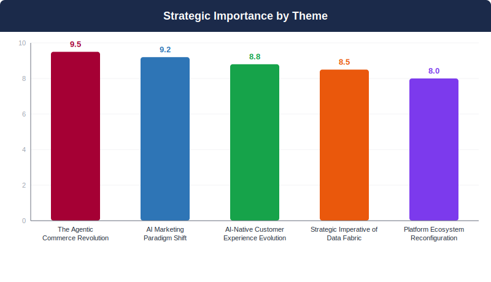
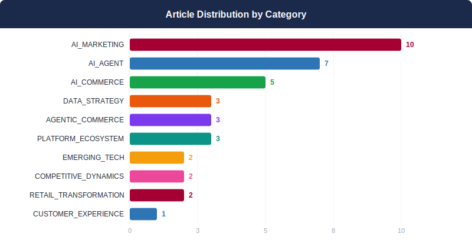
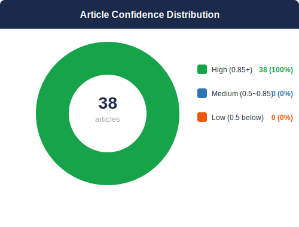
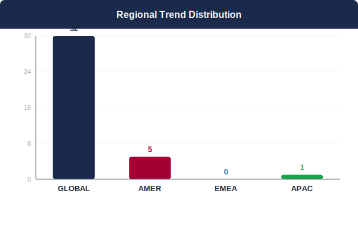
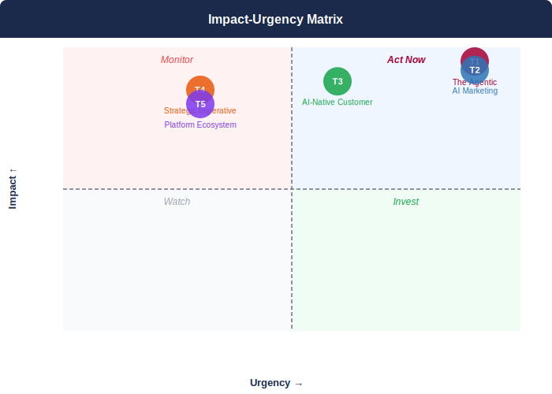

## 📋 2026년 4월 Monthly Deep Dive

### 이달의 핵심 메시지

> AI 에이전트가 단순 도구를 넘어 상거래와 고객 경험의 구조적 변화를 이끌며, D2C 기업들에게 통합 AI 전략 수립과 즉각 실행을 요구하고 있다.

> **"The 2026 AI ecosystem demands integrated strategy development where agentic commerce and AI-native experiences converge—LG's unique smart home platform positioning creates unprecedented opportunity for D2C differentiation, but only with immediate execution."**
> — Synthesized from 38 articles analysis

### 📊 이달의 분석 현황

| 지표 | 값 |
|------|----|
| 분석 기사 수 | **38개** |
| 도출 매크로 테마 | **5개** |
| AI 분석 파이프라인 | **7단계** |
| 분석 소요 시간 | **366초** |

---

## 🌐 4월 AI 트렌드 개요

2026년 AI 생태계는 단순한 도구 혁신을 넘어 상거래와 고객경험의 구조적 재편을 주도하고 있습니다. 에이전틱 커머스와 AI 마케팅의 즉시 도입 압박, AI 네이티브 고객경험으로의 전환, 그리고 데이터 패브릭과 플랫폼 재구성이 동시 진행되며 D2C 기업들에게 통합적 AI 전략 수립을 요구하고 있습니다. LG는 ThinQ AI와 webOS 플랫폼을 중심으로 한 차별화된 스마트홈 생태계를 구축할 수 있는 독특한 기회를 보유하고 있으나, 즉각적인 실행이 경쟁우위 확보의 핵심입니다.

**테마 수렴 패턴:** 5개 거대 테마는 모두 AI 에이전트를 중심으로 수렴하고 있으며, 특히 에이전트 중심 커머스(T1)가 마케팅 패러다임 전환(T2)과 고객 경험 진화(T3)를 주도하는 핵심 동력으로 작용하고 있습니다. 데이터 패브릭(T4)과 플랫폼 생태계 재편(T5)은 이러한 변화를 뒷받침하는 기술적 기반으로 기능합니다.

---

## 🔬 핵심 테마 심층 분석

### 1. 에이전트 중심 커머스 혁명
**AI 에이전트가 상거래의 중심이 되는 근본적 변화**

> ⏰ 긴급도: 🔴 즉시 | 중요도: 9.5/10

#### 트렌드 분석

AI 에이전트가 단순한 고객 서비스 도구를 넘어 커머스 생태계의 핵심 인터페이스로 진화하고 있습니다. Mondelez의 35억 달러 디지털 상거래 전략 개편은 AI 검색 시대의 브랜드 가시성 확보가 필수가 되었음을 보여줍니다. American Express의 ACE 개발자 키트 출시와 Ulta Beauty-Google의 제미나이 연동은 에이전틱 커머스가 실험 단계를 벗어나 실용화 단계에 진입했음을 의미합니다. Datasite의 82% 케이스 디플렉션율 달성은 AI 에이전트의 운영 효율성이 입증되었음을 시사합니다. Adobe의 Experience Cloud 리브랜딩과 Salesforce의 플랫폼 재설계는 기업 인프라가 에이전트 중심으로 재편되고 있음을 보여줍니다.

#### 📎 근거 체인

- **Mondelez가 AI 검색 시대에 맞춰 35억 달러 디지털 상거래 전략을 전면 개편** ([Mondelez overhauls its $3.5 billion digital commerce strategy in era of AI search](https://digiday.com/podcasts/mondelez-overhauls-its-3-5-billion-digital-commerce-strategy-in-era-of-ai-search/?utm_campaign=digidaydis&utm_medium=rss&utm_source=general-rss))
- **Datasite가 Salesforce Agentforce로 82% 케이스 디플렉션율과 4.8/5 고객 만족도 달성** ([Proving the Power of Script: How Datasite Agents Achieved 82% Deflection and 4.8/5 CSAT](https://www.salesforce.com/blog/datasite-agentforce/))
- **American Express가 에이전틱 커머스를 위한 ACE 개발자 키트 출시** ([American Express launches developer kit, purchase protection for agentic commerce](https://www.digitalcommerce360.com/2026/04/14/american-express-agentic-commerce-developer-kit-purchase-protection/))
- **울타 뷰티와 구글이 제미나이를 통한 에이전틱 커머스 출시** ([Ulta Beauty, Google partner on agentic commerce launch through Gemini](https://www.digitalcommerce360.com/2026/04/22/ulta-beauty-google-gemini-agentic-commerce-launch/))

#### 📈 핵심 지표

- 82% case deflection rate (Datasite with Agentforce)
- 4.8/5 customer satisfaction score (Datasite)
- $3.5 billion digital commerce strategy (Mondelez)
- 4자리 수 전년 대비 성장률 (agentic commerce web traffic)
- 17포인트 케이스 디플렉션 향상 (deterministic logic)

#### 영향도 평가: 🔴 HIGH

35억 달러 규모의 기업이 전면적인 전략 개편을 단행하고, 주요 플랫폼들이 에이전트 중심으로 인프라를 재설계하며, 82%의 케이스 디플렉션율 같은 구체적 성과가 입증되어 업계 전반의 패러다임 전환이 가속화되고 있습니다.

> **시간 지평:** 6-12개월 / 6-12 months

#### 🏆 경쟁사 관점

삼성은 Bixby 생태계를 활용한 스마트 홈 에이전트 통합에서 우위를 점할 수 있으나, LG는 ThinQ AI와 webOS 플랫폼의 오픈 생태계 전략으로 차별화 가능합니다. 소니는 엔터테인먼트 콘텐츠 연계에 집중할 것으로 예상되며, 애플은 Siri 기반 seamless 쇼핑 경험을 강화할 것입니다. LG는 가전 도메인 특화 AI 에이전트로 전문성을 확보하고, 제품 라이프사이클 전반의 에이전틱 서비스를 구축하여 경쟁 우위를 확보해야 합니다.

#### 📌 케이스 스터디

- **Datasite**: Implemented Salesforce Agentforce with deterministic logic for customer service automation → Achieved 82% case deflection rate and 4.8/5 customer satisfaction score ([출처](https://www.salesforce.com/blog/datasite-agentforce/))
- **Puma**: Launched 'Dylan' AI-powered digital human concierge at Las Vegas flagship store → Provided personalized service while maintaining customer control and brand differentiation ([출처](https://digiday.com/marketing/pumas-ai-head-says-the-brand-is-still-giving-the-keys-to-the-consumer-as-it-invests-in-digital-concierge/?utm_campaign=digidaydis&utm_medium=rss&utm_source=general-rss))
- **Ulta Beauty**: Partnered with Google to enable product purchases through Gemini's agentic commerce functionality → Enabled AI-powered shopping experiences integrated with Google's search interface ([출처](https://www.digitalcommerce360.com/2026/04/22/ulta-beauty-google-gemini-agentic-commerce-launch/))

#### 💡 LG D2C 시사점

1) 즉시 실행: ThinQ AI 기반 가전 구매 컨시어지 개발 및 주요 제품군별 전문 AI 에이전트 구축 2) 6개월 내: Salesforce Agentforce 같은 검증된 플랫폼과의 파트너십으로 82% 수준의 고객 서비스 자동화 달성 3) 12개월 내: Google, Amazon과의 에이전틱 커머스 통합으로 AI 검색 환경에서의 브랜드 가시성 확보 4) 운영 개선: ChatGPT 기반 운영팀 워크플로우 최적화로 D2C 프로세스 효율성 향상 5) 인프라 재설계: API 중심의 headless 아키텍처 구축으로 AI 에이전트 직접 연동 지원

### 2. AI 마케팅 패러다임 전환
**검색에서 답변 엔진으로, 도달에서 관련성으로의 전환**

> ⏰ 긴급도: 🔴 즉시 | 중요도: 9.2/10

#### 트렌드 분석

디지털 마케팅 패러다임이 전례없는 속도로 AI 중심으로 재편되고 있다. 메타가 처음으로 구글을 제치고 디지털 광고 수익 1위에 오를 전망인 가운데, AI 트래픽이 미국 소매업체에 393% 급증하며 높은 전환율을 기록하고 있다. 구글은 AI Max for Search를 정식 출시하며 기존 광고 도구를 단계적 폐지하고, ChatGPT 광고 비용은 60달러에서 25달러로 58% 하락했다. 이는 단순한 기술적 진화가 아닌 구매자 행동의 근본적 변화를 반영한다. B2B 구매자의 32%가 생성형 AI를 통해 벤더를 발견하며, 도달 범위(reach) 중심 마케팅에서 관련성(relevance) 중심으로 패러다임이 전환되고 있다. 전통적인 검색 엔진 최적화(SEO)에서 답변 엔진 최적화(AEO)로의 전환이 필수가 되었으며, AI 인용 추적이 새로운 성과 지표로 부상하고 있다.

#### 📎 근거 체인

- **메타가 처음으로 구글을 제치고 디지털 광고 수익 1위 달성 예정** ([Meta to shoot past Google in digital ad revenue for first time: Emarketer](https://www.marketingdive.com/news/meta-to-surpass-google-in-digital-ad-revenue-for-first-time-emarketer/817384/))
- **미국 소매업체의 AI 트래픽이 1분기 393% 급증하며 높은 전환율 기록** ([AI traffic to US retailers rose 393% in Q1, and it's boosting their revenue too](https://techcrunch.com/2026/04/16/ai-traffic-to-us-retailers-rose-393-in-q1-and-its-boosting-their-revenue-too/))
- **ChatGPT 광고 비용이 60달러에서 25달러로 58% 하락** (['Everything is coming down': ChatGPT ads are getting cheaper](https://digiday.com/marketing/everything-is-coming-down-chatgpt-ads-are-getting-cheaper/?utm_campaign=digidaydis&utm_medium=rss&utm_source=general-rss))
- **B2B 구매자의 32%가 생성형 AI 챗봇을 통해 새로운 벤더 발견** ([AEO Strategy for B2B: 9 Tactics to Increase B2B Answer Engine Visibility](https://blog.hubspot.com/marketing/aeo-b2b-strategy))
- **구글이 AI Max for Search 정식 출시하며 기존 광고 도구 단계적 폐지** ([Google brings AI Max for Search out of beta, will deprecate legacy tools](https://www.marketingdive.com/news/google-brings-ai-max-for-search-out-of-beta-will-deprecate-legacy-tools/817688/))

#### 📈 핵심 지표

- AI 트래픽 393% 증가 (1분기, 미국 소매업체)
- ChatGPT CPM 60달러→25달러 (58% 하락)
- B2B 구매자 32%가 AI로 벤더 발견
- 구매자 여정: 평균 7.6개→3.5개 벤더로 축소
- 3월 AI 트래픽 269% 증가

#### 영향도 평가: 🔴 HIGH

AI 트래픽의 393% 급증과 메타의 구글 추월은 디지털 마케팅 생태계의 구조적 변화를 의미하며, ChatGPT 광고 비용 하락은 새로운 마케팅 기회를 창출한다. B2B 구매자의 32%가 AI를 통해 벤더를 발견하는 현실은 LG의 가전제품 마케팅 전략 전면 재검토를 요구한다.

> **시간 지평:** 6-12개월 / 6-12 months

#### 🏆 경쟁사 관점

삼성과 소니는 이미 AI 기반 마케팅 자동화에 투자하고 있어 LG가 늦어질수록 격차가 벌어질 위험이 있다. 애플의 Siri 통합 전략과 달리 LG는 다중 AI 플랫폼 최적화가 필요하며, 중국 가전 브랜드들의 AI 네이티브 마케팅 접근에 대응해야 한다. 특히 메타의 성장은 소셜 커머스에서 삼성 대비 LG의 상대적 약세를 더욱 부각시킬 수 있다.

#### 📌 케이스 스터디

- **Meta**: Implemented AI-based advertising automation improvements → Set to surpass Google in digital ad revenue for first time ([출처](https://www.marketingdive.com/news/meta-to-surpass-google-in-digital-ad-revenue-for-first-time-emarketer/817384/))
- **US Retailers (aggregate)**: Optimized for AI traffic discovery and conversion → 393% increase in AI traffic with higher conversion rates than traditional traffic ([출처](https://techcrunch.com/2026/04/16/ai-traffic-to-us-retailers-rose-393-in-q1-and-its-boosting-their-revenue-too/))

#### 💡 LG D2C 시사점

1) 즉시 AEO 전담팀 구성하여 ChatGPT, Google AI, Perplexity 등 주요 AI 검색에서 LG 제품 노출 최적화, 2) ChatGPT 광고 파일럿 프로그램 런칭하여 저렴한 진입 비용 활용, 3) AI 인용 추적 시스템 도입으로 브랜드 언급량과 품질 측정, 4) 메타 AI 기반 자동화 광고에 예산 25% 이상 배정, 5) 가전제품 구매 관련 AI 질문에 최적화된 콘텐츠 전략 수립

### 3. 고객 경험의 AI 네이티브화
**디지털 컨시어지와 개인화된 AI 쇼핑 도구의 부상**

> ⏰ 긴급도: 🟡 단기 | 중요도: 8.8/10

#### 트렌드 분석

고객 경험의 AI 네이티브화가 소매업계를 재정의하고 있다. 푸마는 라스베이거스 플래그십 스토어에 'Dylan'이라는 AI 디지털 휴먼 컨시어지를 도입하여 개인화된 서비스를 제공하면서도 '고객에게 열쇠를 맡기는' 철학을 유지하고 있다. 밀레니얼과 Z세대가 AI 쇼핑 도구에 개방적인 태도를 보이는 가운데, 시스코는 AI360 플랫폼을 통해 3분기 매출 205억 달러, 4.7% 증가라는 가시적 성과를 달성했다. 울타 뷰티와 구글의 제미나이 에이젠틱 커머스 파트너십, VTEX의 AI 네이티브 커머스 스위트 출시는 AI가 단순 도구에서 쇼핑 경험의 핵심 인프라로 진화하고 있음을 시사한다. 이는 더 이상 실험이 아닌 비즈니스 필수 요소로서의 AI 전환을 의미한다.

#### 📎 근거 체인

- **푸마가 AI 디지털 휴먼 컨시어지 'Dylan'을 라스베이거스 매장에 도입하여 개인화 서비스 제공** ([Puma's AI head says the brand is still giving 'the keys to the consumer' as it invests in digital concierge](https://digiday.com/marketing/pumas-ai-head-says-the-brand-is-still-giving-the-keys-to-the-consumer-as-it-invests-in-digital-concierge/?utm_campaign=digidaydis&utm_medium=rss&utm_source=general-rss))
- **시스코가 AI360 플랫폼으로 3분기 매출 4.7% 증가한 205억 달러 달성** ([Sysco credits AI as sales rise 4.7% in Q3](https://www.digitalcommerce360.com/2026/04/29/sysco-credits-ai-sales-q3-fy26/))
- **울타 뷰티와 구글이 제미나이의 에이젠틱 커머스를 통해 AI 기반 구매 경험 론칭** ([Ulta Beauty, Google partner on agentic commerce launch through Gemini](https://www.digitalcommerce360.com/2026/04/22/ulta-beauty-google-gemini-agentic-commerce-launch/))
- **밀레니얼과 Z세대가 AI 쇼핑 도구 사용에 개방적인 태도를 보임** ([Millennials, Gen Zers warm up to AI shopping tools](https://www.retaildive.com/news/millennials-gen-zers-warm-up-to-ai-shopping-tools/817509/))

#### 📈 핵심 지표

- 시스코 3분기 매출 4.7% 증가 (205억 달러)
- Sysco Q3 sales: 4.7% increase ($20.5B)
- 밀레니얼/Z세대의 AI 쇼핑 도구 개방성 증가 추세
- Increasing Millennial/Gen Z openness to AI shopping tools

#### 영향도 평가: 🔴 HIGH

시스코의 4.7% 매출 성장이 AI 직접 기여로 입증된 점과 젊은 고객층의 AI 도구 수용도 증가, 주요 브랜드들의 AI 네이티브 플랫폼 전환이 복합적으로 작용하여 높은 영향도를 시사

> **시간 지평:** 6-12개월 / 6-12 months

#### 🏆 경쟁사 관점

삼성과 소니는 이미 AI 기반 개인화 기술을 스마트 기기에 통합하고 있으며, 애플은 Siri와 앱스토어를 통한 AI 쇼핑 경험을 강화하고 있다. LG는 ThinQ AI 플랫폼을 활용한 가전 연동 D2C 경험에서 차별화 기회를 가지고 있으나, 빠른 실행이 필요한 상황이다. 특히 푸마의 사례처럼 고객 주도권을 유지하면서 AI를 도입하는 접근법이 브랜드 신뢰도 측면에서 경쟁 우위를 가져다줄 것이다.

#### 📌 케이스 스터디

- **Puma**: Deployed AI digital human concierge 'Dylan' in Las Vegas flagship store while maintaining customer-centric approach → Successfully demonstrated AI integration that preserves customer autonomy and brand trust ([출처](https://digiday.com/marketing/pumas-ai-head-says-the-brand-is-still-giving-the-keys-to-the-consumer-as-it-invests-in-digital-concierge/?utm_campaign=digidaydis&utm_medium=rss&utm_source=general-rss))
- **Sysco**: Implemented AI360 platform for sales optimization and customer experience enhancement → Achieved $20.5B in Q3 sales with 4.7% growth directly attributed to AI implementation ([출처](https://www.digitalcommerce360.com/2026/04/29/sysco-credits-ai-sales-q3-fy26/))
- **Ulta Beauty & Google**: Partnered on agentic commerce through Gemini AI for integrated shopping experiences → Enabled product purchases directly through Google's AI interface, pioneering agentic commerce ([출처](https://www.digitalcommerce360.com/2026/04/22/ulta-beauty-google-gemini-agentic-commerce-launch/))

#### 💡 LG D2C 시사점

1) ThinQ AI를 활용한 스마트 홈 컨시어지 서비스를 6개월 내 파일럿 론칭 2) 밀레니얼/Z세대 타겟 AI 기반 제품 추천 엔진 개발 3) LG전자 매장에 AI 디지털 어시스턴트 도입으로 오프라인-온라인 통합 경험 구축 4) AI 기반 고객 여정 분석을 통한 D2C 전환율 최적화 5) 고객 데이터 주도권 보장 정책 수립으로 신뢰 기반 AI 경험 제공

### 4. 데이터 패브릭의 전략적 중요성
**AI 비즈니스 가치 실현을 위한 강력한 데이터 기반**

> ⏰ 긴급도: 🟢 중기 | 중요도: 8.5/10

#### 트렌드 분석

데이터 패브릭이 AI 비즈니스 가치 실현의 핵심 전략적 요구사항으로 부상하고 있습니다. MIT Technology Review는 'AI가 비즈니스 가치를 제공하려면 강력한 데이터 패브릭이 필수적'이라고 강조했으며, 2025년 말까지 기업의 절반이 최소 3개 비즈니스 기능에서 AI를 사용할 것으로 예상된다고 발표했습니다. AI가 전문직의 전통적 업무 경계를 무너뜨리면서 조직 내 역할 재정의가 불가피해졌고, CyberAgent의 ChatGPT Enterprise 성공 사례는 엔터프라이즈급 AI 도구가 광고, 미디어, 게임 등 다양한 사업 영역에서 품질 향상과 의사결정 가속화를 동시에 달성할 수 있음을 입증했습니다. 아마존의 Nitro Isolation Engine 개발 사례는 공식 검증된 클라우드 인프라가 플랫폼 보안성과 신뢰성을 근본적으로 향상시킬 수 있다는 것을 보여줍니다.

#### 📎 근거 체인

- **MIT Technology Review가 AI 비즈니스 가치 실현을 위한 강력한 데이터 패브릭의 필수성을 강조** ([AI needs a strong data fabric to deliver business value](https://www.technologyreview.com/2026/04/22/1135295/ai-needs-a-strong-data-fabric-to-deliver-business-value/))
- **CyberAgent가 ChatGPT Enterprise를 통해 광고, 미디어, 게임 분야에서 품질 향상과 의사결정 가속화 달성** ([CyberAgent moves faster with ChatGPT Enterprise and Codex](https://openai.com/index/cyberagent))
- **아마존이 Isabelle/HOL을 활용하여 세계 최초 공식 검증된 클라우드 하이퍼바이저 구현** ([Isabelle/HOL: The proof assistant behind the Nitro Isolation Engine](https://www.amazon.science/blog/isabelle-hol-the-proof-assistant-behind-the-nitro-isolation-engine))
- **AI가 디자이너와 엔지니어의 전문화된 업무를 몇 분 만에 수행하며 기존 직무 경계 파괴** ([AI Broke Your Job Title 'Moat.' What Happens Now?](https://www.salesforce.com/blog/ai-redefine-job-title/))

#### 📈 핵심 지표

- 2025년 말까지 기업의 절반이 최소 3개 비즈니스 기능에서 AI 사용 예상
- Half of enterprises expected to use AI in at least 3 business functions by end-2025

#### 영향도 평가: 🔴 HIGH

MIT Technology Review의 2025년 말 기업의 50% AI 도입 전망과 CyberAgent의 다분야 동시 성과 달성 사례는 데이터 패브릭 투자가 AI ROI 극대화의 핵심 조건임을 증명합니다.

> **시간 지평:** 6-12개월 / 6-12 months

#### 🏆 경쟁사 관점

삼성은 반도체와 디스플레이 데이터를 활용한 AI 최적화에 강점이 있고, 소니는 콘텐츠 데이터 패브릭을 통한 엔터테인먼트 AI 경쟁력을 보유하고 있습니다. 애플은 디바이스 생태계 데이터 통합으로 개인화 AI 서비스에서 우위를 점하고 있습니다. LG는 가전, 모바일, 차량용 전자기기 등 다양한 하드웨어 데이터를 통합하여 cross-category AI 인사이트를 창출할 수 있는 독특한 포지션을 가지고 있으나, 현재 데이터 사일로화 문제로 이러한 잠재력을 충분히 활용하지 못하고 있습니다.

#### 📌 케이스 스터디

- **CyberAgent**: Implemented ChatGPT Enterprise and Codex across advertising, media, and gaming divisions → Achieved quality improvements and decision acceleration across multiple business areas ([출처](https://openai.com/index/cyberagent))
- **Amazon**: Developed Nitro Isolation Engine using Isabelle/HOL proof assistant → Created world's first formally verified cloud hypervisor implementation ([출처](https://www.amazon.science/blog/isabelle-hol-the-proof-assistant-behind-the-nitro-isolation-engine))

#### 💡 LG D2C 시사점

LG D2C는 즉시 통합 데이터 레이크 구축 프로젝트를 시작하여 가전, 모바일, 서비스 데이터를 단일 패브릭으로 통합해야 합니다. CyberAgent 모델을 벤치마킹하여 ChatGPT Enterprise 도입을 통해 고객 서비스, 마케팅, 제품 개발 영역에서 AI 활용을 확대하고, 디자인/개발 인력을 고객 경험 전략 및 데이터 분석 역할로 재배치해야 합니다. 아마존의 공식 검증 접근법을 참고하여 데이터 보안과 프라이버시 검증 체계를 구축하여 고객 신뢰를 확보해야 합니다.

### 5. 플랫폼 생태계의 재편
**통합된 AI 중심 플랫폼으로의 진화**

> ⏰ 긴급도: 🟢 중기 | 중요도: 8/10

#### 트렌드 분석

플랫폼 생태계는 AI 중심의 통합 환경으로 급격히 재편되고 있다. Canva는 Simtheory와 Ortto 인수를 통해 단순 디자인 툴에서 AI 기반 마케팅 자동화 플랫폼으로 진화했으며, Adobe는 Experience Cloud를 'CX Enterprise'로 리브랜딩하며 AI 에이전트 기반 고객 경험 솔루션에 전면 투자하고 있다. 한편 Amazon AWS는 예상을 뛰어넘는 성장세를 보이며 AI 인프라에 대규모 자본을 투입하고 있다. 이러한 변화는 기존의 수직적 플랫폼 구조에서 AI를 중심으로 한 수평적 통합 생태계로의 전환을 의미한다. 특히 AWS의 Nitro Isolation Engine처럼 공식 검증된 클라우드 인프라는 플랫폼의 보안성과 신뢰성을 새로운 차원으로 끌어올리고 있다.

#### 📎 근거 체인

- **Canva가 디자인 툴에서 AI 기반 마케팅 자동화 플랫폼으로 사업 영역 확장** ([Canva expands into marketing automation with new acquisitions](https://martech.org/canva-expands-into-marketing-automation-with-new-acquisitions/))
- **Adobe가 Experience Cloud를 'CX Enterprise'로 리브랜딩하며 AI 에이전트에 전면 투자** ([Adobe rebrands Experience Cloud as 'CX Enterprise,' goes all-in on AI agents](https://martech.org/adobe-rebrands-experience-cloud-as-cx-enterprise-goes-all-in-on-ai-agents/))
- **AWS가 예상 초과 성장세와 AI 인프라 대규모 자본 투자 진행** ([Amazon's cloud business is surging — and so is its capital spending](https://techcrunch.com/2026/04/29/amazons-cloud-business-is-surging-and-so-is-its-capital-spending/))
- **Amazon이 Nitro Isolation Engine에 Isabelle/HOL 증명 도우미를 활용해 공식 검증된 클라우드 하이퍼바이저 구현** ([Isabelle/HOL: The proof assistant behind the Nitro Isolation Engine](https://www.amazon.science/blog/isabelle-hol-the-proof-assistant-behind-the-nitro-isolation-engine))

#### 📈 핵심 지표

- AWS 예상 초과 수익 성장 (구체적 수치는 소스에 미명시)
- Amazon의 AI 인프라 자본 지출 대폭 증가
- 세계 최초 공식 검증된 클라우드 하이퍼바이저 구현 (Nitro Isolation Engine)

#### 영향도 평가: 🔴 HIGH

주요 플랫폼 기업들의 AI 중심 통합 전략은 D2C 생태계의 경쟁 구도를 근본적으로 변화시킬 것이다. Adobe, Canva 등의 AI 에이전트 도입과 AWS의 대규모 AI 인프라 투자는 플랫폼 차별화 요소를 AI 역량으로 집중시키고 있다.

> **시간 지평:** 6-12개월 / 6-12 months

#### 🏆 경쟁사 관점

삼성과 소니는 각각 SmartThings와 PlayStation 생태계에서 AI 통합을 가속화할 가능성이 높다. 애플은 iOS/macOS 생태계의 AI 기능 강화를 통해 폐쇄적 플랫폼의 장점을 극대화할 것이다. LG는 상대적으로 플랫폼 생태계가 약한 상황에서 AWS, Adobe 등 외부 AI 플랫폼과의 전략적 파트너십이 필수적이다. 특히 가전 제품의 IoT 데이터와 D2C 고객 데이터를 연결한 AI 기반 개인화 서비스에서 경쟁 우위를 찾아야 한다.

#### 📌 케이스 스터디

- **Canva**: Acquired Simtheory and Ortto to expand from design tools into AI-powered marketing automation platform → Evolution into integrated marketing platform enabling design-to-execution workflows for D2C brands ([출처](https://martech.org/canva-expands-into-marketing-automation-with-new-acquisitions/))
- **Adobe**: Rebranded Experience Cloud as 'CX Enterprise' with full investment in AI agents and GenStudio modules → Positioned for AI agent-based content bottleneck solutions and enhanced customer experience automation ([출처](https://martech.org/adobe-rebrands-experience-cloud-as-cx-enterprise-goes-all-in-on-ai-agents/))
- **Amazon**: Massive capital spending on AI infrastructure while AWS shows above-expected growth → Strengthened competitive position in cloud-based AI services market ([출처](https://techcrunch.com/2026/04/29/amazons-cloud-business-is-surging-and-so-is-its-capital-spending/))

#### 💡 LG D2C 시사점

1) AWS와의 전략적 클라우드 파트너십을 통해 AI 네이티브 D2C 플랫폼 구축 2) Adobe CX Enterprise 솔루션 도입으로 AI 에이전트 기반 고객 경험 자동화 구현 3) 가전 IoT 데이터와 D2C 구매 데이터를 통합한 AI 개인화 엔진 개발 4) Canva와 유사한 콘텐츠-마케팅 통합 워크플로우 구축을 위한 MarTech 스택 재설계 5) 공식 검증된 보안 인프라 도입으로 고객 데이터 신뢰성 확보

---

## 🔗 크로스 트렌드 종합 분석

다섯 테마의 수렴에서 'AI 통합 스마트홈 커머스 플랫폼'이라는 새로운 비즈니스 모델이 등장하고 있습니다. ThinQ AI를 중심으로 한 에이전틱 가전 구매, AI 기반 개인화 마케팅, 데이터 패브릭을 통한 통합 고객 인사이트, 그리고 webOS 플랫폼의 오픈 생태계가 결합되어 가전제품을 단순 판매에서 지속적 서비스 관계로 전환하는 기회를 창출합니다. 이는 삼성의 폐쇄형 SmartThings와 차별화되는 LG만의 독특한 포지셔닝을 가능하게 합니다.

### 상호 강화 테마

- **T1 ↔ T2**: 에이전틱 커머스의 AI 구매 상담원과 AI 마케팅 패러다임이 상호 강화되어 완전한 고객 여정 자동화를 실현합니다. ChatGPT 광고비 58% 감소와 82% 고객서비스 자동화는 동일한 AI 인프라를 활용한 비용 효율적 통합 솔루션을 가능하게 합니다.
- **T3 ↔ T5**: AI 네이티브 고객경험과 플랫폼 생태계 재구성이 결합되어 개인화된 스마트홈 서비스 플랫폼을 창출합니다. Adobe CX Enterprise와 AWS 클라우드 파트너십을 통한 AI 에이전트 기반 자동화가 ThinQ AI 기반 고객경험을 극대화합니다.

### 긴장 관계 테마

- **T4 vs T1**: 데이터 패브릭 구축의 중장기 투자와 에이전틱 커머스의 즉각적 구현 요구 간 자원 배분 갈등이 존재합니다. MIT의 2025년 50% 기업 AI 도입 예측과 현재 82% 고객서비스 자동화 실현 사례는 단기 수익과 장기 인프라 투자 간 우선순위 딜레마를 야기합니다.
- **T2 vs T3**: AI 마케팅의 도달 기반 KPI에서 관련성 기반 KPI로의 전환과 고객 주체성을 유지하는 AI 경험 구축 간 측정 방식의 충돌이 발생합니다. 393% AI 트래픽 급증 활용과 고객 데이터 주권 정책 수립은 마케팅 효율성과 개인정보보호 간 균형점을 요구합니다.

---

## 📐 전략 프레임워크

### 영향도-긴급도 매트릭스

> 🔴 **즉시 행동 (Act Now):** T1, T2 — 에이전틱 커머스와 AI 마케팅은 시장 선점 효과가 크고 고객 경험 혁신의 핵심입니다. CEO 직속 태스크포스 구성과 즉각적 예산 배정이 필요합니다.

> 🔵 **전략적 투자:** T3, T4, T5 — AI 네이티브 고객 경험, 데이터 패브릭, 플랫폼 재구성은 중장기 경쟁력의 기반입니다. 체계적 로드맵과 단계별 투자 계획이 필요합니다.

### 🎯 단계별 실행 로드맵

#### 즉시 (0-30일)

1. **ThinQ AI 기반 가전제품 구매 컨시어지 프로토타입 개발 착수** (담당: Commerce) — KPI: 프로토타입 완성도 및 사용자 테스트 완료율

2. **AEO(AI Engine Optimization) 전담팀 구성 및 ChatGPT/Google AI/Perplexity 대응 전략 수립** (담당: Marketing) — KPI: AI 검색 엔진에서 LG 제품 노출 순위 개선율

3. **ChatGPT 광고 파일럿 캠페인 기획 및 예산 확보** (담당: Marketing) — KPI: 파일럿 캠페인 ROI 및 브랜드 인지도 증가율

4. **통합 데이터 레이크 구축을 위한 기술 아키텍처 설계 시작** (담당: IT) — KPI: 아키텍처 설계 완료 및 개발 일정 확정

#### 단기 (1-3개월)

1. **주요 제품 카테고리별 전문 AI 에이전트 개발 및 배포** (담당: Commerce) — KPI: 카테고리별 AI 에이전트 활용률 및 고객 만족도

2. **ThinQ AI 기반 스마트홈 컨시어지 서비스 파일럿 런칭** (담당: Strategy) — KPI: 파일럿 참여 고객 수 및 서비스 이용 빈도

3. **밀레니얼/Z세대 타겟 AI 기반 제품 추천 엔진 개발** (담당: CRM) — KPI: 타겟 세그먼트 전환율 및 평균 주문 금액 증가율

4. **AWS 클라우드 파트너십을 통한 AI 네이티브 D2C 플랫폼 구축 착수** (담당: IT) — KPI: 플랫폼 개발 진행률 및 성능 벤치마크 달성도

#### 중기 (3-6개월)

1. **가전, 모바일, 서비스 데이터를 통합한 단일 데이터 패브릭 완성** (담당: Data) — KPI: 데이터 통합 완성도 및 실시간 분석 가능 데이터 비율

2. **Adobe CX Enterprise를 활용한 AI 에이전트 기반 고객 경험 자동화 구현** (담당: CRM) — KPI: 고객 서비스 자동화율 및 고객 만족도 개선 정도

3. **ThinQ AI와 webOS 플랫폼 중심의 차별화된 스마트홈 생태계 완성** (담당: Strategy) — KPI: 생태계 내 제품 연동률 및 고객 리텐션율

4. **CyberAgent 벤치마킹 기반 데이터 분석 역량 고도화** (담당: Data) — KPI: 데이터 분석 정확도 및 비즈니스 인사이트 활용률

---

## 🏢 LG D2C 전략적 포지셔닝

LG D2C는 현재 AI 변혁의 임계점에 위치해 있으며, ThinQ AI와 webOS 플랫폼을 활용한 차별화 기회를 보유하고 있으나 즉각적 실행이 필수적입니다. 삼성의 Bixby/SmartThings 통합 생태계와 애플의 폐쇄형 AI 서비스 대비 오픈 플랫폼 전략의 강점을 활용하되, 에이전틱 커머스와 AI 마케팅의 즉시 도입을 통해 선점 효과를 확보해야 합니다. 특히 ChatGPT 광고비 58% 감소와 82% 고객서비스 자동화 실현 가능성은 LG에게 비용 효율적 AI 전환의 골든타임을 제공하고 있습니다.

---

## 🚀 핵심 전략 명령 (Top 3 Imperatives)

1. **ThinQ AI 플랫폼을 AI 에이전트 상거래 허브로 전환하여 스마트홈 생태계 중심의 차별화된 D2C 경험 구축** (Global D2C & AI Strategy) — 2026년 Q3

2. **webOS 기반 AI 네이티브 고객 인터페이스 개발로 음성-시각-행동 통합 경험 플랫폼 선점** (Product & UX Innovation) — 2026년 Q4

3. **AI 마케팅 패러다임 전환 대비 실시간 개인화 및 동적 최적화 역량 구축** (Marketing Technology) — 2026년 Q2

## 📋 April 2026 Monthly Deep Dive

### This Month's Core Message

> AI agents are driving structural transformation of commerce and customer experience beyond simple tools, demanding integrated AI strategy development and immediate execution from D2C companies.

> **"The 2026 AI ecosystem demands integrated strategy development where agentic commerce and AI-native experiences converge—LG's unique smart home platform positioning creates unprecedented opportunity for D2C differentiation, but only with immediate execution."**
> — Synthesized from 38 articles analysis

### 📊 Monthly Analysis Dashboard

| Metric | Value |
|--------|-------|
| Articles Analyzed | **38** |
| Macro Themes Identified | **5** |
| AI Pipeline Stages | **7** |
| Analysis Duration | **366s** |

---

## 🌐 April 2026 AI Trend Overview

The 2026 AI ecosystem is driving structural transformation of commerce and customer experience beyond simple tool innovation. The immediate adoption pressure of agentic commerce and AI marketing, transition to AI-native customer experiences, and simultaneous data fabric and platform reconfiguration demands integrated AI strategy development from D2C companies. LG possesses unique opportunities to build differentiated smart home ecosystems centered on ThinQ AI and webOS platforms, but immediate execution is critical for competitive advantage.

**Theme Convergence:** All five macro themes converge around AI agents, with Agentic Commerce (T1) serving as the primary driver for Marketing Paradigm Shift (T2) and Customer Experience Evolution (T3). Data Fabric (T4) and Platform Ecosystem Reconfiguration (T5) function as the technical foundation supporting these transformations.

---

## 🔬 Macro Theme Deep Dives

### 1. The Agentic Commerce Revolution
**AI agents becoming the center of commerce interactions**

> ⏰ Urgency: 🔴 Immediate | Importance: 9.5/10

#### Trend Analysis

AI agents are evolving beyond simple customer service tools to become the central interface of commerce ecosystems. Mondelez's $3.5 billion digital commerce strategy overhaul demonstrates that brand visibility in the AI search era has become essential. The launch of American Express's ACE developer kit and Ulta Beauty's integration with Google Gemini signal that agentic commerce has moved beyond experimentation into practical implementation. Datasite's achievement of 82% case deflection rates proves the operational efficiency of AI agents. Adobe's Experience Cloud rebranding and Salesforce's platform redesign show that enterprise infrastructure is being reorganized around agent-centric architectures. The convergence of front-office customer experiences and back-office automation through AI agents represents a fundamental shift in how D2C commerce operates, with early adopters gaining significant competitive advantages through improved efficiency and customer satisfaction.

#### 📎 Evidence Chain

- **Mondelez overhauled its $3.5 billion digital commerce strategy for the AI search era** ([Mondelez overhauls its $3.5 billion digital commerce strategy in era of AI search](https://digiday.com/podcasts/mondelez-overhauls-its-3-5-billion-digital-commerce-strategy-in-era-of-ai-search/?utm_campaign=digidaydis&utm_medium=rss&utm_source=general-rss))
- **Datasite achieved 82% case deflection rate and 4.8/5 customer satisfaction with Salesforce Agentforce** ([Proving the Power of Script: How Datasite Agents Achieved 82% Deflection and 4.8/5 CSAT](https://www.salesforce.com/blog/datasite-agentforce/))
- **American Express launched ACE developer kit for agentic commerce** ([American Express launches developer kit, purchase protection for agentic commerce](https://www.digitalcommerce360.com/2026/04/14/american-express-agentic-commerce-developer-kit-purchase-protection/))
- **Ulta Beauty and Google launched agentic commerce through Gemini** ([Ulta Beauty, Google partner on agentic commerce launch through Gemini](https://www.digitalcommerce360.com/2026/04/22/ulta-beauty-google-gemini-agentic-commerce-launch/))

#### 📈 Key Metrics

- 82% case deflection rate (Datasite with Agentforce)
- 4.8/5 customer satisfaction score (Datasite)
- $3.5 billion digital commerce strategy (Mondelez)
- 4자리 수 전년 대비 성장률 (agentic commerce web traffic)
- 17포인트 케이스 디플렉션 향상 (deterministic logic)

#### Impact Assessment: 🔴 HIGH

A $3.5B enterprise has undertaken comprehensive strategic overhaul, major platforms are redesigning infrastructure around agents, and concrete results like 82% case deflection rates are proven, accelerating industry-wide paradigm shift.

> **Time Horizon:** 6-12개월 / 6-12 months

#### 🏆 Competitive Landscape

Samsung can leverage Bixby ecosystem for smart home agent integration, but LG can differentiate through ThinQ AI and webOS platform's open ecosystem strategy. Sony will likely focus on entertainment content integration, while Apple will enhance Siri-based seamless shopping experiences. LG must establish competitive advantage by building appliance domain-specific AI agents and creating agentic services across the entire product lifecycle.

#### 📌 Case Studies

- **Datasite**: Implemented Salesforce Agentforce with deterministic logic for customer service automation → Achieved 82% case deflection rate and 4.8/5 customer satisfaction score ([source](https://www.salesforce.com/blog/datasite-agentforce/))
- **Puma**: Launched 'Dylan' AI-powered digital human concierge at Las Vegas flagship store → Provided personalized service while maintaining customer control and brand differentiation ([source](https://digiday.com/marketing/pumas-ai-head-says-the-brand-is-still-giving-the-keys-to-the-consumer-as-it-invests-in-digital-concierge/?utm_campaign=digidaydis&utm_medium=rss&utm_source=general-rss))
- **Ulta Beauty**: Partnered with Google to enable product purchases through Gemini's agentic commerce functionality → Enabled AI-powered shopping experiences integrated with Google's search interface ([source](https://www.digitalcommerce360.com/2026/04/22/ulta-beauty-google-gemini-agentic-commerce-launch/))

#### 💡 LG D2C Implications

1) Immediate: Develop ThinQ AI-based appliance purchase concierge and build specialized AI agents for major product categories 2) Within 6 months: Partner with proven platforms like Salesforce Agentforce to achieve 82%-level customer service automation 3) Within 12 months: Integrate agentic commerce with Google and Amazon to secure brand visibility in AI search environments 4) Operations improvement: Optimize D2C process efficiency through ChatGPT-based operations team workflows 5) Infrastructure redesign: Build API-centric headless architecture to support direct AI agent integration

### 2. AI Marketing Paradigm Shift
**From search to answer engines, reach to relevance**

> ⏰ Urgency: 🔴 Immediate | Importance: 9.2/10

#### Trend Analysis

The digital marketing paradigm is undergoing an unprecedented AI-driven transformation that demands immediate strategic recalibration. Meta is poised to surpass Google in digital ad revenue for the first time, while AI traffic to US retailers has exploded by 393% in Q1, demonstrating superior conversion rates compared to traditional traffic sources. Google's formal launch of AI Max for Search and deprecation of legacy tools signals the irreversible shift toward AI-native advertising ecosystems. Simultaneously, ChatGPT ad costs have plummeted 58% from $60 to $25 CPM, creating new arbitrage opportunities. This represents more than technological evolution—it reflects fundamental buyer behavior changes. With 32% of B2B buyers now discovering vendors through generative AI chatbots, the traditional reach-based marketing paradigm is giving way to relevance-centric strategies. The shift from Search Engine Optimization (SEO) to Answer Engine Optimization (AEO) is no longer optional but essential for maintaining competitive visibility. AI citation tracking emerges as a critical new performance metric, as brands risk losing influence at the crucial moment of buyer opinion formation if they fail to appear in AI-generated responses.

#### 📎 Evidence Chain

- **Meta set to surpass Google in digital ad revenue for the first time** ([Meta to shoot past Google in digital ad revenue for first time: Emarketer](https://www.marketingdive.com/news/meta-to-surpass-google-in-digital-ad-revenue-for-first-time-emarketer/817384/))
- **AI traffic to US retailers rose 393% in Q1 with higher conversion rates** ([AI traffic to US retailers rose 393% in Q1, and it's boosting their revenue too](https://techcrunch.com/2026/04/16/ai-traffic-to-us-retailers-rose-393-in-q1-and-its-boosting-their-revenue-too/))
- **ChatGPT ad costs dropped 58% from $60 to $25 CPM in 9 weeks** (['Everything is coming down': ChatGPT ads are getting cheaper](https://digiday.com/marketing/everything-is-coming-down-chatgpt-ads-are-getting-cheaper/?utm_campaign=digidaydis&utm_medium=rss&utm_source=general-rss))
- **32% of B2B buyers discover new vendors through generative AI chatbots** ([AEO Strategy for B2B: 9 Tactics to Increase B2B Answer Engine Visibility](https://blog.hubspot.com/marketing/aeo-b2b-strategy))
- **Google launches AI Max for Search out of beta, deprecating legacy tools** ([Google brings AI Max for Search out of beta, will deprecate legacy tools](https://www.marketingdive.com/news/google-brings-ai-max-for-search-out-of-beta-will-deprecate-legacy-tools/817688/))

#### 📈 Key Metrics

- AI 트래픽 393% 증가 (1분기, 미국 소매업체)
- ChatGPT CPM 60달러→25달러 (58% 하락)
- B2B 구매자 32%가 AI로 벤더 발견
- 구매자 여정: 평균 7.6개→3.5개 벤더로 축소
- 3월 AI 트래픽 269% 증가

#### Impact Assessment: 🔴 HIGH

The 393% surge in AI traffic and Meta's overtaking of Google represent structural shifts in the digital marketing ecosystem. The 58% decline in ChatGPT ad costs creates immediate arbitrage opportunities, while 32% of B2B buyers using AI for vendor discovery demands fundamental reassessment of LG's appliance marketing strategies.

> **Time Horizon:** 6-12개월 / 6-12 months

#### 🏆 Competitive Landscape

Samsung and Sony are already investing in AI-powered marketing automation, creating widening competitive gaps if LG delays action. Unlike Apple's integrated Siri strategy, LG must optimize across multiple AI platforms while responding to Chinese appliance brands' AI-native marketing approaches. Meta's growth particularly threatens to highlight LG's relative weakness in social commerce compared to Samsung.

#### 📌 Case Studies

- **Meta**: Implemented AI-based advertising automation improvements → Set to surpass Google in digital ad revenue for first time ([source](https://www.marketingdive.com/news/meta-to-surpass-google-in-digital-ad-revenue-for-first-time-emarketer/817384/))
- **US Retailers (aggregate)**: Optimized for AI traffic discovery and conversion → 393% increase in AI traffic with higher conversion rates than traditional traffic ([source](https://techcrunch.com/2026/04/16/ai-traffic-to-us-retailers-rose-393-in-q1-and-its-boosting-their-revenue-too/))

#### 💡 LG D2C Implications

1) Immediately establish dedicated AEO team to optimize LG product visibility across ChatGPT, Google AI, and Perplexity, 2) Launch ChatGPT advertising pilot program leveraging reduced entry costs, 3) Implement AI citation tracking system to measure brand mention volume and quality, 4) Allocate 25%+ of advertising budget to Meta's AI-powered automated campaigns, 5) Develop content strategy optimized for appliance purchase-related AI queries, 6) Retrain marketing teams on relevance-based rather than reach-based KPIs

### 3. AI-Native Customer Experience Evolution
**Rise of digital concierges and personalized AI shopping tools**

> ⏰ Urgency: 🟡 Short-term | Importance: 8.8/10

#### Trend Analysis

AI-native customer experience is fundamentally reshaping retail commerce. Puma exemplifies this shift with 'Dylan,' an AI digital human concierge deployed in their Las Vegas flagship store, maintaining their philosophy of 'giving the keys to the consumer' while delivering personalized services. This resonates with Millennials and Gen Z who demonstrate openness to AI shopping tools, creating a generational divide in adoption patterns. The business case is proven: Sysco's AI360 platform directly contributed to $20.5 billion in Q3 sales, representing a 4.7% increase that CEO Kevin Hourican characterized as 'strong' performance. Meanwhile, Ulta Beauty's partnership with Google's Gemini for agentic commerce and VTEX's launch of an AI-native commerce suite signal the infrastructure maturation. AI is evolving from experimental tool to core shopping architecture, with platforms now embedding AI at their foundational level for operational automation, experience personalization, and revenue optimization. This represents a paradigm shift where AI becomes business-critical infrastructure rather than optional enhancement.

#### 📎 Evidence Chain

- **Puma deployed AI digital human concierge 'Dylan' in Las Vegas flagship for personalized service delivery** ([Puma's AI head says the brand is still giving 'the keys to the consumer' as it invests in digital concierge](https://digiday.com/marketing/pumas-ai-head-says-the-brand-is-still-giving-the-keys-to-the-consumer-as-it-invests-in-digital-concierge/?utm_campaign=digidaydis&utm_medium=rss&utm_source=general-rss))
- **Sysco achieved $20.5B in Q3 sales with 4.7% growth attributed to AI360 platform** ([Sysco credits AI as sales rise 4.7% in Q3](https://www.digitalcommerce360.com/2026/04/29/sysco-credits-ai-sales-q3-fy26/))
- **Ulta Beauty and Google launched agentic commerce through Gemini for AI-powered shopping experiences** ([Ulta Beauty, Google partner on agentic commerce launch through Gemini](https://www.digitalcommerce360.com/2026/04/22/ulta-beauty-google-gemini-agentic-commerce-launch/))
- **Millennials and Gen Z show openness to AI shopping tools adoption** ([Millennials, Gen Zers warm up to AI shopping tools](https://www.retaildive.com/news/millennials-gen-zers-warm-up-to-ai-shopping-tools/817509/))

#### 📈 Key Metrics

- 시스코 3분기 매출 4.7% 증가 (205억 달러)
- Sysco Q3 sales: 4.7% increase ($20.5B)
- 밀레니얼/Z세대의 AI 쇼핑 도구 개방성 증가 추세
- Increasing Millennial/Gen Z openness to AI shopping tools

#### Impact Assessment: 🔴 HIGH

High impact evidenced by Sysco's 4.7% sales growth directly attributed to AI, increasing young consumer acceptance of AI tools, and major brands transitioning to AI-native platforms, creating compound transformation effects

> **Time Horizon:** 6-12개월 / 6-12 months

#### 🏆 Competitive Landscape

Samsung and Sony are already integrating AI-powered personalization into smart devices, while Apple strengthens AI shopping experiences through Siri and App Store. LG has differentiation opportunities through ThinQ AI platform-enabled appliance-connected D2C experiences, but requires rapid execution. Following Puma's approach of maintaining customer agency while deploying AI could provide competitive advantage through enhanced brand trust and customer loyalty.

#### 📌 Case Studies

- **Puma**: Deployed AI digital human concierge 'Dylan' in Las Vegas flagship store while maintaining customer-centric approach → Successfully demonstrated AI integration that preserves customer autonomy and brand trust ([source](https://digiday.com/marketing/pumas-ai-head-says-the-brand-is-still-giving-the-keys-to-the-consumer-as-it-invests-in-digital-concierge/?utm_campaign=digidaydis&utm_medium=rss&utm_source=general-rss))
- **Sysco**: Implemented AI360 platform for sales optimization and customer experience enhancement → Achieved $20.5B in Q3 sales with 4.7% growth directly attributed to AI implementation ([source](https://www.digitalcommerce360.com/2026/04/29/sysco-credits-ai-sales-q3-fy26/))
- **Ulta Beauty & Google**: Partnered on agentic commerce through Gemini AI for integrated shopping experiences → Enabled product purchases directly through Google's AI interface, pioneering agentic commerce ([source](https://www.digitalcommerce360.com/2026/04/22/ulta-beauty-google-gemini-agentic-commerce-launch/))

#### 💡 LG D2C Implications

1) Launch ThinQ AI-powered smart home concierge service pilot within 6 months 2) Develop AI-based product recommendation engine targeting Millennials/Gen Z 3) Deploy AI digital assistants in LG stores for integrated offline-online experiences 4) Implement AI-driven customer journey analytics for D2C conversion optimization 5) Establish customer data sovereignty policies to build trust-based AI experiences that maintain customer agency

### 4. Strategic Imperative of Data Fabric
**Strong data foundation for AI business value realization**

> ⏰ Urgency: 🟢 Medium-term | Importance: 8.5/10

#### Trend Analysis

Data fabric has emerged as a critical strategic requirement for AI business value realization. MIT Technology Review emphasized that 'AI needs a strong data fabric to deliver business value,' projecting that by end-2025, half of enterprises will use AI in at least three business functions. As AI disrupts traditional professional boundaries, organizational role redefinition has become inevitable. CyberAgent's ChatGPT Enterprise success demonstrates how enterprise-grade AI tools can simultaneously achieve quality improvements and decision acceleration across diverse business areas including advertising, media, and gaming. The transition from AI experimentation to daily operational use underscores the paramount importance of robust data infrastructure. Amazon's Nitro Isolation Engine development showcases how formally verified cloud infrastructure can fundamentally enhance platform security and reliability. This convergence of data fabric investment, AI adoption acceleration, and workforce transformation represents a strategic inflection point where enterprises must prioritize foundational data capabilities to unlock AI's full business potential across multiple operational domains.

#### 📎 Evidence Chain

- **MIT Technology Review emphasizes the necessity of strong data fabric for AI business value delivery** ([AI needs a strong data fabric to deliver business value](https://www.technologyreview.com/2026/04/22/1135295/ai-needs-a-strong-data-fabric-to-deliver-business-value/))
- **CyberAgent achieved quality improvements and decision acceleration across advertising, media, and gaming using ChatGPT Enterprise** ([CyberAgent moves faster with ChatGPT Enterprise and Codex](https://openai.com/index/cyberagent))
- **Amazon implemented world's first formally verified cloud hypervisor using Isabelle/HOL** ([Isabelle/HOL: The proof assistant behind the Nitro Isolation Engine](https://www.amazon.science/blog/isabelle-hol-the-proof-assistant-behind-the-nitro-isolation-engine))
- **AI performs specialized tasks of designers and engineers in minutes, breaking traditional job boundaries** ([AI Broke Your Job Title 'Moat.' What Happens Now?](https://www.salesforce.com/blog/ai-redefine-job-title/))

#### 📈 Key Metrics

- 2025년 말까지 기업의 절반이 최소 3개 비즈니스 기능에서 AI 사용 예상
- Half of enterprises expected to use AI in at least 3 business functions by end-2025

#### Impact Assessment: 🔴 HIGH

MIT Technology Review's projection of 50% enterprise AI adoption by end-2025 and CyberAgent's multi-domain success proves data fabric investment is critical for AI ROI maximization.

> **Time Horizon:** 6-12개월 / 6-12 months

#### 🏆 Competitive Landscape

Samsung leverages semiconductor and display data for AI optimization, Sony possesses content data fabric strength for entertainment AI competitiveness, and Apple dominates personalized AI services through device ecosystem data integration. LG holds a unique position to create cross-category AI insights by integrating diverse hardware data from appliances, mobile, and automotive electronics, but currently underutilizes this potential due to data silos.

#### 📌 Case Studies

- **CyberAgent**: Implemented ChatGPT Enterprise and Codex across advertising, media, and gaming divisions → Achieved quality improvements and decision acceleration across multiple business areas ([source](https://openai.com/index/cyberagent))
- **Amazon**: Developed Nitro Isolation Engine using Isabelle/HOL proof assistant → Created world's first formally verified cloud hypervisor implementation ([source](https://www.amazon.science/blog/isabelle-hol-the-proof-assistant-behind-the-nitro-isolation-engine))

#### 💡 LG D2C Implications

LG D2C must immediately initiate integrated data lake construction to unify appliance, mobile, and service data into a single fabric. Benchmark CyberAgent's model by implementing ChatGPT Enterprise to expand AI utilization across customer service, marketing, and product development, while repositioning design/development talent toward customer experience strategy and data analysis roles. Reference Amazon's formal verification approach to build data security and privacy verification systems for customer trust establishment.

### 5. Platform Ecosystem Reconfiguration
**Evolution toward integrated AI-centric platforms**

> ⏰ Urgency: 🟢 Medium-term | Importance: 8/10

#### Trend Analysis

Platform ecosystems are undergoing rapid reconfiguration toward AI-centric integrated environments. Canva has evolved from a simple design tool into an AI-powered marketing automation platform through acquisitions of Simtheory and Ortto, while Adobe has rebranded Experience Cloud to 'CX Enterprise' with full investment in AI agent-based customer experience solutions. Meanwhile, Amazon AWS is showing growth beyond expectations with massive capital investments in AI infrastructure. This transformation represents a shift from vertical platform structures to horizontal integrated ecosystems centered around AI capabilities. Particularly, formally verified cloud infrastructure like AWS's Nitro Isolation Engine is elevating platform security and reliability to unprecedented levels. The convergence of design, marketing automation, customer data management, and AI agents within single platforms is creating new competitive dynamics where ecosystem breadth and AI sophistication determine market leadership.

#### 📎 Evidence Chain

- **Canva expanding from design tools to AI-powered marketing automation platform** ([Canva expands into marketing automation with new acquisitions](https://martech.org/canva-expands-into-marketing-automation-with-new-acquisitions/))
- **Adobe rebranding Experience Cloud as 'CX Enterprise' with full AI agent investment** ([Adobe rebrands Experience Cloud as 'CX Enterprise,' goes all-in on AI agents](https://martech.org/adobe-rebrands-experience-cloud-as-cx-enterprise-goes-all-in-on-ai-agents/))
- **AWS showing above-expected growth with massive AI infrastructure capital spending** ([Amazon's cloud business is surging — and so is its capital spending](https://techcrunch.com/2026/04/29/amazons-cloud-business-is-surging-and-so-is-its-capital-spending/))
- **Amazon implementing world's first formally verified cloud hypervisor using Isabelle/HOL proof assistant for Nitro Isolation Engine** ([Isabelle/HOL: The proof assistant behind the Nitro Isolation Engine](https://www.amazon.science/blog/isabelle-hol-the-proof-assistant-behind-the-nitro-isolation-engine))

#### 📈 Key Metrics

- AWS 예상 초과 수익 성장 (구체적 수치는 소스에 미명시)
- Amazon의 AI 인프라 자본 지출 대폭 증가
- 세계 최초 공식 검증된 클라우드 하이퍼바이저 구현 (Nitro Isolation Engine)

#### Impact Assessment: 🔴 HIGH

Major platform companies' AI-centric integration strategies will fundamentally reshape D2C ecosystem competitive dynamics. AI agent adoption by Adobe, Canva and AWS's massive AI infrastructure investments are concentrating platform differentiation around AI capabilities.

> **Time Horizon:** 6-12개월 / 6-12 months

#### 🏆 Competitive Landscape

Samsung and Sony are likely to accelerate AI integration within SmartThings and PlayStation ecosystems respectively. Apple will maximize closed platform advantages through enhanced AI capabilities across iOS/macOS ecosystem. LG, with relatively weaker platform ecosystem, must pursue strategic partnerships with external AI platforms like AWS and Adobe. LG should seek competitive advantage in AI-powered personalization services connecting IoT appliance data with D2C customer data.

#### 📌 Case Studies

- **Canva**: Acquired Simtheory and Ortto to expand from design tools into AI-powered marketing automation platform → Evolution into integrated marketing platform enabling design-to-execution workflows for D2C brands ([source](https://martech.org/canva-expands-into-marketing-automation-with-new-acquisitions/))
- **Adobe**: Rebranded Experience Cloud as 'CX Enterprise' with full investment in AI agents and GenStudio modules → Positioned for AI agent-based content bottleneck solutions and enhanced customer experience automation ([source](https://martech.org/adobe-rebrands-experience-cloud-as-cx-enterprise-goes-all-in-on-ai-agents/))
- **Amazon**: Massive capital spending on AI infrastructure while AWS shows above-expected growth → Strengthened competitive position in cloud-based AI services market ([source](https://techcrunch.com/2026/04/29/amazons-cloud-business-is-surging-and-so-is-its-capital-spending/))

#### 💡 LG D2C Implications

1) Build AI-native D2C platform through strategic AWS cloud partnership 2) Implement AI agent-based customer experience automation via Adobe CX Enterprise solutions 3) Develop AI personalization engine integrating appliance IoT data with D2C purchase data 4) Redesign MarTech stack for Canva-like content-marketing integrated workflows 5) Ensure customer data trustworthiness through formally verified security infrastructure adoption

---

## 🔗 Cross-Trend Synthesis

The convergence of five themes reveals an emerging 'AI-Integrated Smart Home Commerce Platform' business model. ThinQ AI-centered agentic appliance purchasing, AI-based personalized marketing, integrated customer insights through data fabric, and webOS platform's open ecosystem combine to create opportunities for transforming appliances from simple sales to continuous service relationships. This enables LG's unique positioning differentiated from Samsung's closed SmartThings ecosystem.

### Reinforcing Theme Pairs

- **T1 ↔ T2**: Agentic commerce AI purchase concierges and AI marketing paradigms mutually reinforce to achieve complete customer journey automation. The 58% reduction in ChatGPT ad costs and 82% customer service automation enable cost-efficient integrated solutions using the same AI infrastructure.
- **T3 ↔ T5**: AI-native customer experience and platform ecosystem reconfiguration combine to create personalized smart home service platforms. AI agent-based automation through Adobe CX Enterprise and AWS cloud partnerships maximizes ThinQ AI-based customer experiences.

---

## 📐 Strategic Framework

### Impact-Urgency Matrix

### 🎯 Phased Action Roadmap

#### Immediate (0-30 days)

1. **Initiate ThinQ AI-based appliance purchase concierge prototype development** (Owner: Commerce) — KPI: Prototype completion rate and user testing completion

2. **Establish dedicated AEO team and develop strategy for ChatGPT/Google AI/Perplexity optimization** (Owner: Marketing) — KPI: LG product ranking improvement rate in AI search engines

3. **Plan ChatGPT advertising pilot campaign and secure budget** (Owner: Marketing) — KPI: Pilot campaign ROI and brand awareness increase rate

4. **Begin technical architecture design for integrated data lake construction** (Owner: IT) — KPI: Architecture design completion and development timeline confirmation

#### Short-term (1-3 months)

1. **Develop and deploy specialized AI agents for major product categories** (Owner: Commerce) — KPI: AI agent utilization rate and customer satisfaction by category

2. **Launch ThinQ AI-powered smart home concierge service pilot** (Owner: Strategy) — KPI: Number of pilot customers and service usage frequency

3. **Develop AI-based product recommendation engine targeting Millennials/Gen Z** (Owner: CRM) — KPI: Target segment conversion rate and average order value increase

4. **Initiate AI-native D2C platform construction through AWS cloud partnership** (Owner: IT) — KPI: Platform development progress rate and performance benchmark achievement

#### Medium-term (3-6 months)

1. **Complete unified data fabric integrating appliance, mobile, and service data** (Owner: Data) — KPI: Data integration completion rate and real-time analyzable data percentage

2. **Implement AI agent-based customer experience automation via Adobe CX Enterprise** (Owner: CRM) — KPI: Customer service automation rate and customer satisfaction improvement

3. **Complete differentiated smart home ecosystem centered on ThinQ AI and webOS platforms** (Owner: Strategy) — KPI: Product integration rate within ecosystem and customer retention rate

4. **Enhance data analytics capabilities based on CyberAgent benchmarking** (Owner: Data) — KPI: Data analysis accuracy and business insight utilization rate

---

## 🏢 LG D2C Strategic Positioning

LG D2C is positioned at a critical inflection point of AI transformation, possessing differentiation opportunities through ThinQ AI and webOS platforms, but immediate execution is essential. While leveraging open platform strategy advantages against Samsung's Bixby/SmartThings integrated ecosystem and Apple's closed AI services, LG must secure first-mover effects through immediate adoption of agentic commerce and AI marketing. The 58% reduction in ChatGPT ad costs and 82% customer service automation potential provides LG with a golden opportunity for cost-efficient AI transformation.

---

## 🚀 Top 3 Strategic Imperatives

1. **Transform ThinQ AI platform into agentic commerce hub to build differentiated D2C experience centered on smart home ecosystem** (Global D2C & AI Strategy) — Q3 2026

2. **Develop webOS-based AI-native customer interface to preempt voice-visual-behavioral integrated experience platform** (Product & UX Innovation) — Q4 2026

3. **Build real-time personalization and dynamic optimization capabilities for AI marketing paradigm transition** (Marketing Technology) — Q2 2026

