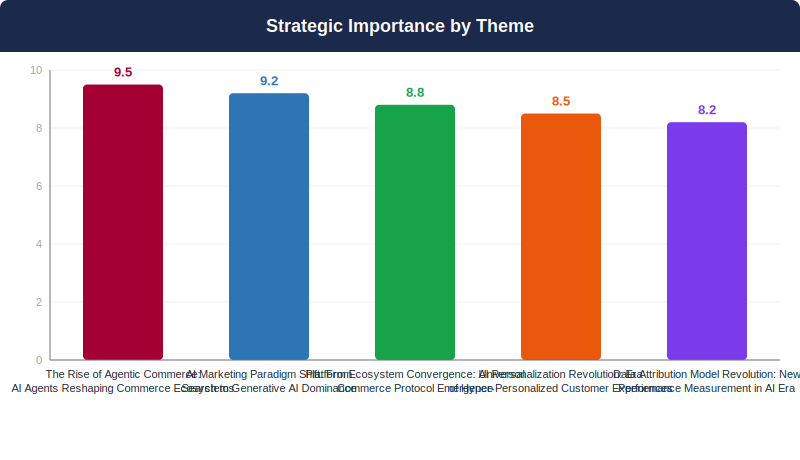
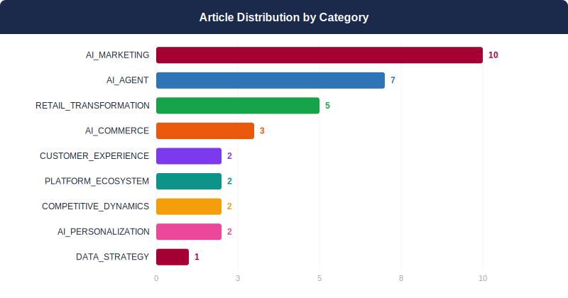
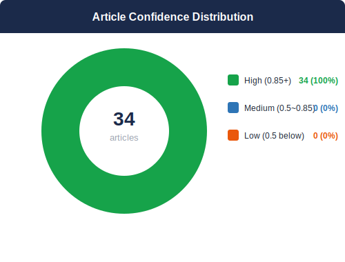
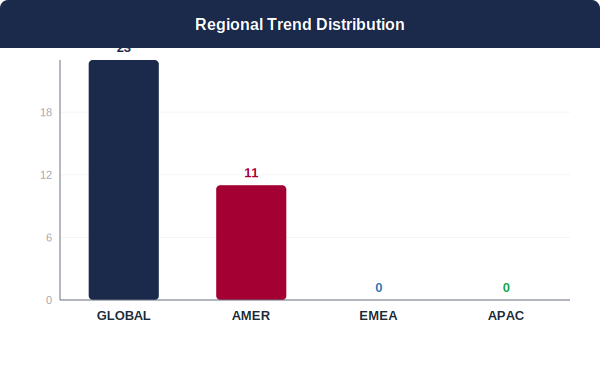
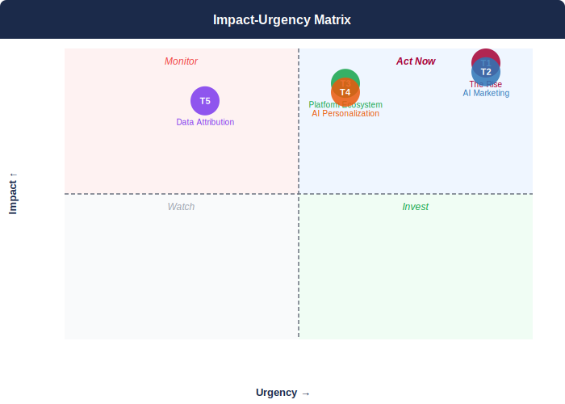

## 📋 2026년 5월 Monthly Deep Dive

### 이달의 핵심 메시지

> 2025년은 AI 에이전트가 상거래 생태계 전반을 재편하며, 검색부터 구매까지 모든 고객 여정이 AI 중심으로 전환되는 변곡점입니다.

> **"AI agents are not just changing how customers shop—they're becoming the customers themselves, making purchase decisions autonomously and fundamentally redefining what brand loyalty means in a post-search world."**
> — Synthesized from 34 articles analyzing agentic commerce trends

### 📊 이달의 분석 현황

| 지표 | 값 |
|------|----|
| 분석 기사 수 | **34개** |
| 도출 매크로 테마 | **5개** |
| AI 분석 파이프라인 | **7단계** |
| 분석 소요 시간 | **352초** |

---

## 🌐 5월 AI 트렌드 개요

2025년은 AI가 상거래 생태계 전반을 재정의하는 전환점이 되고 있습니다. 검색부터 구매, 개인화까지 모든 고객 여정이 AI 에이전트 중심으로 재편되고 있으며, 기존 D2C 채널과 마케팅 접근법의 근본적 혁신이 요구됩니다. Google Universal Cart, AI Overview 등 플랫폼 거대 기업들이 구축하는 새로운 인프라에 조기 참여하지 못할 경우, 고객 접점 확보와 브랜드 가시성에서 치명적인 경쟁 열위에 처할 위험이 높습니다. LG D2C는 현재 삼성, 소니, 애플 대비 상대적 후발주자 위치에서 AI 전환의 시급성을 인지하고 즉각적인 전략적 대응을 실행해야 합니다.

**테마 수렴 패턴:** 5개 테마는 AI 에이전트 중심의 상거래 생태계로 수렴하고 있으며, 이는 고객-브랜드 관계의 근본적 재정의를 의미합니다. LG는 에이전트 최적화, AI 마케팅 전환, 플랫폼 통합 대응을 동시에 추진하여 새로운 상거래 패러다임에서 경쟁 우위를 확보해야 합니다.

---

## 🔬 핵심 테마 심층 분석

### 1. 에이전틱 커머스의 부상: AI 에이전트가 주도하는 상거래 생태계
**AI 에이전트가 구매 결정부터 거래 완료까지 전 과정을 자율 수행하는 새로운 상거래 패러다임**

> ⏰ 긴급도: 🔴 즉시 | 중요도: 9.5/10

#### 트렌드 분석

에이전틱 커머스(Agentic Commerce)가 상거래 생태계의 근본적 패러다임 변화를 이끌고 있습니다. AI 에이전트가 소비자를 대신하여 제품 연구부터 구매 완료까지 전체 상거래 여정을 자율적으로 처리하는 새로운 모델이 빠르게 현실화되고 있습니다. 구글의 유니버설 카트와 어펌/클라르나 BNPL 통합, 허브스팟의 에이전틱 플랫폼 구축 등 주요 기술 기업들이 AI 에이전트 기반 자동화 인프라에 집중 투자하고 있습니다. 비자와 마스터카드는 에이전틱 커머스가 인간 개입을 제거하여 거래량을 배증시킬 것으로 전망한다고 발표했습니다. 이는 전통적인 D2C 고객 접점 전략의 완전한 재편을 요구하며, 브랜드들은 AI 에이전트의 추천 알고리즘에 최적화된 제품 정보 구조와 자동화된 구매 프로세스 구축이 필수가 되었습니다.

#### 📎 근거 체인

- **구글이 AI 에이전트 전용 유니버설 카트를 출시하여 에이전틱 커머스 인프라를 구축** ([Google unveils its new Universal Cart for agentic commerce](https://www.digitalcommerce360.com/2026/05/20/google-universal-cart-for-agentic-commerce/))
- **비자와 마스터카드가 에이전틱 커머스로 인한 거래량 배증과 수수료 수익 증대를 전망** ([Visa, Mastercard envision agentic commerce benefits](https://www.paymentsdive.com/news/visa-mastercard-envision-agentic-commerce-benefits/821205/))
- **허브스팟이 에이전틱 고객 플랫폼으로 전환하여 마케팅부터 서비스까지 AI 에이전트 자동화 구현** ([Our Vision for Building an Open Ecosystem for the Agent Era](https://blog.hubspot.com/marketing/our-vision-for-building-an-open-ecosystem-for-the-agent-era))
- **구글-어펌-클라르나 파트너십을 통해 AI 모드에서 BNPL 서비스 제공 시작** ([Google partners with Affirm, Klarna on BNPL for agentic commerce](https://www.digitalcommerce360.com/2026/05/13/affirm-klarna-google-bnpl-agentic-commerce/))

#### 📈 핵심 지표

- AI가 새로운 코드의 60% 작성 (에어비앤비)
- AI 봇이 40%의 고객 문의를 인간 개입 없이 처리 (에어비앤비)
- 120개 브랜드와 18,000개 이상 장비 모델 지원 (Parts Town PartPredictor)
- 22억 달러 LiveRamp 인수 (퍼블리시스 그룹)
- 거래량 배증 전망 (비자/마스터카드)

#### 영향도 평가: 🔴 HIGH

주요 결제 업체들이 거래량 배증을 전망하고, 구글과 같은 플랫폼 기업이 전용 인프라를 구축하고 있어 D2C 채널의 근본적 변화가 임박했습니다. 전통적인 고객 여정과 접점 전략의 완전한 재편이 필요한 상황입니다.

> **시간 지평:** 6-12개월 / 6-12 months

#### 🏆 경쟁사 관점

삼성과 소니는 이미 AI 기반 제품 추천 시스템을 보유하고 있어 에이전틱 커머스 전환에서 유리한 위치에 있습니다. 애플은 Siri와 iOS 생태계를 통해 자체 에이전틱 커머스 플랫폼을 구축할 가능성이 높습니다. LG는 AI 에이전트 최적화된 제품 데이터 구조와 자동화 구매 시스템 구축에서 뒤처질 위험이 있으며, 특히 구글, 아마존 등 플랫폼 기업들의 에이전틱 커머스 생태계에서 제품 노출도가 감소할 수 있습니다.

#### 📌 케이스 스터디

- **HubSpot**: Transformed into 'Agentic Customer Platform' with AI agents handling lead generation, ticket processing, and deal closure → Automated marketing, sales, and service operations across the entire customer lifecycle ([출처](https://blog.hubspot.com/marketing/our-vision-for-building-an-open-ecosystem-for-the-agent-era))
- **Airbnb**: Deployed AI bots to handle customer support and AI to write code → AI handles 40% of customer inquiries without human intervention and writes 60% of new code ([출처](https://techcrunch.com/2026/05/08/airbnb-says-ai-now-writes-60-of-its-new-code/))
- **Parts Town**: Upgraded PartPredictor AI tool to support 120 brands and 18,000+ equipment models with natural language processing → Technicians can identify correct parts faster using model numbers to general language symptom descriptions ([출처](https://www.digitalcommerce360.com/2026/05/15/parts-town-updates-partpredictor-with-new-ai-backed-features/))

#### 💡 LG D2C 시사점

1) AI 에이전트용 제품 정보 최적화: 구조화된 데이터와 자연어 처리가 가능한 제품 설명 체계 구축 2) 에이전틱 커머스 플랫폼 통합: 구글 유니버설 카트, 아마존 에이전트 등 주요 플랫폼과의 API 통합 준비 3) 자동화된 고객 서비스: 에어비앤비처럼 AI가 40%의 고객 문의를 처리할 수 있는 시스템 구축 4) BNPL 결제 옵션 확대: 에이전틱 구매를 지원하는 다양한 결제 방식 도입 5) 데이터 기반 AI 추천 시스템: 퍼블리시스-LiveRamp 사례를 참고한 자체 데이터 플랫폼 구축

### 2. AI 마케팅 패러다임 전환: 검색에서 생성형 AI로의 이동
**기존 SEO 중심에서 AEO(AI Engine Optimization)와 생성형 AI 최적화로 마케팅 전략 전환**

> ⏰ 긴급도: 🔴 즉시 | 중요도: 9.2/10

#### 트렌드 분석

검색 생태계의 패러다임이 근본적으로 변화하고 있습니다. 구글 I/O에서 AI 생성 답변이 검색 결과의 중심으로 공식 발표되면서, 기존 SEO 전략은 더 이상 유효하지 않은 검색 엔진에 최적화된 상태입니다. AI 오버뷰가 점점 더 많은 검색 결과에 등장하며, 백링크보다 인용이 더 중요한 역할을 하는 새로운 메커니즘이 콘텐츠 노출을 결정하고 있습니다. 마케터들의 AI 기술 투자는 2022년 44%에서 2025년 86%로 급증했지만, 대부분의 조직이 AI 도구 구매와 실제 구현 역량 사이의 심각한 격차를 보이고 있습니다. 브랜드 가시성이 검색 결과와 소셜 피드뿐만 아니라 AI 생성 답변에서도 결정적 요소가 되면서, 생성형 엔진 최적화(GEO)가 새로운 마케팅 전장으로 부상하고 있습니다.

#### 📎 근거 체인

- **AI 생성 답변이 검색의 중심으로 공식 발표됨** ([Your SEO strategy is optimized for a search engine that no longer exists](https://techcrunch.com/podcast/your-seo-strategy-is-optimized-for-a-search-engine-that-no-longer-exists/))
- **마케터 AI 투자가 2022년 44%에서 2025년 86%로 급증** ([Modern Retail+ Research: Marketers' AI use rises, but tech skills stall](https://www.modernretail.co/ai-strategies/modern-retail-research-marketers-ai-use-rises-but-tech-skills-stall/?utm_campaign=modernretaildis&utm_medium=rss&utm_source=general-rss))
- **AI 답변 엔진에서 백링크보다 인용이 더 중요함** ([The role of citations in AEO: Why citations matter more than backlinks for AI visibility](https://blog.hubspot.com/marketing/citations-in-aeo))
- **브랜드 가시성이 AI 생성 답변에서도 결정적 요소로 부상** ([Brand Visibility: How to Increase It in the Era of AI](https://blog.hubspot.com/marketing/brand-visibility))

#### 📈 핵심 지표

- 마케터 AI 투자: 2022년 44% → 2025년 86%
- Marketer AI investment: 44% in 2022 → 86% in 2025

#### 영향도 평가: 🔴 HIGH

검색 생태계의 근본적 변화로 기존 마케팅 전략이 무력화되고 있으며, AI 오버뷰 최적화 실패 시 경쟁사 대비 검색 가시성을 완전히 잃을 위험이 존재합니다.

> **시간 지평:** 6-12개월 / 6-12 months

#### 🏆 경쟁사 관점

삼성, 소니, 애플 등 글로벌 전자제품 경쟁사들이 AI 검색 최적화에 빠르게 적응할 경우, LG의 검색 가시성과 브랜드 발견 가능성이 급격히 감소할 위험이 있습니다. 특히 가전제품 구매 결정 과정에서 AI가 제공하는 제품 추천과 비교 정보에 LG가 포함되지 않을 가능성이 높아지고 있어, D2C 채널로의 트래픽 유입이 심각하게 제약받을 수 있습니다.

#### 📌 케이스 스터디

- **Google**: Launched Gemini LLM-based agentic advertising tools suite at Google Marketing Live → Expanding AI mode advertising with focus on trust and transparency balance ([출처](https://digiday.com/marketing/trust-becomes-the-product-marketers-grapple-with-googles-new-suite-of-ai-powered-ad-agents/?utm_campaign=digidaydis&utm_medium=rss&utm_source=general-rss))

#### 💡 LG D2C 시사점

1) AI 오버뷰 최적화를 위한 제품 콘텐츠 전면 재구성: 인용 가능한 권위적 콘텐츠 중심으로 제품 정보 아키텍처 재설계 2) 생성형 엔진 최적화(GEO) 전담팀 구성: SEO 팀을 AEO 팀으로 전환하고 AI 검색 알고리즘 대응 역량 구축 3) AI 어트리뷰션 모델 도입: 라스트 클릭 어트리뷰션에서 멀티터치 어트리뷰션으로 측정 프레임워크 전환 4) 구글 AI 광고 에이전트 파일럿 프로그램 참여: 투명성 확보와 제어 가능성 유지하며 자동화 이점 활용

### 3. 플랫폼 생태계 통합: 범용 상거래 프로토콜의 등장
**Google Universal Cart와 같은 크로스 플랫폼 상거래 솔루션이 소매 경계를 해체**

> ⏰ 긴급도: 🟡 단기 | 중요도: 8.8/10

#### 트렌드 분석

플랫폼 경계가 해체되는 '범용 상거래 프로토콜' 시대가 도래했다. 구글의 Universal Cart 출시는 검색, 동영상, 이메일 등 다양한 플랫폼에서 단일 장바구니로 쇼핑할 수 있는 새로운 패러다임을 제시하며, 아마존-링크드인의 CTV 광고 협력은 네트워킹과 커머스 플랫폼 간 융합을 보여준다. 이러한 변화는 기존 리테일 경계선을 무너뜨리고 AI 에이전트 기반 자동화 구매(Agentic Commerce)를 가능하게 만든다. 브랜드들은 이제 개별 채널이 아닌 통합된 플랫폼 생태계 관점에서 고객과 만나야 하며, 특히 구글의 Universal Commerce Protocol(UCP) 같은 표준화된 인프라에 조기 참여하지 않으면 고객 접점을 상실할 위험이 크다.

#### 📎 근거 체인

- **구글이 Universal Commerce Protocol 기반 Universal Cart를 출시하여 AI 에이전트가 전자상거래 결제 인프라와 통신 가능** ([Google unveils its new Universal Cart for agentic commerce](https://www.digitalcommerce360.com/2026/05/20/google-universal-cart-for-agentic-commerce/))
- **구글 Universal Cart가 검색, Gemini, YouTube, Gmail 등 다양한 플랫폼에서 크로스 리테일러 쇼핑 경험 제공** ([Google launches cross-retailer Universal Cart](https://www.retaildive.com/news/google-launches-cross-retailer-universal-cart/820957/))
- **아마존과 링크드인이 CTV 광고에서 협력하여 플랫폼 간 융합을 통한 정교한 B2B 타겟팅 실현** ([Amazon, LinkedIn help advertisers reach professionals via CTV ads](https://www.marketingdive.com/news/amazon-linkedin-help-advertisers-reach-professionals-via-ctv-ads/819372/))

#### 📈 핵심 지표

- 구글 Universal Cart가 검색, Gemini, YouTube, Gmail 등 다중 플랫폼에서 크로스 리테일러 지원
- Google Universal Cart supports cross-retailer functionality across Search, Gemini, YouTube, Gmail platforms

#### 영향도 평가: 🔴 HIGH

구글의 Universal Cart와 UCP는 전자상거래의 기본 인프라를 재정의하며, 모든 D2C 브랜드가 대응해야 할 표준화된 프로토콜로 부상하고 있음. 조기 참여 여부가 향후 고객 접점 확보의 핵심 요소가 될 것

> **시간 지평:** 6-12개월 / 6-12 months

#### 🏆 경쟁사 관점

삼성은 Galaxy 생태계와 SmartThings를 통해 자체 플랫폼 구축에 집중하고 있지만, 구글 UCP 같은 개방형 표준에는 상대적으로 소극적이다. 애플은 App Store와 Apple Pay를 중심으로 폐쇄형 생태계를 유지하며 외부 플랫폼 통합에 제한적이다. 소니는 PlayStation과 엔터테인먼트 콘텐츠 중심의 접근을 보이고 있다. LG는 이러한 경쟁사들과 달리 개방형 플랫폼 전략을 통해 구글 UCP 등 표준화된 상거래 프로토콜에 조기 참여할 수 있는 기회를 가지고 있다.

#### 📌 케이스 스터디

- **Google**: Launched Universal Cart with Universal Commerce Protocol enabling cross-platform shopping across Search, Gemini, YouTube, Gmail → Created unified shopping experience dissolving retail platform boundaries ([출처](https://www.retaildive.com/news/google-launches-cross-retailer-universal-cart/820957/))
- **Amazon-LinkedIn**: Collaborated on CTV advertising allowing marketers to run LinkedIn campaigns through Amazon DSP → Enabled sophisticated B2B professional targeting through platform convergence ([출처](https://www.marketingdive.com/news/amazon-linkedin-help-advertisers-reach-professionals-via-ctv-ads/819372/))

#### 💡 LG D2C 시사점

1) 구글 Universal Cart와 UCP 통합을 위한 기술 파트너십 즉시 추진 2) LG ThinQ와 webOS를 구글 플랫폼과 연동하는 크로스 플랫폼 쇼핑 경험 개발 3) AI 에이전트 기반 자동화 구매를 지원하는 상품 카탈로그 및 API 구조 재설계 4) 아마존-링크드인 사례를 벤치마킹한 B2B 고객 대상 CTV 광고 전략 수립 5) 6개월 내 구글 Universal Commerce Protocol 얼리 어답터 프로그램 참여

### 4. AI 개인화 혁명: 초개인화된 고객 경험 시대
**AI 기반 실시간 개인화가 고객 여정의 모든 단계를 최적화**

> ⏰ 긴급도: 🟡 단기 | 중요도: 8.5/10

#### 트렌드 분석

AI 기반 초개인화는 D2C 업계의 새로운 경쟁 차원으로 부상하고 있다. 단순한 상품 추천을 넘어 고객의 금융 상태, 구매 패턴, 배송 선호도까지 고려한 전방위적 개인화가 현실화되고 있다. OpenAI의 ChatGPT 개인 금융 서비스 출시는 AI가 고객의 구매력과 재정 상황을 실시간으로 분석하여 맞춤형 상품 제안이 가능함을 보여준다. 동시에 Edible Brands의 AOV 증대 사례는 개인화된 배송 서비스와 마켓플레이스 전략이 평균 주문가치 향상에 직접적으로 기여함을 입증한다. Amazon Now의 30분 배송과 Ulta Beauty의 당일 배송 확대는 개인화가 상품 선택뿐만 아니라 배송 타이밍과 방식까지 포함하는 전체 고객 여정의 최적화로 진화하고 있음을 시사한다.

#### 📎 근거 체인

- **AI가 개인의 금융 맥락을 분석하여 구매 결정을 지원하는 서비스가 상용화됨** ([A new personal finance experience in ChatGPT](https://openai.com/index/personal-finance-chatgpt))
- **개인화와 맞춤화 강화가 AOV 증대의 핵심 전략으로 검증됨** ([3 ways Edible Brands has grown its AOV in 2026](https://www.digitalcommerce360.com/2026/05/14/3-ways-edible-brands-has-grown-its-aov-in-2026/))
- **초고속 배송이 새로운 업계 표준으로 자리잡으며 개인화된 배송 옵션 제공 필요성 증대** ([Amazon launches Amazon Now in U.S. for 30-minute delivery](https://www.digitalcommerce360.com/2026/05/12/amazon-now-us-30-minute-delivery/))

#### 📈 핵심 지표

- Amazon Now: 30분 배송 서비스 / 30-minute delivery service
- UAE에서 15분 배송 서비스 제공 (2025년 10월) / 15-minute delivery in UAE (October 2025)
- Edible Brands AOV 성장 (2026년) / Edible Brands AOV growth (2026)

#### 영향도 평가: 🔴 HIGH

AI 개인화는 고객 경험과 AOV에 직접적 영향을 미치며, Amazon과 같은 플랫폼 자이언트들이 30분 배송 등 새로운 표준을 설정하고 있어 LG의 즉각적 대응이 필요한 상황

> **시간 지평:** 6-12개월 / 6-12 months

#### 🏆 경쟁사 관점

삼성은 SmartThings 생태계를 통해 가전제품 사용 패턴 기반 개인화에서 선도하고 있으며, 소니는 PlayStation과 엔터테인먼트 콘텐츠 연계 개인화를 구축 중이다. 애플은 Apple Intelligence를 통해 디바이스 간 통합 개인화 경험을 제공한다. LG는 ThinQ AI 플랫폼을 활용하여 가전제품 사용 데이터와 구매 이력을 결합한 차별화된 개인화 전략이 필요하다.

#### 📌 케이스 스터디

- **Edible Brands**: Implemented three-pronged strategy: delivery expansion, personalization enhancement, and marketplace entry → Successfully grew average order value (AOV) in 2026 ([출처](https://www.digitalcommerce360.com/2026/05/14/3-ways-edible-brands-has-grown-its-aov-in-2026/))
- **OpenAI**: Launched personal finance service in ChatGPT Pro for US users with secure account connection → Provides personalized AI-based insights and customized guidance based on individual financial context and goals ([출처](https://openai.com/index/personal-finance-chatgpt))
- **Amazon**: Launched Amazon Now 30-minute delivery service using micro-fulfillment centers → Set new industry standard for ultra-fast delivery following 15-minute delivery in UAE in October 2025 ([출처](https://www.digitalcommerce360.com/2026/05/12/amazon-now-us-30-minute-delivery/))

#### 💡 LG D2C 시사점

1) ThinQ AI 플랫폼에 고객 금융 데이터 통합 분석 기능 구축하여 구매력 기반 상품 추천 시스템 개발 2) 가전제품 사용 패턴과 라이프스타일 데이터를 활용한 개인화된 배송 옵션(시간대, 빈도) 제공 3) 마이크로 풀필먼트 센터 도입으로 주요 도시 2시간 이내 배송 서비스 구축 4) 개인화 효과 측정을 위한 AOV, 재구매율, 고객만족도 KPI 시스템 구축

### 5. 데이터 귀속 모델의 혁명: AI 시대의 새로운 성과 측정
**기존 라스트 클릭 귀속에서 AI 기반 통합 고객 여정 분석으로 전환**

> ⏰ 긴급도: 🟢 중기 | 중요도: 8.2/10

#### 트렌드 분석

AI 시대의 도래로 전통적인 마지막 클릭 기반 어트리뷰션 모델이 근본적 한계를 드러내고 있습니다. AI가 고객 여정을 더욱 복잡하게 만들면서, 기존의 단순한 성과 측정 방식으로는 실제 마케팅 투자 효과를 정확히 파악할 수 없는 상황입니다. 퍼블리시스의 LiveRamp 22억 달러 인수 사례에서 보듯, 글로벌 기업들은 데이터 기반 AI 에이전트 기능을 핵심 경쟁력으로 인식하고 있습니다. 동시에 AI 결과물의 품질과 실제 전략적 이해 사이의 격차가 확대되면서, 표면적 성과와 실질적 비즈니스 임팩트 간의 차이가 더욱 중요해지고 있습니다. 이는 D2C 조직이 멀티터치 어트리뷰션과 고도화된 측정 프레임워크로의 전환을 통해 AI 시대에 적합한 성과 평가 체계를 구축해야 함을 의미합니다.

#### 📎 근거 체인

- **AI 중심 환경에서 라스트 클릭 어트리뷰션이 잘못된 마케팅 활동에 보상을 주고 있음** ([Last-click attribution rewards the wrong work in an AI-first world](https://martech.org/last-click-attribution-rewards-the-wrong-work-in-an-ai-first-world/))
- **퍼블리시스가 22억 달러로 LiveRamp를 인수하여 커머스 미디어와 에이전틱 AI 영역 경쟁력 확보** ([LiveRamp's Data Gives Publicis a New Way Into Commerce Media and Agentic AI](https://www.adweek.com/commerce/liveramps-data-gives-publicis-a-new-way-into-commerce-media-and-agentic-ai/))
- **AI 결과물의 품질과 실제 전략적 이해도 사이에 위험한 격차 존재** ([The dangerous gap between AI output and actual understanding](https://martech.org/the-dangerous-gap-between-ai-output-and-actual-understanding/))

#### 📈 핵심 지표

- 22억 달러 LiveRamp 인수 금액
- $2.2 billion LiveRamp acquisition value

#### 영향도 평가: 🔴 HIGH

AI 기술 발전으로 인한 고객 여정 복잡화와 퍼블리시스의 22억 달러 LiveRamp 인수 등 대규모 업계 투자가 데이터 어트리뷰션 모델의 근본적 변화 필요성을 입증하고 있습니다. 기존 측정 방식의 한계가 마케팅 ROI 오판으로 이어질 위험이 높습니다.

> **시간 지평:** 6-12개월 / 6-12 months

#### 🏆 경쟁사 관점

삼성, 소니, 애플 등 글로벌 경쟁사들이 이미 고도화된 데이터 분석과 AI 기반 성과 측정 시스템에 투자하고 있는 상황에서, LG는 상대적으로 후발주자 위치에 있습니다. 특히 아마존이 지배하는 커머스 미디어 시장에서 경쟁하기 위해서는 자체적인 데이터 플랫폼과 AI 에이전트 기능 구축이 필수적입니다. 경쟁사 대비 어트리뷰션 모델 혁신 지연 시, D2C 마케팅 효율성에서 결정적 격차가 발생할 위험이 있습니다.

#### 📌 케이스 스터디

- **Publicis Group**: Acquired LiveRamp for $2.2 billion to build data-driven AI agent capabilities for commerce media → Secured competitive position in Amazon-dominated commerce media market ([출처](https://www.adweek.com/commerce/liveramps-data-gives-publicis-a-new-way-into-commerce-media-and-agentic-ai/))

#### 💡 LG D2C 시사점

LG D2C는 즉시 멀티터치 어트리뷰션 모델 구축을 위한 로드맵을 수립하고, AI 기반 고객 여정 분석 플랫폼 도입을 추진해야 합니다. 기존 라스트 클릭 기반 KPI 체계를 전면 재검토하고, 크로스 채널 성과 측정이 가능한 통합 대시보드를 구축해야 합니다. 또한 마케팅 팀 대상 AI 시대 어트리뷰션 모델 교육 프로그램을 실시하여 전략적 이해도와 실행 역량을 동시에 강화해야 합니다.

---

## 🔗 크로스 트렌드 종합 분석

5개 테마의 수렴에서 'AI-First 통합 커머스 생태계'가 새로운 메가 트렌드로 부상하고 있습니다. 이는 AI 에이전트가 검색, 추천, 구매, 배송까지 전 과정을 자동화하되, 개별 고객의 라이프스타일과 선호도를 실시간으로 학습하고 반영하는 지능형 커머스 플랫폼을 의미합니다. LG에게는 ThinQ AI 플랫폼을 중심으로 가전 사용 패턴, 에너지 소비 데이터, 생활 리듬 등을 활용한 '생활 밀착형 AI 커머스' 구축 기회가 열립니다. 이는 단순한 제품 판매를 넘어 고객의 삶의 질 향상을 위한 통합 솔루션 제공자로의 포지셔닝 전환을 가능하게 합니다.

### 상호 강화 테마

- **T1 ↔ T2**: 에이전틱 커머스와 AI 마케팅은 동일한 핵심 요구사항을 공유합니다. 두 테마 모두 AI가 이해하고 처리할 수 있는 구조화된 제품 데이터와 자연어 최적화된 콘텐츠를 요구하며, AI 에이전트가 검색부터 구매까지 전 과정을 자동화할 수 있는 API 통합 능력이 필요합니다. 이는 LG가 단일 투자로 두 영역의 경쟁력을 동시에 확보할 수 있는 시너지 기회를 제공합니다.
- **T3 ↔ T5**: 플랫폼 생태계 수렴과 데이터 어트리뷰션 혁명은 상호 의존적입니다. Google Universal Cart와 같은 통합 플랫폼이 확산될수록 고객 여정이 더욱 복잡해지고 멀티터치 어트리뷰션의 중요성이 증가합니다. 동시에 정확한 AI 기반 성과 측정 능력을 보유한 브랜드만이 새로운 플랫폼 환경에서 효과적인 투자 배분과 최적화를 실현할 수 있어 경쟁 우위를 확보할 수 있습니다.

### 긴장 관계 테마

- **T3 vs T4**: 플랫폼 표준화와 개인화 혁명 간 근본적 딜레마가 존재합니다. Google UCP 같은 범용 플랫폼 참여는 표준화된 경험을 요구하는 반면, AI 개인화는 LG만의 차별화된 고객 경험 구축을 추구합니다. 특히 LG ThinQ 생태계의 고유한 가전 사용 패턴 데이터를 활용한 개인화가 범용 플랫폼의 표준화된 인터페이스와 충돌할 가능성이 높아 전략적 선택의 어려움이 예상됩니다.
- **T1 vs T4**: 에이전틱 커머스의 자동화 지향과 개인화의 인간 중심 접근 간 모순이 발생합니다. AI 에이전트는 효율성을 위해 고객 개입을 최소화하려 하지만, 진정한 개인화는 고객의 세밀한 피드백과 상호작용을 필요로 합니다. 특히 가전제품처럼 복잡한 구매 결정이 필요한 영역에서 완전 자동화와 개인화된 컨설팅 사이의 균형점 찾기가 핵심 과제가 될 것입니다.

---

## 📐 전략 프레임워크

### 영향도-긴급도 매트릭스

> 🔴 **즉시 행동 (Act Now):** T1, T2 — AI 에이전트 최적화와 생성형 AI 마케팅 전환에 즉각적 투자 필요. 경쟁 우위 확보를 위한 핵심 기반 구축 단계

> 🔵 **전략적 투자:** T3, T4 — 플랫폼 통합 생태계와 AI 개인화 혁명에 대한 체계적 준비. 중장기 경쟁력 확보를 위한 선제적 투자

### 🎯 단계별 실행 로드맵

#### 즉시 (0-30일)

1. **AI 에이전트용 구조화된 제품 데이터 시스템 구축 TF 조직** (담당: IT/Data) — KPI: 제품 데이터 구조화 완료율 (%)

2. **Google AI Overview 최적화를 위한 제품 콘텐츠 재설계 프로젝트 착수** (담당: Marketing/Commerce) — KPI: AI Overview 인용 가능한 콘텐츠 비율 (%)

3. **경쟁사 AI 에이전트 대응 전략 분석 및 벤치마킹 완료** (담당: Strategy) — KPI: 경쟁사 분석 보고서 완료 여부

#### 단기 (1-3개월)

1. **Google Universal Cart 및 UCP 통합을 위한 기술 파트너십 체결** (담당: Commerce/IT) — KPI: 파트너십 체결 및 통합 완료 일정

2. **ThinQ AI 플랫폼 내 고객 금융 데이터 통합 분석 기능 개발** (담당: Data/CRM) — KPI: 개인화 추천 정확도 향상율 (%)

3. **크로스 플랫폼 쇼핑 경험 연결 시스템 프로토타입 개발** (담당: Commerce/IT) — KPI: 플랫폼 간 전환율 개선 (%)

4. **AI 기반 자연어 제품 검색 시스템 구축** (담당: IT/Commerce) — KPI: 자연어 검색 정확도 및 사용자 만족도

#### 중기 (3-6개월)

1. **AI 에이전트 전용 제품 카탈로그 및 API 시스템 완전 구축** (담당: IT/Commerce) — KPI: AI 에이전트 쿼리 응답률 및 정확도

2. **멀티터치 어트리뷰션 모델 개발 로드맵 수립** (담당: Data/Marketing) — KPI: 어트리뷰션 모델 정확도 및 ROI 측정 개선율

3. **AI 기반 고객 여정 분석 플랫폼 도입** (담당: Data/CRM) — KPI: 고객 여정 예측 정확도 및 전환율 개선

4. **하이퍼 개인화 상품 추천 시스템 전면 배포** (담당: Data/Commerce) — KPI: 개인화 추천 클릭률 및 구매 전환율

---

## 🏢 LG D2C 전략적 포지셔닝

LG D2C는 현재 '전략적 기회의 창' 시점에 있지만 시간적 압박이 심각합니다. 삼성(SmartThings 생태계), 소니(PlayStation 연계 개인화), 애플(통합 생태계) 대비 AI 전환에서 뒤처져 있으나, ThinQ AI와 webOS라는 고유한 플랫폼 자산을 보유하고 있어 차별화 가능성이 높습니다. 핵심은 향후 6-12개월 내 Google UCP 조기 참여, AI 최적화된 제품 정보 시스템 구축, 가전 데이터 기반 개인화 엔진 개발을 동시 실행하는 것입니다. 실행 속도가 LG의 AI 커머스 시대 경쟁력을 결정할 것이며, 늦어질 경우 플랫폼 종속적 지위로 전락할 위험이 큽니다.

---

## 🚀 핵심 전략 명령 (Top 3 Imperatives)

1. **Google Universal Cart 등 주요 AI 플랫폼과의 파트너십 수립 및 조기 참여 전략 실행** (Global D2C Strategy) — 2025년 Q2

2. **생성형 AI 기반 마케팅 역량 구축 및 기존 검색 마케팅 전략 전면 재검토** (Digital Marketing) — 2025년 Q3

3. **AI 에이전트 환경에서의 브랜드 차별화 및 가시성 확보를 위한 데이터 전략 수립** (Data & Analytics) — 2025년 Q2

## 📋 May 2026 Monthly Deep Dive

### This Month's Core Message

> 2025 marks the inflection point where AI agents are fundamentally reshaping the entire commerce ecosystem, transforming every aspect of the customer journey from search to purchase around AI-centric experiences.

> **"AI agents are not just changing how customers shop—they're becoming the customers themselves, making purchase decisions autonomously and fundamentally redefining what brand loyalty means in a post-search world."**
> — Synthesized from 34 articles analyzing agentic commerce trends

### 📊 Monthly Analysis Dashboard

| Metric | Value |
|--------|-------|
| Articles Analyzed | **34** |
| Macro Themes Identified | **5** |
| AI Pipeline Stages | **7** |
| Analysis Duration | **352s** |

---

## 🌐 May 2026 AI Trend Overview

2025 marks an inflection point where AI is fundamentally redefining the entire commerce ecosystem. Every aspect of the customer journey—from search to purchase to personalization—is being reorganized around AI agents, demanding radical innovation in existing D2C channels and marketing approaches. Failure to participate early in the new infrastructure being built by platform giants like Google Universal Cart and AI Overview poses critical competitive risks in securing customer touchpoints and brand visibility. LG D2C must recognize the urgency of AI transformation from its current follower position relative to Samsung, Sony, and Apple, and execute immediate strategic responses.

**Theme Convergence:** The five themes are converging toward an AI agent-centric commerce ecosystem, signifying a fundamental redefinition of customer-brand relationships. LG must simultaneously pursue agent optimization, AI marketing transformation, and platform integration responses to secure competitive advantage in the new commerce paradigm.

---

## 🔬 Macro Theme Deep Dives

### 1. The Rise of Agentic Commerce: AI Agents Reshaping Commerce Ecosystems
**AI agents autonomously handling entire commerce journeys from purchase decisions to transaction completion**

> ⏰ Urgency: 🔴 Immediate | Importance: 9.5/10

#### Trend Analysis

Agentic Commerce represents a fundamental paradigm shift in commerce ecosystems, with AI agents autonomously handling entire commerce journeys from product research to purchase completion on behalf of consumers. This transformation is rapidly materializing as major technology companies invest heavily in AI agent-based automation infrastructure. Google has unveiled its Universal Cart for agentic commerce, built on the Universal Commerce Protocol (UCP), enabling AI agents to communicate with payment infrastructure during e-commerce transactions. Meanwhile, Google's partnerships with Affirm and Klarna integrate BNPL services into AI Mode for autonomous purchasing. HubSpot has repositioned itself as an 'Agentic Customer Platform,' automating lead generation, ticket handling, and deal closure across marketing, sales, and service teams. The financial implications are substantial - Visa and Mastercard CFOs project that removing human intervention from purchase processes could double transaction volumes, significantly increasing fee revenue. This evolution demands a complete reimagining of traditional D2C customer touchpoint strategies, requiring brands to optimize product information architecture for AI agent recommendation algorithms and develop seamless automated purchase processes.

#### 📎 Evidence Chain

- **Google launched Universal Cart specifically for agentic commerce, building core infrastructure for AI agent transactions** ([Google unveils its new Universal Cart for agentic commerce](https://www.digitalcommerce360.com/2026/05/20/google-universal-cart-for-agentic-commerce/))
- **Visa and Mastercard CFOs project doubled transaction volumes and increased fee revenue from agentic commerce** ([Visa, Mastercard envision agentic commerce benefits](https://www.paymentsdive.com/news/visa-mastercard-envision-agentic-commerce-benefits/821205/))
- **HubSpot transformed into an 'Agentic Customer Platform' with AI agent automation across marketing, sales, and service** ([Our Vision for Building an Open Ecosystem for the Agent Era](https://blog.hubspot.com/marketing/our-vision-for-building-an-open-ecosystem-for-the-agent-era))
- **Google-Affirm-Klarna partnership enables BNPL services in AI Mode for autonomous purchasing** ([Google partners with Affirm, Klarna on BNPL for agentic commerce](https://www.digitalcommerce360.com/2026/05/13/affirm-klarna-google-bnpl-agentic-commerce/))

#### 📈 Key Metrics

- AI가 새로운 코드의 60% 작성 (에어비앤비)
- AI 봇이 40%의 고객 문의를 인간 개입 없이 처리 (에어비앤비)
- 120개 브랜드와 18,000개 이상 장비 모델 지원 (Parts Town PartPredictor)
- 22억 달러 LiveRamp 인수 (퍼블리시스 그룹)
- 거래량 배증 전망 (비자/마스터카드)

#### Impact Assessment: 🔴 HIGH

Major payment companies project doubled transaction volumes, and platform giants like Google are building dedicated infrastructure, indicating imminent fundamental changes to D2C channels. Complete reimagining of traditional customer journeys and touchpoint strategies is required.

> **Time Horizon:** 6-12개월 / 6-12 months

#### 🏆 Competitive Landscape

Samsung and Sony already possess AI-based product recommendation systems, positioning them advantageously for agentic commerce transition. Apple will likely build proprietary agentic commerce platforms through Siri and iOS ecosystem integration. LG risks falling behind in building AI agent-optimized product data architecture and automated purchase systems, potentially facing reduced product visibility within agentic commerce ecosystems dominated by platform companies like Google and Amazon.

#### 📌 Case Studies

- **HubSpot**: Transformed into 'Agentic Customer Platform' with AI agents handling lead generation, ticket processing, and deal closure → Automated marketing, sales, and service operations across the entire customer lifecycle ([source](https://blog.hubspot.com/marketing/our-vision-for-building-an-open-ecosystem-for-the-agent-era))
- **Airbnb**: Deployed AI bots to handle customer support and AI to write code → AI handles 40% of customer inquiries without human intervention and writes 60% of new code ([source](https://techcrunch.com/2026/05/08/airbnb-says-ai-now-writes-60-of-its-new-code/))
- **Parts Town**: Upgraded PartPredictor AI tool to support 120 brands and 18,000+ equipment models with natural language processing → Technicians can identify correct parts faster using model numbers to general language symptom descriptions ([source](https://www.digitalcommerce360.com/2026/05/15/parts-town-updates-partpredictor-with-new-ai-backed-features/))

#### 💡 LG D2C Implications

1) Optimize product information for AI agents: Build structured data and natural language processing-capable product description systems 2) Integrate with agentic commerce platforms: Prepare API integrations with major platforms like Google Universal Cart and Amazon agents 3) Implement automated customer service: Build systems capable of handling 40% of customer inquiries without human intervention, following Airbnb's model 4) Expand BNPL payment options: Introduce diverse payment methods supporting agentic purchases 5) Develop data-driven AI recommendation systems: Build proprietary data platforms following the Publicis-LiveRamp acquisition model

### 2. AI Marketing Paradigm Shift: From Search to Generative AI Dominance
**Marketing strategy transformation from SEO-centric to AEO (AI Engine Optimization) and generative AI optimization**

> ⏰ Urgency: 🔴 Immediate | Importance: 9.2/10

#### Trend Analysis

The search ecosystem is undergoing a fundamental paradigm shift. Google's official announcement at I/O positioning AI-generated answers at the center of search results has rendered existing SEO strategies obsolete, as they remain optimized for a search engine that no longer exists. AI Overviews are appearing in increasingly more search results, with citations playing a more crucial role than backlinks in determining content visibility through new mechanisms. While marketers' AI technology investments have surged from 44% in 2022 to 86% in 2025, most organizations exhibit a serious gap between AI tool purchases and actual implementation capabilities. Brand visibility has become a decisive factor not only in search results and social feeds but also in AI-generated answers, making Generative Engine Optimization (GEO) the new marketing battleground. This shift requires brands to fundamentally restructure their content strategies from traditional SEO-centric approaches to AI Engine Optimization (AEO), where authoritative, citation-worthy content creation takes precedence over link-building activities.

#### 📎 Evidence Chain

- **AI-generated answers officially positioned at center of search** ([Your SEO strategy is optimized for a search engine that no longer exists](https://techcrunch.com/podcast/your-seo-strategy-is-optimized-for-a-search-engine-that-no-longer-exists/))
- **Marketer AI investment surged from 44% in 2022 to 86% in 2025** ([Modern Retail+ Research: Marketers' AI use rises, but tech skills stall](https://www.modernretail.co/ai-strategies/modern-retail-research-marketers-ai-use-rises-but-tech-skills-stall/?utm_campaign=modernretaildis&utm_medium=rss&utm_source=general-rss))
- **Citations matter more than backlinks for AI visibility** ([The role of citations in AEO: Why citations matter more than backlinks for AI visibility](https://blog.hubspot.com/marketing/citations-in-aeo))
- **Brand visibility becomes decisive factor in AI-generated answers** ([Brand Visibility: How to Increase It in the Era of AI](https://blog.hubspot.com/marketing/brand-visibility))

#### 📈 Key Metrics

- 마케터 AI 투자: 2022년 44% → 2025년 86%
- Marketer AI investment: 44% in 2022 → 86% in 2025

#### Impact Assessment: 🔴 HIGH

Fundamental changes in search ecosystem are rendering existing marketing strategies ineffective, with risk of complete loss of search visibility versus competitors if AI Overview optimization fails.

> **Time Horizon:** 6-12개월 / 6-12 months

#### 🏆 Competitive Landscape

If global electronics competitors like Samsung, Sony, and Apple rapidly adapt to AI search optimization, LG faces significant risk of decreased search visibility and brand discoverability. Particularly in appliance purchase decision processes, LG's exclusion from AI-provided product recommendations and comparison information is increasingly likely, potentially severely constraining traffic flow to D2C channels.

#### 📌 Case Studies

- **Google**: Launched Gemini LLM-based agentic advertising tools suite at Google Marketing Live → Expanding AI mode advertising with focus on trust and transparency balance ([source](https://digiday.com/marketing/trust-becomes-the-product-marketers-grapple-with-googles-new-suite-of-ai-powered-ad-agents/?utm_campaign=digidaydis&utm_medium=rss&utm_source=general-rss))

#### 💡 LG D2C Implications

1) Complete restructuring of product content for AI Overview optimization: Redesign product information architecture centered on authoritative, citation-worthy content 2) Establish dedicated Generative Engine Optimization (GEO) team: Transform SEO team into AEO team and build AI search algorithm response capabilities 3) Implement AI attribution models: Transition measurement framework from last-click to multi-touch attribution 4) Participate in Google AI ad agent pilot programs: Leverage automation benefits while ensuring transparency and maintaining controllability

### 3. Platform Ecosystem Convergence: Universal Commerce Protocol Emergence
**Cross-platform commerce solutions like Google Universal Cart dissolving retail boundaries**

> ⏰ Urgency: 🟡 Short-term | Importance: 8.8/10

#### Trend Analysis

The era of 'Universal Commerce Protocol' is dismantling traditional platform boundaries. Google's Universal Cart launch represents a paradigm shift enabling unified shopping across search, video, and email platforms, while Amazon-LinkedIn's CTV advertising partnership demonstrates convergence between networking and commerce ecosystems. This transformation dissolves retail boundaries and enables AI agent-driven automated purchasing (Agentic Commerce). Brands must now engage customers through integrated platform ecosystems rather than individual channels. Early participation in standardized infrastructures like Google's Universal Commerce Protocol (UCP) is critical - failure to integrate risks losing customer touchpoints as shopping becomes increasingly platform-agnostic and AI-mediated.

#### 📎 Evidence Chain

- **Google launched Universal Cart based on Universal Commerce Protocol enabling AI agents to communicate with e-commerce payment infrastructure** ([Google unveils its new Universal Cart for agentic commerce](https://www.digitalcommerce360.com/2026/05/20/google-universal-cart-for-agentic-commerce/))
- **Google Universal Cart provides cross-retailer shopping experience across Search, Gemini, YouTube, Gmail platforms** ([Google launches cross-retailer Universal Cart](https://www.retaildive.com/news/google-launches-cross-retailer-universal-cart/820957/))
- **Amazon and LinkedIn collaborate on CTV advertising enabling sophisticated B2B targeting through platform convergence** ([Amazon, LinkedIn help advertisers reach professionals via CTV ads](https://www.marketingdive.com/news/amazon-linkedin-help-advertisers-reach-professionals-via-ctv-ads/819372/))

#### 📈 Key Metrics

- 구글 Universal Cart가 검색, Gemini, YouTube, Gmail 등 다중 플랫폼에서 크로스 리테일러 지원
- Google Universal Cart supports cross-retailer functionality across Search, Gemini, YouTube, Gmail platforms

#### Impact Assessment: 🔴 HIGH

Google's Universal Cart and UCP are redefining fundamental e-commerce infrastructure, emerging as standardized protocols all D2C brands must address. Early participation will be critical for securing future customer touchpoints

> **Time Horizon:** 6-12개월 / 6-12 months

#### 🏆 Competitive Landscape

Samsung focuses on building proprietary platforms through Galaxy ecosystem and SmartThings but remains relatively passive on open standards like Google UCP. Apple maintains a closed ecosystem centered on App Store and Apple Pay with limited external platform integration. Sony pursues PlayStation and entertainment content-focused approaches. Unlike these competitors, LG has an opportunity to leverage an open platform strategy for early participation in standardized commerce protocols like Google UCP.

#### 📌 Case Studies

- **Google**: Launched Universal Cart with Universal Commerce Protocol enabling cross-platform shopping across Search, Gemini, YouTube, Gmail → Created unified shopping experience dissolving retail platform boundaries ([source](https://www.retaildive.com/news/google-launches-cross-retailer-universal-cart/820957/))
- **Amazon-LinkedIn**: Collaborated on CTV advertising allowing marketers to run LinkedIn campaigns through Amazon DSP → Enabled sophisticated B2B professional targeting through platform convergence ([source](https://www.marketingdive.com/news/amazon-linkedin-help-advertisers-reach-professionals-via-ctv-ads/819372/))

#### 💡 LG D2C Implications

1) Immediately pursue technical partnership for Google Universal Cart and UCP integration 2) Develop cross-platform shopping experiences connecting LG ThinQ and webOS with Google platforms 3) Redesign product catalog and API architecture to support AI agent-based automated purchasing 4) Establish B2B customer CTV advertising strategy benchmarking Amazon-LinkedIn case 5) Join Google Universal Commerce Protocol early adopter program within 6 months

### 4. AI Personalization Revolution: Era of Hyper-Personalized Customer Experiences
**AI-driven real-time personalization optimizing every stage of the customer journey**

> ⏰ Urgency: 🟡 Short-term | Importance: 8.5/10

#### Trend Analysis

AI-driven hyper-personalization is emerging as a new competitive dimension in the D2C industry. Moving beyond simple product recommendations, comprehensive personalization now considers customers' financial status, purchasing patterns, and delivery preferences. OpenAI's ChatGPT personal finance service launch demonstrates AI's capability to analyze customers' purchasing power and financial situations in real-time for tailored product suggestions. Simultaneously, Edible Brands' AOV growth case proves that personalized delivery services and marketplace strategies directly contribute to average order value improvement. Amazon Now's 30-minute delivery and Ulta Beauty's same-day delivery expansion indicate that personalization is evolving into optimization of the entire customer journey, including product selection, delivery timing, and fulfillment methods.

#### 📎 Evidence Chain

- **AI services analyzing personal financial context to support purchase decisions are becoming commercial reality** ([A new personal finance experience in ChatGPT](https://openai.com/index/personal-finance-chatgpt))
- **Enhanced personalization and customization proven as key strategy for AOV growth** ([3 ways Edible Brands has grown its AOV in 2026](https://www.digitalcommerce360.com/2026/05/14/3-ways-edible-brands-has-grown-its-aov-in-2026/))
- **Ultra-fast delivery becoming new industry standard, increasing need for personalized delivery options** ([Amazon launches Amazon Now in U.S. for 30-minute delivery](https://www.digitalcommerce360.com/2026/05/12/amazon-now-us-30-minute-delivery/))

#### 📈 Key Metrics

- Amazon Now: 30분 배송 서비스 / 30-minute delivery service
- UAE에서 15분 배송 서비스 제공 (2025년 10월) / 15-minute delivery in UAE (October 2025)
- Edible Brands AOV 성장 (2026년) / Edible Brands AOV growth (2026)

#### Impact Assessment: 🔴 HIGH

AI personalization directly impacts customer experience and AOV, with platform giants like Amazon setting new standards such as 30-minute delivery, requiring LG's immediate response

> **Time Horizon:** 6-12개월 / 6-12 months

#### 🏆 Competitive Landscape

Samsung leads in appliance usage pattern-based personalization through SmartThings ecosystem, while Sony builds entertainment content-linked personalization via PlayStation. Apple provides integrated personalization experience across devices through Apple Intelligence. LG needs a differentiated personalization strategy combining appliance usage data with purchase history through ThinQ AI platform.

#### 📌 Case Studies

- **Edible Brands**: Implemented three-pronged strategy: delivery expansion, personalization enhancement, and marketplace entry → Successfully grew average order value (AOV) in 2026 ([source](https://www.digitalcommerce360.com/2026/05/14/3-ways-edible-brands-has-grown-its-aov-in-2026/))
- **OpenAI**: Launched personal finance service in ChatGPT Pro for US users with secure account connection → Provides personalized AI-based insights and customized guidance based on individual financial context and goals ([source](https://openai.com/index/personal-finance-chatgpt))
- **Amazon**: Launched Amazon Now 30-minute delivery service using micro-fulfillment centers → Set new industry standard for ultra-fast delivery following 15-minute delivery in UAE in October 2025 ([source](https://www.digitalcommerce360.com/2026/05/12/amazon-now-us-30-minute-delivery/))

#### 💡 LG D2C Implications

1) Build customer financial data integration and analysis capabilities in ThinQ AI platform to develop purchasing power-based product recommendation system 2) Provide personalized delivery options (timing, frequency) using appliance usage patterns and lifestyle data 3) Introduce micro-fulfillment centers to establish 2-hour delivery service in major cities 4) Establish AOV, repeat purchase rate, and customer satisfaction KPI system to measure personalization effectiveness

### 5. Data Attribution Model Revolution: New Performance Measurement in AI Era
**Transition from traditional last-click attribution to AI-powered integrated customer journey analysis**

> ⏰ Urgency: 🟢 Medium-term | Importance: 8.2/10

#### Trend Analysis

The advent of AI has exposed fundamental limitations in traditional last-click attribution models. As AI makes customer journeys increasingly complex, conventional performance measurement approaches fail to accurately capture the true effectiveness of marketing investments. The $2.2 billion acquisition of LiveRamp by Publicis demonstrates how global enterprises are recognizing data-driven AI agent capabilities as core competitive advantages. Simultaneously, a widening gap between AI output quality and actual strategic understanding is making the distinction between surface-level performance and genuine business impact increasingly critical. This landscape demands that D2C organizations transition to multi-touch attribution and sophisticated measurement frameworks designed for the AI era. Traditional metrics that reward the 'wrong work' in AI-first environments are creating misleading attribution data, leading to suboptimal investment decisions. The emergence of agentic AI in commerce media, as evidenced by major holding companies' strategic investments, signals a fundamental shift toward more intelligent, data-driven performance measurement systems that can navigate the complexity of modern customer interactions.

#### 📎 Evidence Chain

- **Last-click attribution rewards the wrong work in AI-first world environments** ([Last-click attribution rewards the wrong work in an AI-first world](https://martech.org/last-click-attribution-rewards-the-wrong-work-in-an-ai-first-world/))
- **Publicis acquired LiveRamp for $2.2 billion to gain competitive edge in commerce media and agentic AI** ([LiveRamp's Data Gives Publicis a New Way Into Commerce Media and Agentic AI](https://www.adweek.com/commerce/liveramps-data-gives-publicis-a-new-way-into-commerce-media-and-agentic-ai/))
- **Dangerous gap exists between AI output quality and actual strategic understanding** ([The dangerous gap between AI output and actual understanding](https://martech.org/the-dangerous-gap-between-ai-output-and-actual-understanding/))

#### 📈 Key Metrics

- 22억 달러 LiveRamp 인수 금액
- $2.2 billion LiveRamp acquisition value

#### Impact Assessment: 🔴 HIGH

AI-driven complexity in customer journeys and major industry investments like Publicis' $2.2 billion LiveRamp acquisition demonstrate fundamental need for attribution model transformation. Limitations of existing measurement approaches pose high risk of marketing ROI misjudgment.

> **Time Horizon:** 6-12개월 / 6-12 months

#### 🏆 Competitive Landscape

While global competitors like Samsung, Sony, and Apple are already investing in sophisticated data analytics and AI-powered performance measurement systems, LG finds itself in a relatively follower position. To compete in Amazon-dominated commerce media markets, building proprietary data platforms and AI agent capabilities is essential. Delays in attribution model innovation compared to competitors risk creating decisive gaps in D2C marketing efficiency.

#### 📌 Case Studies

- **Publicis Group**: Acquired LiveRamp for $2.2 billion to build data-driven AI agent capabilities for commerce media → Secured competitive position in Amazon-dominated commerce media market ([source](https://www.adweek.com/commerce/liveramps-data-gives-publicis-a-new-way-into-commerce-media-and-agentic-ai/))

#### 💡 LG D2C Implications

LG D2C must immediately establish a roadmap for multi-touch attribution model development and pursue AI-powered customer journey analysis platform adoption. Existing last-click based KPI frameworks require comprehensive review, with implementation of integrated dashboards enabling cross-channel performance measurement. Additionally, marketing teams need AI-era attribution model training programs to simultaneously strengthen strategic understanding and execution capabilities.

---

## 🔗 Cross-Trend Synthesis

From the convergence of all five themes, 'AI-First Integrated Commerce Ecosystem' is emerging as a new mega-trend. This represents intelligent commerce platforms where AI agents automate the entire process from search to recommendation to purchase to delivery, while real-time learning and reflecting individual customer lifestyles and preferences. For LG, this opens opportunities to build 'Lifestyle-Integrated AI Commerce' centered on the ThinQ AI platform, leveraging appliance usage patterns, energy consumption data, and daily life rhythms. This enables positioning transformation beyond simple product sales to become an integrated solution provider for improving customers' quality of life.

### Reinforcing Theme Pairs

- **T1 ↔ T2**: Agentic commerce and AI marketing share identical core requirements. Both themes demand structured product data and natural language-optimized content that AI can understand and process, as well as API integration capabilities that enable AI agents to automate the entire process from search to purchase. This provides LG with a synergy opportunity to secure competitiveness in both areas through a single strategic investment.
- **T3 ↔ T5**: Platform ecosystem convergence and data attribution revolution are interdependent. As unified platforms like Google Universal Cart proliferate, customer journeys become increasingly complex, heightening the importance of multi-touch attribution. Simultaneously, only brands with accurate AI-powered performance measurement capabilities can achieve effective investment allocation and optimization in new platform environments, securing competitive advantage.

---

## 📐 Strategic Framework

### Impact-Urgency Matrix

### 🎯 Phased Action Roadmap

#### Immediate (0-30 days)

1. **Establish task force for structured product data system for AI agents** (Owner: IT/Data) — KPI: Product data structuring completion rate (%)

2. **Launch product content redesign project for Google AI Overview optimization** (Owner: Marketing/Commerce) — KPI: Percentage of content suitable for AI Overview citation (%)

3. **Complete competitive analysis and benchmarking of AI agent response strategies** (Owner: Strategy) — KPI: Completion of competitive analysis report

#### Short-term (1-3 months)

1. **Secure technical partnership for Google Universal Cart and UCP integration** (Owner: Commerce/IT) — KPI: Partnership agreement and integration completion timeline

2. **Develop customer financial data integration and analysis capabilities within ThinQ AI platform** (Owner: Data/CRM) — KPI: Improvement rate in personalization recommendation accuracy (%)

3. **Develop prototype for cross-platform shopping experience connection system** (Owner: Commerce/IT) — KPI: Cross-platform conversion rate improvement (%)

4. **Build AI-powered natural language product search system** (Owner: IT/Commerce) — KPI: Natural language search accuracy and user satisfaction

#### Medium-term (3-6 months)

1. **Complete development of AI agent-specific product catalog and API system** (Owner: IT/Commerce) — KPI: AI agent query response rate and accuracy

2. **Establish roadmap for multi-touch attribution model development** (Owner: Data/Marketing) — KPI: Attribution model accuracy and ROI measurement improvement rate

3. **Implement AI-powered customer journey analysis platform** (Owner: Data/CRM) — KPI: Customer journey prediction accuracy and conversion rate improvement

4. **Full deployment of hyper-personalized product recommendation system** (Owner: Data/Commerce) — KPI: Personalized recommendation click-through rate and purchase conversion rate

---

## 🏢 LG D2C Strategic Positioning

LG D2C is currently at a 'strategic window of opportunity' but faces severe time pressure. While lagging behind Samsung (SmartThings ecosystem), Sony (PlayStation-linked personalization), and Apple (integrated ecosystem) in AI transformation, LG possesses unique platform assets in ThinQ AI and webOS with high differentiation potential. The key is simultaneous execution within the next 6-12 months: early participation in Google UCP, building AI-optimized product information systems, and developing appliance data-based personalization engines. Execution speed will determine LG's competitiveness in the AI commerce era, with significant risk of falling into platform-dependent status if delayed.

---

## 🚀 Top 3 Strategic Imperatives

1. **Establish partnerships with major AI platforms like Google Universal Cart and execute early participation strategy** (Global D2C Strategy) — Q2 2025

2. **Build generative AI-based marketing capabilities and comprehensively review existing search marketing strategies** (Digital Marketing) — Q3 2025

3. **Develop data strategy for brand differentiation and visibility in AI agent environments** (Data & Analytics) — Q2 2025

