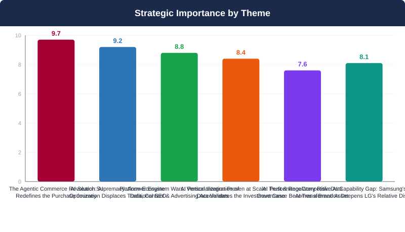
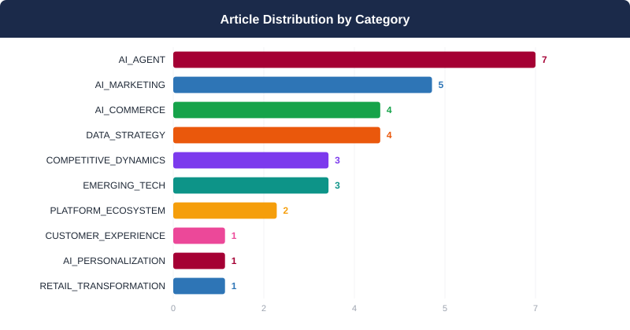
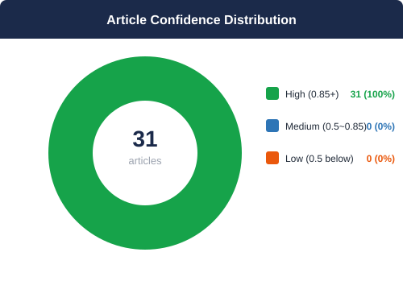
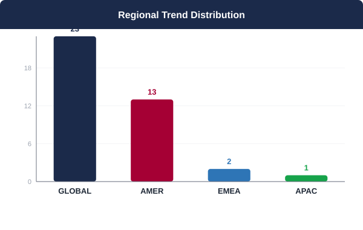
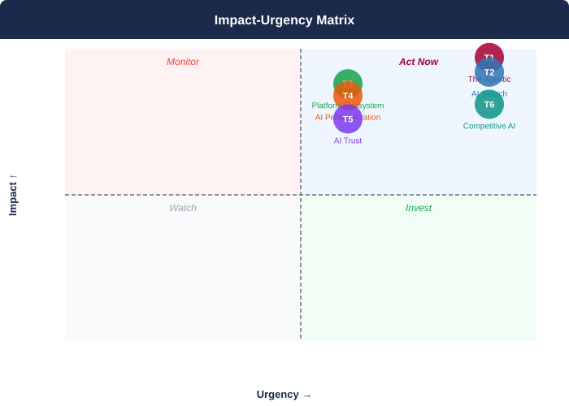

## 📋 2026년 6월 Monthly Deep Dive

### 이달의 핵심 메시지

> 2026년 6월, AI는 마케팅 도구에서 구매 여정 전체를 중개하는 핵심 인프라로 전환을 완료했으며, LG.com과 ThinQ로 이어지는 직접 소비자 접점이 인간의 능동적 선택 이전에 AI 에이전트와 플랫폼 알고리즘에 의해 체계적으로 우회되는 구조적 위협이 현실화되었다.

> **"The consumer journey no longer begins with a brand website or a search bar — it begins with an AI agent's decision about which brands are even worth considering. LG D2C's next 90 days will determine whether LG is in that consideration set at all."**
> — Synthesized from 31 articles analyzed, June 2026 AI Trend Monthly Deep Dive — LG Electronics Global D2C Strategic Intelligence

### 📊 이달의 분석 현황

| 지표 | 값 |
|------|----|
| 분석 기사 수 | **31개** |
| 도출 매크로 테마 | **6개** |
| AI 분석 파이프라인 | **7단계** |
| 분석 소요 시간 | **1063초** |

---

## 🌐 6월 AI 트렌드 개요

2026년 6월, AI는 더 이상 마케팅 도구가 아니라 구매 여정 전체를 중개하는 '인프라'로 전환되었다. 에이전틱 커머스(T1), AI 검색 패권(T2), 플랫폼 생태계 수직통합(T3)이 동시에 가속화되면서, LG D2C가 지금까지 구축해온 직접 소비자 접점(LG.com, ThinQ)은 AI 에이전트와 플랫폼 알고리즘에 의해 체계적으로 우회될 위기에 처했다. 삼성의 기업 전반 ChatGPT/Codex 도입(T6)은 이 구조적 열위를 실행 역량 차원까지 확장시키고 있으며, AI 개인화 성과 데이터(T4)는 즉각 행동하지 않을 경우 전환율 격차가 돌이킬 수 없이 고착될 수 있음을 경고한다. LG D2C에게 향후 90일은 단순한 '디지털 전환' 국면이 아니라, AI 중개 경제에서 브랜드 주권을 유지할 수 있는지를 결정짓는 구조적 분기점이다.

**테마 수렴 패턴:** 6개 테마는 하나의 거대한 구조적 전환으로 수렴된다: AI가 커머스의 인프라 레이어 자체가 되는 것이다. T1(에이전틱 커머스)과 T2(AI 검색 재편)는 소비자 접점의 관문을 AI가 통제하게 되는 '프런트엔드 혁명'을 형성하고, T3(플랫폼 생태계 전쟁)와 T6(경쟁사 AI 격차)는 이 혁명에서 뒤처질 경우의 구조적 열위를 경고한다. T4(AI 개인화 증명)는 행동 변화의 실증적 근거를 제공하며 투자 정당성을 강화하고, T5(규제·신뢰)는 이 모든 혁신이 작동하기 위한 사회적 허가(social license)의 조건을 설정한다. LG D2C에게 이는 명확한 메시지다: AI 상거래 인프라에서의 포지셔닝을 지금 확보하지 않으면, 향후 2-3년 내 D2C 채널의 구조적 무관련화(irrelevance)를 초래할 수 있다.

---

## 🔬 핵심 테마 심층 분석

### 1. 에이전틱 커머스의 부상: AI가 구매 여정을 재정의하다
**AI 에이전트가 소비자의 첫 번째 쇼핑 접점이 되는 시대**

> ⏰ 긴급도: 🔴 즉시 | 중요도: 9.7/10

#### 트렌드 분석

에이전틱 커머스(Agentic Commerce)는 더 이상 미래의 개념이 아니다. 2026년 현재, AI 에이전트는 소비자의 쇼핑 여정에서 '첫 번째 접점'으로 자리매김하며 구매 결정을 대행하는 실질적 거래 레이어로 진화하고 있다. 아마존은 자사의 AI 쇼핑 에이전트 기술을 AWS를 통해 Kate Spade New York을 시작으로 외부 리테일러에게 개방하며 에이전틱 커머스 인프라의 사실상 표준(de facto standard) 지위를 선점하고 있다. 동시에 Visa와 OpenAI는 AI 에이전트 주도 결제 인프라를 공동 구축하며 에이전트가 단순 추천을 넘어 실결제까지 완결하는 생태계를 조성 중이다. 칸 라이언즈 2026에서 아마존의 Charlotte Maines 부사장이 공개한 'Alexa+ Agentic Ads' 포맷은 파파존스 등 브랜드들과의 테스트를 통해 에이전틱 광고가 이미 상업적 단계에 진입했음을 증명했다. Salesforce는 Agentic Resource Discovery(ARD) 오픈 표준을 통해 에이전트 간 상호 운용성을 제도화하며 멀티에이전트 생태계의 기술적 기반을 다지고 있다. 이 모든 흐름이 동시다발적으로 수렴하는 시점에서, AI 에이전트에 최적화되지 않은 브랜드는 소비자가 LG.com에 방문하기도 전에 구매 여정에서 이탈된다는 구조적 리스크에 직면한다. 에이전틱 커머스는 채널 전략의 변화가 아니라, 브랜드 존재 방식 자체의 재정의를 요구한다.

#### 📎 근거 체인

- **아마존, AWS를 통해 Kate Spade를 시작으로 외부 리테일러에게 AI 쇼핑 에이전트 기술(Agentic Shopping Assistant) 개방 — 에이전틱 커머스 인프라의 플랫폼 표준화 가속** ([Amazon applies AI shopping tech to customer retailer agents with AWS](https://www.digitalcommerce360.com/2026/06/03/amazon-applies-ai-shopping-tech-to-customer-retailer-agents-with-aws/))
- **AI 에이전트가 소비자 쇼핑의 '첫 번째 출발점'으로 부상 — 에이전트 미최적화 리테일러는 이미 경쟁에서 뒤처지고 있다고 명시** ([Agentic commerce: AI is now your shopper's first stop. Showing up is just the beginning.](https://www.retaildive.com/spons/agentic-commerce-ai-is-now-your-shoppers-first-stop-showing-up-is-just-t/821824/))
- **Visa와 OpenAI, AI 에이전트 주도 결제 인프라 공동 구축 발표 — 에이전트가 추천을 넘어 실결제까지 완결하는 풀스택 커머스 레이어 형성** ([Visa, OpenAI work together to support agent-led payments](https://www.digitalcommerce360.com/2026/06/12/visa-openai-agent-led-payments/))
- **칸 라이언즈 2026에서 아마존 VP Charlotte Maines, 파파존스 등이 테스트 중인 'Alexa+ Agentic Ads' 포맷 공개 — 에이전틱 광고가 상업적 테스트 단계에 진입했음을 공식 확인** ([As agentic advertising floods Cannes, Amazon touts its Alexa advantage](https://www.marketingdive.com/news/as-agentic-advertising-floods-cannes-amazon-touts-its-alexa-advantage/823730/))
- **Salesforce, Agentic Resource Discovery(ARD) 오픈 표준 창립 파트너로 참여 — 플랫폼 간 AI 에이전트 상호 운용성을 위한 업계 표준 정립 본격화** ([Trusted Agents at Scale: How Open Discovery Is Unifying the Agentic Enterprise](https://www.salesforce.com/blog/open-discovery-agentic-enterprise/))
- **아마존, AI 에이전트 기술을 타 리테일러에게 제공하며 AI 커머스 기술의 민주화를 주도 — 에이전틱 어시스턴트 구축 및 런칭 소요 시간 단축을 핵심 가치로 제시** ([Amazon offers AI agent tech to other retailers](https://www.retaildive.com/news/amazon-to-offer-ai-agents-to-other-retailers/821597/))

#### 📈 핵심 지표

- Amazon's Agentic Shopping Assistant via AWS: time-to-launch for AI shopping assistants is being materially reduced for third-party retailers (source: Retail Dive / Digital Commerce 360, 2026.06)
- Cannes Lions 2026: agentic advertising identified as the central theme of the industry's most significant annual marketing event — Amazon, Alexa+, and Papa John's cited as active commercial participants (source: Marketing Dive, 2026)
- Visa-OpenAI partnership: Visa payment capabilities being integrated into OpenAI experiences to enable agent-led payment completion for developers and merchants (source: Digital Commerce 360, 2026.06.12)
- Salesforce ARD open standard: founding partner status confirmed, targeting cross-platform AI agent interoperability across enterprise deployments (source: Salesforce Blog, 2026)
- Kate Spade New York: confirmed as Amazon AWS Agentic Shopping Assistant's first external retail partner — establishing benchmark for D2C agentic commerce adoption timeline (source: Digital Commerce 360, 2026.06.03)

#### 영향도 평가: 🔴 HIGH

에이전틱 커머스의 영향은 단순한 채널 추가가 아닌, 소비자-브랜드 간 접점 구조 자체의 재편을 의미한다. 아마존이 플랫폼(마켓플레이스)과 에이전트 레이어(Alexa+)를 동시에 지배하는 상황에서, LG가 에이전트 추천 풀(recommendation pool)에 포함되지 않을 경우 LG.com 직접 방문 트래픽은 구조적으로 감소한다. Visa-OpenAI의 에이전트 결제 인프라 구축은 이 위협의 시간표를 12개월 이내로 압축한다. 또한 에이전틱 광고 포맷(Alexa+ Agentic Ads)의 등장은 기존 검색·디스플레이 광고 예산의 재배분을 요구하며, 이에 대응하지 않는 브랜드는 광고 가시성까지 동시에 상실한다. LG전자의 주력 제품군(가전, TV, OLED)은 고관여 구매 카테고리로, AI 에이전트의 영향력이 특히 크게 작용할 수 있는 영역이다.

> **시간 지평:** 6-12개월 / 6-12 months

#### 🏆 경쟁사 관점

삼성전자는 자체 AI 생태계(Bixby, SmartThings)와 갤럭시 디바이스 통합을 통해 에이전틱 커머스의 온디바이스 레이어에서 LG 대비 구조적 우위를 점하고 있다. Bixby를 통한 자사 제품 우선 추천 환경을 독자적으로 구축할 수 있으며, SmartThings 허브는 에이전트 기반 가전 제어 및 재구매 유도에 활용 가능한 데이터 자산을 보유한다. 애플은 Apple Intelligence와 Siri의 고도화를 통해 iOS·macOS 생태계 내 에이전틱 쇼핑 경험을 폐쇄적으로 통합할 가능성이 높으며, 애플 카드·애플페이와의 결합은 Visa-OpenAI 모델과 유사한 에이전트 결제 완결 구조를 제공한다. 소니는 에이전틱 커머스 인프라 측면에서 LG와 유사하게 자체 AI 에이전트 레이어가 부재하나, PlayStation 생태계와 콘텐츠 자산이 엔터테인먼트 연계 구매에서 차별적 강점을 제공한다. LG전자는 ThinQ AI를 보유하고 있으나, 외부 AI 에이전트 생태계(OpenAI, Amazon Alexa, Google)와의 통합 깊이 및 에이전트 추천 알고리즘 내 제품 데이터 최적화에서 경쟁사 대비 명확한 열위에 있다. 특히 아마존이 Kate Spade 사례에서처럼 자체 AI 기술을 외부에 개방하면서 AWS 기반 에이전틱 쇼핑 어시스턴트 구축을 장려하는 상황에서, LG가 이 생태계에 적극 편입되지 않으면 아마존 플랫폼 내 자연 노출 기회를 경쟁사 대비 추가로 상실할 위험이 크다.

#### 📌 케이스 스터디

- **Kate Spade New York**: 아마존 AWS의 Agentic Shopping Assistant 기술을 도입한 첫 번째 외부 리테일러 파트너로 참여, 자사 D2C 채널에 맞춤형 AI 쇼핑 어시스턴트를 구축 및 런칭 / Became the first third-party retail partner to adopt Amazon's AWS-powered Agentic Shopping Assistant technology, building and launching a customized AI shopping assistant on its D2C channel → 에이전틱 쇼핑 어시스턴트 구축에 소요되는 시간을 단축하며 고도화된 AI 쇼핑 경험을 빠르게 D2C 채널에 적용한 선도 사례가 됨. 아마존의 공식 레퍼런스 케이스로 업계 주목을 받음 / Reduced time-to-launch for an agentic shopping assistant, becoming Amazon's flagship reference case for third-party agentic commerce deployment and establishing early-mover credibility in AI-driven D2C retail ([출처](https://www.digitalcommerce360.com/2026/06/03/amazon-applies-ai-shopping-tech-to-customer-retailer-agents-with-aws/))
- **Papa John's**: 칸 라이언즈 2026에서 공개된 Amazon Alexa+ Agentic Ads 포맷을 테스트하는 브랜드 파트너로 참여, AI 에이전트가 소비자를 대신해 구매 결정을 내리는 환경에서의 브랜드 노출 실험 진행 / Participated as a brand testing partner for Amazon's Alexa+ Agentic Ads format unveiled at Cannes Lions 2026, running brand exposure experiments in environments where AI agents make purchase decisions on behalf of consumers → 에이전틱 광고 포맷의 상업적 실용성을 검증하는 초기 테스터로서 에이전틱 커머스 광고 시대의 선행 학습 데이터와 플랫폼 관계를 선점 / As an early tester validating the commercial viability of agentic ad formats, secured first-mover learning data and platform relationships ahead of broad industry adoption of agent-targeted advertising ([출처](https://www.marketingdive.com/news/as-agentic-advertising-floods-cannes-amazon-touts-its-alexa-advantage/823730/))
- **Visa + OpenAI**: Visa의 결제 기능을 OpenAI 경험에 통합하는 파트너십을 체결, AI 에이전트가 소비자를 대신해 결제까지 완결할 수 있는 에이전트 주도 결제 인프라 공동 구축 / Formed a partnership to embed Visa's payment capabilities directly into OpenAI experiences, jointly building agent-led payment infrastructure enabling AI agents to complete full end-to-end purchases on behalf of consumers → 에이전틱 커머스의 마지막 장벽이었던 결제 완결 문제를 해소하며 개발자와 판매자에게 새로운 에이전틱 커머스 기회를 제공, 풀스택 에이전틱 거래 레이어 구축의 기술적 가능성을 공식화 / Resolved the final friction point in agentic commerce — autonomous payment completion — officially validating the technical feasibility of a full-stack agentic transaction layer and opening new commerce opportunities for developers and merchants ([출처](https://www.digitalcommerce360.com/2026/06/12/visa-openai-agent-led-payments/))
- **Salesforce**: Agentic Resource Discovery(ARD) 명세의 창립 파트너로 참여하여 AI 에이전트가 플랫폼에 관계없이 다른 에이전트와 기능을 탐색·신뢰·호출할 수 있는 오픈 표준 개발 주도 / Joined as a founding partner of the Agentic Resource Discovery (ARD) specification, leading the development of open standards enabling AI agents to discover, trust, and invoke other agents and capabilities across platforms regardless of underlying infrastructure → Salesforce Agentforce를 중심으로 에이전트 생태계의 개방형 표준화를 가속화하며 엔터프라이즈 AI 인프라의 상호 운용성을 제도화, 기업의 멀티에이전트 커머스 구현의 기술적 장벽을 낮춤 / Accelerated open standardization of the agent ecosystem around Salesforce Agentforce, institutionalizing enterprise AI infrastructure interoperability and lowering the technical barrier for enterprises to implement multi-agent commerce orchestration at scale ([출처](https://www.salesforce.com/blog/open-discovery-agentic-enterprise/))

#### 💡 LG D2C 시사점

LG D2C 조직은 에이전틱 커머스를 '미래 대비' 과제가 아닌 즉각적 실행 아젠다로 격상해야 한다. 구체적 행동 방향은 다음과 같다: 

[즉시 실행 - 0~3개월]
① 에이전트 가시성 감사(Agent Visibility Audit) 실시: OpenAI ChatGPT, Amazon Alexa, Google Gemini 등 주요 AI 에이전트에서 LG 제품이 어떻게 검색·추천되는지 체계적으로 측정하고, 경쟁사(삼성, 소니) 대비 노출 격차를 정량화한다. 
② 에이전트 최적화 제품 데이터 레이어 구축: 구조화된 제품 메타데이터(spec, 비교 속성, 리뷰 요약, 재고·가격 실시간 API)를 AI 에이전트가 소비할 수 있는 형태로 재설계한다. 이는 SEO 최적화와 유사하지만 에이전트 알고리즘에 특화된 'AEO(Agent Engine Optimization)' 개념으로 접근해야 한다. 
③ Amazon AWS Agentic Shopping Assistant 파트너십 타당성 검토: Kate Spade 사례를 벤치마크로, LG D2C가 AWS 기반 에이전틱 쇼핑 어시스턴트를 LG.com에 도입할 경우의 비용-편익 및 데이터 주권 리스크를 긴급 평가한다.

[단기 실행 - 3~6개월]
④ Alexa+ Agentic Ads 파일럿 집행: 파파존스 사례를 참고하여 LG 주력 제품(OLED TV, 프리미엄 가전)에 대한 Alexa+ 에이전틱 광고 포맷 테스트를 집행하고, 기존 검색·디스플레이 광고 대비 전환 효율을 측정한다. 
⑤ Visa-OpenAI 에이전트 결제 파이프라인 연동 준비: LG.com의 결제 인프라가 AI 에이전트 주도 결제(agent-initiated checkout)를 수용할 수 있도록 API 연동 및 보안 프레임워크를 선제적으로 준비한다. 
⑥ ThinQ AI의 멀티에이전트 허브화: Salesforce ARD 오픈 표준을 활용하여 ThinQ AI를 외부 AI 에이전트(OpenAI, Google, Alexa)와 상호 운용 가능한 허브로 발전시키는 기술 로드맵을 수립한다.

[중기 전략 - 6~12개월]
⑦ 에이전틱 D2C 채널 전략 재설계: LG.com을 에이전트 트래픽의 '최종 목적지'로 포지셔닝하는 동시에, 주요 AI 에이전트 플랫폼을 신규 유입 채널로 공식화하는 멀티에이전트 채널 전략을 수립한다. 에이전트 채널별 성과 지표(agent referral conversion rate, agent-assisted AOV 등)를 신규 KPI로 채택한다.

### 2. AI 검색 생태계 재편: AEO가 SEO를 대체하는 마케팅 패러다임 전환
**ChatGPT·Gemini가 검색의 관문이 되며 브랜드 가시성의 법칙이 바뀐다**

> ⏰ 긴급도: 🔴 즉시 | 중요도: 9.2/10

#### 트렌드 분석

AI 검색 생태계가 근본적으로 재편되고 있다. ChatGPT, Gemini, Perplexity로 대표되는 AI 답변 엔진(Answer Engine)이 전통적 검색 포털을 대체하면서, 브랜드 가시성의 전장이 Google 검색 결과 페이지(SERP)에서 AI 생성 응답(AI-Generated Answer) 내 인용(Citation)으로 이동하고 있다. OpenAI는 영국에서 ChatGPT 광고를 공식 출시하고 멀티 광고주 배치 테스트를 진행 중이며, Amazon은 이미 프라임 데이 프로모션을 ChatGPT 광고로 집행함으로써 AI 챗봇이 공식 커머스 채널로 진입했음을 선언했다. HubSpot의 2026 AEO 보고서는 AI 검색이 구매 의도를 예측하는 최고 지표임을 확인했고, Microsoft Clarity 연구는 AI 도구 유입 방문자가 일반 검색 대비 약 11배 높은 회원가입률을 기록한다고 밝혔다. 트래픽 볼륨은 감소하더라도 리드 품질이 압도적으로 높다는 점은, 기존 트래픽 중심의 SEO 성과 지표 체계 전체를 뒤흔드는 패러다임 전환이다. Reddit이 ChatGPT의 핵심 데이터 소스로 부상하면서 커뮤니티 기반 신뢰 신호(Trust Signal)가 AI 인용 점유율을 결정하는 핵심 변수로 등장했다. LG D2C는 AI 인용 점유율(AI Citation Share)을 핵심 KPI로 즉시 지정하고, AEO 전담 조직과 예산을 선제적으로 확보해야 한다.

#### 📎 근거 체인

- **OpenAI가 영국에서 ChatGPT 광고를 공식 출시하고, EU 개인정보보호 규정을 준수하는 개인화 광고 동의 프레임워크를 수립했다. AI 플랫폼이 규제 적합 광고 채널로 성숙하고 있음을 의미한다.** ([ChatGPT ads land in U.K. as OpenAI outlines EU privacy rules](https://digiday.com/marketing/chatgpt-ads-land-in-u-k-as-openai-outlines-eu-privacy-rules/?utm_campaign=digidaydis&utm_medium=rss&utm_source=general-rss))
- **OpenAI가 ChatGPT 내 멀티 광고주 배치와 새로운 타겟팅·캠페인 도구를 테스트 중이다. AI 대화형 인터페이스가 본격적인 프로그래매틱 광고 매체로 진화하고 있다.** ([OpenAI tests multi-advertiser ad placements in ChatGPT](https://martech.org/openai-tests-multi-advertiser-ad-placements-in-chatgpt/))
- **Amazon이 연간 최대 쇼핑 이벤트인 프라임 데이 홍보를 위해 ChatGPT에 광고를 집행했다. 최대 이커머스 플레이어의 AI 채널 채택은 AI 챗봇 광고의 제도적 정당성을 확립하는 분기점이다.** ([Amazon buys ads in ChatGPT to promote Prime Day](https://www.modernretail.co/technology/amazon-buys-ads-in-chatgpt-to-promote-prime-day/?utm_campaign=modernretaildis&utm_medium=rss&utm_source=general-rss))
- **HubSpot의 2026 AEO 보고서에 따르면 AI 검색은 CRM 소프트웨어 구매자의 구매 의도를 예측하는 최고의 지표로 확인되었다. AI 검색이 단순 정보 탐색이 아닌 고의도 구매 여정의 핵심 채널임을 입증한다.** ([AI search behavior: What it means for your marketing strategy in 2026](https://blog.hubspot.com/marketing/ai-search-behavior))
- **Microsoft Clarity 연구 결과, AI 도구를 통해 유입된 방문자는 일반 검색 유입 방문자 대비 약 11배 높은 회원가입 전환율을 보였다. 트래픽 볼륨 감소에도 불구하고 AI 검색의 ROI 우위를 수치로 입증한다.** ([What is AI search optimization? (& why marketers should care)](https://blog.hubspot.com/marketing/what-is-ai-search-optimization))
- **Reddit이 ChatGPT의 훈련 데이터 및 실시간 웹 검색 양측에서 핵심 답변 소스로 활용되고 있다. 커뮤니티 기반 진정성 있는 콘텐츠가 AI 인용 가능성을 결정하는 핵심 신뢰 신호로 부상했다.** ([How Reddit Drives GenAI Visibility](https://www.practicalecommerce.com/how-reddit-drives-genai-visibility))

#### 📈 핵심 지표

- AI 도구 유입 방문자는 일반 검색 대비 약 11배 높은 회원가입 전환율 기록 (출처: Microsoft Clarity, via HubSpot AEO Report)
- AI search visitors convert at approximately 11x the sign-up rate of traditional search visitors (Source: Microsoft Clarity, via HubSpot AEO Report)
- HubSpot 2026 AEO 보고서: AI 검색이 CRM 소프트웨어 구매자 구매 의도 예측 최고 지표로 확인 (출처: HubSpot)
- HubSpot 2026 AEO Report: AI search confirmed as the single strongest predictor of purchase intent for buyers (Source: HubSpot)
- Amazon이 프라임 데이 — 연간 최대 쇼핑 이벤트 — 프로모션 채널로 ChatGPT 광고를 공식 채택 (출처: Modern Retail)
- Amazon adopted ChatGPT ads as an official promotion channel for Prime Day — the world's largest annual shopping event (Source: Modern Retail)
- OpenAI, 영국에서 ChatGPT 광고 공식 출시 및 멀티 광고주 배치 테스트 진행 중 (출처: Digiday, MarTech)
- OpenAI has officially launched ChatGPT advertising in the UK and is actively testing multi-advertiser placements (Source: Digiday, MarTech)
- Reddit, ChatGPT의 훈련 데이터 및 실시간 웹 검색 양측에서 핵심 답변 소스로 기능 (출처: Practical Ecommerce)
- Reddit functions as a primary answer source for ChatGPT in both training data and real-time web search contexts (Source: Practical Ecommerce)

#### 영향도 평가: 🔴 HIGH

AI 검색 채널의 상업화가 Amazon 사례에서 보듯 이미 현실화되었으며, AI 유입 방문자의 11배 전환율 우위는 D2C 비즈니스 모델의 핵심 지표인 전환율과 CAC(고객획득비용)에 직접적이고 즉각적인 영향을 미친다. 가전제품 카테고리는 '최고의 세탁기 추천', '에너지 효율 냉장고 비교'와 같은 AI 검색 쿼리가 구매 결정으로 직결되는 고의도 카테고리로, LG가 AI 답변 내 인용되지 않으면 경쟁사에 구매 여정 선점권을 양도하는 결과를 초래한다. 초기 진입자가 AI 학습 데이터 내 브랜드 권위를 선점할 경우, 후발 주자의 추격이 구조적으로 어려워지는 '선점 잠금(First-mover Lock-in)' 리스크가 존재한다.

> **시간 지평:** 즉시~12개월 / Immediate to 12 months

#### 🏆 경쟁사 관점

삼성전자는 글로벌 브랜드 인지도와 방대한 디지털 콘텐츠 자산을 바탕으로 AI 답변 엔진 내 인용 점유율에서 이미 우위를 점하고 있을 가능성이 높다. 삼성닷컴의 대규모 제품 스펙 데이터베이스, Samsung Community의 활성 포럼, 그리고 Reddit r/samsung 서브레딧의 강력한 사용자 생성 콘텐츠(UGC)는 ChatGPT가 가전 관련 쿼리를 처리할 때 삼성 제품을 선호적으로 인용하도록 유도하는 구조적 이점을 제공한다. 소니(Sony)는 오디오·카메라 카테고리에서 열성 팬 커뮤니티를 보유하고 있어 Reddit 및 포럼 기반 AEO 신뢰 신호에서 강점을 발휘하고 있다. 반면 LG전자는 ThinQ AI, OLED, 에너지 효율 등 차별화 포인트가 명확함에도 불구하고, 이를 AI 답변 엔진이 인용 가능한 구조화된 콘텐츠 형태로 최적화하는 AEO 체계가 부재한 상태로 추정된다. 특히 경쟁이 치열한 냉장고, 세탁기, 에어컨, TV 카테고리에서 'ChatGPT에게 어떤 제품을 추천받느냐'가 구매 결정을 좌우하는 시대에, LG가 AI 인용 점유율에서 열위에 있다면 이는 D2C 전환율 저하와 브랜드 선호도 훼손으로 직결된다. AI 광고 채널 선점 측면에서도 Amazon의 선도적 움직임은 이커머스 플레이어들이 ChatGPT 광고 인벤토리를 경쟁적으로 매집할 것임을 시사하며, 가전 카테고리에서 삼성이 먼저 AI 광고를 집행할 경우 LG D2C는 구조적 불리함에 직면하게 된다.

#### 📌 케이스 스터디

- **Amazon**: Purchased ChatGPT ads to promote Prime Day — the world's largest annual shopping event — deploying AI chatbot advertising as an official, high-priority marketing channel for a major commercial event. → Established the definitive institutional precedent for AI chatbot advertising in e-commerce, demonstrating that conversational AI platforms can function as direct commercial performance channels, not merely brand awareness vehicles. ([출처](https://www.modernretail.co/technology/amazon-buys-ads-in-chatgpt-to-promote-prime-day/?utm_campaign=modernretaildis&utm_medium=rss&utm_source=general-rss))
- **OpenAI (ChatGPT)**: Launched formal advertising in the UK with consent-based personalized ad targeting, and began testing multi-advertiser placements with enhanced campaign management and targeting tools. → Transformed ChatGPT from a pure AI assistant into a commercialized advertising platform, opening a new and structurally distinct inventory channel for brands to reach high-intent consumers at the point of AI-mediated decision-making. ([출처](https://martech.org/openai-tests-multi-advertiser-ad-placements-in-chatgpt/))
- **HubSpot (AEO Report Benchmark)**: Documented and analyzed AI search behavior patterns across buyer journeys, establishing AI search as the top purchase-intent predictor and validating the 11x conversion rate advantage of AI-referred traffic via Microsoft Clarity data. → Provided the evidence base for AEO as a distinct and superior marketing discipline vs. traditional SEO, compelling marketers to reallocate resources toward AI search optimization with quantified ROI justification. ([출처](https://blog.hubspot.com/marketing/what-is-ai-search-optimization))

#### 💡 LG D2C 시사점

1. [즉시] AI 인용 점유율(AI Citation Share) KPI 공식 지정: ChatGPT, Perplexity, Gemini에서 주요 가전 카테고리 쿼리(예: '에너지 효율 냉장고 추천', '최고의 OLED TV', '세탁기 비교') 입력 시 LG 제품 인용 빈도를 월간 추적하는 대시보드를 즉시 구축하고, 이를 마케팅 팀의 공식 KPI로 지정한다. 2. [30일 내] AEO 전담 태스크포스 구성: SEO, 콘텐츠, 커뮤니티 마케팅 역량을 통합한 AEO 전담 TF를 구성하고, AI 답변 엔진 최적화를 위한 콘텐츠 아키텍처 재설계 로드맵을 수립한다. 구조화된 데이터(Schema Markup), FAQ 형식 콘텐츠, 권위 있는 제3자 인용 확보를 우선 과제로 설정한다. 3. [60일 내] Reddit AEO 전략 실행: r/homeimprovement, r/Appliances, r/OLED, r/hometheater 등 핵심 서브레딧에서 LG 제품의 진정성 있는 사용자 경험 콘텐츠 생성을 지원하고, 공식 LG 계정을 통한 커뮤니티 참여를 제도화한다. Reddit 콘텐츠는 ChatGPT의 실시간 검색 소스이므로 즉각적인 AI 인용 효과가 기대된다. 4. [90일 내] ChatGPT 광고 채널 파일럿 집행: Amazon의 선례를 참고하여 주요 프로모션 시즌(블랙프라이데이, 연말 시즌)에 맞춰 ChatGPT 광고 파일럿 캠페인을 기획하고, AI 광고 특화 랜딩 페이지와 전환 추적 체계를 선제적으로 개발한다. 5. [지속] 성과 지표 패러다임 전환: 기존 트래픽 볼륨 중심의 SEO KPI(오가닉 클릭, 페이지 순위)를 AI 인용 점유율, AI 유입 방문자 전환율, AI 채널 CAC 등 AEO 기반 지표로 점진적으로 대체하고, 경영진 보고 체계에 AEO 섹션을 공식 추가한다.

### 3. 플랫폼 생태계 전쟁: 데이터·콘텐츠·광고의 수직 통합이 가속화된다
**Walmart·Salesforce·Amazon이 데이터-콘텐츠-광고를 하나의 스택으로 통합하며 독립 D2C의 입지를 압박한다**

> ⏰ 긴급도: 🟡 단기 | 중요도: 8.8/10

#### 트렌드 분석

플랫폼 생태계 전쟁이 새로운 국면에 접어들고 있다. 월마트의 Vibe.co 인수는 리테일 미디어 네트워크(Walmart Connect)에 커넥티드 TV(CTV) 광고 인벤토리와 1st-party 구매 데이터를 수직 통합하는 전략으로, 중소 소비재 브랜드를 포함한 광고주를 월마트 생태계 안으로 흡수하는 구조를 만든다. 세일즈포스는 Contentful 인수를 통해 Agentforce AI 에이전트 플랫폼에 콘텐츠 관리 레이어를 결합, 채널별 정적 콘텐츠 방식을 탈피한 대규모 1:1 개인화 경험 스택을 완성하고 있다. 아마존은 Alexa+를 기반으로 AI 에이전트가 소비자를 대신해 구매 의사결정을 수행하는 '에이전틱 광고(Agentic Ads)' 포맷을 칸 광고제에서 공개하며, 에이전틱 커머스 시대의 광고 표준을 선점하려 하고 있다. 삼성전자는 전사적 ChatGPT Enterprise 및 Codex 배포를 통해 경쟁사 대비 AI 운영 역량 격차를 빠르게 확대하고 있다. 이러한 수직 통합 움직임은 LG D2C가 현재 의존하는 외부 리테일 미디어 네트워크와 서드파티 플랫폼에 대한 협상력을 구조적으로 약화시킨다. 자체 1st-party 데이터 자산과 owned media 역량을 조속히 강화하지 않으면, LG는 플랫폼 거인들이 통제하는 생태계의 '테넌트'로 전락할 위험이 현실화된다.

#### 📎 근거 체인

- **월마트는 Vibe.co 인수를 통해 CTV 광고, 스트리밍 캠페인 측정 기술, 1st-party 구매 데이터를 Walmart Connect 리테일 미디어 네트워크에 수직 통합하여 광고주의 생태계 의존도를 심화시키고 있다.** ([Walmart to acquire Vibe.co, growing data and connected TV capabilities](https://www.digitalcommerce360.com/2026/06/26/walmart-to-acquire-vibe-co/))
- **세일즈포스는 Contentful 인수를 통해 Agentforce AI 에이전트 플랫폼에 콘텐츠 관리 레이어를 추가, 채널별 정적 콘텐츠에서 대규모 1:1 AI 개인화 경험으로의 전환을 지원하는 통합 스택을 구축하고 있다.** ([Agentforce needed a content layer, so Salesforce is buying Contentful](https://martech.org/agentforce-needed-a-content-layer-so-salesforce-is-buying-contentful/))
- **아마존은 칸 광고제에서 Alexa+를 기반으로 AI 에이전트가 소비자를 대신해 구매 의사결정을 수행하는 'Alexa+ Agentic Ads' 포맷을 공개했으며, 파파존스 등 브랜드가 실제 테스트 중임을 확인했다.** ([As agentic advertising floods Cannes, Amazon touts its Alexa advantage](https://www.marketingdive.com/news/as-agentic-advertising-floods-cannes-amazon-touts-its-alexa-advantage/823730/))
- **삼성전자는 전 세계 임직원에게 ChatGPT Enterprise와 코딩 AI 도구 Codex를 배포, OpenAI 역대 최대 규모의 기업 AI 도입 사례 중 하나를 기록하며 사무직부터 엔지니어링 부문까지 AI 운영 역량을 전사적으로 강화하고 있다.** ([Samsung Electronics brings ChatGPT and Codex to employees](https://openai.com/index/samsung-electronics-chatgpt-codex-deployment))
- **세일즈포스는 AI 에이전트 간 플랫폼 초월 상호 운용성을 지원하는 Agentic Resource Discovery(ARD) 오픈 표준의 창립 파트너로 참여, Agentforce를 중심으로 에이전트 생태계 표준화를 주도하며 엔터프라이즈 AI 인프라 지형을 재편하고 있다.** ([Trusted Agents at Scale: How Open Discovery Is Unifying the Agentic Enterprise](https://www.salesforce.com/blog/open-discovery-agentic-enterprise/))

#### 📈 핵심 지표

- Samsung Electronics' ChatGPT Enterprise and Codex deployment is cited as one of the largest enterprise AI deployments in OpenAI's history (Source: OpenAI / Samsung deployment announcement)
- Walmart's Vibe.co acquisition targets SMB consumer brands as the initial advertiser segment for integrated CTV advertising via Walmart Connect (Source: Digital Commerce 360)
- Papa John's is among the brands actively testing Amazon's Alexa+ Agentic Ads format at the time of Cannes Lions 2025 (Source: Marketing Dive)
- Salesforce's Contentful acquisition is explicitly designed to enable large-scale 1:1 personalized experiences — moving enterprise content strategy from static/channel-specific to dynamic/AI-agent-driven (Source: MarTech)
- Salesforce's ARD open standard enables cross-platform agent interoperability as a founding-partner-level initiative, positioning it as an emerging enterprise infrastructure norm (Source: Salesforce Blog)

#### 영향도 평가: 🔴 HIGH

월마트·아마존·세일즈포스의 수직 통합이 동시다발적으로 가속화되면서, LG D2C가 현재 의존하는 서드파티 리테일 미디어 및 광고 채널의 협상력이 단기 내 구조적으로 약화될 위험이 높다. 특히 Walmart Connect의 CTV 광고 강화는 LG 가전 제품의 주요 광고 채널인 커넥티드 TV 광고 시장에서 월마트 생태계 내 브랜드들과의 경쟁 열위를 심화시킬 수 있다. 삼성의 전사 AI 도입은 LG와의 디지털 운영 역량 격차를 6~12개월 내 가시화할 가능성이 있으며, 아마존의 에이전틱 광고 선점은 향후 AI 에이전트 기반 소비자 구매 환경에서 LG 브랜드 노출 기회를 구조적으로 축소할 수 있다.

> **시간 지평:** 6-12개월 / 6-12 months

#### 🏆 경쟁사 관점

【삼성전자】 OpenAI와의 전략적 파트너십을 통해 ChatGPT Enterprise 및 Codex를 전사 배포함으로써 D2C 운영, 콘텐츠 생성, 엔지니어링 생산성 전반에 걸쳐 LG 대비 AI 역량 격차를 빠르게 확대하고 있다. 삼성은 SmartThings 플랫폼을 통한 자체 1st-party 데이터 자산과 Samsung Ads라는 독자적 광고 네트워크까지 보유하고 있어, 데이터-콘텐츠-광고 수직 통합 면에서 LG를 이미 앞서 있다. 【아마존】 Alexa+ 에이전틱 광고 포맷은 스마트 가전의 핵심 경쟁 플랫폼인 음성 AI 생태계에서 아마존이 광고 수익 모델과 커머스 의사결정 권한을 동시에 장악하는 구조로 발전하고 있어, LG 가전 브랜드가 에이전틱 커머스 환경에서 노출 기회를 확보하려면 아마존 생태계 전략이 필수적이다. 【월마트】 Vibe.co 인수로 완성되는 CTV-리테일미디어-1st-party 데이터 통합 스택은 LG가 북미 가전 시장에서 가장 중요한 유통 파트너인 월마트와의 관계를 단순 유통에서 광고·데이터 파트너십으로 진화시킬 수 있는 기회이자, 광고 예산의 월마트 생태계 내 종속 심화라는 리스크를 동시에 의미한다. 【세일즈포스】 ARD 오픈 표준 주도와 Contentful 통합은 LG가 Salesforce 기반 CRM·커머스 시스템을 운영하고 있다면 에이전틱 퍼스널라이제이션 구현의 기술적 진입 장벽을 낮춰주는 기회가 될 수 있으나, Salesforce 플랫폼에 대한 의존도 심화라는 부작용도 경계해야 한다.

#### 📌 케이스 스터디

- **Walmart**: Acquired Vibe.co, a self-serve connected TV advertising platform with streaming campaign measurement capabilities, to integrate CTV advertising inventory into the Walmart Connect retail media network alongside Walmart's first-party purchase data. → Walmart Connect gains CTV advertising capabilities targeted initially at SMB consumer brands, creating a vertically integrated data-to-ad-delivery stack that deepens advertiser dependency within Walmart's ecosystem and strengthens its competitive position against Amazon's advertising business. ([출처](https://www.digitalcommerce360.com/2026/06/26/walmart-to-acquire-vibe-co/))
- **Salesforce**: Acquired Contentful to add a content management layer to the Agentforce AI agent platform, enabling enterprises to deliver large-scale 1:1 personalized experiences powered by AI agents across all channels — moving beyond static, channel-specific content strategies. → Salesforce completes a vertically integrated enterprise stack spanning CRM, AI agent orchestration, and content delivery, positioning Agentforce as the central platform for AI-driven customer experience and raising the switching cost for enterprise customers while attracting D2C brands seeking unified personalization capabilities. ([출처](https://martech.org/agentforce-needed-a-content-layer-so-salesforce-is-buying-contentful/))
- **Amazon**: Unveiled 'Alexa+ Agentic Ads' at Cannes Lions — a next-generation advertising format where AI agents execute purchase decisions on behalf of consumers — with brands including Papa John's actively testing the format. → Amazon establishes a first-mover position in agentic advertising, where the AI agent layer mediates consumer purchase decisions, effectively positioning Amazon to control both advertising revenue and purchase intent conversion simultaneously in the emerging agentic commerce era. ([출처](https://www.marketingdive.com/news/as-agentic-advertising-floods-cannes-amazon-touts-its-alexa-advantage/823730/))
- **Samsung Electronics**: Deployed ChatGPT Enterprise and OpenAI Codex to employees worldwide across white-collar and engineering functions, completing one of the largest enterprise AI deployments in OpenAI's history as part of a strategic partnership with OpenAI. → Samsung accelerates AI-driven productivity gains across engineering, operations, and content functions at enterprise scale, creating a measurable AI operational capability gap versus competitors who have not undertaken comparable deployments — including LG Electronics. ([출처](https://openai.com/index/samsung-electronics-chatgpt-codex-deployment))
- **Salesforce**: Joined as a founding partner of the Agentic Resource Discovery (ARD) open standard, enabling AI agents to discover, trust, and invoke other agents across platforms regardless of the underlying vendor infrastructure. → Salesforce positions Agentforce as the de facto orchestration hub for enterprise agentic ecosystems, leveraging open standards to accelerate adoption and inter-agent interoperability — reshaping enterprise AI infrastructure norms in a way that favors Salesforce-native architectures. ([출처](https://www.salesforce.com/blog/open-discovery-agentic-enterprise/))

#### 💡 LG D2C 시사점

【즉시 실행 / 0-3개월】
① 1st-party 데이터 자산 긴급 감사: LG ThinQ 앱, LG닷컴 등 자체 채널에서 수집 가능한 1st-party 데이터의 현황을 감사하고, 데이터 수집-통합-활성화(activation) 파이프라인의 공백을 파악하라. 월마트·아마존 생태계 의존도를 정량화하여 임원진에게 보고하라.
② Walmart Connect CTV 파트너십 전략 수립: Vibe.co 인수 완료 전에 Walmart Connect 팀과 CTV 광고 파트너십 조건을 협의하라. LG 가전 제품의 Walmart 1st-party 구매 데이터 활용 가능성 및 공동 마케팅 조건을 사전 협상 우위 확보 관점에서 접근하라.
③ 아마존 에이전틱 광고 대응 태스크포스 구성: Alexa+ Agentic Ads 포맷에 LG 제품 데이터가 최적화되어 있는지 점검하고, 아마존 광고팀과 에이전틱 광고 파일럿 기회를 타진하라.

【단기 실행 / 3-6개월】
④ 전사 생성 AI 도입 계획 수립: 삼성의 ChatGPT Enterprise 전사 배포를 벤치마크로 삼아, LG D2C 조직 내 생성 AI 도구(콘텐츠 생성, 개인화, 고객 서비스) 도입 로드맵을 수립하라. 삼성 대비 AI 역량 격차가 마케팅 효율 및 고객 경험 품질로 직결됨을 임원진에게 사업 케이스로 제시하라.
⑤ Owned Media 역량 강화: LG닷컴을 단순 커머스 채널을 넘어 콘텐츠-커머스-데이터 통합 플랫폼으로 진화시키는 전략을 수립하라. Salesforce Agentforce+Contentful 통합 모델을 참조하여, LG D2C의 AI 에이전트 기반 개인화 콘텐츠 전달 아키텍처를 설계하라.
⑥ ARD 오픈 표준 모니터링 및 기술 로드맵 반영: Salesforce가 주도하는 Agentic Resource Discovery 표준이 LG의 CRM·커머스 시스템에 미치는 영향을 분석하고, 자체 AI 에이전트와 외부 에이전트 생태계 간 상호 운용성 전략을 기술 로드맵에 반영하라.

### 4. AI 개인화의 상업적 증명: 실적 데이터가 투자 정당성을 확보하다
**Ulta·Kawasaki·Stitch Fix의 실증 데이터가 AI 개인화 ROI를 입증하며 업계 표준을 끌어올린다**

> ⏰ 긴급도: 🟡 단기 | 중요도: 8.4/10

#### 트렌드 분석

AI 개인화는 더 이상 실험적 기술이 아닌 정량화된 수익 레버로 입증되고 있다. 울타 뷰티는 AI 어시스턴트 도입 이후 1분기 매출이 전년 대비 11.1% 증가한 31억 6천만 달러를 기록하며 전자상거래 성장이 오프라인 매장을 뚜렷하게 앞서는 성과를 공개했다. 가와사키 엔진 USA는 레거시 시스템 데이터 통합을 출발점으로 10년간 B2B 이커머스 평균 주문가치(AOV)를 500% 성장시키며 시스템 현대화의 복리 효과를 실증했다. 스티치 픽스는 'see it on me' 기능을 통해 시각적 불확실성을 제거함으로써 온라인 전환율 향상을 구조적으로 공략하고 있으며, 핀터레스트는 'Ask Pinterest' AI 쇼핑 앱을 통해 비주얼 디스커버리와 대화형 커머스를 결합한 새로운 구매 여정을 설계하고 있다. 아마존은 AI 이미지 생성 기술로 모호한 검색 의도를 시각적으로 정밀화하며 검색-전환 간 마찰을 최소화하는 방향으로 진화 중이다. 이러한 다층적 증거는 AI 개인화가 업종을 초월하여 전환율 제고, AOV 상승, 구매 빈도 증가라는 세 가지 핵심 D2C 지표를 동시에 개선하는 검증된 메커니즘임을 확인시켜 준다. 2026 비즈니스 AI 현황 보고서에 따르면 응답 조직의 13%만이 AI 확장을 위한 거버넌스 체계를 보유하고 있어, 선제적으로 체계를 갖춘 기업과 그렇지 못한 기업 간의 전환율 격차는 단기 내 급격히 벌어질 것으로 전망된다.

#### 📎 근거 체인

- **울타 뷰티 AI 어시스턴트 도입 후 1분기 매출 31억 6천만 달러(+11.1% YoY) 달성, 전자상거래 성장이 오프라인을 상회하며 고객 구매 빈도·구매액 동반 상승 확인** ([Ulta Beauty shares early AI assistant results as ecommerce growth outpaces sales in physical stores](https://www.digitalcommerce360.com/2026/06/05/ulta-beauty-ai-assistant-ecommerce-sales-q1-fy26/))
- **가와사키 엔진 USA, 레거시 데이터 통합 기반 B2B 이커머스 고도화를 통해 10년간 AOV 500% 성장 달성 — 데이터 인프라 현대화의 장기 복리 효과를 입증** ([Kawasaki Engines USA grows B2B ecommerce sales AOV by 500%](https://www.digitalcommerce360.com/2026/06/09/kawasaki-engines-usa-b2b-ecommerce-sales-aov/))
- **스티치 픽스 'see it on me' 기능, 추천 의상을 고객 이미지에 즉시 적용한 AI 생성 시각화로 온라인 구매의 시각적 불확실성을 제거하여 전환율 향상을 구조적으로 실현** ([Stitch Fix Vision platform adds 'see it on me' feature](https://www.digitalcommerce360.com/2026/06/26/stitch-fix-vision-ai-tool-see-it-on-me/))
- **핀터레스트 'Ask Pinterest' 실험적 AI 쇼핑 앱, 비주얼 디스커버리 강점과 생성형 AI 대화 기능 결합으로 영감 단계에서 구매 여정까지의 마찰을 제거하는 새로운 커머스 패러다임 제시** ([Pinterest launches an experimental AI shopping app called 'Ask Pinterest'](https://techcrunch.com/2026/06/17/pinterest-launches-an-experimental-ai-shopping-app-called-ask-pinterest/))
- **아마존 AI 이미지 생성 기능, 모호한 제품 설명을 시각적으로 정밀화하여 검색-구매 전환 간 마찰을 최소화 — 플랫폼 전반에서 AI 기반 검색-커머스 통합이 가속화됨을 시사** ([Amazon launches AI image generator to narrow search queries](https://www.retaildive.com/news/amazon-launches-ai-image-generator-search-bar-queries/822231/))
- **2026 비즈니스 AI 현황 보고서(n=2,109): 조직의 13%만이 AI 확장 거버넌스 체계 보유 — 선점 기업과 후발 기업 간 전환율 격차가 단기 내 구조적으로 확대될 것임을 시사** 

#### 📈 핵심 지표

- Ulta Beauty Q1 FY26 net sales: $3.16 billion (+11.1% YoY) — Source: Digital Commerce 360
- Kawasaki Engines USA B2B e-commerce AOV growth: 500% over 10 years — Source: Digital Commerce 360
- 2026 State of AI for Business Report: Only 13% of organizations have governance frameworks to scale AI — Source: 2026 State of AI for Business Report (n=2,109)
- 2026 State of AI for Business Report: 71% of respondents expect AI to eliminate more jobs than it creates — Source: 2026 State of AI for Business Report (n=2,109)
- 2026 State of AI for Business Report: Only 20% of respondents feel their own job is threatened by AI — Source: 2026 State of AI for Business Report (n=2,109)
- Survey sample size: 2,109 respondents — Source: 2026 State of AI for Business Report

#### 영향도 평가: 🔴 HIGH

경쟁사들의 AI 개인화 성과가 전환율·AOV·구매 빈도라는 핵심 D2C 지표에서 정량적으로 입증되고 있으며, 13%의 조직만이 AI 스케일링 거버넌스를 보유한 현 시점이 선점 효과를 확보할 수 있는 임계 시간창이다. LG D2C가 ThinQ 생태계 데이터를 개인화 엔진으로 전환하지 않을 경우, 경쟁사 대비 전환율 격차는 6~12개월 내 가시적·측정 가능한 수준으로 확대될 위험이 높다.

> **시간 지평:** 6-12개월 / 6-12 months

#### 🏆 경쟁사 관점

삼성은 SmartThings 생태계 데이터를 기반으로 가전 구매 여정에서 AI 개인화를 이미 실험 중이며, 자사 D2C 채널(Samsung.com)과의 통합을 통해 ThinQ 대비 선행 학습 데이터를 축적하고 있을 가능성이 높다. 애플은 HomeKit 생태계와 Apple Intelligence를 결합하여 기기 간 맥락 인지형 개인화 경험을 강화하고 있으며, 프리미엄 고객층 내에서 LG와 직접 경합한다. 소니는 엔터테인먼트·오디오·카메라 제품군에서 AI 기반 추천을 고도화하며 브랜드 충성도가 높은 고객의 재구매 사이클을 단축하고 있다. 아마존은 AI 이미지 생성 기능(본 분석에 포함)을 포함한 다층적 AI 커머스 인프라로 LG 제품이 유통되는 자사 플랫폼 내 알고리즘적 가시성을 높이고 있어, LG가 자사 D2C 채널의 차별화에 실패할 경우 고객 접점이 아마존으로 종속될 위험이 있다. 핵심 격차는 LG가 ThinQ 생태계를 통해 경쟁사가 보유하지 못한 실사용 행동 데이터(에너지 소비 패턴, 콘텐츠 이용 습관, 제품 사용 주기 등)를 이미 보유하고 있음에도 이를 D2C 전환율 최적화로 연결하는 피드백 루프가 부재하다는 점이다.

#### 📌 케이스 스터디

- **Ulta Beauty**: Deployed an AI assistant integrated into the e-commerce experience, driving higher purchase frequency and spend per customer → Q1 FY26 net sales of $3.16 billion (+11.1% YoY), with e-commerce growth materially outpacing physical store performance ([출처](https://www.digitalcommerce360.com/2026/06/05/ulta-beauty-ai-assistant-ecommerce-sales-q1-fy26/))
- **Kawasaki Engines USA**: Modernized B2B e-commerce by integrating data from legacy systems as the foundational step, then progressively upgrading the e-commerce experience → 500% growth in B2B e-commerce Average Order Value (AOV) over 10 years ([출처](https://www.digitalcommerce360.com/2026/06/09/kawasaki-engines-usa-b2b-ecommerce-sales-aov/))
- **Stitch Fix**: Added 'see it on me' feature to its Vision AI platform, generating real-time AI imagery of recommended outfits applied to the customer's own image → Structural reduction of visual uncertainty in online shopping, targeting measurable improvement in online purchase conversion rate ([출처](https://www.digitalcommerce360.com/2026/06/26/stitch-fix-vision-ai-tool-see-it-on-me/))
- **Pinterest**: Launched 'Ask Pinterest' experimental AI shopping app combining visual discovery with generative AI conversational interface → New discovery-to-purchase pathway that reduces friction at the inspiration stage, positioning Pinterest as an AI shopping assistant platform ([출처](https://techcrunch.com/2026/06/17/pinterest-launches-an-experimental-ai-shopping-app-called-ask-pinterest/))
- **Amazon**: Launched AI image generator in search bar enabling users to select from AI-generated images to find and shop similar products → Narrowed search query ambiguity and reduced search-to-conversion friction across the platform ([출처](https://www.retaildive.com/news/amazon-launches-ai-image-generator-search-bar-queries/822231/))

#### 💡 LG D2C 시사점

LG D2C 조직은 다음 세 가지 우선순위 행동을 6~12개월 내 실행해야 한다.

① ThinQ 데이터 기반 '맥락 인지형 AI 구매 어시스턴트' 즉시 설계 착수: 울타 뷰티 AI 어시스턴트의 전환율 향상 사례를 벤치마크로 삼아, ThinQ 앱 내 고객의 제품 사용 패턴·소모품 교체 주기·에너지 소비 이상 데이터를 활용한 AI 구매 어시스턴트를 D2C 웹사이트 및 앱과 통합 설계한다. 예: '세탁기 필터 교체 시점 감지 → AI 어시스턴트가 최적 소모품 또는 신제품 업그레이드 추천 → 원클릭 D2C 구매 연결'의 풀스택 여정을 구현한다.

② AI 공간 시각화 기능으로 온라인 전환율 마찰 제거: 스티치 픽스 'see it on me' 및 아마존 AI 이미지 생성 기술의 논리를 가전 카테고리에 적용하여, 고객이 LG 냉장고·세탁기·OLED TV를 자신의 실제 주거 공간 이미지에 배치해 볼 수 있는 AR/AI 시각화 기능을 D2C 제품 상세 페이지에 즉시 도입한다. 이는 가전 온라인 구매의 최대 마찰 요인인 '공간 적합성 불확실성'을 직접 제거한다.

③ AI 스케일링 거버넌스 체계 선제 구축: 2026 AI 현황 보고서가 확인한 '13% 거버넌스 보유 조직'의 선점 우위를 확보하기 위해, LG D2C AI 이니셔티브에 대한 데이터 거버넌스 정책·KPI 프레임워크(전환율, AOV, 재구매율 기준)·실험 설계(A/B 테스트 로드맵)를 90일 내 수립하고, 파일럿-스케일링 전환을 가로막는 조직 내 병목을 사전 제거한다.

### 5. AI 규제·신뢰 리스크: 데이터 거버넌스가 브랜드 자산이 되는 시대
**EU 규제, AI 사기 위협, 콘텐츠 출처 검증이 D2C 신뢰 경제의 핵심 변수로 부상한다**

> ⏰ 긴급도: 🟡 단기 | 중요도: 7.6/10

#### 트렌드 분석

AI 기술의 급속한 상업적 확산과 함께, 유럽을 중심으로 한 규제 환경이 빠르게 재편되고 있다. OpenAI는 영국 시장에 ChatGPT 광고를 출시하면서 EU 개인정보보호 규정에 따라 개인화 광고를 명시적 동의 사용자에게만 제공하는 정책을 공표했으며, 동시에 EU의 AI 콘텐츠 투명성 실행 규범(Code of Practice)을 공개 지지하고 AI 생성 콘텐츠의 출처(provenance) 표준 개발에 참여하고 있다. 한편 구글이 AI를 활용해 2주간 250만 건의 문자를 발송하며 수십만 명을 사취한 사이버범죄 조직을 고소한 사건은 AI 기반 소비자 신뢰 위협이 이미 현실화되었음을 방증한다. 더불어 2026년 비즈니스 AI 현황 보고서(n=2,109)에 따르면 조직의 단 13%만이 AI 스케일링에 필요한 거버넌스 체계를 보유하고 있어, 대다수 기업이 규제 대응 역량 부재 상태에서 AI를 운용 중이다. D2C 브랜드에게 이는 단순한 법적 리스크가 아니다. 소비자가 어떤 기업의 AI를 신뢰하느냐가 구매 결정의 핵심 변수로 부상하는 시대에, 데이터 거버넌스는 프리미엄 포지셔닝을 강화하는 브랜드 자산으로 재정의되어야 한다.

#### 📎 근거 체인

- **OpenAI가 EU 개인정보보호 규정 준수를 위해 영국 ChatGPT 광고에서 개인화 광고를 명시적 동의 사용자에게만 제공하는 정책을 확립함으로써, AI 기반 마케팅 채널의 유럽 운영 기준이 새롭게 설정되었다.** ([ChatGPT ads land in U.K. as OpenAI outlines EU privacy rules](https://digiday.com/marketing/chatgpt-ads-land-in-u-k-as-openai-outlines-eu-privacy-rules/?utm_campaign=digidaydis&utm_medium=rss&utm_source=general-rss))
- **OpenAI가 EU의 AI 콘텐츠 투명성 실행 규범을 공개 지지하고 AI 생성 콘텐츠의 출처 추적 표준 개발에 참여함으로써, 콘텐츠 출처(provenance) 공시가 사실상 업계 표준으로 부상하고 있다.** ([Supporting Europe's work in ensuring a trustworthy AI ecosystem](https://openai.com/index/supporting-eu-trustworthy-ai-ecosystem))
- **구글이 AI를 활용해 단 2주 만에 250만 건의 사기 문자를 발송하고 수십만 명의 피해자를 양산한 '아웃사이더 엔터프라이즈' 사이버범죄 조직을 고소한 사례는, AI 기반 소비자 사기가 이미 산업적 규모로 현실화되었음을 입증한다.** ([Chinese cybercrime operation that used AI to scam 'hundreds of thousands of victims' sued by Google](https://techcrunch.com/2026/06/12/chinese-cybercrime-operation-that-used-ai-to-scam-hundreds-of-thousands-of-victims-sued-by-google/))
- **2,109명 대상의 2026 비즈니스 AI 현황 보고서에 따르면, 조직의 단 13%만이 AI를 스케일링할 수 있는 거버넌스 체계를 보유하고 있어, 87%의 기업이 거버넌스 공백 속에서 AI를 운용 중이다. 이는 규제 강화 시 대규모 컴플라이언스 리스크로 전환될 수 있다.** 

#### 📈 핵심 지표

- 250만 건: '아웃사이더 엔터프라이즈' 사이버범죄 조직이 2주 동안 AI를 이용해 발송한 사기 문자 건수 (출처: TechCrunch / Google lawsuit)
- 2.5 million: Number of fraudulent AI-generated text messages sent by the 'Outsider Enterprise' cybercrime group within two weeks (Source: TechCrunch / Google lawsuit)
- 수십만 명: 해당 AI 사이버범죄 조직의 피해자 규모 (출처: TechCrunch)
- Hundreds of thousands: Estimated number of victims defrauded by the AI-enabled cybercrime operation (Source: TechCrunch)
- 13%: AI를 확장할 수 있는 거버넌스 체계를 보유한 조직의 비율 (출처: 2026 State of AI for Business Report, n=2,109)
- 13%: Share of organizations with AI governance infrastructure sufficient to scale AI deployments (Source: 2026 State of AI for Business Report, n=2,109)
- 71%: AI가 만드는 일자리보다 없애는 일자리가 더 많을 것이라 예상한 응답자 비율 (출처: 2026 State of AI for Business Report, n=2,109)
- 71%: Respondents who believe AI will eliminate more jobs than it creates (Source: 2026 State of AI for Business Report, n=2,109)
- 20%: 자신의 일자리가 AI로 위협받는다고 느끼는 응답자 비율—인식과 현실의 괴리를 시사 (출처: 2026 State of AI for Business Report)
- 20%: Respondents who personally feel their own job is threatened by AI—indicating a significant perception-reality gap in AI risk awareness (Source: 2026 State of AI for Business Report)

#### 영향도 평가: 🔴 HIGH

LG전자는 유럽 시장에서 상당한 매출 비중을 보유하고 있으며, LG ThinQ 플랫폼을 통해 가전제품 사용 패턴, 에너지 소비량, 위치 정보 등 고감도 행동 데이터를 수집하고 있다. EU AI Act 및 GDPR의 교차 적용은 이러한 데이터 운용 방식 전반에 직접적인 규제 영향을 미치며, 위반 시 글로벌 매출의 최대 4%(GDPR) 또는 3%(EU AI Act) 수준의 과징금 리스크가 존재한다. 동시에 AI 기반 사기 피해 사례의 증가는 소비자의 브랜드 신뢰도에 즉각적인 영향을 미치므로, 선제적 거버넌스 체계 구축은 단기 내 구체적인 재무적·브랜드 가치 보호 효과를 창출한다.

> **시간 지평:** 6-12개월 / 6-12 months

#### 🏆 경쟁사 관점

삼성전자는 SmartThings 플랫폼을 통해 LG와 유사한 연결 가전 데이터 수집 구조를 보유하고 있으나, EU AI Act 대응 전략을 공개적으로 천명한 사례가 제한적이다. 이는 LG가 선제적 투명성 포지셔닝을 통해 프리미엄 유럽 소비자 세그먼트에서 차별화할 수 있는 공백을 의미한다. 애플은 'Privacy as a Brand'를 수년간 일관되게 실행하며 하드웨어 프리미엄 포지셔닝을 강화하는 데 성공한 전례를 제시하며, LG는 이 전략을 가전·IoT 영역에 적용하는 최초 주자가 될 수 있다. 소니는 콘텐츠 및 엔터테인먼트 자산과의 데이터 연동으로 규제 노출이 상이하다. 중국계 브랜드(하이어, 미디아)는 EU 내 데이터 거버넌스 신뢰도에서 구조적 약점을 보유하고 있어, LG가 'Trusted AI Home' 내러티브를 선점할 경우 프리미엄 시장 내 재포지셔닝 가속이 가능하다. 핵심 경쟁 변수는 '누가 먼저 EU AI Act 컴플라이언스를 소비자 가시적 브랜드 언어로 번역하느냐'이다.

#### 📌 케이스 스터디

- **OpenAI**: Launched ChatGPT advertising in the UK with an explicit policy restricting personalized ads to consenting users only, and publicly endorsed the EU AI content transparency Code of Practice, committing to provenance standards development. → Converted regulatory compliance requirements into proactive brand trust signals, positioning ChatGPT as the responsible AI platform in Europe and enabling market entry into a high-scrutiny regulatory environment. ([출처](https://digiday.com/marketing/chatgpt-ads-land-in-u-k-as-openai-outlines-eu-privacy-rules/?utm_campaign=digidaydis&utm_medium=rss&utm_source=general-rss))
- **Google**: Filed a lawsuit against the 'Outsider Enterprise' Chinese cybercrime syndicate that used AI technology to send 2.5 million fraudulent text messages within two weeks, defrauding hundreds of thousands of victims. → Demonstrated that proactive legal action against AI-enabled fraud is a necessary brand defense mechanism, and raised industry-wide awareness that AI-powered consumer fraud has reached industrial operational scale. ([출처](https://techcrunch.com/2026/06/12/chinese-cybercrime-operation-that-used-ai-to-scam-hundreds-of-thousands-of-victims-sued-by-google/))

#### 💡 LG D2C 시사점

① [즉시 실행 - 90일] LG ThinQ 플랫폼의 EU AI Act 및 GDPR 교차 적용 갭 분석(Gap Analysis)을 외부 법무·기술 전문가와 함께 실시하고, 고위험 데이터 처리 프로세스(에너지 사용 패턴, 사용 행동 분석)를 우선 진단하라. ② [브랜드 전략 - 90-180일] 'LG Trusted AI' 소비자 커뮤니케이션 프레임워크를 개발하라. OpenAI의 EU 투명성 규범 지지 사례처럼, LG도 EU AI Act 준수를 법적 의무가 아닌 브랜드 가치 선언으로 공개 포지셔닝하는 커뮤니케이션 캠페인을 기획하고 유럽 D2C 채널에 우선 적용하라. ③ [사이버보안 강화 - 즉시] Google이 적발한 AI 기반 사기 수법(대량 문자 발송, 피싱)에 대응하는 D2C 고객 보호 프로토콜을 강화하라. LG 공식 채널 사칭 AI 사기에 대한 소비자 경보 시스템과 내부 모니터링 체계를 즉시 구축하라. ④ [거버넌스 인프라 - 180일] 2026 AI 보고서가 지적한 '13% 거버넌스 보유 조직'의 선도 그룹에 편입하기 위해, AI 거버넌스 위원회(AI Governance Council)를 설립하고 D2C 마케팅 AI 사용에 대한 내부 정책과 감사 체계를 수립하라. ⑤ [콘텐츠 출처 관리] EU 실행 규범이 요구하는 AI 생성 콘텐츠 출처 표시 기준을 D2C 마케팅 콘텐츠 제작 워크플로우에 선제적으로 통합하여, 규제 시행 이전에 운영 역량을 내재화하라.

### 6. 경쟁사 AI 역량 격차: Samsung의 내부 AI 전환이 LG의 상대적 열위를 심화시킨다
**삼성의 ChatGPT·Codex 전사 도입은 운영 효율과 AI 제품 혁신 양면에서 LG와의 격차를 가속화한다**

> ⏰ 긴급도: 🔴 즉시 | 중요도: 8.1/10

#### 트렌드 분석

삼성전자가 전 세계 임직원을 대상으로 ChatGPT Enterprise와 코딩 AI 도구 Codex를 전사 배포하며 OpenAI 역대 최대 규모의 기업 AI 도입 사례 중 하나를 기록했다. 이는 단순한 IT 업그레이드가 아니라, 사무직부터 엔지니어링까지 전 부문을 AI로 무장시키는 조직 전체의 역량 재정의이다. 동시에 OpenAI는 Broadcom과 공동으로 LLM 추론에 최적화된 커스텀 칩 'Jalapeño'를 공개하며 AI 인프라의 수직 통합을 가속화하고 있고, Ona 인수를 통해 Codex를 클라우드 기반 장기 실행 AI 에이전트로 확장하고 있다. Salesforce 또한 Agentforce에 Contentful을 통합하며 AI 에이전트 기반의 1:1 개인화 콘텐츠 전달 체계를 구축 중이다. 이러한 일련의 움직임은 AI 역량 격차가 소프트웨어 도입 수준을 넘어 하드웨어 인프라, 에이전트 자동화, 콘텐츠 운영 전반으로 확산되고 있음을 시사한다. LG전자가 D2C 조직 내 체계적인 AI 전환 전략 없이 현 상태를 유지할 경우, 삼성 대비 생산성·개인화·제품 혁신 측면에서의 상대적 열위는 향후 12개월 내 구조적 격차로 고착될 위험이 높다.

#### 📎 근거 체인

- **삼성전자가 ChatGPT Enterprise와 Codex를 전 세계 임직원 대상으로 배포하며 OpenAI 역대 최대 규모 기업 AI 도입 사례 중 하나를 기록함. 사무직부터 엔지니어링까지 전 부문에 적용되어 생산성 격차를 조직 전체 수준으로 확대.** ([Samsung Electronics brings ChatGPT and Codex to employees](https://openai.com/index/samsung-electronics-chatgpt-codex-deployment))
- **OpenAI와 Broadcom이 LLM 추론 전용 커스텀 칩 'Jalapeño'를 공동 공개. AI 서비스의 성능·효율성·확장성 향상을 목표로 하며, AI 인프라 수직 통합 트렌드가 가속화됨. 이는 AI 서비스 운영 비용 구조와 접근성에 중요한 변화를 예고함.** ([OpenAI and Broadcom unveil LLM-optimized inference chip](https://openai.com/index/openai-broadcom-jalapeno-inference-chip))
- **OpenAI의 Ona 인수를 통해 Codex가 안전하고 지속적인 클라우드 환경으로 확장됨. 장기 실행 AI 에이전트가 기업 워크플로우 전반에서 자율적으로 작동 가능해져, 기업 AI 솔루션의 자동화 범위가 크게 확대됨.** ([OpenAI to acquire Ona](https://openai.com/index/openai-to-acquire-ona))
- **Salesforce가 Agentforce를 위한 콘텐츠 레이어 확보를 위해 Contentful을 인수. 채널별 정적 콘텐츠에서 대규모 1:1 개인화 경험으로의 전환을 추구하며, AI 에이전트와 콘텐츠 관리 시스템의 통합이 D2C 고객 경험의 새로운 기준을 설정하고 있음.** ([Agentforce needed a content layer, so Salesforce is buying Contentful](https://martech.org/agentforce-needed-a-content-layer-so-salesforce-is-buying-contentful/))

#### 📈 핵심 지표

- Samsung's ChatGPT Enterprise + Codex deployment is described as one of the largest corporate AI adoption events in OpenAI's history, covering the full global workforce across office and engineering functions (Source: openai.com/index/samsung-electronics-chatgpt-codex-deployment)
- OpenAI-Broadcom 'Jalapeño' chip targets improvements across three dimensions simultaneously: AI system performance, efficiency, and scalability (Source: openai.com/index/openai-broadcom-jalapeno-inference-chip)
- Ona acquisition enables Codex to support long-running (persistent) AI agents operating across enterprise workflows in a secure cloud environment — a qualitative leap from session-based AI interactions (Source: openai.com/index/openai-to-acquire-ona)
- Salesforce-Contentful integration signals strategic shift: from channel-specific static content to large-scale 1:1 personalized experiences powered by AI agents (Source: martech.org/agentforce-needed-a-content-layer-so-salesforce-is-buying-contentful/)
- Urgency classification: IMMEDIATE — 90-day concrete roadmap establishment required to prevent structural entrenchment of AI capability gap within 6-12 month horizon (Source: Strategic Rationale, Theme T6)

#### 영향도 평가: 🔴 HIGH

삼성전자의 ChatGPT Enterprise·Codex 전사 배포는 OpenAI 역대 최대 규모 기업 AI 도입 사례 중 하나로, 생산성·제품 개발·마케팅·고객 서비스 전 영역에서 동시다발적 역량 향상을 유발한다. 여기에 전용 추론 칩(Jalapeño) 개발, 지속형 AI 에이전트(Ona 인수), 콘텐츠 통합 플랫폼(Salesforce-Contentful) 등 에코시스템 전반의 AI 인프라 수직 통합이 가속화되면서, AI 역량 격차는 소프트웨어 도입 수준을 넘어 하드웨어·에이전트·데이터 레이어까지 확산 중이다. LG D2C가 90일 내 구체적 대응 로드맵을 수립하지 않으면, 이 격차는 12개월 내 구조적으로 고착화될 위험이 있다.

> **시간 지평:** 6-12개월 / 6-12 months

#### 🏆 경쟁사 관점

【삼성전자 vs. LG전자】 삼성전자는 ChatGPT Enterprise와 Codex를 전 세계 임직원 대상으로 전사 배포하며 OpenAI 최대 규모 기업 파트너십 중 하나를 확보했다. 이는 제품 개발 주기 단축, 마케팅 콘텐츠 생산 효율화, 고객 서비스 자동화 등 D2C 경쟁력 핵심 요소 전반에서 생산성 배율 효과를 창출한다. 반면 LG전자는 현재 동등한 수준의 전사 AI 플랫폼 배포 공식 발표가 없는 상황으로, 조직 단위 AI 역량 격차가 가시화되고 있다. 특히 Codex 기반 소프트웨어 개발 자동화는 삼성의 스마트홈·가전 AI 기능 고도화 속도를 가속화할 수 있어, LG 씽큐(ThinQ) 플랫폼과의 기능 격차 확대로 이어질 수 있다.

【소니 vs. LG전자】 소니는 AI를 활용한 콘텐츠·엔터테인먼트 생태계 강화에 집중하고 있으나, 가전 D2C 분야에서 삼성·LG만큼 직접적 경쟁 구도를 형성하지는 않는다. 그러나 소니의 PlayStation 생태계 기반 D2C 직접 판매 모델은 AI 개인화 추천 측면에서 LG D2C에 간접적 벤치마크가 될 수 있다.

【애플 vs. LG전자】 애플은 Apple Intelligence를 중심으로 온디바이스 AI 전략을 강화하며 하드웨어-소프트웨어-서비스 수직 통합 모델을 심화하고 있다. LG전자가 D2C 채널에서 AI 개인화 경험을 제공하지 못할 경우, 애플 생태계 내 고객의 LG 가전 구매 유인 자체가 약화될 위험이 있다.

【Salesforce 에코시스템의 함의】 Salesforce의 Contentful 인수는 AI 에이전트와 콘텐츠 관리의 통합이 D2C 운영의 새로운 인프라 기준이 되고 있음을 보여준다. LG D2C가 이러한 통합 플랫폼 전략을 채택하지 않으면, 경쟁사 대비 개인화 콘텐츠 전달 속도와 정밀도에서 뒤처질 수 있다.

#### 📌 케이스 스터디

- **Samsung Electronics**: Deployed ChatGPT Enterprise and Codex to its global workforce in one of the largest enterprise AI adoption initiatives in OpenAI's history, covering functions from office workers to engineering teams as part of a company-wide AI productivity enhancement strategy. → Established a systemic AI productivity advantage across product development, marketing, and customer service — creating a compounding operational efficiency and AI innovation capability gap versus competitors who lack equivalent enterprise-wide AI deployment. ([출처](https://openai.com/index/samsung-electronics-chatgpt-codex-deployment))
- **OpenAI + Broadcom**: Jointly unveiled 'Jalapeño,' a custom AI chip optimized for LLM inference, designed to improve AI system performance, efficiency, and scalability as part of OpenAI's proprietary hardware strategy. → Signals accelerating vertical integration of AI infrastructure, with expected structural reductions in AI inference costs and improvements in response latency — creating conditions for more cost-effective and scalable enterprise AI service deployment. ([출처](https://openai.com/index/openai-broadcom-jalapeno-inference-chip))
- **OpenAI (Ona Acquisition)**: Acquired Ona to extend Codex into a persistent, secure cloud environment, enabling long-running AI agents to operate autonomously across enterprise workflows at scale. → Opens a new dimension of enterprise AI automation — enabling businesses to deploy AI agents for continuous customer management, inventory optimization, and personalized shopping experiences on a 24/7 basis. ([출처](https://openai.com/index/openai-to-acquire-ona))
- **Salesforce**: Acquired Contentful to build a content layer for its Agentforce platform, integrating AI agent capabilities with a headless content management system to enable large-scale 1:1 personalized experiences across channels. → Demonstrated that AI agent-driven customer service, when integrated with content management infrastructure, enables D2C brands to move beyond static channel content to dynamically personalized, agent-orchestrated customer experiences at scale. ([출처](https://martech.org/agentforce-needed-a-content-layer-so-salesforce-is-buying-contentful/))

#### 💡 LG D2C 시사점

【즉시 행동 (0-30일)】
① AI 역량 격차 정량 진단: 삼성전자의 ChatGPT Enterprise·Codex 전사 배포를 기준점으로 삼아, LG D2C 조직의 현재 생성 AI 도구 활용 수준(도입률, 활용 부문, 자동화 비율)을 부문별로 정량 측정하고 벤치마크 갭 분석 보고서를 작성한다.
② 긴급 파일럿 스폰서 지정: CDO 또는 COO 주도로 D2C 조직 내 ChatGPT Enterprise급 생성 AI 도구 파일럿 프로그램의 공식 스폰서십을 확정하고, 90일 로드맵 수립을 위한 TF를 즉시 구성한다.

【단기 실행 (30-90일)】
③ D2C 핵심 유스케이스 우선순위화: 마케팅 콘텐츠 생성, 고객 서비스 자동화, 제품 추천 개인화, 가격 최적화 등 D2C 가치사슬 내 생성 AI 적용 유스케이스를 ROI 기반으로 우선순위화하고, 90일 내 파일럿 결과를 검증한다.
④ AI 에이전트 인프라 로드맵 수립: OpenAI의 Ona 인수로 확장되는 지속형 AI 에이전트 환경을 선제적으로 평가하여, 24/7 고객 관리·재고 최적화·개인화 쇼핑 경험 자동화를 위한 에이전트 기반 아키텍처 설계를 시작한다.
⑤ 통합 콘텐츠-AI 플랫폼 전략 검토: Salesforce-Contentful 통합 모델을 참조하여, LG D2C의 AI 에이전트와 콘텐츠 관리 시스템의 통합 가능성을 기술 스택 관점에서 평가하고, 채널별 1:1 개인화 콘텐츠 전달 체계의 청사진을 수립한다.

【중기 전략 (90일-12개월)】
⑥ Jalapeño 칩 등 전용 AI 추론 인프라 비용 구조 모니터링: OpenAI-Broadcom의 전용 추론 칩이 상용화되면 AI 서비스 운영 비용이 구조적으로 하락할 수 있으므로, LG D2C의 AI 서비스 확장 시나리오별 비용-편익 모델을 선제적으로 수립한다.
⑦ 조직 AI 문해력 강화 프로그램 실행: 삼성의 전사 배포 사례가 보여주듯 AI 도구의 효과는 조직 전반의 활용 역량에 비례한다. D2C 조직 전 구성원 대상 생성 AI 리터러시 교육 프로그램을 설계하고, 부문별 AI 챔피언을 육성한다.

---

## 🔗 크로스 트렌드 종합 분석

6개 테마의 교차 분석에서 하나의 결정적 수렴 현상이 부상한다: '퍼스트파티 데이터 주권(First-Party Data Sovereignty)'이 LG D2C의 생존 조건이자 유일한 비대칭 경쟁 우위 원천으로 부상하고 있다는 점이다. AI 에이전트는 브랜드의 데이터 품질을 기반으로 추천을 생성하고(T1), AI 검색 엔진은 신뢰할 수 있는 자체 콘텐츠를 인용 신호로 삼으며(T2), 플랫폼들은 퍼스트파티 데이터를 광고 타겟팅의 핵심 자산으로 수직통합하고(T3), AI 개인화 성과는 행동 데이터의 깊이에 정비례하며(T4), 규제 프레임워크는 데이터 거버넌스를 브랜드 신뢰의 기반으로 요구하고(T5), 삼성과의 역량 격차는 결국 AI 학습 데이터의 우위로 귀결된다(T6). 이 수렴이 가리키는 전략적 기회는 명확하다: LG ThinQ가 보유한 수천만 대의 커넥티드 가전에서 생성되는 IoT 행동 데이터는 — 올바른 거버넌스 아키텍처와 에이전트-네이티브 활성화 레이어를 갖춘다면 — Amazon·Walmart·Samsung 어느 누구도 복제할 수 없는 독점적 경쟁 자산이다. 즉, LG D2C의 2026년 핵심 전략 과제는 'ThinQ 데이터를 AI 에이전트 추천, AEO 콘텐츠 신호, 개인화 엔진 원료, 규제 컴플라이언트 브랜드 자산'으로 동시에 전환하는 통합 퍼스트파티 데이터 전략의 설계 및 실행이다.

### 상호 강화 테마

- **T1 ↔ T2**: 에이전틱 커머스(T1)와 AI 검색 패권(T2)은 동일한 구조적 전환의 두 얼굴이다. AI 에이전트는 AI 검색 엔진이 생성한 콘텐츠와 인용 데이터를 학습 기반으로 활용하며, AI 검색에서 높은 인용 점유율을 확보한 브랜드는 에이전트 추천 알고리즘에서도 구조적으로 우선 노출된다. 즉, AEO(Agent Engine Optimization) 투자와 AI 인용 점유율 확보는 별개의 과제가 아니라 단일 최적화 전략의 상호 강화 요소다. LG가 ChatGPT·Perplexity·Gemini에서 '최고의 에너지 효율 냉장고' 쿼리의 인용 점유율을 확보하면, 동일한 AI 인프라를 활용하는 Alexa+ 에이전트가 LG 제품을 우선 추천할 가능성도 동시에 높아진다.
- **T1 ↔ T4**: 에이전틱 커머스(T1)의 실현 가능성은 AI 개인화 인프라(T4)의 성숙도에 의해 직접 결정된다. Ulta Beauty의 AI 어시스턴트 전환율 상승 사례와 Stitch Fix의 '직접 착용 시각화'가 증명하듯, AI 에이전트가 소비자에게 신뢰받는 추천자로 기능하려면 고도화된 컨텍스트 기반 개인화 데이터가 선행되어야 한다. LG ThinQ의 IoT 행동 데이터는 이 개인화 엔진의 핵심 원료이며, ThinQ 데이터를 에이전트-네이티브 추천 인터페이스로 전환하는 전략은 T1과 T4를 동시에 실행하는 단일 이니셔티브가 될 수 있다. 즉, ThinQ는 단순 IoT 플랫폼이 아니라 LG D2C의 에이전틱 경쟁 진입 티켓이다.
- **T2 ↔ T5**: AI 검색 패권(T2)에서 인용 점유율을 높이려면 AI 학습 데이터에 신뢰할 수 있는 브랜드 콘텐츠를 지속 공급해야 하며, 이는 필연적으로 소비자 데이터 활용과 콘텐츠 출처 투명성 이슈(T5)와 교차한다. EU AI Act의 콘텐츠 출처 공개 표준을 선제적으로 내재화한 브랜드는 AI 엔진이 신뢰 지표로 인식하는 '검증 가능한 출처(verifiable provenance)'를 확보하게 되며, 이는 AI 인용 점유율 향상에 직접 기여한다. 즉, 'LG Trusted AI' 브랜드 프레임(T5)은 규제 리스크 헤지 수단인 동시에 AEO 경쟁력을 강화하는 신호(signal)로 기능한다.
- **T3 ↔ T6**: 플랫폼 생태계 수직통합(T3)과 삼성의 AI 역량 격차(T6)는 동일한 결론을 향해 수렴한다: LG D2C의 전략적 자율성이 양방향에서 동시에 압축되고 있다. 외부적으로는 Amazon·Walmart·Salesforce가 데이터-콘텐츠-광고를 수직통합하여 LG의 외부 채널 레버리지를 약화시키고, 내부적으로는 삼성의 ChatGPT Enterprise/Codex 전사 도입이 LG 대비 실행 속도와 운영 효율 격차를 확대한다. 이 두 테마가 동시에 작용하는 환경에서, LG의 유일한 비대칭 대응 전략은 플랫폼이 복제할 수 없는 자산 — ThinQ IoT 데이터와 프리미엄 소비자 관계 — 을 중심으로 한 '소유 생태계(Owned Ecosystem)' 구축이다.
- **T4 ↔ T6**: AI 개인화 성과 데이터(T4)는 삼성의 AI 역량 격차(T6)가 단순한 기술 채택 지연이 아니라 전환율·AOV·재구매율이라는 핵심 D2C 비즈니스 지표에서의 성과 격차로 직결됨을 증명한다. 삼성이 SmartThings 데이터를 활용한 AI 개인화를 Samsung.com에 먼저 적용하고 ChatGPT Enterprise로 운영 효율을 동시에 높인다면, LG D2C는 12개월 내에 정량적으로 측정 가능한 전환율 열위에 직면할 수 있다. T4의 벤치마크 데이터(Ulta Beauty, Stitch Fix 등)는 이 위험의 규모를 정량화하는 기준선을 제공하며, 이는 LG 내부 AI 투자 의사결정을 위한 긴급성 근거로 직접 활용 가능하다.

### 긴장 관계 테마

- **T3 vs T1**: 플랫폼 수직통합(T3)은 LG D2C가 Amazon·Walmart 생태계와의 협력을 심화해야 한다는 단기 실행 논리를 제공하지만, 에이전틱 커머스(T1)는 그 동일한 플랫폼들이 LG의 D2C 채널을 장기적으로 우회·대체할 가장 강력한 위협임을 동시에 경고한다. Amazon AWS 에이전틱 쇼핑 어시스턴트를 LG.com에 도입하면 단기 전환율이 개선될 수 있지만, Amazon 에이전트는 구조적으로 Amazon 풀필먼트 제품을 우선 노출하도록 설계되어 있어 장기적으로 LG D2C의 독립적 채널 가치를 잠식한다. 이 긴장은 '단기 실행 속도 vs. 장기 채널 주권' 간의 근본적 전략 딜레마를 형성하며, 명확한 데이터 주권 조건 없이는 플랫폼 파트너십 심화를 경계해야 한다.
- **T4 vs T5**: AI 개인화 투자 확대(T4)는 전환율·AOV 향상을 위해 소비자의 IoT 행동 데이터를 최대한 활용하라는 방향을 제시하지만, AI 신뢰 및 규제 리스크(T5)는 그 동일한 데이터 활용이 GDPR(글로벌 매출 4% 과징금)과 EU AI Act(글로벌 매출 3% 과징금) 위반 리스크를 내포함을 경고한다. LG ThinQ의 에너지 사용 패턴, 위치 신호, 행동 프로파일링 데이터는 개인화 엔진의 핵심 원료인 동시에 고감도 규제 대상 데이터다. 이 긴장의 해소는 '덜 활용할 것인가(T5 우선)'와 '더 활용할 것인가(T4 우선)' 사이의 선택이 아니라, 프라이버시-네이티브 AI 아키텍처 설계를 통해 두 목표를 동시에 달성하는 기술적·거버넌스적 설계 역량의 문제다.
- **T6 vs T5**: 삼성의 AI 역량 격차(T6)에 대응하기 위한 가장 빠른 경로는 ChatGPT Enterprise·Codex 등 외부 AI 플랫폼의 전사 도입이지만, AI 신뢰·규제 리스크(T5)는 외부 AI 도구에 고객 데이터와 비즈니스 인텔리전스를 입력하는 행위 자체가 데이터 거버넌스 위험을 수반함을 지적한다. 삼성이 OpenAI의 '역대 최대 규모 기업 파트너십' 중 하나를 체결하면서 감수한 바로 그 데이터 주권 리스크가, LG가 동일한 속도로 추종할 때 직면하게 될 위험이기도 하다. 이 긴장은 'AI 역량 확보 속도'와 '데이터 거버넌스 엄격성' 간의 실행 우선순위 갈등으로, AI 거버넌스 위원회 선행 설립 후 외부 AI 플랫폼 도입을 진행하는 '거버넌스-퍼스트' 접근이 필요하다.

---

## 📐 전략 프레임워크

### 영향도-긴급도 매트릭스

> 🔴 **즉시 행동 (Act Now):** T1, T2, T6 — C레벨 전담 TF 즉시 구성, 분기 예산 재배분, 30일 내 파일럿 착수 의무화. 세 테마를 단일 'AI 커머스 인프라' 이니셔티브로 통합하여 실행 분산 방지.

> 🔵 **전략적 투자:** T3, T4, T5 — 분기별 전략 검토 사이클에 세 테마를 공식 의제로 편입. T4는 ThinQ 데이터 인프라와 연계한 개인화 파일럿 설계를 1분기 내 착수. T3은 퍼스트파티 데이터 감사를 즉시 시작하되, 플랫폼 협상 전략은 2분기 내 완성. T5는 90일 내 갭 분석 완료 후 규제 대응 로드맵 수립.

### 🎯 단계별 실행 로드맵

#### 즉시 (0-30일)

1. **AI 커머스 전략 TF 구성 및 C레벨 스폰서십 확보: T1·T2·T6를 단일 'AI 커머스 인프라' 이니셔티브로 통합하고, CMO 또는 CDO를 공식 스폰서로 지정. 커머스·마케팅·IT·데이터·전략 부문 크로스펑셔널 TF를 30일 내 출범시켜 의사결정 단일화 및 실행 분산 방지.** (담당: Strategy/Commerce) — KPI: TF 출범일, C레벨 스폰서 지정 완료, 첫 번째 주간 스티어링 미팅 개최 여부

2. **AI 역량 격차 정량적 벤치마크 수립: 삼성의 ChatGPT Enterprise 및 Codex 전사 배포를 기준선으로 삼아, LG D2C의 현재 AI 도구 도입률·자동화 커버리지·데이터 파이프라인 성숙도를 정량 측정. 격차를 재무적 임팩트(전환율 손실 추정, 운영 비용 비효율)로 환산하여 경영진 보고서 작성.** (담당: Strategy/IT/Data) — KPI: 벤치마크 보고서 완성일, 전환율 손실 추정치(%), 자동화 커버리지 격차 정량화 완료

3. **AI 인용 점유율(AI Citation Share) KPI 공식 지정 및 추적 대시보드 구축 착수: ChatGPT, Perplexity, Google AI Overview 등 주요 AI 검색 엔진에서 LG 제품이 소비자 쿼리(예: '최고의 OLED TV', '에너지 효율 냉장고')에 응답될 때 인용되는 빈도를 측정하는 월간 KPI 대시보드 설계 및 구축 착수. 초기 베이스라인 측정 즉시 실시.** (담당: Marketing/Data) — KPI: 대시보드 설계 완료일, 베이스라인 AI 인용 점유율(%), 경쟁사(삼성·소니) 대비 인용 점유율 격차

4. **퍼스트파티 데이터 긴급 감사 착수: LG ThinQ, LG.com, CRM, 고객 서비스 채널 등 LG D2C 전체 퍼스트파티 데이터 자산의 현황, 품질, 접근성, 활용 가능성을 30일 내 긴급 감사. 에이전틱 커머스 및 AI 개인화 엔진 구축에 활용 가능한 데이터 자산과 공백(데이터 갭)을 명확히 식별.** (담당: Data/IT/CRM) — KPI: 감사 완료일, 활용 가능 데이터 자산 목록 완성, 데이터 갭 항목 수, 즉시 활용 가능 ThinQ 사용자 데이터 포인트 수

#### 단기 (1-3개월)

1. **에이전틱 커머스 파일럿 설계 및 런칭: LG.com 내 단일 제품 카테고리(예: OLED TV 또는 식기세척기)를 대상으로 AI 에이전트 친화적 구매 경험 파일럿을 설계. 구체적으로 ① 구조화된 제품 데이터 API 공개(에이전트가 실시간 가격·재고·스펙을 조회 가능하도록), ② LLM이 LG 제품을 정확히 추천할 수 있도록 훈련 가능한 제품 컨텍스트 레이어 구축, ③ 에이전트 개시 구매 트랜잭션 추적을 포함한 파일럿을 90일 내 런칭.** (담당: Commerce/IT/Marketing) — KPI: 파일럿 런칭일, 에이전트 개시 세션 수, 에이전트 경유 전환율 vs. 기존 채널 전환율, API 응답 정확도(%)

2. **AEO(Answer Engine Optimization) 전문 역량 내재화: 기존 SEO 팀에 AEO 전담 기능을 추가하거나 외부 전문 에이전시와 협력 체계 구축. 우선 실행 과제: ① LG 주요 제품군 대상 'AI 검색 최적화 콘텐츠' 재설계(구조화 데이터·FAQ·비교 콘텐츠 강화), ② AI 검색 엔진이 LG 제품을 권위 있는 소스로 인식하도록 하는 콘텐츠 신호 강화, ③ 주요 경쟁 쿼리 50개에 대한 AI 인용 점유율 월간 추적 개시.** (담당: Marketing/Commerce) — KPI: AEO 전담 인력 또는 파트너 지정 완료일, 재설계된 제품 페이지 수, 50개 쿼리 대상 AI 인용 점유율 변화(전월 대비)

3. **ThinQ 기반 컨텍스트 인식 AI 구매 어시스턴트 설계: ThinQ 플랫폼이 보유한 기기 사용 패턴·에너지 소비·유지보수 이력 데이터를 활용하여, '컨텍스트 인식 AI 구매 어시스턴트' 프로토타입을 설계. 예: 세탁기 이상 감지 시 자동으로 교체 제품 추천 및 D2C 구매 링크 제공. Ulta Beauty 등 벤치마크 기업의 개인화 ROI 데이터를 활용하여 내부 투자 승인 자료 작성.** (담당: Commerce/Data/IT/CRM) — KPI: 프로토타입 설계 완성일, 내부 투자 승인 완료 여부, 파일럿 대상 ThinQ 연동 기기 수, 추천 클릭률(CTR) 목표값 설정

4. **EU AI Act / GDPR 교차 컴플라이언스 갭 분석 완료 및 대응 로드맵 수립: LG ThinQ 플랫폼을 중심으로 EU AI Act 및 GDPR 교차 컴플라이언스 갭 분석을 90일 내 완료. 고위험 데이터 처리 프로세스(개인화 추천, 행동 데이터 수집)를 우선 검토. 갭 분석 결과를 토대로 12개월 규제 대응 로드맵 수립 및 법무·컴플라이언스 팀과 공동 검토.** (담당: Data/IT/Strategy) — KPI: 갭 분석 완료일, 고위험 항목 수 식별, 12개월 로드맵 승인 완료 여부, 컴플라이언스 리스크 재무 영향 추정치

#### 중기 (3-6개월)

1. **AI 커머스 인프라 풀 스케일 구축 및 전 카테고리 확장: 0-3개월 파일럿 결과를 토대로 에이전틱 커머스 경험, AEO 최적화 콘텐츠 레이어, ThinQ 컨텍스트 어시스턴트를 LG D2C 전 제품 카테고리로 확장. ChatGPT, Perplexity, Google AI Overview 등 주요 AI 에이전트 플랫폼과의 공식 파트너십 또는 데이터 피드 협약 체결을 추진하여 LG 제품이 에이전트 추천 알고리즘에서 우위를 점할 수 있는 구조 확보.** (담당: Commerce/IT/Marketing/Strategy) — KPI: 전 카테고리 AEO 적용률(%), 에이전트 개시 거래 비중(전체 D2C 거래 대비 %), AI 플랫폼 파트너십 체결 수, ThinQ 어시스턴트 MAU

2. **퍼스트파티 데이터 모네타이제이션 전략 실행 및 리테일 미디어 네트워크 파일럿: 1-3개월 감사로 확보한 퍼스트파티 데이터 자산을 기반으로, ① LG ThinQ 사용자 세그먼트를 활용한 고정밀 타겟 광고 파일럿(내부 또는 파트너 채널), ② 플랫폼 파트너(아마존, 월마트 등)와의 데이터 협력 조건 재협상을 통해 LG D2C 채널 우선 노출 및 수익 분배 구조 개선. 리테일 미디어 네트워크 구축 타당성 검토 완료.** (담당: Data/Commerce/Marketing/CRM) — KPI: 타겟 광고 파일럿 ROAS(광고비 대비 수익), 플랫폼 파트너 재협상 완료 수, D2C 채널 전환율 개선(%p), 리테일 미디어 네트워크 타당성 보고서 완성

3. **AI 거버넌스 프레임워크 공식화 및 '신뢰 기반 브랜드 자산화' 전략 실행: EU AI Act 갭 분석 로드맵을 실행하는 동시에, LG D2C의 AI 데이터 거버넌스를 경쟁 차별화 요소로 포지셔닝. 구체적으로 ① 소비자 대상 AI 데이터 사용 투명성 공시(ThinQ 앱 내 가시적 컨트롤 패널), ② '프라이버시 우선 AI' 마케팅 내러티브 개발 및 캠페인 런칭, ③ 삼성 대비 LG의 AI 윤리·신뢰성 포지셔닝을 통한 프리미엄 브랜드 자산 강화.** (담당: Data/Marketing/Strategy/IT) — KPI: ThinQ 앱 내 AI 데이터 컨트롤 패널 출시일, '프라이버시 우선 AI' 캠페인 브랜드 인식 리프트(%), ThinQ 사용자 데이터 동의율 변화, EU AI Act 컴플라이언스 완료 항목 수

4. **AI 운영 내재화 역량 구축 및 삼성 격차 축소 로드맵 실행: 삼성의 ChatGPT Enterprise·Codex 배포 대비 LG D2C 운영 AI 도입 계획을 12개월 로드맵으로 구체화하고 실행 착수. 우선 적용 영역: ① D2C 콘텐츠 제작 자동화(제품 설명, AEO 콘텐츠, 이메일 마케팅), ② 고객 서비스 AI 에이전트 도입(ThinQ 연동 자가 해결 기능), ③ 데이터 분석·인사이트 생성 자동화(BI 팀 생산성 향상). 분기별 격차 축소 진행률 경영진 보고 체계 구축.** (담당: IT/Commerce/Marketing/Data) — KPI: AI 자동화 커버리지 증가(%p, 전분기 대비), 콘텐츠 제작 비용 절감(%), 고객 서비스 AI 해결율(%), 분기별 AI 역량 격차 축소 진행률(삼성 대비)

---

## 🏢 LG D2C 전략적 포지셔닝

현재 LG D2C의 전략적 포지션은 '고잠재력-고위험(High Potential, High Vulnerability)'의 이중 구조로 특징지어진다. 강점 측면에서, LG ThinQ 커넥티드 가전 생태계는 경쟁자가 단기간에 구축할 수 없는 독점적 IoT 행동 데이터 자산을 보유하고 있으며, OLED TV·프리미엄 생활가전 카테고리는 AI 에이전트가 소비자에게 가장 큰 가치를 제공하는 '고관여 고단가' 구매 영역에 해당한다. 이는 에이전틱 커머스와 AI 개인화 파도가 왔을 때 가장 큰 수혜를 받을 수 있는 카테고리 포지셔닝이다. 그러나 취약성 측면에서, LG D2C는 현재 AI 에이전트 가시성(Agent Visibility), AI 인용 점유율(AI Citation Share), 조직 내 생성 AI 도입률이라는 세 가지 핵심 지표 모두에서 삼성 대비 측정 가능한 열위에 있을 가능성이 높으며, 이를 확인하는 진단 데이터 자체가 부재한 상태다. 가장 긴급한 전략적 과제는 역량 격차의 정량적 진단(90일 내 AI 가시성 감사, AI 인용 점유율 대시보드, AI 도구 도입률 현황 파악)을 선행한 후, ThinQ 데이터를 중심으로 한 '소유 AI 생태계' 구축에 자원을 집중하는 것이다. 경쟁 전략의 방향성은 삼성의 AI 규모 경쟁을 정면 추종하는 것이 아니라, 플랫폼과 경쟁사가 접근할 수 없는 독점 데이터 자산(ThinQ IoT)과 규제 신뢰 자산('LG Trusted AI')을 중심으로 한 차별화된 AI 생태계를 구축하여, AI 중개 경제에서 소비자가 LG를 선택하게 만드는 '신뢰 기반 에이전트 우선 브랜드(Trust-Native Agent-First Brand)'로 재포지셔닝하는 것이다.

---

## 🚀 핵심 전략 명령 (Top 3 Imperatives)

1. **LG.com 및 ThinQ를 AI 에이전트 접근 가능 인프라로 즉시 전환하라 — 에이전틱 커머스 API, 구조화 데이터, 제품 피드를 AI 에이전트 호환 형식으로 90일 내 재설계하지 않으면 D2C 채널은 AI 구매 여정에서 구조적으로 배제된다.** (D2C Technology & Commerce Platform) — 2026년 9월 (90일)

2. **SEO 예산과 팀의 전략적 전환: Answer Engine Optimization(AEO) 전담 기능을 신설하고, LG 핵심 제품 카테고리가 AI 답변 엔진의 추천 결과에 우선 포함되도록 콘텐츠 구조와 데이터 아키텍처를 재설계하라.** (D2C Marketing & Digital Acquisition) — 2026년 8월 (60일, 우선순위 카테고리 파일럿)

3. **LG D2C 전사 AI 운영 내재화 로드맵을 즉각 가동하라 — 삼성의 ChatGPT·Codex 전사 배포에 대응하여 LG D2C 핵심 기능(콘텐츠, 개인화, 커머스 운영)에 AI 도구를 90일 내 통합하고, 실행 속도 격차를 전략적 우선순위로 추적하라.** (D2C Strategy & Operations / CISO / CDO) — 2026년 9월 (90일, 1단계 기능 배포 완료)

## 📋 June 2026 Monthly Deep Dive

### This Month's Core Message

> In June 2026, AI completed its transformation from marketing tool to core purchase-journey infrastructure, making the systematic circumvention of LG's hard-built D2C touchpoints by AI agents and platform algorithms an immediate structural reality — not a future risk.

> **"The consumer journey no longer begins with a brand website or a search bar — it begins with an AI agent's decision about which brands are even worth considering. LG D2C's next 90 days will determine whether LG is in that consideration set at all."**
> — Synthesized from 31 articles analyzed, June 2026 AI Trend Monthly Deep Dive — LG Electronics Global D2C Strategic Intelligence

### 📊 Monthly Analysis Dashboard

| Metric | Value |
|--------|-------|
| Articles Analyzed | **31** |
| Macro Themes Identified | **6** |
| AI Pipeline Stages | **7** |
| Analysis Duration | **1063s** |

---

## 🌐 June 2026 AI Trend Overview

In June 2026, AI has completed its transformation from a marketing tool into the core infrastructure that intermediates the entire purchase journey. The simultaneous acceleration of agentic commerce (T1), AI search supremacy (T2), and platform vertical integration (T3) means that LG D2C's hard-built direct consumer touchpoints — LG.com and ThinQ — now face systematic circumvention by AI agents and platform algorithms before a human consumer ever makes an active brand choice. Samsung's enterprise-wide ChatGPT and Codex deployment (T6) extends this structural disadvantage into operational execution capability, while proven AI personalization performance data (T4) signals that conversion rate gaps will compound into structurally irreversible disadvantage for brands that delay action. For LG D2C, the next 90 days are not a 'digital transformation' moment — they are the decisive inflection point that will determine whether the brand retains sovereign consumer relationships in an AI-intermediated economy.

**Theme Convergence:** The six themes converge into a single structural transformation: AI is becoming the infrastructure layer of commerce itself. T1 (Agentic Commerce) and T2 (AI Search Supremacy) form the 'front-end revolution' in which AI controls the gateway to consumer touchpoints, while T3 (Platform Ecosystem Wars) and T6 (Competitive AI Gap) warn of the structural disadvantage that awaits those who fall behind. T4 (AI Personalization Proven) provides empirical evidence for behavioral change and reinforces the investment case, while T5 (Regulatory Trust Risk) sets the conditions for social license under which all these innovations must operate. For LG D2C, the message is unambiguous: failure to secure a strong position within the AI commerce infrastructure stack today risks the structural irrelevance of the D2C channel within the next two to three years.

---

## 🔬 Macro Theme Deep Dives

### 1. The Agentic Commerce Revolution: AI Redefines the Purchase Journey
**AI agents become the primary interface between consumers and commerce**

> ⏰ Urgency: 🔴 Immediate | Importance: 9.7/10

#### Trend Analysis

Agentic Commerce has decisively crossed the threshold from theoretical construct to active transaction infrastructure. In 2026, AI agents are functioning as the primary interface between consumers and commerce — researching, recommending, and increasingly completing purchases autonomously, before a human ever consciously engages with a brand's owned channels. The structural shift is being driven by coordinated moves across the industry's most powerful platforms. Amazon, leveraging its unparalleled position as both the world's largest retailer and a dominant cloud provider, has begun offering its proprietary AI shopping agent technology to third-party retailers via AWS, with Kate Spade New York as the inaugural partner — democratizing agentic capability while simultaneously deepening merchant dependency on Amazon's ecosystem. The payment rails for agentic transactions are being laid in parallel: Visa and OpenAI have announced a partnership to embed Visa's payment capabilities directly into OpenAI experiences, enabling AI agents to execute end-to-end purchases — not merely recommend them. At Cannes Lions 2026, Amazon's VP of Devices Content and Advertising, Charlotte Maines, unveiled 'Alexa+ Agentic Ads,' a next-generation ad format being actively tested by brands including Papa John's, designed specifically for environments where AI agents make purchase decisions on behalf of consumers. The open-standards layer is also maturing: Salesforce has joined as a founding partner of the Agentic Resource Discovery (ARD) specification, establishing cross-platform interoperability standards that will allow AI agents to discover, trust, and invoke other agents regardless of underlying platform — a development that will accelerate enterprise-grade agentic commerce deployment. Collectively, these moves signal that the agentic commerce stack — discovery, recommendation, payment, and fulfillment — is being assembled at speed by the largest technology and financial players on earth. Retailers and brands that fail to optimize for agent-readable product data, agent-native advertising formats, and multi-agent integration risk structural disintermediation: becoming invisible precisely at the moment a consumer's purchase intent is highest.

#### 📎 Evidence Chain

- **Amazon opened its Agentic Shopping Assistant technology to third-party retailers via AWS, with Kate Spade New York as the first partner — accelerating platform standardization of agentic commerce infrastructure and deepening merchant dependency on Amazon's AI stack** ([Amazon applies AI shopping tech to customer retailer agents with AWS](https://www.digitalcommerce360.com/2026/06/03/amazon-applies-ai-shopping-tech-to-customer-retailer-agents-with-aws/))
- **AI assistants have become consumers' first stop in the shopping journey — retailers treating agent-based product exposure as a future problem are described as already falling behind, establishing urgency as a present-tense competitive reality** ([Agentic commerce: AI is now your shopper's first stop. Showing up is just the beginning.](https://www.retaildive.com/spons/agentic-commerce-ai-is-now-your-shoppers-first-stop-showing-up-is-just-t/821824/))
- **Visa and OpenAI announced a partnership to integrate Visa's payment capabilities into OpenAI experiences, enabling AI agents to complete end-to-end transactions — closing the loop from discovery to payment within the agent layer and eliminating the need for human-initiated checkout** ([Visa, OpenAI work together to support agent-led payments](https://www.digitalcommerce360.com/2026/06/12/visa-openai-agent-led-payments/))
- **At Cannes Lions 2026, Amazon VP Charlotte Maines unveiled 'Alexa+ Agentic Ads' — a next-generation ad format actively being tested by brands including Papa John's — confirming that agentic advertising has entered commercial testing, making Cannes the symbolic inflection point for industry-wide adoption** ([As agentic advertising floods Cannes, Amazon touts its Alexa advantage](https://www.marketingdive.com/news/as-agentic-advertising-floods-cannes-amazon-touts-its-alexa-advantage/823730/))
- **Salesforce joined as a founding partner of the Agentic Resource Discovery (ARD) specification, driving open-standard development for cross-platform AI agent interoperability — reducing technical barriers for enterprises to deploy multi-agent commerce orchestration at scale** ([Trusted Agents at Scale: How Open Discovery Is Unifying the Agentic Enterprise](https://www.salesforce.com/blog/open-discovery-agentic-enterprise/))
- **Amazon's strategic intent in opening its AI agent technology is explicitly to reduce the time it takes for retailers to launch AI shopping assistants — positioning Amazon as the infrastructure layer for the agentic commerce era, creating a gravitational pull that could lock in retailer dependency on Amazon's AI ecosystem** ([Amazon offers AI agent tech to other retailers](https://www.retaildive.com/news/amazon-to-offer-ai-agents-to-other-retailers/821597/))

#### 📈 Key Metrics

- Amazon's Agentic Shopping Assistant via AWS: time-to-launch for AI shopping assistants is being materially reduced for third-party retailers (source: Retail Dive / Digital Commerce 360, 2026.06)
- Cannes Lions 2026: agentic advertising identified as the central theme of the industry's most significant annual marketing event — Amazon, Alexa+, and Papa John's cited as active commercial participants (source: Marketing Dive, 2026)
- Visa-OpenAI partnership: Visa payment capabilities being integrated into OpenAI experiences to enable agent-led payment completion for developers and merchants (source: Digital Commerce 360, 2026.06.12)
- Salesforce ARD open standard: founding partner status confirmed, targeting cross-platform AI agent interoperability across enterprise deployments (source: Salesforce Blog, 2026)
- Kate Spade New York: confirmed as Amazon AWS Agentic Shopping Assistant's first external retail partner — establishing benchmark for D2C agentic commerce adoption timeline (source: Digital Commerce 360, 2026.06.03)

#### Impact Assessment: 🔴 HIGH

The impact of agentic commerce on LG D2C is categorically HIGH because it threatens the foundational premise of the D2C model — direct consumer engagement — before a human even visits LG.com. Amazon's dual control of the marketplace (retail platform) and the agent layer (Alexa+) creates a structural conflict of interest: Amazon-powered agents have an inherent incentive to surface Amazon-fulfilled products first. The Visa-OpenAI payment infrastructure announcement compresses the timeline for fully autonomous agent-executed purchases to within 12 months. LG's core product categories — home appliances, OLED TVs, premium electronics — are high-consideration purchases where AI agents providing curated recommendations will have outsized influence on final brand selection. The emergence of Alexa+ Agentic Ads further means that even paid media visibility is now contingent on agent-format optimization, requiring immediate marketing budget and strategy recalibration.

> **Time Horizon:** 6-12개월 / 6-12 months

#### 🏆 Competitive Landscape

Samsung Electronics holds a structural advantage over LG in the agentic commerce era by virtue of its integrated AI ecosystem spanning Bixby, SmartThings, and Galaxy devices. Samsung can construct a proprietary agent layer that preferentially surfaces its own products, while SmartThings data provides rich behavioral signals for agent-driven reorder and upsell. Apple, through Apple Intelligence and an increasingly capable Siri, is positioned to create a closed agentic shopping loop within its iOS/macOS ecosystem — with Apple Card and Apple Pay providing the payment completion layer analogous to the Visa-OpenAI model. Sony lacks a standalone agentic commerce infrastructure comparable to Samsung or Apple, putting it in a similar structural position to LG, but its PlayStation ecosystem and entertainment content assets provide a differentiated entry point for entertainment-linked commerce. LG, with ThinQ AI as its primary consumer-facing AI platform, faces the most significant gap: ThinQ has limited integration depth with dominant external agent ecosystems (Amazon Alexa, OpenAI, Google), and LG's product catalog data is not yet optimized for agent-readable formats (structured data, API accessibility, real-time inventory signals). As Amazon actively incentivizes retailers to build on its AWS-powered Agentic Shopping Assistant infrastructure — as demonstrated by the Kate Spade partnership — LG risks compounding its disadvantage if it remains outside this ecosystem, ceding organic agent-driven product discovery to Amazon-native and Samsung-integrated alternatives.

#### 📌 Case Studies

- **Kate Spade New York**: 아마존 AWS의 Agentic Shopping Assistant 기술을 도입한 첫 번째 외부 리테일러 파트너로 참여, 자사 D2C 채널에 맞춤형 AI 쇼핑 어시스턴트를 구축 및 런칭 / Became the first third-party retail partner to adopt Amazon's AWS-powered Agentic Shopping Assistant technology, building and launching a customized AI shopping assistant on its D2C channel → 에이전틱 쇼핑 어시스턴트 구축에 소요되는 시간을 단축하며 고도화된 AI 쇼핑 경험을 빠르게 D2C 채널에 적용한 선도 사례가 됨. 아마존의 공식 레퍼런스 케이스로 업계 주목을 받음 / Reduced time-to-launch for an agentic shopping assistant, becoming Amazon's flagship reference case for third-party agentic commerce deployment and establishing early-mover credibility in AI-driven D2C retail ([source](https://www.digitalcommerce360.com/2026/06/03/amazon-applies-ai-shopping-tech-to-customer-retailer-agents-with-aws/))
- **Papa John's**: 칸 라이언즈 2026에서 공개된 Amazon Alexa+ Agentic Ads 포맷을 테스트하는 브랜드 파트너로 참여, AI 에이전트가 소비자를 대신해 구매 결정을 내리는 환경에서의 브랜드 노출 실험 진행 / Participated as a brand testing partner for Amazon's Alexa+ Agentic Ads format unveiled at Cannes Lions 2026, running brand exposure experiments in environments where AI agents make purchase decisions on behalf of consumers → 에이전틱 광고 포맷의 상업적 실용성을 검증하는 초기 테스터로서 에이전틱 커머스 광고 시대의 선행 학습 데이터와 플랫폼 관계를 선점 / As an early tester validating the commercial viability of agentic ad formats, secured first-mover learning data and platform relationships ahead of broad industry adoption of agent-targeted advertising ([source](https://www.marketingdive.com/news/as-agentic-advertising-floods-cannes-amazon-touts-its-alexa-advantage/823730/))
- **Visa + OpenAI**: Visa의 결제 기능을 OpenAI 경험에 통합하는 파트너십을 체결, AI 에이전트가 소비자를 대신해 결제까지 완결할 수 있는 에이전트 주도 결제 인프라 공동 구축 / Formed a partnership to embed Visa's payment capabilities directly into OpenAI experiences, jointly building agent-led payment infrastructure enabling AI agents to complete full end-to-end purchases on behalf of consumers → 에이전틱 커머스의 마지막 장벽이었던 결제 완결 문제를 해소하며 개발자와 판매자에게 새로운 에이전틱 커머스 기회를 제공, 풀스택 에이전틱 거래 레이어 구축의 기술적 가능성을 공식화 / Resolved the final friction point in agentic commerce — autonomous payment completion — officially validating the technical feasibility of a full-stack agentic transaction layer and opening new commerce opportunities for developers and merchants ([source](https://www.digitalcommerce360.com/2026/06/12/visa-openai-agent-led-payments/))
- **Salesforce**: Agentic Resource Discovery(ARD) 명세의 창립 파트너로 참여하여 AI 에이전트가 플랫폼에 관계없이 다른 에이전트와 기능을 탐색·신뢰·호출할 수 있는 오픈 표준 개발 주도 / Joined as a founding partner of the Agentic Resource Discovery (ARD) specification, leading the development of open standards enabling AI agents to discover, trust, and invoke other agents and capabilities across platforms regardless of underlying infrastructure → Salesforce Agentforce를 중심으로 에이전트 생태계의 개방형 표준화를 가속화하며 엔터프라이즈 AI 인프라의 상호 운용성을 제도화, 기업의 멀티에이전트 커머스 구현의 기술적 장벽을 낮춤 / Accelerated open standardization of the agent ecosystem around Salesforce Agentforce, institutionalizing enterprise AI infrastructure interoperability and lowering the technical barrier for enterprises to implement multi-agent commerce orchestration at scale ([source](https://www.salesforce.com/blog/open-discovery-agentic-enterprise/))

#### 💡 LG D2C Implications

LG D2C must immediately elevate agentic commerce from a 'watch list' item to a top-priority execution agenda. The following action framework is recommended:

[Immediate Actions - 0 to 3 Months]
① Conduct an Agent Visibility Audit: Systematically measure how LG products are discovered and recommended across major AI agent platforms — OpenAI ChatGPT, Amazon Alexa, Google Gemini — and quantify the exposure gap versus Samsung and Sony. This diagnostic will establish the baseline for all subsequent optimization efforts.
② Build an Agent-Optimized Product Data Layer: Redesign LG's product metadata architecture to be machine-consumable by AI agents — structured specs, comparative attributes, review summaries, and real-time inventory/pricing APIs. This should be approached as 'AEO (Agent Engine Optimization),' the agentic-era equivalent of SEO, and treated with equivalent organizational priority.
③ Evaluate Amazon AWS Agentic Shopping Assistant Partnership: Using the Kate Spade case as a benchmark, urgently assess the cost-benefit and data sovereignty implications of deploying Amazon's AWS-powered Agentic Shopping Assistant on LG.com. The speed-to-market benefit must be weighed against the risk of deepening Amazon ecosystem dependency.

[Short-Term Actions - 3 to 6 Months]
④ Launch Alexa+ Agentic Ads Pilot: Drawing on the Papa John's testing precedent cited at Cannes Lions 2026, execute a structured pilot of Alexa+ Agentic Ad formats for LG's hero products (OLED TVs, premium home appliances) and measure conversion efficiency against existing search and display benchmarks.
⑤ Prepare Agent-Led Payment Integration: Proactively build API connectivity and security frameworks that allow LG.com's checkout infrastructure to accept agent-initiated payment requests — positioning LG to capture the Visa-OpenAI agentic payment wave as it scales commercially.
⑥ Evolve ThinQ AI into a Multi-Agent Hub: Develop a technical roadmap to leverage the Salesforce ARD open standard — and equivalent emerging specifications — to make ThinQ AI interoperable with external AI agents (OpenAI, Google, Alexa), transforming it from a closed ecosystem into an agent-native commerce interface.

[Medium-Term Strategy - 6 to 12 Months]
⑦ Redesign D2C Channel Strategy for the Agentic Era: Formally recognize major AI agent platforms as primary acquisition channels — equivalent to paid search or social — and establish dedicated KPIs including agent referral conversion rate and agent-assisted average order value. Position LG.com as the authoritative destination that AI agents route high-intent consumers to, making the site itself the premium end-point in the agentic funnel.

### 2. AI Search Supremacy: Answer Engine Optimization Displaces Traditional SEO
**As ChatGPT and Gemini become the search gateway, the rules of brand visibility fundamentally change**

> ⏰ Urgency: 🔴 Immediate | Importance: 9.2/10

#### Trend Analysis

The search ecosystem is undergoing a structural disruption of historic proportions. AI answer engines — ChatGPT, Gemini, and Perplexity — are rapidly displacing traditional search portals as the primary gateway for consumer discovery and purchase intent. The competitive battleground for brand visibility has fundamentally shifted: winning is no longer about ranking on Google's SERP, but about being cited within AI-generated responses. This transition is accelerating at commercial speed. OpenAI has officially launched ChatGPT advertising in the UK and is actively testing multi-advertiser placements, signaling a move toward a fully commercialized AI ad ecosystem. Amazon's decision to purchase ChatGPT ads for Prime Day promotion — arguably the world's largest e-commerce event — represents the definitive inflection point: AI chatbots are now a mainstream, institutional marketing channel, not an experimental one. The quality signal is equally compelling. HubSpot's 2026 AEO Report identifies AI search as the single strongest predictor of purchase intent for software buyers. Microsoft Clarity research further demonstrates that visitors arriving via AI tools exhibit approximately 11x higher sign-up conversion rates compared to traditional search visitors — a staggering quality differential that demands a complete re-evaluation of how marketing effectiveness is measured. Traffic volume metrics, the cornerstone of SEO performance management, are rendered increasingly misleading in this new paradigm. Simultaneously, Reddit has emerged as a critical trust-signal infrastructure for GenAI visibility, functioning as both a training data source and a real-time reference for ChatGPT responses. Community-generated authentic content now directly influences AI citation outcomes, elevating community engagement from a brand-building tactic to a core AEO imperative. LG D2C must act immediately: designate AI citation share as a primary KPI, build dedicated AEO capability, and reallocate budget from traditional SEO toward AI search optimization before category leadership solidifies around early movers.

#### 📎 Evidence Chain

- **OpenAI officially launched ChatGPT ads in the UK and established a consent-based personalized advertising framework compliant with EU privacy regulations, confirming AI platforms are maturing into regulation-compliant advertising channels.** ([ChatGPT ads land in U.K. as OpenAI outlines EU privacy rules](https://digiday.com/marketing/chatgpt-ads-land-in-u-k-as-openai-outlines-eu-privacy-rules/?utm_campaign=digidaydis&utm_medium=rss&utm_source=general-rss))
- **OpenAI is testing multi-advertiser placements within ChatGPT alongside new targeting and campaign management tools, indicating that the conversational AI interface is evolving into a full-scale programmatic advertising medium.** ([OpenAI tests multi-advertiser ad placements in ChatGPT](https://martech.org/openai-tests-multi-advertiser-ad-placements-in-chatgpt/))
- **Amazon purchased ChatGPT ads to promote Prime Day — the world's largest shopping event — establishing a definitive institutional precedent that AI chatbot advertising is a legitimate and high-priority commercial channel.** ([Amazon buys ads in ChatGPT to promote Prime Day](https://www.modernretail.co/technology/amazon-buys-ads-in-chatgpt-to-promote-prime-day/?utm_campaign=modernretaildis&utm_medium=rss&utm_source=general-rss))
- **HubSpot's 2026 AEO Report confirms that AI search is the single strongest predictor of purchase intent for buyers, proving that AI search functions as a high-intent purchase journey channel, not merely an information discovery tool.** ([AI search behavior: What it means for your marketing strategy in 2026](https://blog.hubspot.com/marketing/ai-search-behavior))
- **Microsoft Clarity research found that visitors arriving via AI tools demonstrate approximately 11x higher sign-up conversion rates compared to traditional search visitors, quantitatively validating AI search's superior ROI despite lower traffic volume.** ([What is AI search optimization? (& why marketers should care)](https://blog.hubspot.com/marketing/what-is-ai-search-optimization))
- **Reddit serves as a primary answer source for ChatGPT in both training data and real-time web search contexts, establishing community-generated authentic content as a critical trust signal that directly determines AI citation probability.** ([How Reddit Drives GenAI Visibility](https://www.practicalecommerce.com/how-reddit-drives-genai-visibility))

#### 📈 Key Metrics

- AI 도구 유입 방문자는 일반 검색 대비 약 11배 높은 회원가입 전환율 기록 (출처: Microsoft Clarity, via HubSpot AEO Report)
- AI search visitors convert at approximately 11x the sign-up rate of traditional search visitors (Source: Microsoft Clarity, via HubSpot AEO Report)
- HubSpot 2026 AEO 보고서: AI 검색이 CRM 소프트웨어 구매자 구매 의도 예측 최고 지표로 확인 (출처: HubSpot)
- HubSpot 2026 AEO Report: AI search confirmed as the single strongest predictor of purchase intent for buyers (Source: HubSpot)
- Amazon이 프라임 데이 — 연간 최대 쇼핑 이벤트 — 프로모션 채널로 ChatGPT 광고를 공식 채택 (출처: Modern Retail)
- Amazon adopted ChatGPT ads as an official promotion channel for Prime Day — the world's largest annual shopping event (Source: Modern Retail)
- OpenAI, 영국에서 ChatGPT 광고 공식 출시 및 멀티 광고주 배치 테스트 진행 중 (출처: Digiday, MarTech)
- OpenAI has officially launched ChatGPT advertising in the UK and is actively testing multi-advertiser placements (Source: Digiday, MarTech)
- Reddit, ChatGPT의 훈련 데이터 및 실시간 웹 검색 양측에서 핵심 답변 소스로 기능 (출처: Practical Ecommerce)
- Reddit functions as a primary answer source for ChatGPT in both training data and real-time web search contexts (Source: Practical Ecommerce)

#### Impact Assessment: 🔴 HIGH

The commercialization of AI search advertising is already a reality — not a future scenario — as evidenced by Amazon's Prime Day ChatGPT campaign. The 11x conversion rate advantage for AI-referred visitors directly and immediately impacts D2C's most critical business metrics: conversion rate and customer acquisition cost (CAC). The home appliance category is inherently high-intent for AI search queries such as 'best washing machine recommendation' or 'most energy-efficient refrigerator comparison,' meaning that failure to appear in AI-generated answers directly transfers purchase journey ownership to competitors. Furthermore, a structural first-mover lock-in risk exists: brands that establish authority within AI training data and citation patterns early will create compounding advantages that are architecturally difficult for late entrants to overcome.

> **Time Horizon:** 즉시~12개월 / Immediate to 12 months

#### 🏆 Competitive Landscape

Samsung Electronics very likely holds a structural first-mover advantage in AI citation share, given its massive global brand authority, extensive product specification databases on Samsung.com, active Samsung Community forums, and a robust Reddit r/samsung community generating high-volume authentic UGC — all of which are primary training and real-time reference signals for ChatGPT's home appliance responses. Sony commands strong AEO trust signals in audio and camera categories through passionate enthusiast communities on Reddit and specialty forums. LG Electronics, despite possessing clear and defensible differentiation points — ThinQ AI ecosystem, OLED display leadership, energy efficiency credentials — appears to lack a structured AEO content architecture that enables AI answer engines to systematically cite these advantages in response to consumer queries. In the highest-volume, most competitive appliance categories — refrigerators, washing machines, air conditioners, and TVs — the emerging reality is that 'what ChatGPT recommends' increasingly determines purchase decisions. An LG citation share deficit in these categories translates directly into D2C conversion rate decline and erosion of brand preference at the earliest and most influential stage of the purchase funnel. On the paid side, Amazon's Prime Day ChatGPT campaign signals that major retail and e-commerce players will aggressively compete for AI ad inventory; if Samsung moves first in appliance category ChatGPT advertising, LG D2C will face a structural disadvantage in the most consequential new marketing channel of this decade.

#### 📌 Case Studies

- **Amazon**: Purchased ChatGPT ads to promote Prime Day — the world's largest annual shopping event — deploying AI chatbot advertising as an official, high-priority marketing channel for a major commercial event. → Established the definitive institutional precedent for AI chatbot advertising in e-commerce, demonstrating that conversational AI platforms can function as direct commercial performance channels, not merely brand awareness vehicles. ([source](https://www.modernretail.co/technology/amazon-buys-ads-in-chatgpt-to-promote-prime-day/?utm_campaign=modernretaildis&utm_medium=rss&utm_source=general-rss))
- **OpenAI (ChatGPT)**: Launched formal advertising in the UK with consent-based personalized ad targeting, and began testing multi-advertiser placements with enhanced campaign management and targeting tools. → Transformed ChatGPT from a pure AI assistant into a commercialized advertising platform, opening a new and structurally distinct inventory channel for brands to reach high-intent consumers at the point of AI-mediated decision-making. ([source](https://martech.org/openai-tests-multi-advertiser-ad-placements-in-chatgpt/))
- **HubSpot (AEO Report Benchmark)**: Documented and analyzed AI search behavior patterns across buyer journeys, establishing AI search as the top purchase-intent predictor and validating the 11x conversion rate advantage of AI-referred traffic via Microsoft Clarity data. → Provided the evidence base for AEO as a distinct and superior marketing discipline vs. traditional SEO, compelling marketers to reallocate resources toward AI search optimization with quantified ROI justification. ([source](https://blog.hubspot.com/marketing/what-is-ai-search-optimization))

#### 💡 LG D2C Implications

1. [Immediate] Formally designate AI Citation Share as a core KPI: Build a monthly tracking dashboard that measures LG product citation frequency when high-intent appliance queries (e.g., 'best energy-efficient refrigerator,' 'top OLED TV recommendation,' 'washing machine comparison') are submitted to ChatGPT, Perplexity, and Gemini. Integrate this metric into official marketing performance reporting for C-level visibility. 2. [Within 30 days] Stand up a dedicated AEO Task Force: Assemble a cross-functional AEO team integrating SEO, content strategy, and community marketing capabilities. Prioritize redesigning content architecture for AI answer engine optimization — specifically structured data (Schema Markup), FAQ-format authoritative content, and systematic acquisition of third-party citation signals that AI engines recognize as trust indicators. 3. [Within 60 days] Execute a Reddit AEO strategy: Systematically cultivate authentic LG product experience content in high-relevance subreddits (r/homeimprovement, r/Appliances, r/OLED, r/hometheater). Institutionalize official LG account participation in community discussions. Given Reddit's confirmed role as a real-time ChatGPT reference source, this initiative carries the fastest expected AI citation impact. 4. [Within 90 days] Launch a ChatGPT advertising pilot: Following Amazon's Prime Day precedent, design a ChatGPT ad pilot campaign timed to major promotional periods (Black Friday, Year-End season). Develop AI-advertising-native landing pages with robust conversion tracking to measure AI channel-specific ROAS and CAC from day one. 5. [Ongoing] Execute a KPI paradigm transition: Progressively replace traditional SEO-centric metrics (organic click volume, keyword rankings) with AEO-native performance indicators — AI citation share by category, AI-referred visitor conversion rate, AI channel CAC — and formally introduce an AEO performance section into executive-level marketing reporting.

### 3. Platform Ecosystem Wars: Vertical Integration of Data, Content & Advertising Accelerates
**Walmart, Salesforce, and Amazon merge data, content, and advertising into unified stacks, squeezing independent D2C operators**

> ⏰ Urgency: 🟡 Short-term | Importance: 8.8/10

#### Trend Analysis

The platform ecosystem wars have entered a decisive new phase, characterized by the rapid vertical integration of data, content, and advertising into unified, proprietary stacks. Three concurrent moves define the strategic landscape. First, Walmart's acquisition of Vibe.co — a self-serve connected TV platform with streaming campaign measurement capabilities — bolts CTV advertising inventory directly onto Walmart Connect's retail media network, creating a closed-loop system that ties first-party purchase data to upper-funnel video advertising. This move is explicitly designed to deepen advertiser dependency within Walmart's ecosystem, initially targeting SMB consumer brands. Second, Salesforce is acquiring Contentful to add a content management layer to its Agentforce AI agent platform, enabling enterprises to move beyond static, channel-specific content toward dynamic, at-scale 1:1 personalization — a capability that positions Salesforce as a vertically integrated stack spanning CRM, AI agents, and content delivery. Third, Amazon leveraged Cannes Lions to unveil 'Alexa+ Agentic Ads,' a next-generation format where AI agents execute purchase decisions on behalf of consumers, with Papa John's already in active testing — signaling that the agentic commerce era is not theoretical but operational. Simultaneously, Samsung Electronics has completed one of the largest enterprise deployments of ChatGPT Enterprise and OpenAI Codex in history, accelerating its AI operational capabilities across engineering and white-collar functions at a pace that creates a measurable productivity and innovation gap versus competitors. Collectively, these moves structurally erode the negotiating leverage of independent D2C operators like LG Electronics. As platform giants consolidate data, content, and advertising into self-reinforcing moats, LG's current reliance on third-party retail media networks and external platforms becomes an increasingly untenable dependency. The window for LG to build countervailing first-party data assets and owned media capabilities is measured in quarters, not years.

#### 📎 Evidence Chain

- **Walmart's acquisition of Vibe.co integrates self-serve CTV advertising and streaming campaign measurement technology into the Walmart Connect retail media network, creating a closed-loop advertising ecosystem anchored by Walmart's first-party purchase data — deepening advertiser lock-in.** ([Walmart to acquire Vibe.co, growing data and connected TV capabilities](https://www.digitalcommerce360.com/2026/06/26/walmart-to-acquire-vibe-co/))
- **Salesforce's acquisition of Contentful adds a content management layer to Agentforce, enabling enterprises to shift from static, channel-specific content to large-scale 1:1 personalized experiences — completing a vertically integrated stack spanning CRM, AI agents, and content delivery.** ([Agentforce needed a content layer, so Salesforce is buying Contentful](https://martech.org/agentforce-needed-a-content-layer-so-salesforce-is-buying-contentful/))
- **At Cannes Lions, Amazon unveiled 'Alexa+ Agentic Ads,' a format where AI agents execute purchase decisions on behalf of consumers. Brands including Papa John's are actively testing the format, signaling that agentic commerce is moving from concept to operational reality.** ([As agentic advertising floods Cannes, Amazon touts its Alexa advantage](https://www.marketingdive.com/news/as-agentic-advertising-floods-cannes-amazon-touts-its-alexa-advantage/823730/))
- **Samsung Electronics has deployed ChatGPT Enterprise and Codex to employees worldwide — representing one of the largest enterprise AI deployments in OpenAI's history — covering functions from white-collar operations to engineering, accelerating Samsung's AI operational capabilities at an enterprise-wide scale.** ([Samsung Electronics brings ChatGPT and Codex to employees](https://openai.com/index/samsung-electronics-chatgpt-codex-deployment))
- **Salesforce has joined as a founding partner of the Agentic Resource Discovery (ARD) open standard, enabling AI agents to discover, trust, and invoke other agents across platforms — positioning Agentforce as the orchestration hub for enterprise agentic ecosystems and reshaping AI infrastructure norms.** ([Trusted Agents at Scale: How Open Discovery Is Unifying the Agentic Enterprise](https://www.salesforce.com/blog/open-discovery-agentic-enterprise/))

#### 📈 Key Metrics

- Samsung Electronics' ChatGPT Enterprise and Codex deployment is cited as one of the largest enterprise AI deployments in OpenAI's history (Source: OpenAI / Samsung deployment announcement)
- Walmart's Vibe.co acquisition targets SMB consumer brands as the initial advertiser segment for integrated CTV advertising via Walmart Connect (Source: Digital Commerce 360)
- Papa John's is among the brands actively testing Amazon's Alexa+ Agentic Ads format at the time of Cannes Lions 2025 (Source: Marketing Dive)
- Salesforce's Contentful acquisition is explicitly designed to enable large-scale 1:1 personalized experiences — moving enterprise content strategy from static/channel-specific to dynamic/AI-agent-driven (Source: MarTech)
- Salesforce's ARD open standard enables cross-platform agent interoperability as a founding-partner-level initiative, positioning it as an emerging enterprise infrastructure norm (Source: Salesforce Blog)

#### Impact Assessment: 🔴 HIGH

The simultaneous acceleration of vertical integration by Walmart, Amazon, and Salesforce creates a compounding structural risk for LG D2C within a 6-12 month window. Walmart Connect's CTV enhancement directly targets the connected TV advertising space that is central to LG home appliance marketing, potentially disadvantaging LG versus brands natively embedded in Walmart's ecosystem. Samsung's enterprise-wide AI deployment is likely to create a measurable operational capability gap versus LG within this timeframe. Amazon's first-mover positioning in agentic advertising threatens to structurally reduce LG brand visibility in the emerging AI agent-mediated purchase environment. Cumulatively, these moves compress LG D2C's window to build countervailing first-party data and owned media assets.

> **Time Horizon:** 6-12개월 / 6-12 months

#### 🏆 Competitive Landscape

【Samsung Electronics】 Samsung's enterprise-wide deployment of ChatGPT Enterprise and Codex — reportedly one of the largest in OpenAI's history — is rapidly widening the AI operational capability gap versus LG across D2C operations, content generation, and engineering productivity. Critically, Samsung already possesses structural advantages in the data-content-advertising integration race: the SmartThings platform provides proprietary first-party IoT and behavioral data, while Samsung Ads operates as an independent advertising network. LG trails Samsung on all three dimensions of vertical integration. 【Amazon】 The Alexa+ Agentic Ads format represents an existential threat to LG's brand visibility in the agentic commerce era. As AI agents increasingly mediate consumer purchase decisions, Amazon is positioning itself to control both the advertising revenue model and the purchase decision layer simultaneously — in the very voice AI ecosystem where LG smart appliances compete. Without a proactive Amazon agentic advertising strategy, LG risks being systematically deprioritized by AI purchase agents. 【Walmart】 The Vibe.co acquisition transforms Walmart from LG's most important North American retail distribution partner into a vertically integrated media and data platform. This creates a dual dynamic: an opportunity to evolve the LG-Walmart relationship from pure distribution toward a data and CTV advertising partnership via Walmart Connect, and a risk of increasing advertising budget dependency within Walmart's controlled ecosystem. 【Salesforce】 Salesforce's ARD open standard leadership and Contentful integration lower the technical barrier to agentic personalization for LG if it operates Salesforce-based CRM and commerce systems — but simultaneously risk deepening platform dependency on a vendor that is expanding its strategic footprint.

#### 📌 Case Studies

- **Walmart**: Acquired Vibe.co, a self-serve connected TV advertising platform with streaming campaign measurement capabilities, to integrate CTV advertising inventory into the Walmart Connect retail media network alongside Walmart's first-party purchase data. → Walmart Connect gains CTV advertising capabilities targeted initially at SMB consumer brands, creating a vertically integrated data-to-ad-delivery stack that deepens advertiser dependency within Walmart's ecosystem and strengthens its competitive position against Amazon's advertising business. ([source](https://www.digitalcommerce360.com/2026/06/26/walmart-to-acquire-vibe-co/))
- **Salesforce**: Acquired Contentful to add a content management layer to the Agentforce AI agent platform, enabling enterprises to deliver large-scale 1:1 personalized experiences powered by AI agents across all channels — moving beyond static, channel-specific content strategies. → Salesforce completes a vertically integrated enterprise stack spanning CRM, AI agent orchestration, and content delivery, positioning Agentforce as the central platform for AI-driven customer experience and raising the switching cost for enterprise customers while attracting D2C brands seeking unified personalization capabilities. ([source](https://martech.org/agentforce-needed-a-content-layer-so-salesforce-is-buying-contentful/))
- **Amazon**: Unveiled 'Alexa+ Agentic Ads' at Cannes Lions — a next-generation advertising format where AI agents execute purchase decisions on behalf of consumers — with brands including Papa John's actively testing the format. → Amazon establishes a first-mover position in agentic advertising, where the AI agent layer mediates consumer purchase decisions, effectively positioning Amazon to control both advertising revenue and purchase intent conversion simultaneously in the emerging agentic commerce era. ([source](https://www.marketingdive.com/news/as-agentic-advertising-floods-cannes-amazon-touts-its-alexa-advantage/823730/))
- **Samsung Electronics**: Deployed ChatGPT Enterprise and OpenAI Codex to employees worldwide across white-collar and engineering functions, completing one of the largest enterprise AI deployments in OpenAI's history as part of a strategic partnership with OpenAI. → Samsung accelerates AI-driven productivity gains across engineering, operations, and content functions at enterprise scale, creating a measurable AI operational capability gap versus competitors who have not undertaken comparable deployments — including LG Electronics. ([source](https://openai.com/index/samsung-electronics-chatgpt-codex-deployment))
- **Salesforce**: Joined as a founding partner of the Agentic Resource Discovery (ARD) open standard, enabling AI agents to discover, trust, and invoke other agents across platforms regardless of the underlying vendor infrastructure. → Salesforce positions Agentforce as the de facto orchestration hub for enterprise agentic ecosystems, leveraging open standards to accelerate adoption and inter-agent interoperability — reshaping enterprise AI infrastructure norms in a way that favors Salesforce-native architectures. ([source](https://www.salesforce.com/blog/open-discovery-agentic-enterprise/))

#### 💡 LG D2C Implications

【Immediate Actions / 0-3 Months】
① Emergency First-Party Data Audit: Conduct an urgent audit of LG's existing first-party data assets across LG ThinQ, LG.com, and other owned channels. Quantify the data collection, integration, and activation pipeline gaps. Present a quantified Walmart/Amazon ecosystem dependency ratio to senior leadership as a strategic risk metric.
② Proactive Walmart Connect CTV Partnership Negotiation: Engage Walmart Connect's team before the Vibe.co acquisition closes to negotiate CTV advertising partnership terms. Approach conversations from a position of strategic intent — seek to leverage Walmart's first-party purchase data for LG appliance targeting and establish co-marketing frameworks that preserve LG's brand control.
③ Amazon Agentic Advertising Task Force: Assemble a cross-functional team to audit LG product data readiness for Alexa+ Agentic Ads formats and engage Amazon's advertising team to explore pilot opportunities. Structured product data (attributes, pricing, availability) must be optimized for AI agent retrieval.

【Short-Term Actions / 3-6 Months】
④ Enterprise Generative AI Deployment Roadmap: Using Samsung's ChatGPT Enterprise and Codex deployment as a competitive benchmark, develop a deployment roadmap for generative AI tools within LG D2C — spanning content creation, personalization, and customer service. Build the business case by quantifying the productivity and customer experience delta versus Samsung's AI-enabled operations.
⑤ Owned Media Platform Transformation: Evolve LG.com from a transactional commerce channel into an integrated content-commerce-data platform. Reference the Salesforce Agentforce + Contentful integration model to design an AI agent-driven personalized content delivery architecture for LG D2C that reduces reliance on third-party platforms.
⑥ ARD Standard Monitoring and Tech Roadmap Integration: Analyze the implications of Salesforce's Agentic Resource Discovery standard for LG's CRM and commerce systems, and incorporate an agent interoperability strategy into the D2C technology roadmap to ensure LG's AI agents can participate in — rather than be excluded from — the emerging agentic enterprise ecosystem.

### 4. AI Personalization Proven at Scale: Performance Data Validates the Investment Case
**Real-world performance from Ulta, Kawasaki, and Stitch Fix validates AI personalization ROI and raises the competitive floor**

> ⏰ Urgency: 🟡 Short-term | Importance: 8.4/10

#### Trend Analysis

AI personalization has crossed the chasm from experimental technology to a quantifiable revenue engine, validated across multiple industries and business models. Ulta Beauty's disclosure of early AI assistant results — anchoring Q1 FY26 net sales of $3.16 billion, an 11.1% year-over-year increase — reveals that e-commerce growth is materially outpacing physical store performance, with customers demonstrating both higher purchase frequency and higher spend per transaction. Kawasaki Engines USA offers perhaps the most striking proof point: a 500% increase in B2B e-commerce AOV over a decade, with data integration from legacy systems as the foundational catalyst, demonstrating that infrastructure modernization compounds into outsized commercial outcomes. Stitch Fix's 'see it on me' feature within its Vision AI platform directly attacks the core inhibitor of online apparel conversion — visual uncertainty — by generating real-time AI imagery of recommended outfits on the customer's own likeness. Pinterest's experimental 'Ask Pinterest' app fuses its established visual discovery strength with generative AI conversational interfaces, engineering a new discovery-to-purchase pathway that reduces friction at the inspiration stage. Amazon's AI image generator further narrows search query ambiguity by translating vague product descriptions into visual representations, compressing the gap between intent and conversion. Collectively, these evidence points establish a clear pattern: AI personalization simultaneously improves the three cardinal D2C metrics — conversion rate, average order value, and purchase frequency — across consumer and B2B contexts. Critically, the 2026 State of AI for Business Report (n=2,109) reveals that only 13% of organizations possess the governance frameworks necessary to scale AI, meaning the competitive advantage window for early movers is open but narrowing rapidly. For LG D2C, the implication is unambiguous: competitors achieving these benchmarks create a direct, measurable conversion rate gap that will widen with each quarter of inaction.

#### 📎 Evidence Chain

- **Ulta Beauty's AI assistant rollout correlates with Q1 FY26 net sales of $3.16B (+11.1% YoY), with e-commerce growth outpacing physical stores and simultaneous increases in both purchase frequency and spend per customer** ([Ulta Beauty shares early AI assistant results as ecommerce growth outpaces sales in physical stores](https://www.digitalcommerce360.com/2026/06/05/ulta-beauty-ai-assistant-ecommerce-sales-q1-fy26/))
- **Kawasaki Engines USA achieved 500% B2B e-commerce AOV growth over 10 years, initiated by legacy system data integration, proving that infrastructure modernization delivers compounding commercial returns** ([Kawasaki Engines USA grows B2B ecommerce sales AOV by 500%](https://www.digitalcommerce360.com/2026/06/09/kawasaki-engines-usa-b2b-ecommerce-sales-aov/))
- **Stitch Fix's 'see it on me' feature generates real-time AI imagery of recommended outfits on customer's own image, structurally eliminating visual uncertainty — the primary inhibitor of online conversion** ([Stitch Fix Vision platform adds 'see it on me' feature](https://www.digitalcommerce360.com/2026/06/26/stitch-fix-vision-ai-tool-see-it-on-me/))
- **Pinterest's 'Ask Pinterest' app merges visual discovery with generative AI conversation, creating a frictionless pathway from inspiration to purchase and signaling that major platforms are repositioning as AI shopping assistants** ([Pinterest launches an experimental AI shopping app called 'Ask Pinterest'](https://techcrunch.com/2026/06/17/pinterest-launches-an-experimental-ai-shopping-app-called-ask-pinterest/))
- **Amazon's AI image generator translates vague product descriptions into precise visual references, reducing search-to-conversion friction and signaling accelerating AI-commerce integration across major platforms** ([Amazon launches AI image generator to narrow search queries](https://www.retaildive.com/news/amazon-launches-ai-image-generator-search-bar-queries/822231/))
- **2026 State of AI for Business Report (n=2,109): Only 13% of organizations have governance frameworks to scale AI, indicating that the competitive advantage window for early movers is structurally narrowing** 

#### 📈 Key Metrics

- Ulta Beauty Q1 FY26 net sales: $3.16 billion (+11.1% YoY) — Source: Digital Commerce 360
- Kawasaki Engines USA B2B e-commerce AOV growth: 500% over 10 years — Source: Digital Commerce 360
- 2026 State of AI for Business Report: Only 13% of organizations have governance frameworks to scale AI — Source: 2026 State of AI for Business Report (n=2,109)
- 2026 State of AI for Business Report: 71% of respondents expect AI to eliminate more jobs than it creates — Source: 2026 State of AI for Business Report (n=2,109)
- 2026 State of AI for Business Report: Only 20% of respondents feel their own job is threatened by AI — Source: 2026 State of AI for Business Report (n=2,109)
- Survey sample size: 2,109 respondents — Source: 2026 State of AI for Business Report

#### Impact Assessment: 🔴 HIGH

Competitors have produced quantifiable AI personalization outcomes across the three core D2C metrics (conversion rate, AOV, purchase frequency). With only 13% of organizations possessing AI scaling governance, the window for first-mover advantage is critically narrow. Failure to activate LG's ThinQ ecosystem data as a personalization engine risks creating a measurable, widening conversion rate gap versus competitors within 6-12 months — one that becomes structurally difficult to close.

> **Time Horizon:** 6-12개월 / 6-12 months

#### 🏆 Competitive Landscape

Samsung is the most direct competitive threat, likely leveraging SmartThings ecosystem behavioral data to experiment with AI personalization across its D2C channel (Samsung.com), potentially accumulating training data advantages over ThinQ. Apple's combination of HomeKit and Apple Intelligence is deepening context-aware personalization across devices, competing directly with LG for premium segment wallet share. Sony is accelerating AI-driven recommendations across entertainment, audio, and camera categories, compressing repurchase cycles among high-loyalty customers. Amazon's expanding AI commerce infrastructure — including its new AI image generator — increases algorithmic visibility for competitor products sold on its platform, creating a channel dependency risk if LG fails to differentiate its own D2C experience. The critical strategic insight: LG already possesses a data asset that competitors cannot easily replicate — real-world behavioral data from the ThinQ ecosystem (energy consumption patterns, content usage habits, product lifecycle data). The competitive gap is not in data availability but in the absence of a feedback loop connecting this proprietary data to D2C conversion optimization. Every quarter this loop remains unbuilt, the data advantage depreciates while competitors build their own personalization datasets.

#### 📌 Case Studies

- **Ulta Beauty**: Deployed an AI assistant integrated into the e-commerce experience, driving higher purchase frequency and spend per customer → Q1 FY26 net sales of $3.16 billion (+11.1% YoY), with e-commerce growth materially outpacing physical store performance ([source](https://www.digitalcommerce360.com/2026/06/05/ulta-beauty-ai-assistant-ecommerce-sales-q1-fy26/))
- **Kawasaki Engines USA**: Modernized B2B e-commerce by integrating data from legacy systems as the foundational step, then progressively upgrading the e-commerce experience → 500% growth in B2B e-commerce Average Order Value (AOV) over 10 years ([source](https://www.digitalcommerce360.com/2026/06/09/kawasaki-engines-usa-b2b-ecommerce-sales-aov/))
- **Stitch Fix**: Added 'see it on me' feature to its Vision AI platform, generating real-time AI imagery of recommended outfits applied to the customer's own image → Structural reduction of visual uncertainty in online shopping, targeting measurable improvement in online purchase conversion rate ([source](https://www.digitalcommerce360.com/2026/06/26/stitch-fix-vision-ai-tool-see-it-on-me/))
- **Pinterest**: Launched 'Ask Pinterest' experimental AI shopping app combining visual discovery with generative AI conversational interface → New discovery-to-purchase pathway that reduces friction at the inspiration stage, positioning Pinterest as an AI shopping assistant platform ([source](https://techcrunch.com/2026/06/17/pinterest-launches-an-experimental-ai-shopping-app-called-ask-pinterest/))
- **Amazon**: Launched AI image generator in search bar enabling users to select from AI-generated images to find and shop similar products → Narrowed search query ambiguity and reduced search-to-conversion friction across the platform ([source](https://www.retaildive.com/news/amazon-launches-ai-image-generator-search-bar-queries/822231/))

#### 💡 LG D2C Implications

LG D2C must execute three priority actions within 6-12 months:

① Immediately design a ThinQ-powered 'context-aware AI purchase assistant': Using Ulta Beauty's AI assistant conversion uplift as the benchmark, integrate ThinQ behavioral data (product usage patterns, consumable replacement cycles, energy consumption anomalies) into an AI assistant embedded across LG's D2C website and app. The target experience: 'washing machine filter degradation detected → AI assistant recommends optimal consumable or upgrade product → one-click D2C purchase completion' — a full-stack journey that converts proprietary IoT data into direct revenue.

② Deploy AI spatial visualization to eliminate the primary friction in appliance e-commerce: Apply the logic of Stitch Fix's 'see it on me' and Amazon's AI image generator to the home appliance category. Introduce AR/AI visualization on D2C product detail pages enabling customers to place LG refrigerators, washers, and OLED TVs into images of their actual living spaces. This directly addresses 'spatial fit uncertainty' — the dominant inhibitor of appliance online conversion — and should be treated as a near-term product roadmap priority.

③ Proactively build AI scaling governance infrastructure: To capture the first-mover advantage identified in the 2026 State of AI for Business Report (only 13% of organizations have scaling governance), establish within 90 days: a data governance policy for D2C AI initiatives, a KPI framework anchored on conversion rate, AOV, and repurchase rate, and an A/B testing roadmap that enables rapid pilot-to-scale transitions. This governance layer is the prerequisite that separates organizations that experiment with AI from those that compound its returns.

### 5. AI Trust & Regulatory Risk: Data Governance Becomes a Brand Asset
**EU regulation, AI-driven fraud, and content provenance emerge as defining variables in the D2C trust economy**

> ⏰ Urgency: 🟡 Short-term | Importance: 7.6/10

#### Trend Analysis

The commercial acceleration of AI is colliding head-on with a rapidly evolving regulatory landscape, with Europe at its epicenter. OpenAI's simultaneous launch of ChatGPT advertising in the UK and its public endorsement of the EU's AI content transparency Code of Practice signals that the world's leading AI platform is treating regulatory compliance not as a burden but as a market access requirement and trust signal. Critically, OpenAI has committed to restricting personalized advertising exclusively to users who provide explicit consent—a structural shift that will reshape how AI-native marketing channels operate across Europe. At the same time, Google's lawsuit against a Chinese cybercrime syndicate that deployed AI to dispatch 2.5 million fraudulent text messages within two weeks—defrauding hundreds of thousands of consumers—makes viscerally clear that AI-enabled fraud is no longer theoretical. The attack surface for D2C brands is expanding at machine speed. Compounding this, the 2026 State of AI for Business Report (n=2,109) reveals that only 13% of organizations possess the governance infrastructure required to scale AI responsibly. This creates a stark paradox: AI adoption is accelerating even as governance readiness lags catastrophically behind. For LG Electronics, with deep European market exposure and a growing portfolio of connected appliances that collect sensitive behavioral, location, and energy consumption data, this convergence of regulatory pressure, consumer fraud risk, and governance deficits constitutes a strategic inflection point. The organizations that move first to operationalize EU AI Act compliance—and communicate that posture credibly to consumers—will convert a compliance cost into a durable competitive moat in the premium D2C segment.

#### 📎 Evidence Chain

- **OpenAI established that personalized advertising on ChatGPT in the UK will be delivered only to users who have given explicit consent, setting a new operational baseline for AI-driven marketing in Europe under strict privacy regulation.** ([ChatGPT ads land in U.K. as OpenAI outlines EU privacy rules](https://digiday.com/marketing/chatgpt-ads-land-in-u-k-as-openai-outlines-eu-privacy-rules/?utm_campaign=digidaydis&utm_medium=rss&utm_source=general-rss))
- **OpenAI's public endorsement of the EU's AI content transparency Code of Practice and active participation in provenance standards development signals that content origin disclosure is becoming a de facto industry requirement, not a voluntary differentiator.** ([Supporting Europe's work in ensuring a trustworthy AI ecosystem](https://openai.com/index/supporting-eu-trustworthy-ai-ecosystem))
- **Google's lawsuit against the 'Outsider Enterprise' cybercrime group—which used AI to send 2.5 million fraudulent messages in two weeks, victimizing hundreds of thousands of consumers—provides concrete evidence that AI-enabled consumer fraud has already reached industrial scale.** ([Chinese cybercrime operation that used AI to scam 'hundreds of thousands of victims' sued by Google](https://techcrunch.com/2026/06/12/chinese-cybercrime-operation-that-used-ai-to-scam-hundreds-of-thousands-of-victims-sued-by-google/))
- **The 2026 State of AI for Business Report (n=2,109) found that only 13% of organizations have the governance infrastructure to scale AI, meaning 87% are operating AI deployments without adequate compliance architecture—a systemic vulnerability as EU AI Act enforcement intensifies.** 

#### 📈 Key Metrics

- 250만 건: '아웃사이더 엔터프라이즈' 사이버범죄 조직이 2주 동안 AI를 이용해 발송한 사기 문자 건수 (출처: TechCrunch / Google lawsuit)
- 2.5 million: Number of fraudulent AI-generated text messages sent by the 'Outsider Enterprise' cybercrime group within two weeks (Source: TechCrunch / Google lawsuit)
- 수십만 명: 해당 AI 사이버범죄 조직의 피해자 규모 (출처: TechCrunch)
- Hundreds of thousands: Estimated number of victims defrauded by the AI-enabled cybercrime operation (Source: TechCrunch)
- 13%: AI를 확장할 수 있는 거버넌스 체계를 보유한 조직의 비율 (출처: 2026 State of AI for Business Report, n=2,109)
- 13%: Share of organizations with AI governance infrastructure sufficient to scale AI deployments (Source: 2026 State of AI for Business Report, n=2,109)
- 71%: AI가 만드는 일자리보다 없애는 일자리가 더 많을 것이라 예상한 응답자 비율 (출처: 2026 State of AI for Business Report, n=2,109)
- 71%: Respondents who believe AI will eliminate more jobs than it creates (Source: 2026 State of AI for Business Report, n=2,109)
- 20%: 자신의 일자리가 AI로 위협받는다고 느끼는 응답자 비율—인식과 현실의 괴리를 시사 (출처: 2026 State of AI for Business Report)
- 20%: Respondents who personally feel their own job is threatened by AI—indicating a significant perception-reality gap in AI risk awareness (Source: 2026 State of AI for Business Report)

#### Impact Assessment: 🔴 HIGH

LG Electronics holds significant revenue exposure in the European market and collects high-sensitivity behavioral data—usage patterns, energy consumption, location signals—via the LG ThinQ connected appliance platform. The intersection of GDPR and the EU AI Act creates direct regulatory exposure to this data operating model, with potential penalties of up to 4% of global revenue (GDPR) or 3% (EU AI Act). Simultaneously, the proven industrial-scale deployment of AI-enabled consumer fraud creates immediate brand trust risk. Proactive governance infrastructure delivers near-term financial protection and positions LG's data stewardship as a tangible premium brand differentiator within the 6-12 month horizon.

> **Time Horizon:** 6-12개월 / 6-12 months

#### 🏆 Competitive Landscape

Samsung Electronics operates a structurally analogous connected appliance data collection model via SmartThings but has not publicly articulated a differentiated EU AI Act compliance narrative—creating a first-mover window for LG to claim the 'trustworthy AI home' positioning in the premium European segment. Apple's multi-year execution of 'Privacy as a Brand' demonstrates the compounding premium brand value this posture generates; LG has the opportunity to replicate this playbook specifically within the connected home and IoT category. Sony's regulatory exposure profile differs given its content and entertainment data architecture. Chinese challenger brands (Haier, Midea) carry structural credibility deficits on EU data governance, meaning an LG 'Trusted AI Home' narrative would compete against a weakened field in the premium tier. The decisive competitive variable is not compliance itself—it is which brand first translates EU AI Act compliance into consumer-visible brand language that justifies premium pricing and deepens platform loyalty.

#### 📌 Case Studies

- **OpenAI**: Launched ChatGPT advertising in the UK with an explicit policy restricting personalized ads to consenting users only, and publicly endorsed the EU AI content transparency Code of Practice, committing to provenance standards development. → Converted regulatory compliance requirements into proactive brand trust signals, positioning ChatGPT as the responsible AI platform in Europe and enabling market entry into a high-scrutiny regulatory environment. ([source](https://digiday.com/marketing/chatgpt-ads-land-in-u-k-as-openai-outlines-eu-privacy-rules/?utm_campaign=digidaydis&utm_medium=rss&utm_source=general-rss))
- **Google**: Filed a lawsuit against the 'Outsider Enterprise' Chinese cybercrime syndicate that used AI technology to send 2.5 million fraudulent text messages within two weeks, defrauding hundreds of thousands of victims. → Demonstrated that proactive legal action against AI-enabled fraud is a necessary brand defense mechanism, and raised industry-wide awareness that AI-powered consumer fraud has reached industrial operational scale. ([source](https://techcrunch.com/2026/06/12/chinese-cybercrime-operation-that-used-ai-to-scam-hundreds-of-thousands-of-victims-sued-by-google/))

#### 💡 LG D2C Implications

① [Immediate - 90 days] Commission an EU AI Act / GDPR cross-compliance gap analysis for the LG ThinQ platform, prioritizing high-sensitivity data processing flows (energy usage pattern analytics, behavioral profiling). Engage external legal and technical experts to ensure objectivity and enforceability of findings. ② [Brand Strategy - 90-180 days] Develop an 'LG Trusted AI' consumer communication framework. Mirror OpenAI's strategic posture of publicly endorsing EU transparency standards—position LG's compliance not as legal obligation but as a brand value declaration, deployed first through European D2C channels where regulatory salience is highest among target consumers. ③ [Cybersecurity - Immediate] Harden D2C customer protection protocols against the AI-enabled fraud vectors evidenced by Google's lawsuit (AI-generated mass messaging, brand impersonation phishing). Establish real-time monitoring for LG brand impersonation attacks and a consumer alert communication protocol. ④ [Governance Infrastructure - 180 days] Join the elite 13% of organizations with scalable AI governance by establishing a formal AI Governance Council. Define internal policy standards and audit mechanisms specifically governing AI use in D2C marketing, personalization, and customer data processing. ⑤ [Content Provenance - 180 days] Proactively integrate EU Code of Practice content provenance disclosure standards into the D2C marketing content production workflow before regulatory enforcement begins—building operational capability ahead of mandate and demonstrating proactive leadership to European regulators and consumers.

### 6. Competitive AI Capability Gap: Samsung's Internal AI Transformation Deepens LG's Relative Disadvantage
**Samsung's enterprise-wide ChatGPT and Codex deployment accelerates the capability gap with LG across both operational efficiency and AI product innovation**

> ⏰ Urgency: 🔴 Immediate | Importance: 8.1/10

#### Trend Analysis

Samsung Electronics' enterprise-wide deployment of ChatGPT Enterprise and Codex to its global workforce represents one of the largest corporate AI adoption initiatives in OpenAI's history — a systemic transformation that redefines organizational capability across functions from office operations to engineering. This is not an incremental IT investment; it is a deliberate strategic move to embed AI productivity at scale, creating a compounding advantage over competitors who lag in enterprise AI adoption. The broader AI ecosystem is simultaneously undergoing structural shifts that amplify this threat. OpenAI and Broadcom's joint unveiling of 'Jalapeño,' a custom LLM inference chip, signals the vertical integration of AI infrastructure — with direct implications for inference cost reduction, latency improvements, and long-term accessibility of AI services. OpenAI's acquisition of Ona extends Codex into persistent, cloud-hosted AI agents capable of executing long-running enterprise workflows autonomously, fundamentally changing how enterprises can automate complex operational tasks. Concurrently, Salesforce's acquisition of Contentful for its Agentforce platform illustrates how AI agent capabilities are converging with content management infrastructure to enable scalable 1:1 personalization at the enterprise level. Taken together, these developments signal that the AI capability race is extending well beyond software tool adoption into hardware infrastructure, agentic automation, and integrated content operations. For LG Electronics' D2C organization, the risk is clear and immediate: without a structured, organization-wide AI transformation strategy benchmarked against Samsung's deployment, the relative capability gap will solidify into a structural competitive disadvantage within the next 6-12 months — one that is significantly harder and more expensive to close retroactively.

#### 📎 Evidence Chain

- **Samsung Electronics deployed ChatGPT Enterprise and Codex to its global workforce, constituting one of the largest corporate AI adoption events in OpenAI's history. The deployment spans office workers through engineering teams, creating a productivity advantage at organizational scale.** ([Samsung Electronics brings ChatGPT and Codex to employees](https://openai.com/index/samsung-electronics-chatgpt-codex-deployment))
- **OpenAI and Broadcom jointly unveiled 'Jalapeño,' a custom AI chip optimized for LLM inference, targeting improvements in performance, efficiency, and scalability. This signals accelerating vertical integration of AI infrastructure with major implications for inference cost structures and service accessibility.** ([OpenAI and Broadcom unveil LLM-optimized inference chip](https://openai.com/index/openai-broadcom-jalapeno-inference-chip))
- **OpenAI's acquisition of Ona extends Codex into a persistent, secure cloud environment, enabling long-running AI agents to operate autonomously across enterprise workflows. This fundamentally expands the scope of enterprise AI automation beyond point-in-time interactions.** ([OpenAI to acquire Ona](https://openai.com/index/openai-to-acquire-ona))
- **Salesforce acquired Contentful to build a content layer for its Agentforce platform, enabling a shift from static channel-specific content to large-scale 1:1 personalized experiences. The integration of AI agents with content management systems is setting a new benchmark for D2C customer experience.** ([Agentforce needed a content layer, so Salesforce is buying Contentful](https://martech.org/agentforce-needed-a-content-layer-so-salesforce-is-buying-contentful/))

#### 📈 Key Metrics

- Samsung's ChatGPT Enterprise + Codex deployment is described as one of the largest corporate AI adoption events in OpenAI's history, covering the full global workforce across office and engineering functions (Source: openai.com/index/samsung-electronics-chatgpt-codex-deployment)
- OpenAI-Broadcom 'Jalapeño' chip targets improvements across three dimensions simultaneously: AI system performance, efficiency, and scalability (Source: openai.com/index/openai-broadcom-jalapeno-inference-chip)
- Ona acquisition enables Codex to support long-running (persistent) AI agents operating across enterprise workflows in a secure cloud environment — a qualitative leap from session-based AI interactions (Source: openai.com/index/openai-to-acquire-ona)
- Salesforce-Contentful integration signals strategic shift: from channel-specific static content to large-scale 1:1 personalized experiences powered by AI agents (Source: martech.org/agentforce-needed-a-content-layer-so-salesforce-is-buying-contentful/)
- Urgency classification: IMMEDIATE — 90-day concrete roadmap establishment required to prevent structural entrenchment of AI capability gap within 6-12 month horizon (Source: Strategic Rationale, Theme T6)

#### Impact Assessment: 🔴 HIGH

Samsung's ChatGPT Enterprise and Codex enterprise-wide deployment — one of the largest corporate AI adoption events in OpenAI's history — creates simultaneous capability uplift across productivity, product development, marketing, and customer service. Combined with the accelerating vertical integration of AI infrastructure through dedicated inference chips (Jalapeño), persistent AI agents (Ona acquisition), and integrated content platforms (Salesforce-Contentful), the capability gap is extending beyond software adoption into hardware, agentic automation, and data layers. Without a concrete 90-day response roadmap, LG D2C risks this gap becoming structurally entrenched within 12 months.

> **Time Horizon:** 6-12개월 / 6-12 months

#### 🏆 Competitive Landscape

【Samsung vs. LG】 Samsung Electronics has secured one of OpenAI's largest enterprise partnerships by deploying ChatGPT Enterprise and Codex globally across its entire workforce. This creates a productivity multiplier effect across the core levers of D2C competitiveness: accelerated product development cycles, efficient marketing content generation, and automated customer service. LG Electronics, without an equivalent publicly announced enterprise-wide AI platform deployment, faces a growing and increasingly visible organizational AI capability gap. Critically, Codex-driven software development automation could accelerate Samsung's pace of AI feature enhancement in smart home and appliance platforms, potentially widening the functional gap with LG's ThinQ ecosystem.

【Sony vs. LG】 Sony's AI focus centers on content and entertainment ecosystem enhancement rather than direct D2C appliance competition at Samsung/LG's scale. However, Sony's PlayStation-ecosystem-driven direct sales model offers an indirect benchmark for AI-powered personalization in D2C channels that LG should monitor.

【Apple vs. LG】 Apple is deepening its hardware-software-services vertical integration through Apple Intelligence, reinforcing its on-device AI strategy. If LG D2C fails to deliver comparable AI-personalized experiences, the purchase incentive for LG appliances within Apple ecosystem households may itself weaken — an indirect but material competitive risk.

【Salesforce Ecosystem Signal】 Salesforce's acquisition of Contentful demonstrates that the integration of AI agents with content management is becoming the new infrastructure standard for D2C operations. LG D2C's failure to adopt an equivalent integrated platform strategy risks falling behind competitors in both the speed and precision of personalized content delivery.

#### 📌 Case Studies

- **Samsung Electronics**: Deployed ChatGPT Enterprise and Codex to its global workforce in one of the largest enterprise AI adoption initiatives in OpenAI's history, covering functions from office workers to engineering teams as part of a company-wide AI productivity enhancement strategy. → Established a systemic AI productivity advantage across product development, marketing, and customer service — creating a compounding operational efficiency and AI innovation capability gap versus competitors who lack equivalent enterprise-wide AI deployment. ([source](https://openai.com/index/samsung-electronics-chatgpt-codex-deployment))
- **OpenAI + Broadcom**: Jointly unveiled 'Jalapeño,' a custom AI chip optimized for LLM inference, designed to improve AI system performance, efficiency, and scalability as part of OpenAI's proprietary hardware strategy. → Signals accelerating vertical integration of AI infrastructure, with expected structural reductions in AI inference costs and improvements in response latency — creating conditions for more cost-effective and scalable enterprise AI service deployment. ([source](https://openai.com/index/openai-broadcom-jalapeno-inference-chip))
- **OpenAI (Ona Acquisition)**: Acquired Ona to extend Codex into a persistent, secure cloud environment, enabling long-running AI agents to operate autonomously across enterprise workflows at scale. → Opens a new dimension of enterprise AI automation — enabling businesses to deploy AI agents for continuous customer management, inventory optimization, and personalized shopping experiences on a 24/7 basis. ([source](https://openai.com/index/openai-to-acquire-ona))
- **Salesforce**: Acquired Contentful to build a content layer for its Agentforce platform, integrating AI agent capabilities with a headless content management system to enable large-scale 1:1 personalized experiences across channels. → Demonstrated that AI agent-driven customer service, when integrated with content management infrastructure, enables D2C brands to move beyond static channel content to dynamically personalized, agent-orchestrated customer experiences at scale. ([source](https://martech.org/agentforce-needed-a-content-layer-so-salesforce-is-buying-contentful/))

#### 💡 LG D2C Implications

【Immediate Actions (0-30 Days)】
① Quantify the AI Capability Gap: Using Samsung's ChatGPT Enterprise and Codex enterprise-wide deployment as the benchmark, conduct a department-by-department quantitative diagnostic of LG D2C's current generative AI tool adoption rate, coverage, and automation ratio. Produce a formal gap analysis report within 30 days.
② Designate an Urgent Pilot Sponsor: The CDO or COO must formally sponsor a ChatGPT Enterprise-grade generative AI pilot program for the D2C organization and immediately constitute a task force chartered to deliver a 90-day transformation roadmap.

【Near-Term Execution (30-90 Days)】
③ Prioritize D2C Use Cases by ROI: Rank and prioritize generative AI application use cases across the D2C value chain — including marketing content generation, customer service automation, product recommendation personalization, and pricing optimization — using an ROI-based framework. Validate pilot results within 90 days.
④ Design an AI Agent Infrastructure Roadmap: Proactively evaluate the persistent AI agent environment enabled by OpenAI's Ona acquisition and begin designing an agent-based architecture to automate 24/7 customer management, inventory optimization, and personalized shopping experiences.
⑤ Assess Integrated Content-AI Platform Strategy: Using the Salesforce-Contentful integration as a reference model, evaluate the feasibility of integrating LG D2C's AI agents with its content management systems from a technology stack perspective. Develop a blueprint for channel-level 1:1 personalized content delivery.

【Medium-Term Strategy (90 Days - 12 Months)】
⑥ Model the Cost Structure Impact of Dedicated AI Inference Infrastructure: As the OpenAI-Broadcom 'Jalapeño' chip advances toward commercialization, AI service operating costs may structurally decline. Proactively build scenario-based cost-benefit models for LG D2C's AI service expansion under varying infrastructure cost assumptions.
⑦ Execute an Organizational AI Literacy Program: As Samsung's enterprise-wide deployment demonstrates, AI tool effectiveness scales with organizational adoption breadth and depth. Design and execute a generative AI literacy program covering all D2C organization members, and cultivate department-level AI champions to drive embedded adoption.

---

## 🔗 Cross-Trend Synthesis

Across the intersection of all six themes, a single decisive convergence emerges: 'First-Party Data Sovereignty' is crystallizing as both the survival condition and the only source of asymmetric competitive advantage available to LG D2C. AI agents generate recommendations based on the quality of a brand's own data architecture (T1); AI search engines use trustworthy owned content as citation authority signals (T2); platforms are vertically integrating first-party data as the core asset of advertising targeting (T3); AI personalization performance scales directly with the depth of behavioral data (T4); regulatory frameworks require data governance as the foundation of brand trust (T5); and Samsung's capability lead ultimately reduces to an advantage in AI training data quality and volume (T6). The strategic opportunity this convergence reveals is unambiguous: the IoT behavioral data generated by LG ThinQ's tens of millions of connected appliances — if equipped with the right governance architecture and an agent-native activation layer — constitutes a proprietary competitive asset that Amazon, Walmart, and Samsung cannot replicate. LG D2C's defining strategic imperative for 2026 is therefore the design and execution of an integrated first-party data strategy that simultaneously converts ThinQ data into AI agent recommendation fuel, AEO content authority signals, personalization engine raw material, and regulatory-compliant brand assets.

### Reinforcing Theme Pairs

- **T1 ↔ T2**: Agentic commerce (T1) and AI search supremacy (T2) are two faces of the same structural transformation. AI agents draw on the citation data and content authority signals generated by AI search engines as their foundational recommendation logic — meaning brands that achieve high AI citation share in answer engines are structurally advantaged in agent recommendation algorithms as well. AEO investment and AI citation share capture are therefore not separate workstreams but mutually reinforcing components of a single optimization strategy. When LG secures citation dominance for queries like 'best energy-efficient refrigerator' in ChatGPT, Perplexity, and Gemini, the probability that Alexa+ agents — running on the same AI infrastructure — surface LG products first increases in parallel.
- **T1 ↔ T4**: The commercial viability of agentic commerce (T1) is directly determined by the maturity of AI personalization infrastructure (T4). As proven by Ulta Beauty's AI assistant conversion uplift and Stitch Fix's spatial visualization capability, AI agents can only function as trusted consumer advisors when underpinned by sophisticated context-aware personalization data. LG ThinQ's IoT behavioral data — usage patterns, consumable cycles, energy anomalies — is precisely the raw material this personalization engine requires. A strategy that converts ThinQ data into an agent-native recommendation interface therefore executes T1 and T4 simultaneously through a single initiative. In this framing, ThinQ is not merely an IoT platform — it is LG D2C's entry ticket into the agentic commerce competitive arena.
- **T2 ↔ T5**: Building AI citation share dominance (T2) requires sustained supply of trustworthy brand content into AI training data pipelines — which inevitably intersects with consumer data utilization and content provenance transparency issues (T5). Brands that proactively internalize EU AI Act content provenance disclosure standards gain 'verifiable provenance' signals that AI engines recognize as trust indicators, directly contributing to improved citation share. The 'LG Trusted AI' brand framework (T5) therefore functions simultaneously as a regulatory risk hedge and as a concrete AEO competitive signal. Compliance architecture and search authority are not separate investment cases — they are a single compounding asset.
- **T3 ↔ T6**: Platform vertical integration (T3) and Samsung's deepening AI capability lead (T6) converge on the same strategic conclusion: LG D2C's strategic autonomy is being compressed simultaneously from two directions. Externally, Amazon, Walmart, and Salesforce are vertically integrating data, content, and advertising to weaken LG's external channel leverage. Internally, Samsung's enterprise-wide ChatGPT Enterprise and Codex deployment is widening the execution speed and operational efficiency gap versus LG. In an environment where both themes operate simultaneously, LG's only viable asymmetric response is construction of an 'Owned Ecosystem' centered on assets that platforms cannot replicate — ThinQ IoT behavioral data and premium direct consumer relationships.
- **T4 ↔ T6**: AI personalization performance data (T4) proves that Samsung's AI capability lead (T6) is not merely a technology adoption lag — it translates directly into measurable performance gaps in LG D2C's most critical business metrics: conversion rate, AOV, and repurchase rate. If Samsung applies SmartThings behavioral data to AI personalization on Samsung.com while simultaneously improving operational efficiency through ChatGPT Enterprise, LG D2C could face a quantifiably measurable conversion rate disadvantage within 12 months. The benchmark data from T4 (Ulta Beauty, Stitch Fix) provides the quantification baseline that makes this risk concrete, and should be deployed directly as the urgency rationale for internal LG AI investment decision-making.

---

## 📐 Strategic Framework

### Impact-Urgency Matrix

### 🎯 Phased Action Roadmap

#### Immediate (0-30 days)

1. **Constitute AI Commerce Strategy Task Force with C-Level Sponsorship: Consolidate T1, T2, and T6 under a single 'AI Commerce Infrastructure' initiative and formally designate the CMO or CDO as executive sponsor. Launch a cross-functional TF spanning Commerce, Marketing, IT, Data, and Strategy within 30 days to unify decision-making and prevent execution fragmentation.** (Owner: Strategy/Commerce) — KPI: TF launch date, C-level sponsor designation confirmed, first weekly steering meeting held

2. **Establish Quantitative AI Capability Gap Benchmark: Using Samsung's ChatGPT Enterprise and Codex enterprise deployment as the baseline, quantitatively measure LG D2C's current AI tool adoption rate, automation coverage, and data pipeline maturity. Translate identified gaps into financial impact terms — estimated conversion rate loss and operational cost inefficiency — and produce an executive briefing document.** (Owner: Strategy/IT/Data) — KPI: Benchmark report completion date, conversion rate loss estimate (%), automation coverage gap quantified

3. **Formally Designate AI Citation Share as Core KPI and Initiate Tracking Dashboard Build: Design and begin building a monthly KPI dashboard measuring the frequency with which LG products are cited when major AI search engines — ChatGPT, Perplexity, Google AI Overview — respond to consumer queries (e.g., 'best OLED TV,' 'most energy-efficient refrigerator'). Conduct initial baseline measurement immediately.** (Owner: Marketing/Data) — KPI: Dashboard design completion date, baseline AI Citation Share (%), citation share gap vs. competitors (Samsung, Sony)

4. **Initiate Emergency First-Party Data Audit: Conduct an urgent 30-day audit of all LG D2C first-party data assets across LG ThinQ, LG.com, CRM, and customer service channels — assessing current state, data quality, accessibility, and usability. Explicitly identify which assets are immediately actionable for agentic commerce and AI personalization engine development, and map critical data gaps.** (Owner: Data/IT/CRM) — KPI: Audit completion date, actionable data asset inventory completed, number of data gaps identified, count of immediately usable ThinQ user data points

#### Short-term (1-3 months)

1. **Design and Launch Agentic Commerce Pilot: Design an AI-agent-friendly purchase experience pilot targeting a single product category on LG.com (e.g., OLED TVs or dishwashers). Specifically: ① Expose structured product data APIs enabling agents to query real-time pricing, inventory, and specifications; ② Build a product context layer trainable by LLMs to accurately recommend LG products; ③ Launch the pilot within 90 days, inclusive of agent-initiated transaction tracking.** (Owner: Commerce/IT/Marketing) — KPI: Pilot launch date, number of agent-initiated sessions, agent-driven conversion rate vs. traditional channel conversion rate, API response accuracy (%)

2. **Internalize AEO (Answer Engine Optimization) Capability: Add a dedicated AEO function to the existing SEO team or establish a structured collaboration with a specialist external agency. Priority execution items: ① Redesign 'AI search-optimized content' for LG's key product lines (enhancing structured data, FAQs, and comparison content); ② Strengthen content authority signals that cause AI search engines to recognize LG products as authoritative sources; ③ Begin monthly tracking of AI Citation Share across 50 priority competitive queries.** (Owner: Marketing/Commerce) — KPI: AEO dedicated resource or partner designation date, number of product pages redesigned, AI Citation Share change across 50 priority queries (month-over-month)

3. **Design ThinQ-Powered Context-Aware AI Purchase Assistant: Leverage ThinQ platform data — device usage patterns, energy consumption, maintenance history — to design a 'context-aware AI purchase assistant' prototype. Example use case: when a washing machine anomaly is detected, automatically surface a replacement product recommendation with a D2C purchase link. Use benchmark AI personalization ROI data (e.g., from Ulta Beauty comparables) to build internal investment approval documentation.** (Owner: Commerce/Data/IT/CRM) — KPI: Prototype design completion date, internal investment approval secured (Y/N), number of ThinQ-connected devices in pilot scope, target recommendation CTR established

4. **Complete EU AI Act / GDPR Cross-Compliance Gap Analysis and Develop Response Roadmap: Complete a cross-compliance gap analysis for the LG ThinQ platform against EU AI Act and GDPR requirements within 90 days. Prioritize high-risk data processing processes — personalization recommendations and behavioral data collection. Based on gap analysis findings, develop a 12-month regulatory response roadmap and conduct joint review with Legal and Compliance teams.** (Owner: Data/IT/Strategy) — KPI: Gap analysis completion date, number of high-risk items identified, 12-month roadmap approved (Y/N), estimated financial impact of compliance risks

#### Medium-term (3-6 months)

1. **Build Full-Scale AI Commerce Infrastructure and Expand Across All Categories: Based on 0–3 month pilot results, scale agentic commerce experiences, AEO-optimized content layers, and ThinQ context assistant across all LG D2C product categories. Pursue formal partnerships or data feed agreements with major AI agent platforms — ChatGPT, Perplexity, Google AI Overview — to structurally position LG products for algorithmic recommendation advantage.** (Owner: Commerce/IT/Marketing/Strategy) — KPI: AEO coverage across all categories (%), share of agent-initiated transactions (% of total D2C transactions), number of AI platform partnerships secured, ThinQ assistant MAU

2. **Execute First-Party Data Monetization Strategy and Launch Retail Media Network Pilot: Leveraging first-party data assets identified in the 1–3 month audit: ① Launch a high-precision targeted advertising pilot using LG ThinQ user segments (internal or partner channels); ② Renegotiate data collaboration terms with platform partners (Amazon, Walmart, etc.) to improve D2C channel priority exposure and revenue share structures. Complete feasibility assessment for LG D2C retail media network development.** (Owner: Data/Commerce/Marketing/CRM) — KPI: Targeted advertising pilot ROAS, number of platform partner renegotiations completed, D2C channel conversion rate improvement (%p), retail media network feasibility report completed

3. **Formalize AI Governance Framework and Execute 'Trust-as-Brand-Asset' Strategy: While executing the EU AI Act gap analysis roadmap, simultaneously position LG D2C's AI data governance as a competitive differentiator. Specifically: ① Launch a consumer-facing AI data transparency disclosure (a visible control panel within the ThinQ app); ② Develop a 'Privacy-First AI' marketing narrative and execute a corresponding campaign; ③ Strengthen LG's premium brand equity by positioning LG's AI ethics and trustworthiness favorably against Samsung.** (Owner: Data/Marketing/Strategy/IT) — KPI: ThinQ AI data control panel launch date, brand awareness lift from 'Privacy-First AI' campaign (%), change in ThinQ user data consent rate, number of EU AI Act compliance items completed

4. **Build Internalized AI Operational Capability and Execute Samsung Gap Closure Roadmap: Translate the quantified AI capability gap vs. Samsung's ChatGPT Enterprise and Codex deployment into a concrete 12-month LG D2C operational AI adoption roadmap and begin execution. Priority application areas: ① D2C content creation automation (product descriptions, AEO content, email marketing); ② Customer service AI agent deployment (ThinQ-integrated self-resolution); ③ Data analytics and insight generation automation (BI team productivity). Establish quarterly gap-closure progress reporting to executive leadership.** (Owner: IT/Commerce/Marketing/Data) — KPI: AI automation coverage increase (%p quarter-over-quarter), content production cost reduction (%), customer service AI resolution rate (%), quarterly AI capability gap closure progress vs. Samsung

---

## 🏢 LG D2C Strategic Positioning

LG D2C's current strategic position is characterized by a dual structure of 'High Potential, High Vulnerability.' On the strength side, the LG ThinQ connected appliance ecosystem holds a proprietary IoT behavioral data asset that competitors cannot replicate in the near term, and the OLED TV and premium home appliance categories sit precisely in the 'high-consideration, high-value' purchase segment where AI agents deliver the greatest consumer value — making this the category positioning most likely to benefit from the agentic commerce and AI personalization waves when they fully materialize. On the vulnerability side, LG D2C very likely sits in a measurably inferior position versus Samsung across all three critical leading indicators — AI agent visibility, AI citation share, and internal generative AI adoption rate — and crucially, the diagnostic data to confirm this gap does not yet exist within the organization. The most urgent strategic imperative is to execute quantitative gap diagnostics first (Agent Visibility Audit, AI Citation Share dashboard, and generative AI adoption baseline — all within 90 days) and then concentrate resources on building an 'Owned AI Ecosystem' anchored on ThinQ data. The competitive strategy direction is not to frontally match Samsung's AI scale investment, but to construct a differentiated AI ecosystem centered on proprietary data assets (ThinQ IoT) and regulatory trust assets ('LG Trusted AI') that platforms and competitors cannot access — repositioning LG D2C as a 'Trust-Native, Agent-First Brand' that earns consumer selection in an AI-intermediated economy precisely because it is the brand that AI agents trust and consumers trust in equal measure.

---

## 🚀 Top 3 Strategic Imperatives

1. **Immediately re-architect LG.com and ThinQ as AI agent-accessible infrastructure — redesign agentic commerce APIs, structured data, and product feeds into AI agent-compatible formats within 90 days, or D2C channels will be structurally excluded from the AI-mediated purchase journey.** (D2C Technology & Commerce Platform) — September 2026 (90-day window)

2. **Execute a strategic pivot of SEO budget and talent toward Answer Engine Optimization (AEO) — establish a dedicated AEO function and redesign content structure and data architecture to ensure LG's core product categories are prioritized within AI answer engine recommendations.** (D2C Marketing & Digital Acquisition) — August 2026 (60-day pilot on priority categories)

3. **Launch an immediate LG D2C enterprise AI internalization roadmap — in direct response to Samsung's enterprise-wide ChatGPT and Codex deployment, integrate AI tools into LG D2C's core functions (content, personalization, commerce operations) within 90 days and track execution velocity gap as a board-level strategic KPI.** (D2C Strategy & Operations / CISO / CDO) — September 2026 (90-day Phase 1 capability deployment)

