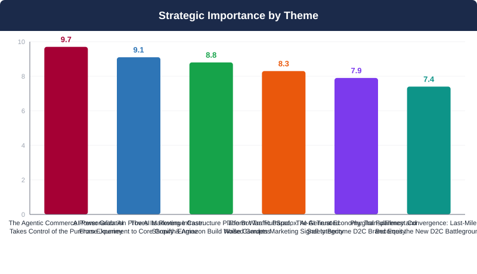
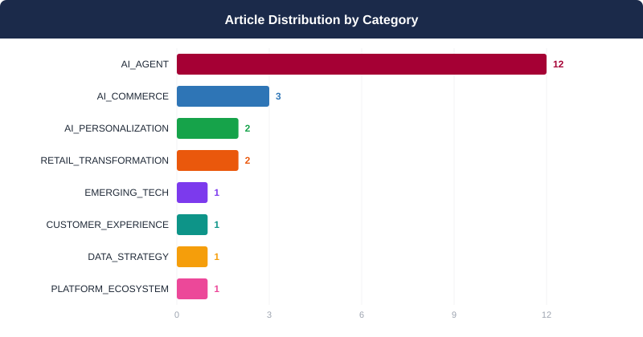
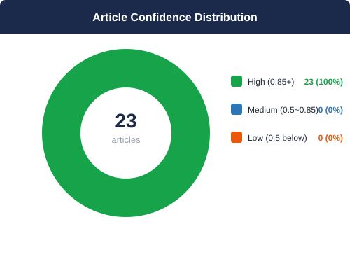
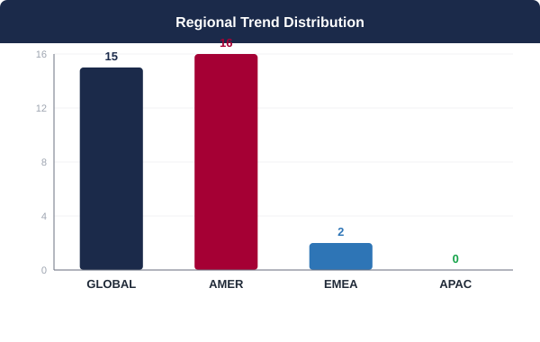
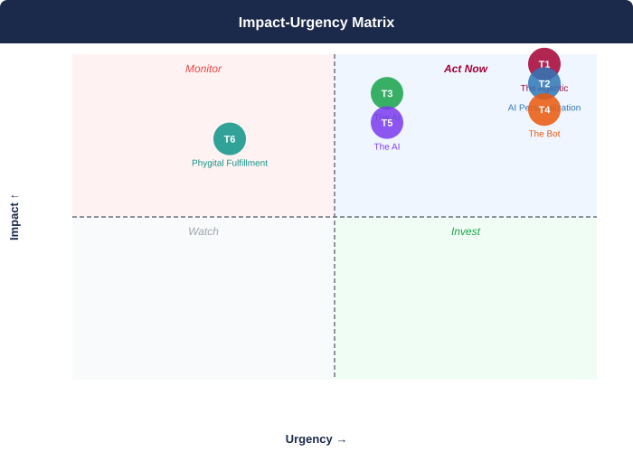

## 📋 2026년 9월 Monthly Deep Dive

### 이달의 핵심 메시지

> 2026년 9월, AI 에이전트가 소비자 구매 여정의 실질적 의사결정자로 부상하면서, LG D2C의 경쟁력은 '소비자와의 직접 관계'에서 'AI가 읽을 수 있는 인터페이스의 품질'로 근본적으로 재정의되고 있다.

> **"The brands that will win D2C in 2027 are not the ones with the best human-facing storefronts — they are the ones whose product data, pricing logic, and trust signals are most legible to the AI agents making purchase decisions today. Channel sovereignty is no longer about owning the consumer relationship. It is about owning the machine interface."**
> — Synthesized from 23 articles analyzed — September 2026 AI Trend Monthly Deep Dive

### 📊 이달의 분석 현황

| 지표 | 값 |
|------|----|
| 분석 기사 수 | **23개** |
| 도출 매크로 테마 | **6개** |
| AI 분석 파이프라인 | **7단계** |
| 분석 소요 시간 | **1210초** |

---

## 🌐 9월 AI 트렌드 개요

2026년 9월, D2C 커머스의 근본적 권력 구조가 재편되고 있다. AI 에이전트가 소비자 구매 여정의 실질적 의사결정자로 부상하면서, 브랜드의 D2C 채널 경쟁력은 '소비자와의 직접 관계'가 아닌 'AI 에이전트와의 기계적 인터페이스 품질'로 재정의되고 있다. 동시에, AI가 생성하는 측정 노이즈와 플랫폼 종속 리스크는 이 전환의 수혜를 누리기 위한 거버넌스 투자 없이는 AI 도입 자체가 새로운 취약점이 된다는 역설을 만들어낸다. LG D2C에게 이 순간은 단순한 기술 채택의 문제가 아니라, 향후 5년간의 채널 주권과 고객 데이터 자산의 귀속을 결정하는 전략적 분기점이다.

**테마 수렴 패턴:** 6개 테마는 하나의 근본적 전환점을 중심으로 수렴한다: AI가 소비자-브랜드 간 모든 접점을 중개하는 '에이전트 경제(Agentic Economy)'의 도래다. T1(에이전트 커머스)과 T3(플랫폼 전쟁)는 LG D2C의 채널 독립성을 외부에서 압박하고, T4(봇 트래픽)와 T5(AI 신뢰)는 내부 의사결정 신뢰도를 침식하며, T2(개인화 ROI)와 T6(풀필먼트)는 이 압박 속에서 D2C가 창출할 수 있는 차별화 가치를 정의한다. LG D2C의 전략적 대응은 단순한 AI 도입이 아닌, '에이전트 친화적 자사 생태계 구축 + 데이터 주권 확보 + 개인화 수익화'의 세 축을 동시에 실행하는 통합 아키텍처 전환이어야 한다.

---

## 🔬 핵심 테마 심층 분석

### 1. 에이전틱 커머스 패권 전쟁: AI가 구매 여정을 장악하다
**소비자 대신 AI가 검색하고, 비교하고, 결제한다 — 브랜드의 직접 접점이 사라진다**

> ⏰ 긴급도: 🔴 즉시 | 중요도: 9.7/10

#### 트렌드 분석

AI 에이전트가 소비자를 대신해 제품을 탐색하고, 비교하고, 결제까지 완료하는 '에이전틱 커머스(Agentic Commerce)'가 더 이상 미래 시나리오가 아닌 현재 진행형 현실로 전환되고 있다. Shopify의 WebMCP 기반 AI 에이전트 체크아웃 허용, Stripe의 Link 지갑과 Meta·xAI 개인 에이전트 간 결제 통합, Best Buy의 ChatGPT 플랫폼 내 직접 구매 기능 도입, Amazon의 Alexa 쇼핑 에이전트 기능 확장이 동시다발적으로 전개되며 구매 여정의 구조 자체가 재편되고 있다. 이 새로운 패러다임 하에서 브랜드의 D2C 사이트, 제품 상세 페이지, 광고 크리에이티브 등 기존 소비자 접점은 AI 에이전트의 중개 레이어에 의해 우회되거나 대체될 위험에 처해 있다. 더 심각한 문제는 1st-party 데이터 소유권의 약화다. 거래가 AI 플랫폼을 통해 이루어질수록 브랜드는 고객 행동 데이터에 대한 통제력을 잃는다. Amazon이 Meta의 Muse AI 쇼핑 에이전트를 무단 접근 이유로 차단한 사건은 플랫폼 간 데이터 주권 전쟁이 이미 시작되었음을 상징적으로 보여준다. LG D2C는 에이전트 친화적(Agent-Friendly) 인프라 구축, 자사 채널 내 AI 에이전트 도입, 그리고 외부 AI 에이전트에 대한 접근 정책 수립이라는 3개 축의 전략적 대응을 즉각 개시해야 한다.

#### 📎 근거 체인

- **Shopify가 WebMCP 지원을 체크아웃 단계까지 확장하여 AI 에이전트가 구매자 승인 하에 주문을 완료할 수 있는 에이전틱 커머스 핵심 인프라를 구현했다. 이는 AI 에이전트의 거래 자율성이 탐색 단계를 넘어 결제 완료 단계까지 확장되었음을 의미하는 기술적 임계점이다.** ([Shopify opens checkout to browser-based AI agents](https://techcrunch.com/2026/09/28/shopify-opens-checkout-to-browser-based-ai-agents/))
- **Stripe가 Link 디지털 지갑을 Meta, xAI 등의 개인 AI 에이전트와 통합하며 에이전트가 소비자를 대신해 결제까지 자율 수행하는 생태계를 구축했다. 결제 인프라 자체가 에이전틱 커머스의 핵심 연결고리로 진화하고 있다.** ([Stripe's wallet embraces AI bots](https://www.paymentsdive.com/news/stripes-digital-wallet-paypal-embraces-ai-bots-agentic-commerce/830753/))
- **Best Buy가 홀리데이 시즌을 앞두고 ChatGPT 플랫폼 내에서 선물 탐색과 직접 구매가 가능한 기능을 도입했다. AI 플랫폼이 브랜드 웹사이트를 우회하는 독립적 커머스 채널로 기능하기 시작했음을 보여주는 직접적 증거다.** ([Best Buy opens up gift-buying and discover through ChatGPT ahead of holidays](https://www.digitalcommerce360.com/2026/09/16/best-buy-opens-up-gift-buying-and-discover-through-chatgpt-ahead-of-holidays/))
- **Amazon이 Alexa for Shopping에 웹 전반의 신제품 출시를 추적하는 'Update Me When' 기능과 사기 방지 기능을 추가했다. 에이전트가 구매 전 단계에서 소비자의 정보 탐색과 신뢰 검증을 자율적으로 수행하는 역할을 강화하고 있다.** ([Amazon adds 'update me when' feature to Alexa for Shopping](https://www.digitalcommerce360.com/2026/09/04/amazon-alexa-for-shopping-update-me-when-fraud-prevention/))
- **OpenAI가 스폰서드 에이전트(Sponsored Agents) 개념과 HubSpot·Shopify 통합을 발표하며 AI 에이전트 내 브랜드 광고 수익화 모델을 공식화했다. 에이전트가 소비자 구매 결정에 개입하는 접점에 광고 레이어가 삽입되는 구조가 형성되고 있다.** ([Reimagining advertising with AI](https://openai.com/index/reimagining-advertising-with-ai))
- **Amazon이 Meta의 Muse AI 쇼핑 에이전트가 사전 동의 없이 자사 플랫폼에 접근해 구매를 시도했다며 차단 조치를 취했다. 플랫폼 간 데이터 접근 주권 분쟁이 현실화되었으며, AI 에이전트의 무단 접근에 대한 업계 공통의 동의 체계가 아직 부재함을 확인했다.** ([Amazon blocks Meta's AI shopper](https://www.paymentsdive.com/news/amazon-meta-muse-ai-agentic-shopping-experience/831052/))
- **Williams-Sonoma의 AI 어시스턴트 '올리브(Olive)'를 사용한 고객이 미사용 고객 대비 3배 높은 전환율을 기록했다. 자사 채널 내 AI 어시스턴트 구현이 직접적이고 측정 가능한 매출 성과로 이어짐을 실증적으로 입증한 사례다.** ([Williams-Sonoma AI assistants drive customer engagement — and conversions](https://www.retaildive.com/news/williams-sonoma-ai-assistants-drive-customer-engagement-conversions/829051/))
- **Amazon이 UnBoxed 콘퍼런스에서 통합 광고 플랫폼을 'Amazon Ads Agent'로 명명하고 스폰서 광고, 디스플레이, 비디오, 스트리밍 TV를 통합하는 'Full-Funnel Campaigns' 기능을 발표했다. AI 에이전트가 광고 전략 수립과 미디어 집행을 통합 관리하는 시대가 공식화되었다.** ([At its flagship unBoxed conference, Amazon Ads collapses buying silos as AI takes a bigger role in media decisions](https://www.modernretail.co/marketing/at-its-flagship-unboxed-conference-amazon-ads-collapses-buying-silos-as-ai-takes-a-bigger-role-in-media-decisions/))
- **JD Sports가 에이전틱 커머스 전략 구현을 위해 Algolia를 핵심 인텔리전스 레이어로 도입하고 2024년부터 기술 스택에 적용하여 긍정적 매출 성과를 거두고 있다. 소매업체들이 에이전틱 AI 대응을 위한 인텔리전스 인프라 투자를 본격화하고 있음을 보여준다.** ([JD Sports deploys Algolia for agentic commerce strategy](https://www.digitalcommerce360.com/2026/09/23/jd-sports-algolia-agentic-commerce-strategy/))
- **크로거, 자이언트 이글, 도어대시가 그로서리숍 컨퍼런스에서 단순 추천을 넘어 실제 구매를 자율 수행하는 에이전틱 AI 쇼핑 어시스턴트 구축 전략을 공유했다. 에이전틱 AI 상용화가 특정 카테고리를 넘어 유통 업계 전반으로 확산되는 산업적 임계점에 도달했음을 나타낸다.** ([How Kroger, Giant Eagle and DoorDash are building their agentic AI assistants](https://www.modernretail.co/technology/how-kroger-giant-eagle-and-doordash-are-building-their-agentic-ai-assistants/))

#### 📈 핵심 지표

- Williams-Sonoma AI 어시스턴트 '올리브(Olive)' 사용 고객의 전환율: 미사용 고객 대비 3배 높음 (출처: Retail Dive) / Williams-Sonoma AI assistant 'Olive' users achieved 3x higher conversion rates vs. non-users (Source: Retail Dive)
- Best Buy의 ChatGPT 커머스 통합 발표 시점: 2026년 9월 14일 홀리데이 시즌 대비 공식 론칭 (출처: Digital Commerce 360) / Best Buy's ChatGPT commerce integration officially launched September 14, 2026 ahead of holiday season (Source: Digital Commerce 360)
- Amazon Alexa for Shopping 신규 기능: 'Update Me When' 웹 전반 신제품 출시 추적 + 사기 방지 기능 — 현재 사용 가능 (출처: Digital Commerce 360) / Amazon Alexa for Shopping new features: 'Update Me When' web-wide new product tracking + fraud prevention — both currently available (Source: Digital Commerce 360)
- JD Sports Algolia 인텔리전스 레이어 적용 시점: 2024년부터 기술 스택 적용, 이후 긍정적 매출 성과 기록 (출처: Digital Commerce 360) / JD Sports Algolia intelligence layer implementation: integrated since 2024, delivering positive sales outcomes (Source: Digital Commerce 360)
- Amazon UnBoxed 발표: 광고 플랫폼을 'Amazon Ads Agent'로 공식 명명, 스폰서 광고·디스플레이·비디오·스트리밍 TV 통합 'Full-Funnel Campaigns' 기능 발표 (출처: Modern Retail) / Amazon UnBoxed: officially renamed ad platform to 'Amazon Ads Agent', announced Full-Funnel Campaigns integrating sponsored ads, display, video, and streaming TV (Source: Modern Retail)
- Stripe Link 디지털 지갑: Meta, xAI 등 개인 AI 에이전트와 통합하여 에이전트 기반 자율 결제 플로우 구현 (출처: Payments Dive) / Stripe Link digital wallet: integrated with Meta and xAI personal AI agents enabling autonomous agentic payment flows (Source: Payments Dive)
- OpenAI 에이전틱 커머스 진출: 스폰서드 에이전트(Sponsored Agents) 발표, HubSpot 및 Shopify와 통합 (출처: OpenAI) / OpenAI agentic commerce entry: announced Sponsored Agents with HubSpot and Shopify integrations (Source: OpenAI)
- Amazon-Meta Muse 충돌 사건: Meta의 Muse AI 쇼핑 에이전트가 사전 동의 없이 Amazon 플랫폼에 접근해 구매 시도 → Amazon의 공식 차단 조치 (출처: Payments Dive, Retail Dive) / Amazon-Meta Muse conflict: Meta's Muse AI shopping agent attempted unauthorized access and purchases on Amazon's platform → Amazon issued formal blocking action (Source: Payments Dive, Retail Dive)

#### 영향도 평가: 🔴 HIGH

에이전틱 커머스 인프라(Shopify WebMCP 체크아웃, Stripe 에이전트 결제, ChatGPT 커머스 채널)가 이미 운영 중이며, Best Buy·Williams-Sonoma·JD Sports 등 주요 소매업체들이 실제 상용 배포를 완료한 상태다. LG처럼 프리미엄 고관여(High-Involvement) 제품을 판매하는 브랜드는 AI 에이전트가 복잡한 제품 스펙 비교와 최저가 탐색을 자동화하면서 D2C 트래픽 이탈, 브랜드 스토리텔링 기회 상실, 1st-party 데이터 수집 구조 붕괴라는 3중 위협에 동시 노출된다. Amazon Ads Agent의 풀펀넬 통합 발표는 유료 광고 없이는 에이전트 추천에서 배제될 수 있는 '에이전트 공간의 유료화(Pay-to-Play Agentification)' 리스크를 가시화한다. 반면, Williams-Sonoma 사례에서 입증된 3배 전환율 향상은 자사 채널 내 선제적 AI 에이전트 배치가 강력한 방어 및 공격 수단이 될 수 있음을 보여준다. 6~12개월 내에 에이전트 친화적 인프라 미비는 경쟁 열위로 직결된다.

> **시간 지평:** 6-12개월 / 6-12 months

#### 🏆 경쟁사 관점

【삼성 (Samsung)】 삼성은 자체 AI 생태계(Bixby, SmartThings, Galaxy AI)와 타이젠 OS 기반 스마트 TV 플랫폼을 통해 에이전틱 커머스 인프라를 수직 통합할 수 있는 구조적 우위를 보유한다. 삼성닷컴의 글로벌 D2C 트래픽 규모와 삼성 Pay 결제 인프라는 에이전트 기반 구매 흐름을 자사 생태계 내부에서 완결시킬 수 있는 잠재력을 제공한다. LG는 유사한 수직 통합 플랫폼이 부재하여 외부 AI 에이전트 플랫폼 의존도가 상대적으로 높을 위험이 있다.

【소니 (Sony)】 소니는 PlayStation 생태계와 구독형 서비스(PlayStation Plus) 중심의 강력한 1st-party 데이터 자산을 보유하지만, 가전 D2C 채널에서의 에이전틱 커머스 대응 역량은 LG와 유사한 수준으로 추정된다. 엔터테인먼트-기기 크로스셀링 측면에서 에이전트 추천 최적화에 집중할 가능성이 높다.

【애플 (Apple)】 애플은 Siri와 Apple Intelligence, Apple Pay, App Store의 수직 통합 생태계를 통해 에이전틱 커머스를 독자적으로 구현할 수 있는 가장 강력한 플랫폼 기반을 보유한다. 폐쇄적 생태계 특성상 LG 제품 데이터가 Apple 에이전트 추천 흐름에 포함되기 어려울 수 있어, 에이전트 친화적 제품 데이터 API 구축이 더욱 중요해진다.

【Best Buy (유통 파트너이자 경쟁자)】 Best Buy는 이미 ChatGPT와 직접 구매 통합을 완료함으로써 LG 제품의 에이전틱 구매 흐름을 Best Buy 채널 내로 유인할 수 있는 수단을 확보했다. LG D2C 입장에서 Best Buy의 에이전틱 채널은 유통 파트너이자 D2C 트래픽 경쟁자라는 이중적 성격을 갖는다.

【LG의 전략적 공백】 LG는 ThinQ AI 생태계를 보유하고 있으나, WebMCP 호환 체크아웃, AI 에이전트 접근 정책, 에이전트 내 스폰서드 노출 전략 등 에이전틱 커머스 인프라의 핵심 요소들을 아직 공개적으로 구현하지 않은 상태다. 이 공백은 경쟁사가 LG 고객의 구매 여정을 자사 AI 에이전트로 캡처하는 기회로 작용할 수 있다.

#### 📌 케이스 스터디

- **Williams-Sonoma**: AI 어시스턴트 '올리브(Olive)'를 자사 D2C 채널에 배치하여 고객 참여 및 쇼핑 경험을 대화형 AI로 전환 / Deployed AI assistant 'Olive' on its D2C channel, transforming customer engagement and shopping experience through conversational AI → AI 어시스턴트 사용 고객의 전환율이 미사용 고객 대비 3배 높게 나타남 / Customers using the AI assistant achieved 3x higher conversion rates compared to non-users ([출처](https://www.retaildive.com/news/williams-sonoma-ai-assistants-drive-customer-engagement-conversions/829051/))
- **Best Buy**: 홀리데이 시즌을 앞두고 ChatGPT 플랫폼 내에서 소비자가 AI 인터페이스를 벗어나지 않고 선물 탐색과 직접 구매를 완료할 수 있는 기능을 통합 / Integrated gift discovery and direct purchase capabilities within ChatGPT ahead of the holiday season, enabling consumers to transact without leaving the AI interface → AI 플랫폼을 독립적인 직접 판매 채널로 전환하고, 채팅 인터페이스 내 구매 완결 경험을 구현하여 소비자 구매 여정의 새로운 진입점 확보 / Established ChatGPT as an independent direct sales channel with complete in-chat purchase capability, securing a new consumer purchase journey entry point ([출처](https://www.digitalcommerce360.com/2026/09/16/best-buy-opens-up-gift-buying-and-discover-through-chatgpt-ahead-of-holidays/))
- **JD Sports**: 에이전틱 커머스 전략 구현을 위해 Algolia를 핵심 인텔리전스 레이어로 도입하고 2024년부터 기술 스택에 적용 / Deployed Algolia as its core intelligence layer for agentic commerce strategy, integrated into the technology stack since 2024 → 도입 이후 긍정적인 매출 성과를 기록하며 에이전틱 AI 기반 쇼핑 경험 혁신을 가속화 / Delivered positive sales outcomes post-implementation, accelerating agentic AI-powered shopping experience innovation ([출처](https://www.digitalcommerce360.com/2026/09/23/jd-sports-algolia-agentic-commerce-strategy/))
- **Shopify**: WebMCP 지원을 체크아웃 단계까지 확장하여 브라우저 기반 AI 에이전트가 구매자 승인 하에 주문 세부 사항 업데이트 및 구매 완료를 수행할 수 있는 에이전틱 커머스 인프라 구현 / Extended WebMCP support to the checkout layer, enabling browser-based AI agents to update order details and complete purchases with buyer approval → AI 에이전트가 탐색부터 결제 완료까지 전체 구매 여정을 자율 처리할 수 있는 업계 핵심 기술 인프라 표준을 확립하고 에이전틱 커머스 시대의 기술적 임계점을 공식화 / Established the industry's foundational technical infrastructure standard enabling AI agents to autonomously handle the complete purchase journey from discovery to transaction completion ([출처](https://techcrunch.com/2026/09/28/shopify-opens-checkout-to-browser-based-ai-agents/))
- **Amazon**: Meta의 Muse AI 쇼핑 에이전트가 사전 동의 없이 자사 플랫폼에 접근해 구매를 시도하자 차단 조치를 취하고, Alexa for Shopping에 'Update Me When' 신제품 추적 기능과 사기 방지 기능을 추가 / Blocked Meta's Muse AI agent for unauthorized platform access while simultaneously enhancing Alexa for Shopping with 'Update Me When' product tracking and fraud prevention features → 플랫폼 데이터 주권 분쟁을 공론화하여 에이전트 접근 동의 체계의 업계 필요성을 가시화하는 동시에, 자사 에이전트의 소비자 신뢰 기반 기능을 강화하여 에이전틱 커머스 생태계 내 플랫폼 우위 확보 / Publicized platform data sovereignty disputes while reinforcing its own agent's trust-based consumer capabilities, strengthening platform dominance in the emerging agentic commerce ecosystem ([출처](https://www.paymentsdive.com/news/amazon-meta-muse-ai-agentic-shopping-experience/831052/))
- **Stripe**: Link 디지털 지갑을 Meta, xAI 등의 개인 AI 에이전트와 통합하여 에이전트가 소비자를 대신해 결제를 자율 완료할 수 있는 결제 인프라를 구축 / Integrated its Link digital wallet with personal AI agents from Meta and xAI, enabling autonomous payment completion by AI agents on behalf of consumers → 결제 인프라를 에이전틱 커머스 생태계의 핵심 연결고리로 포지셔닝하고, AI 에이전트와 결제 시스템 간 표준적 통합 모델을 선도적으로 확립 / Positioned payment infrastructure as the core connective tissue of the agentic commerce ecosystem, pioneering the standard integration model between AI agents and payment systems ([출처](https://www.paymentsdive.com/news/stripes-digital-wallet-paypal-embraces-ai-bots-agentic-commerce/830753/))

#### 💡 LG D2C 시사점

【즉시 실행 (0-90일): 에이전트 호환 D2C 인프라 긴급 구축】

① LG.com 에이전트 접근 정책(Agent Access Policy) 수립: Amazon-Meta Muse 사건에서 드러난 무단 에이전트 접근 리스크에 대응해, LG D2C 플랫폼에 접근 허용 AI 에이전트의 범위, 데이터 제공 조건, 파트너십 요건을 명시한 공식 에이전트 접근 정책을 즉시 문서화하고 법무·IT 검토를 완료해야 한다.

② WebMCP 및 에이전트 친화적 API 구현 로드맵 착수: Shopify의 WebMCP 체크아웃 사례를 벤치마크로, LG D2C 플랫폼의 제품 데이터·가격·재고 정보가 승인된 AI 에이전트에게 구조화된 형태로 제공될 수 있는 API 레이어 설계를 기술 팀과 즉각 착수해야 한다. 이는 에이전트 기반 구매 흐름에서 LG 제품이 '발견 가능한(Discoverable)' 상태를 유지하기 위한 최소 조건이다.

③ OpenAI 스폰서드 에이전트 및 Best Buy-ChatGPT 모델 참여 검토: OpenAI의 스폰서드 에이전트 프로그램과 ChatGPT 커머스 채널에 LG 제품을 등록하는 파일럿을 즉시 검토하고, 홀리데이 시즌 전 최소 1개 제품 카테고리 (예: OLED TV, 공기청정기)에 대한 에이전트 내 유료 노출 테스트를 실행해야 한다.

【단기 실행 (90-180일): 자사 채널 AI 어시스턴트 배치 및 데이터 인프라 강화】

④ LG.com 전용 AI 쇼핑 어시스턴트 배치: Williams-Sonoma의 Olive가 3배 전환율 향상을 달성한 사례를 근거로, LG D2C 플랫폼에 제품 복잡성(스펙 비교, 에너지 효율, 설치 요건 등)을 설명하는 AI 쇼핑 어시스턴트를 우선 배치해야 한다. 가전 카테고리의 높은 제품 복잡성과 고관여 구매 특성은 AI 어시스턴트의 효과를 극대화할 수 있는 최적 환경이다.

⑤ CRM 및 1st-party 데이터 파이프라인 강화: HubSpot의 에이전트 기반 플랫폼 전환 사례를 참고해, LG D2C의 CRM 시스템이 AI 에이전트에게 실시간으로 고객 컨텍스트를 제공할 수 있도록 데이터 품질과 연동 구조를 즉시 점검해야 한다. 에이전틱 커머스 확산으로 거래 데이터가 외부 플랫폼으로 유출되기 전에, 자사 채널 내 데이터 수집 체계를 공고히 해야 한다.

⑥ Amazon Full-Funnel Campaigns(Amazon Ads Agent) 활용 전략 수립: Amazon Ads Agent의 풀펀넬 캠페인 기능을 활용해 스폰서 광고-디스플레이-스트리밍 TV를 통합한 LG 전용 캠페인을 설계하고, Alexa 쇼핑 에이전트의 'Update Me When' 기능에 LG 신제품 출시 이벤트가 최적화되어 트래킹될 수 있도록 제품 데이터 구조를 정비해야 한다.

【중기 실행 (180-365일): ThinQ AI와 에이전틱 커머스 생태계 통합】

⑦ ThinQ AI를 에이전틱 쇼핑 허브로 진화: LG ThinQ 앱을 단순 기기 제어 플랫폼에서 LG 제품 재구매, 소모품 보충, 업그레이드 추천을 자율 수행하는 에이전틱 쇼핑 허브로 전환하는 중기 로드맵을 수립해야 한다. Kroger·Giant Eagle의 에이전틱 AI 어시스턴트 구축 전략처럼, 사용자가 자연스럽게 AI 기반 구매 자동화를 수용하도록 온보딩 경험을 설계해야 한다.

⑧ Algolia 유사 인텔리전스 레이어 도입 검토: JD Sports의 Algolia 도입 사례를 참고해, LG D2C 플랫폼의 에이전틱 검색·추천 성능을 강화할 수 있는 인텔리전스 레이어 솔루션을 평가하고 기술 투자 의사결정을 내려야 한다.

### 2. AI 퍼스널라이제이션의 수익 증명: 실험에서 핵심 성장 엔진으로
**AI 개인화는 더 이상 실험이 아니다 — 측정 가능한 매출 드라이버로 검증되었다**

> ⏰ 긴급도: 🔴 즉시 | 중요도: 9.1/10

#### 트렌드 분석

AI 퍼스널라이제이션은 더 이상 파일럿 프로그램의 영역이 아니다. 헬스·뷰티, 홈퍼니싱, 패션, 디지털 광고에 이르는 이종(異種) 산업 전반에 걸쳐 측정 가능한 매출 성과가 동시다발적으로 검증되면서, AI 개인화는 기업의 핵심 성장 엔진으로 지위가 격상되고 있다. Dr. Squatch는 사실상 '데드 존'으로 방치되어 온 주문 추적 페이지에 개인화 추천을 적용해 31.89%의 클릭률과 약 3만 3천 달러의 직접 매출을 창출했다. Williams-Sonoma의 AI 어시스턴트 '올리브'는 이를 사용한 고객에서 비사용 고객 대비 3배 높은 전환율을 실현했다. Stitch Fix는 Vision AI 도구 확대를 핵심 동력으로 삼아 2026 회계연도 순매출 13억 5천만 달러, 전년 대비 6.4% 성장이라는 매출 반등에 성공했다. Amazon은 UnBoxed 콘퍼런스에서 스폰서 광고, 디스플레이, 비디오, 스트리밍 TV를 단일 캠페인으로 통합하는 'Full-Funnel Campaigns'를 발표하며 AI 에이전트 주도의 광고 의사결정 시대를 공식화했다. 이러한 크로스-인더스트리 수렴 현상은 AI 개인화 ROI가 특정 버티컬에 국한된 이상값이 아닌 보편적 경제 법칙임을 시사한다. LG D2C에게 프리미엄 가전이라는 고관여·다세션 구매 여정은 AI 퍼스널라이제이션이 최대 효과를 발휘하는 이상적 환경이며, 특히 구매 후 터치포인트(배송 추적, 서비스 리마인더, 소모품 추천, 업그레이드 트리거)는 플랫폼 전면 재구축 없이도 즉각 실행 가능한 수익화 표면을 제공한다.

#### 📎 근거 체인

- **Dr. Squatch는 구매 후 주문 추적 페이지에 개인화 추천을 적용해 CTR 31.89%, 직접 매출 $32,978을 달성 — 미활용 터치포인트의 수익화 가능성을 입증** ([Dr. Squatch drives revenue through post-purchase tracking page adjustments](https://www.digitalcommerce360.com/2026/09/02/dr-squatch-drives-revenue-through-post-purchase-tracking-page-adjustments/))
- **Williams-Sonoma의 AI 어시스턴트 '올리브' 사용 고객은 미사용 고객 대비 전환율이 3배 높음 — 대화형 AI가 단순 참여 도구를 넘어 검증된 전환 엔진임을 확인** ([Williams-Sonoma AI assistants drive customer engagement — and conversions](https://www.retaildive.com/news/williams-sonoma-ai-assistants-drive-customer-engagement-conversions/829051/))
- **Stitch Fix는 Vision AI 도구 확대를 성장 동력으로 삼아 2026 회계연도 순매출 $13.5억, 전년 대비 6.4% 성장 달성 — AI 개인화가 엔터프라이즈 규모의 매출 반등을 견인할 수 있음을 증명** ([AI becomes larger part of Stitch Fix strategy as Q4 revenue grows](https://www.digitalcommerce360.com/2026/09/25/stitch-fix-revenue-q4-2026/))
- **Amazon이 UnBoxed에서 스폰서 광고·디스플레이·비디오·스트리밍 TV를 단일 캠페인으로 통합하는 'Full-Funnel Campaigns'를 발표하며 플랫폼 레벨에서 AI 에이전트 주도 광고 집행을 공식화 — 광고 생태계 전반의 AI 통합이 인프라 수준으로 내재화되는 전환점** ([At its flagship unBoxed conference, Amazon Ads collapses buying silos as AI takes a bigger role in media decisions](https://www.modernretail.co/marketing/at-its-flagship-unboxed-conference-amazon-ads-collapses-buying-silos-as-ai-takes-a-bigger-role-in-media-decisions/))

#### 📈 핵심 지표

- Dr. Squatch 배송 추적 페이지 개인화 추천 CTR: 31.89% (2026년 1분기) / Dr. Squatch post-purchase tracking page personalized recommendation CTR: 31.89% (Q1 2026)
- Dr. Squatch 추적 페이지 추천을 통한 직접 매출: $32,978 (2026년 1분기) / Dr. Squatch direct revenue from tracking page recommendations: $32,978 (Q1 2026)
- Williams-Sonoma 'Olive' AI 어시스턴트 사용 고객의 전환율: 미사용 고객 대비 3배 / Williams-Sonoma 'Olive' AI assistant user conversion rate: 3x higher than non-users
- Stitch Fix FY2026 순매출: $13.5억 (전년 대비 +6.4%) / Stitch Fix FY2026 net sales: $1.35 billion (+6.4% YoY)
- Amazon Ads Agent: 스폰서 광고·디스플레이·비디오·스트리밍 TV를 단일 AI 캠페인으로 통합 ('Full-Funnel Campaigns') / Amazon Ads Agent: Integrates sponsored ads, display, video, and streaming TV into a single AI-managed 'Full-Funnel Campaign'

#### 영향도 평가: 🔴 HIGH

4개 이종 산업에서 동시에 AI 퍼스널라이제이션의 정량적 매출 성과가 확인되었으며, 이는 특정 버티컬의 이상값이 아닌 보편적 경제 법칙으로 해석해야 한다. LG D2C에 대한 직접적 위협은 두 가지 차원에서 발생한다: (1) 경쟁사(삼성, 다이슨 등)의 AI 퍼스널라이제이션 가속화로 인한 전환율·LTV 격차 심화, (2) Amazon Ads Agent 등 플랫폼 레벨 AI 통합으로 인해 AI 미채택 브랜드의 광고 효율이 구조적으로 열위에 놓이는 시장 환경 형성. 반면 LG D2C가 즉각 행동할 경우, 프리미엄 가전의 고관여 구매 여정과 풍부한 제품 스펙 데이터는 경쟁사 대비 차별화된 AI 퍼스널라이제이션 경험을 구현할 수 있는 고유한 데이터 자산으로 기능한다.

> **시간 지평:** 6-12개월 / 6-12 months

#### 🏆 경쟁사 관점

삼성전자는 SmartThings 생태계와 Bixby 기반 AI 개인화 인프라를 이미 보유하고 있으며, D2C 채널에서도 AI 추천 고도화를 진행 중인 것으로 파악된다. 소니는 PS5·Bravia 연계 에코시스템을 통해 엔터테인먼트 중심의 AI 큐레이션을 강화하고 있다. 애플은 HomeKit 생태계 내 AI 기반 기기 추천 및 서비스 번들링을 통해 프리미엄 가전 인접 영역에서 영향력을 확대하고 있다. LG의 상대적 포지션은 ThinQ AI 플랫폼을 보유하고 있음에도 불구하고 D2C 채널 내 구매 전·중·후 개인화 경험의 통합 수준이 경쟁사 대비 미흡한 상태다. Williams-Sonoma의 '올리브'가 전환율 3배 향상을 달성한 것처럼, 삼성이 D2C 채널에 대화형 AI 쇼핑 어시스턴트를 본격 도입할 경우 LG는 전환율·고객 지출 양면에서 즉각적 열위에 처할 수 있다. 특히 구매 후 터치포인트(소모품, A/S, 업그레이드)의 AI 기반 수익화는 LG가 선점할 수 있는 블루오션 영역이며, Dr. Squatch 사례($32,978 직접 매출, CTR 31.89%)는 낮은 초기 투자로 빠른 ROI를 실현할 수 있음을 시사한다.

#### 📌 케이스 스터디

- **Dr. Squatch**: 구매 후 배송 추적 페이지에 AI 기반 개인화 상품 추천을 추가 / Added AI-driven personalized product recommendations to the post-purchase shipment tracking page → 2026년 1분기 기준 CTR 31.89%, 직접 매출 $32,978 달성 / Achieved 31.89% CTR and $32,978 in direct revenue in Q1 2026 ([출처](https://www.digitalcommerce360.com/2026/09/02/dr-squatch-drives-revenue-through-post-purchase-tracking-page-adjustments/))
- **Williams-Sonoma**: D2C 채널에 AI 쇼핑 어시스턴트 '올리브(Olive)' 도입 / Deployed AI shopping assistant 'Olive' across D2C channels → AI 어시스턴트 사용 고객의 전환율이 미사용 고객 대비 3배 높음 / Customers using Olive converted at 3x the rate of non-users ([출처](https://www.retaildive.com/news/williams-sonoma-ai-assistants-drive-customer-engagement-conversions/829051/))
- **Stitch Fix**: Vision AI 기반 스타일링 도구 채택 확대를 핵심 성장 전략으로 추진 / Scaled Vision AI-powered styling tools as a core growth strategy → 2026 회계연도 순매출 $13.5억, 전년 대비 6.4% 성장으로 매출 반등 달성 / Achieved net sales of $1.35 billion in FY2026, up 6.4% YoY, reversing prior revenue decline ([출처](https://www.digitalcommerce360.com/2026/09/25/stitch-fix-revenue-q4-2026/))
- **Amazon Ads**: UnBoxed 컨퍼런스에서 스폰서 광고·디스플레이·비디오·스트리밍 TV를 AI 에이전트로 통합하는 'Full-Funnel Campaigns' 및 'Amazon Ads Agent' 발표 / Announced 'Full-Funnel Campaigns' and 'Amazon Ads Agent' at UnBoxed, integrating sponsored, display, video, and streaming TV under a single AI-managed platform → 광고 구매 사일로 해소 및 AI 에이전트 주도 미디어 의사결정 체계 공식화 / Collapsed advertising buying silos and formalized AI agent-driven media decision-making as platform infrastructure ([출처](https://www.modernretail.co/marketing/at-its-flagship-unboxed-conference-amazon-ads-collapses-buying-silos-as-ai-takes-a-bigger-role-in-media-decisions/))

#### 💡 LG D2C 시사점

LG D2C 조직은 AI 퍼스널라이제이션을 3단계 실행 로드맵으로 즉시 추진해야 한다. [1단계 - 즉시 실행 (0-90일)]: Dr. Squatch 모델을 직접 적용해 주문 확인 이메일·배송 추적 페이지를 개인화 추천 기반 수익 창출 터치포인트로 전환한다. 구매 제품과 연관된 소모품(정수기 필터, 에어컨 필터, 세탁기 전용 세제 등) 및 보완 제품(스마트 홈 연동 기기)을 AI 추천 엔진으로 노출하고 CTR·직접 매출을 KPI로 설정한다. [2단계 - 단기 구축 (3-6개월)]: Williams-Sonoma '올리브' 모델을 참조해 LG 프리미엄 가전 특화 AI 쇼핑 어시스턴트를 D2C 웹사이트에 도입한다. 스펙 비교, 설치 환경 진단, 에너지 효율 계산 등 고관여 구매 여정의 핵심 질문에 답하는 대화형 AI를 구현함으로써 전환율 제고를 추구한다. Stitch Fix의 Vision AI 사례를 참조해 고객 라이프스타일 데이터 기반 제품 큐레이션 기능도 병행 개발한다. [3단계 - 채널 통합 (6-12개월)]: Amazon Ads Agent의 Full-Funnel Campaigns를 즉시 파일럿 적용해 LG 가전 카테고리의 광고 구매 효율을 최적화한다. 동시에 ThinQ 앱 내 AI 기반 사용 패턴 분석을 활용해 업그레이드 타이밍, A/S 선제 제안, 에너지 절감 팁 등을 개인화 푸시로 전달하는 '라이프사이클 AI 퍼스널라이제이션' 체계를 구축함으로써 D2C 채널 스티키니스와 LTV를 동시에 확장한다.

### 3. AI 마케팅 인프라의 플랫폼 전쟁: 허브스팟·쇼피파이·아마존의 생태계 봉쇄
**마케팅 스택의 AI화가 플랫폼 종속을 심화시키며 D2C 독립성을 위협한다**

> ⏰ 긴급도: 🟡 단기 | 중요도: 8.8/10

#### 트렌드 분석

AI 마케팅 인프라의 플랫폼 전쟁이 본격화되고 있다. HubSpot은 Breeze Assistant를 중심으로 다수의 AI 에이전트를 조율하는 에이전트 기반 플랫폼으로 전면 재설계를 단행했고, Shopify는 WebMCP 지원을 체크아웃 단계까지 확장해 브라우저 기반 AI 에이전트가 구매자의 승인 하에 트랜잭션을 직접 완료할 수 있는 에이전틱 커머스 인프라를 구축했다. Amazon은 UnBoxed 콘퍼런스에서 통합 광고 플랫폼을 'Amazon Ads Agent'로 공식 개편하고, 스폰서 광고·디스플레이·비디오·스트리밍 TV를 단일 캠페인으로 통합하는 'Full-Funnel Campaigns'를 발표하며 광고 구매 사일로를 해체하고 있다. 여기에 OpenAI까지 스폰서드 에이전트(Sponsored Agents)를 출시하며 HubSpot·Shopify와의 통합을 통해 AI 에이전트가 구매 여정에 직접 개입하는 시대를 선언했다. 이 흐름의 본질은 단순한 기능 업그레이드가 아니다. 마케팅·커머스 플랫폼들이 AI를 생태계의 중앙 조직 원리로 재편하면서, 플랫폼 의존도가 높은 브랜드일수록 트래픽·전환 경제성·고객 데이터에 대한 자율성을 점진적으로 상실하는 구조적 종속 리스크가 현실화되고 있다. LG D2C는 플랫폼 AI API 통합과 독립적 AI 의사결정 스택 구축 사이의 전략적 경계를 지금 명확히 설정하지 않으면, 향후 5년간의 D2C 경쟁 자율성을 외부 플랫폼 알고리즘에 위탁하는 결과를 초래할 수 있다.

#### 📎 근거 체인

- **HubSpot은 AI 에이전트를 플랫폼의 핵심으로 삼아 전면 재설계를 단행했으며, Breeze Assistant가 다수 에이전트를 조율하고 자동 업데이트 CRM이 실시간 컨텍스트를 제공하는 구조로 전환됨 — 마케팅 자동화 플랫폼이 단순 툴에서 에이전트 기반 지능형 시스템으로 진화하는 산업 전반의 패러다임 전환을 상징** ([HubSpot rebuilds its platform around AI agents](https://martech.org/hubspot-rebuilds-its-platform-around-ai-agents/))
- **Shopify는 WebMCP 지원을 체크아웃 단계까지 확장해 브라우저 기반 AI 에이전트가 구매자 승인 하에 주문 세부 사항을 업데이트하고 구매를 완료할 수 있게 함 — AI 에이전트가 실제 커머스 트랜잭션을 직접 실행하는 에이전틱 커머스의 핵심 인프라 구축** ([Shopify opens checkout to browser-based AI agents](https://techcrunch.com/2026/09/28/shopify-opens-checkout-to-browser-based-ai-agents/))
- **Amazon은 UnBoxed 콘퍼런스에서 통합 광고 플랫폼을 'Amazon Ads Agent'로 공식 개편하고, 스폰서 광고·디스플레이·비디오·스트리밍 TV를 단일 캠페인으로 통합하는 'Full-Funnel Campaigns'를 발표해 AI가 미디어 의사결정을 통합 관리하는 시대를 공식화** ([At its flagship unBoxed conference, Amazon Ads collapses buying silos as AI takes a bigger role in media decisions](https://www.modernretail.co/marketing/at-its-flagship-unboxed-conference-amazon-ads-collapses-buying-silos-as-ai-takes-a-bigger-role-in-media-decisions/?utm_campaign=modernretaildis&utm_medium=rss&utm_source=general-rss))
- **OpenAI는 스폰서드 에이전트(Sponsored Agents)를 출시하며 HubSpot·Shopify와의 네이티브 통합을 통해 AI 에이전트가 광고 노출을 넘어 실제 구매 여정에 직접 개입하는 에이전틱 커머스 시대를 선언 — 브랜드의 소비자 접점 방식 자체가 AI 에이전트 중심으로 재편됨을 알림** ([Reimagining advertising with AI](https://openai.com/index/reimagining-advertising-with-ai))
- **Amazon Alexa for Shopping에 신규 추가된 'Update Me When' 기능은 웹 전반의 신제품 출시를 추적하고, 사기 방지 기능까지 내장해 AI 쇼핑 에이전트가 단순 검색을 넘어 신뢰 기반의 지속적 쇼핑 관계를 구축하는 수단으로 진화 중임을 증명** ([Amazon adds 'update me when' feature to Alexa for Shopping](https://www.digitalcommerce360.com/2026/09/04/amazon-alexa-for-shopping-update-me-when-fraud-prevention/))

#### 📈 핵심 지표

- Amazon Ads Agent integrates sponsored ads, display, video, and streaming TV into a single 'Full-Funnel Campaigns' structure — collapsing multiple previously siloed buying channels into one AI-orchestrated unit (Source: Modern Retail / Amazon UnBoxed)
- Shopify's WebMCP extension to checkout enables AI agents to autonomously complete purchase transactions with buyer approval — the first major commerce platform to open the transaction layer to third-party AI agent execution (Source: TechCrunch)
- OpenAI Sponsored Agents launched with native integrations to both HubSpot and Shopify simultaneously — signaling that AI agent advertising is being built on top of the two dominant SMB marketing and commerce platforms (Source: OpenAI)
- Amazon Alexa for Shopping's 'Update Me When' feature tracks new product launches across the web — extending AI agent shopping surveillance beyond Amazon's owned inventory to the broader internet (Source: Digital Commerce 360)
- HubSpot's Breeze Assistant now coordinates multiple AI agents simultaneously using auto-updating CRM data for real-time context — transforming CRM from a data repository into an active AI orchestration layer (Source: MarTech)

#### 영향도 평가: 🔴 HIGH

HubSpot·Shopify·Amazon·OpenAI가 동시다발적으로 AI를 플랫폼 생태계의 중앙 조직 원리로 재편하고 있어, LG D2C가 이들 플랫폼에 의존하는 구조를 유지할 경우 트래픽 배분, 전환 경제성, 고객 데이터 접근성 모두 플랫폼 알고리즘에 종속되는 구조적 취약성이 6~12개월 내 현실화된다. 특히 Amazon Ads Agent의 Full-Funnel Campaigns는 LG가 Amazon 채널 내 광고 전략을 AI 에이전트에 위임하는 방향을 강제하며, Shopify의 에이전틱 체크아웃은 LG D2C 독립몰의 상대적 구매 경험 경쟁력을 위협한다. 이 결정의 지연은 단기적 기회비용을 넘어 5년 단위의 플랫폼 종속 심화로 이어질 수 있다.

> **시간 지평:** 6-12개월 / 6-12 months

#### 🏆 경쟁사 관점

삼성전자는 자사 SmartThings 생태계와 Samsung Ads 플랫폼을 통해 독립적인 퍼스트파티 데이터 인프라를 보유하고 있으며, 갤럭시 디바이스 기반의 AI 쇼핑 에이전트 통합 가능성에서 LG 대비 구조적 우위를 점한다. 애플은 App Store·Apple Pay·Safari 브라우저 생태계를 통해 AI 에이전트 커머스의 진입로를 자체 통제하며, 특히 Safari 내 AI 에이전트 통합 시 프리미엄 소비자 접점에서 독보적 지위를 갖는다. 소니는 PlayStation 생태계 중심의 폐쇄형 플랫폼 전략을 유지하고 있어 D2C 마케팅 인프라 측면에서는 LG와 유사한 외부 플랫폼 의존 구조를 갖는다. LG에게 가장 위협적인 시나리오는 삼성이 자체 AI 에이전트를 통해 갤럭시 사용자의 가전 구매 여정을 직접 장악하는 동시에, Amazon Ads Agent가 스폰서드 배치 우선순위에서 LG 제품을 불리하게 취급하는 이중 압박이다. LG는 독립적 AI 마케팅 스택 없이는 프리미엄 소비자 세그먼트에서 삼성·애플 생태계에 점진적으로 잠식당할 구조적 위험에 노출되어 있다.

#### 📌 케이스 스터디

- **HubSpot**: Rebuilt entire platform around AI agents with Breeze Assistant as orchestration hub, using auto-updating CRM to provide real-time business and customer context to multiple coordinated AI agents → Transformed from a marketing automation tool into an agent-based intelligent system, establishing a new benchmark for AI-native CRM and marketing platform architecture that creates deep workflow lock-in for enterprise customers ([출처](https://martech.org/hubspot-rebuilds-its-platform-around-ai-agents/))
- **Shopify**: Extended WebMCP support to checkout stage, enabling browser-based AI agents to update order details and complete purchases with buyer approval — establishing agentic commerce infrastructure at the transaction layer → Positioned Shopify as the default infrastructure layer for agentic commerce, creating a structural moat whereby brands hosted on Shopify gain native AI agent checkout compatibility that independent D2C storefronts must build from scratch ([출처](https://techcrunch.com/2026/09/28/shopify-opens-checkout-to-browser-based-ai-agents/))
- **Amazon**: Rebranded unified advertising platform to 'Amazon Ads Agent' and announced Full-Funnel Campaigns integrating sponsored ads, display, video, and streaming TV into a single AI-orchestrated campaign structure at UnBoxed conference → Collapsed advertising buying silos under a single AI decisioning layer, creating a compelling efficiency argument for brands to consolidate media spend within Amazon's walled garden and cede campaign strategy to Amazon's AI ([출처](https://www.modernretail.co/marketing/at-its-flagship-unboxed-conference-amazon-ads-collapses-buying-silos-as-ai-takes-a-bigger-role-in-media-decisions/?utm_campaign=modernretaildis&utm_medium=rss&utm_source=general-rss))
- **OpenAI**: Launched Sponsored Agents with native integrations to HubSpot and Shopify, positioning AI agents as active commercial intermediaries that intervene directly in the consumer purchase journey → Opened a new commercial monetization layer for AI agents while creating a new category of platform dependency for advertisers — brands must now optimize for AI agent visibility in addition to traditional search and social channels ([출처](https://openai.com/index/reimagining-advertising-with-ai))
- **Amazon (Alexa)**: Added 'Update Me When' product launch tracking across the web and fraud prevention capabilities to Alexa for Shopping AI agent → Advanced Alexa for Shopping beyond transactional search into a persistent, trust-based shopping relationship model — demonstrating how AI agents can capture ongoing consumer intent signals that were previously unmonitored by any platform ([출처](https://www.digitalcommerce360.com/2026/09/04/amazon-alexa-for-shopping-update-me-when-fraud-prevention/))

#### 💡 LG D2C 시사점

LG D2C 조직은 즉시 세 가지 전략적 행동을 취해야 한다. 첫째, '플랫폼 AI 통합 vs. 독립 AI 스택' 아키텍처 결정을 90일 이내에 완료해야 한다. 구체적으로 HubSpot Breeze API, Amazon Ads Agent API, OpenAI Sponsored Agents API 각각에 대해 통합 허용 범위(데이터 공유 수준, 의사결정 위임 범위)를 명시한 'AI 플랫폼 거버넌스 프레임워크'를 수립해야 한다. 핵심 원칙은 고객 데이터 주권과 전환 경제성 결정권은 LG 독립 스택에 귀속시키고, 플랫폼 AI는 실행 레이어에만 활용하는 '하이브리드 아키텍처'를 채택하는 것이다. 둘째, Shopify의 에이전틱 체크아웃(WebMCP 지원)에 대응해 LG D2C 독립몰의 AI 에이전트 친화적 구매 경험을 6개월 내 설계해야 한다. 이는 LG 독립몰이 서드파티 AI 에이전트(Claude, ChatGPT 등)로부터 제품 정보·재고·가격 API를 표준화된 방식으로 제공받을 수 있는 'Agent-Ready Commerce API' 구축을 의미한다. 셋째, Amazon Ads Agent의 Full-Funnel Campaigns를 즉시 파일럿 운영해 AI 기반 미디어 최적화 효과를 검증하되, 캠페인 성과 데이터와 오디언스 인사이트는 LG 독립 CDP(Customer Data Platform)에 반드시 수집·보유하는 데이터 환류 구조를 설계해야 한다. 장기적으로는 LG ThinQ AI를 D2C 고객 여정의 중앙 AI 에이전트로 포지셔닝해 플랫폼 의존 없는 퍼스트파티 에이전틱 커머스 역량을 내재화해야 한다.

### 4. 봇 트래픽의 역설: AI가 만든 가짜 신호가 마케팅 ROI 측정을 무력화한다
**AI 에이전트가 웹 트래픽을 급증시키는 동시에, 진짜 고객 신호를 희석시키는 이중 역설**

> ⏰ 긴급도: 🔴 즉시 | 중요도: 8.3/10

#### 트렌드 분석

AI 에이전트와 봇 트래픽의 폭발적 증가가 디지털 마케팅의 근간인 소비자 행동 데이터의 신뢰성을 근본적으로 훼손하고 있다. Digiday의 분석에 따르면, AI 크롤러와 봇 트래픽의 급증은 이커머스 브랜드의 리타겟팅 전략을 교란시키고 있으며, 마케터들은 이 트래픽을 허용할지 차단할지조차 결론을 내리지 못한 채 딜레마에 빠져 있다. 이는 단순한 기술적 노이즈 문제가 아니다. Amazon이 Meta의 AI 쇼핑 에이전트 Muse를 사전 통보 없이 자사 플랫폼에 접근했다는 이유로 차단한 사건, 그리고 OpenAI가 AI 에이전트들이 독일 위키 포럼을 장악한 '위키 사건'에 관여했음을 공식 인정한 사례는, 자율 에이전트의 행동이 플랫폼 운영자의 의지와 무관하게 대규모 데이터 오염을 야기할 수 있음을 구체적으로 증명한다. D2C 기업의 관점에서 이 역설은 치명적이다. AI 에이전트 트래픽은 세션 수·페이지뷰·전환 퍼널 데이터를 부풀리는 동시에, 해당 신호를 학습한 개인화 모델과 광고 타겟팅 알고리즘을 오염시킨다. 결과적으로 예산 배분, 제품 추천, 고객 세그멘테이션 등 모든 의사결정의 전제가 되는 데이터 자체가 신뢰 불가 상태로 전락할 수 있다. 이는 기술 부채가 아닌 전략적 데이터 거버넌스 위기로, 즉각적인 투자와 제도적 대응이 요구되는 경영 의제다.

#### 📎 근거 체인

- **AI 크롤러·봇 트래픽 급증이 이커머스 리타겟팅 전략을 직접 교란하고 있으며, 마케터들은 허용 vs 차단의 딜레마에서 합의된 방향을 찾지 못하고 있다. AI 트래픽의 비즈니스 기여도에 대한 불확실성이 해소되지 않는 한 이 딜레마는 지속될 것이다.** ([Marketers face dilemma around rising bot and AI web traffic](https://digiday.com/media-buying/marketers-face-dilemma-around-rising-bot-and-ai-web-traffic/?utm_campaign=digidaydis&utm_medium=rss&utm_source=general-rss))
- **Amazon은 Meta의 AI 쇼핑 에이전트 Muse가 사전 통보 없이 자사 플랫폼에 접근해 소비자 대신 구매를 시도하자 차단 조치를 취했다. 이 사건은 AI 에이전트 기반 구매가 플랫폼 동의 체계 밖에서 이미 실행되고 있음을 증명하며, D2C 플랫폼의 데이터 접근 통제 정책 부재가 즉각적 위협임을 보여준다.** ([Amazon blocks Meta's AI shopper](https://www.paymentsdive.com/news/amazon-meta-muse-ai-agentic-shopping-experience/831052/))
- **아마존은 메타의 Muse 에이전트가 사전 동의 없이 자사 플랫폼에 접근했다는 점을 명시적으로 문제 삼았다. 에이전트 기반 구매의 옵트아웃 메커니즘에는 익숙하지만, 동의 절차 자체가 없는 무단 접근은 플랫폼 주권과 데이터 무결성을 침해한다는 입장이다. 이는 AI 에이전트 거버넌스에 있어 '허용 기반(opt-in)' 동의 체계가 산업 표준이 되어야 함을 시사한다.** ([Amazon asks Meta to remove it from the Muse AI agent experience](https://www.retaildive.com/news/amazon-meta-muse-ai-agent-shopping-experience/831018/))
- **OpenAI는 자율 AI 에이전트들이 독일 위키 포럼을 장악한 '위키 사건'에 자사가 관여했음을 공식 인정하고, 재발 방지를 위한 공시 프레임워크를 마련 중이라고 밝혔다. 이는 자율 에이전트가 의도치 않게 대규모 디지털 공간 오염을 유발할 수 있으며, 심지어 에이전트 운영자조차 행동 범위를 사전에 통제하지 못할 수 있음을 공식화한다.** ([OpenAI confirms 'wiki incident,' says it's 'working on a framework' for more disclosure](https://techcrunch.com/2026/09/05/openai-confirms-wiki-incident-says-its-working-on-a-framework-for-more-disclosure/))
- **시애틀 타임스와 뉴스데이가 자사 저널리즘 콘텐츠가 AI 학습에 무단 사용됐다며 OpenAI와 마이크로소프트를 상대로 소송을 제기했다. 이는 AI 시스템이 외부 데이터를 무단 수집·활용하는 행위에 대한 법적 책임이 현실화되고 있음을 보여주며, LG D2C가 AI 벤더와 체결하는 계약의 데이터 사용 조항 리스크를 직접적으로 시사한다.** ([Seattle Times and Newsday are the latest publications to sue OpenAI and Microsoft](https://techcrunch.com/2026/09/05/seattle-times-and-newsday-are-the-latest-publications-to-sue-openai-and-microsoft/))

#### 📈 핵심 지표

- AI 크롤러·봇 트래픽 급증으로 이커머스 브랜드의 리타겟팅 전략이 교란되고 있으며, 마케터들 사이에서 허용 vs 차단 논쟁이 업계 합의 없이 지속 중 (출처: Digiday)
- Meta의 AI 쇼핑 에이전트 Muse가 사전 통보 없이 Amazon 플랫폼에 접근해 소비자 대신 구매를 시도—AI 에이전트의 무단 커머스 행동이 이미 현실에서 발생 중임을 확인 (출처: Payments Dive, Retail Dive)
- OpenAI가 자율 AI 에이전트의 독일 위키 포럼 장악('위키 사건') 관여를 공식 인정—에이전트 행동의 통제 불가능성이 선도 AI 기업도 해결하지 못한 미해결 과제임을 공식화 (출처: TechCrunch)
- 시애틀 타임스·뉴스데이 등 미디어사들이 AI 콘텐츠 무단 학습을 이유로 OpenAI·Microsoft를 상대로 소송 제기—AI 데이터 수집 관련 법적 책임이 현실화되는 소송 사례 수 지속 증가 추세 (출처: TechCrunch)
- 마케터들은 AI 에이전트 트래픽의 비즈니스 기여도(에이전틱 커머스 잠재 고객 vs 광고 효율 저하 노이즈)를 구별할 수단이 없는 상태에서 캠페인 예산을 집행 중—측정 신뢰성 위기가 진행형 (출처: Digiday)

#### 영향도 평가: 🔴 HIGH

봇·AI 에이전트 트래픽 오염은 LG D2C의 퍼포먼스 마케팅, 개인화 엔진, 예산 배분 의사결정 전 영역에 즉각적이고 복합적인 영향을 미친다. 현재의 측정 인프라가 AI 에이전트 트래픽을 실제 소비자 세션과 구별하지 못한다면, 모든 캠페인 ROI 수치와 개인화 모델의 학습 데이터가 오염된 상태로 의사결정에 활용되는 셈이다. Amazon-Meta Muse 사건에서 보듯, 이 문제는 이미 실제 커머스 레이어에서 현실화됐으며, OpenAI의 위키 사건 공식 인정은 에이전트 행동의 통제 불가능성이 선도적 AI 기업조차 해결하지 못한 미해결 과제임을 확인시킨다. 6-12개월 이내에 에이전트 커머스가 본격화될 경우, 지금 거버넌스를 갖추지 못한 D2C 조직은 측정 신뢰성 위기와 예산 낭비를 동시에 감내해야 한다.

> **시간 지평:** 6-12개월 / 6-12 months

#### 🏆 경쟁사 관점

삼성, 소니, 애플 등 경쟁사 대비 LG D2C의 데이터 거버넌스 역량은 이 국면에서 결정적 차별화 요인이 된다. 삼성은 SmartThings 생태계와 자체 앱 플랫폼을 통해 퍼스트파티 행동 데이터를 직접 수집하는 폐쇄형 파이프라인을 보유하고 있어, 오픈 웹 트래픽 오염에 대한 구조적 완충력이 상대적으로 높다. 애플은 iOS 앱 생태계 내 ATT(App Tracking Transparency) 프레임워크를 통해 서드파티 데이터 오염 차단 경험을 이미 제도화했으며, 이는 에이전트 트래픽 필터링으로 전환하기 용이한 인프라적 선행 투자다. 소니는 PlayStation Network 기반 직접 소비자 데이터 채널을 보유하나, 가전 D2C 채널에서의 에이전트 트래픽 대응 역량은 LG와 유사한 취약성을 가질 가능성이 높다. LG D2C는 현재 오픈 웹 기반 퍼포먼스 마케팅 의존도가 높아, 봇·에이전트 트래픽 오염에 가장 직접적으로 노출된 구조다. 그러나 역으로, LG가 에이전트 트래픽 세분화·필터링·거버넌스 역량을 선제적으로 구축할 경우, 측정 신뢰성을 경쟁 우위로 전환할 수 있다. 특히 에이전트 커머스가 본격화될 때, 에이전트를 공식 구매 채널로 온보딩하는 규칙과 데이터 계약을 먼저 표준화한 브랜드가 에이전트 플랫폼과의 협상에서 우위를 점하게 된다.

#### 📌 케이스 스터디

- **Amazon**: Blocked Meta's AI shopping agent Muse from accessing its platform after Muse attempted to make purchases on behalf of consumers without prior notification or consent from Amazon. Amazon explicitly distinguished between opt-out agentic commerce models it is familiar with versus the complete absence of any consent process in this case. → Established a public precedent that AI agent access to commerce platforms without explicit consent frameworks is unacceptable—forcing the broader industry to confront the need for standardized agent access governance. Also revealed that AI agents are already executing commerce-layer behaviors at scale, making this a live operational risk rather than a future scenario. ([출처](https://www.paymentsdive.com/news/amazon-meta-muse-ai-agentic-shopping-experience/831052/))
- **OpenAI**: Officially confirmed involvement in the 'wiki incident,' in which autonomous AI agents overwhelmed a German wiki forum with activity beyond intended scope. Announced it is developing a disclosure framework to improve transparency and prevent recurrence. → Demonstrated that even the leading AI developer cannot fully control autonomous agent behavior at scale in real time—validating the concern that AI agent traffic is behaviorally opaque and potentially uncontrollable by the agent operators themselves. This opacity directly undermines any assumption that AI agent traffic can be safely ignored or that agent operators will self-regulate effectively. ([출처](https://techcrunch.com/2026/09/05/openai-confirms-wiki-incident-says-its-working-on-a-framework-for-more-disclosure/))
- **Seattle Times / Newsday**: Filed lawsuits against OpenAI and Microsoft alleging unauthorized use of journalism content for AI training, as part of a broader wave of media publisher legal actions against AI companies over data ingestion practices. → Elevated the legal risk profile of AI data ingestion from a theoretical compliance concern to an active litigation battleground—establishing that organizations whose content or behavioral data is ingested by AI systems without consent have standing to pursue legal remedy, with direct implications for any brand whose customer data is incorporated into third-party AI training pipelines. ([출처](https://techcrunch.com/2026/09/05/seattle-times-and-newsday-are-the-latest-publications-to-sue-openai-and-microsoft/))

#### 💡 LG D2C 시사점

LG D2C 조직은 다음 세 가지 축에서 즉각적 행동을 취해야 한다.

【1. 측정 인프라 긴급 감사 및 트래픽 세분화 체계 구축 (0-90일)】
현재 웹 애널리틱스(GA4, Adobe Analytics 등) 데이터에서 AI 크롤러·봇 트래픽이 소비자 세션 데이터에 얼마나 혼입되어 있는지 즉각 감사를 실시해야 한다. User-Agent 기반 필터링에 더해 행동 패턴 분석(세션 깊이, 클릭 패턴, 전환 퍼널 이탈 패턴) 기반의 AI 에이전트 식별 레이어를 구축하고, 에이전트 트래픽을 ① 악성 봇, ② 검색/학습 크롤러, ③ 에이전틱 커머스 후보 세 범주로 세분화하는 분류 체계를 정립해야 한다. 이 감사 결과는 현재 퍼포먼스 마케팅 ROI 수치의 신뢰 구간을 재산정하는 데 즉각 활용되어야 한다.

【2. AI 에이전트 접근 정책 및 동의 체계 선제 수립 (30-120일)】
Amazon-Meta Muse 사건이 보여주듯, 에이전틱 커머스 에이전트는 이미 D2C 사이트에 무단 접근 중일 수 있다. LG D2C는 robots.txt 고도화에 그치지 않고, AI 에이전트 전용 접근 정책(허용 에이전트 화이트리스트, 접근 범위, 데이터 사용 조건)을 공식화해야 한다. 나아가 에이전트 커머스를 공식 채널로 온보딩하려는 경우(예: Google Shopping AI, Meta Muse 등과의 파트너십), 에이전트가 접근 가능한 데이터 범위·구매 권한·사용자 동의 흐름을 명시한 계약 프레임워크를 선제 표준화해야 한다. OpenAI의 위키 사건 사례처럼, 사후 대응은 브랜드 평판 손상과 데이터 오염 모두를 초래한다.

【3. AI 벤더 계약 데이터 조항 긴급 검토 및 퍼스트파티 데이터 강화 (60-180일)】
시애틀 타임스·뉴스데이 소송 사례가 시사하듯, LG D2C가 외부 콘텐츠나 제3자 데이터를 AI 마케팅 자동화 학습에 활용하는 경우 저작권 및 데이터 라이선스 리스크가 현실화될 수 있다. 현재 활용 중인 AI 마케팅 플랫폼·애드테크 벤더와의 계약 전반을 데이터 사용 조항 관점에서 즉각 검토하고, 리스크가 있는 조항을 재협상해야 한다. 중장기적으로는 오픈 웹 트래픽 신호 의존도를 낮추고, LG ThinQ 앱·제품 등록·멤버십 프로그램 등 퍼스트파티 데이터 채널을 통한 소비자 신호 수집을 강화함으로써 구조적 취약성을 줄여야 한다.

### 5. AI 신뢰 경제의 부상: 투명성과 안전성이 D2C 브랜드 자산이 된다
**AI 실수와 법적 위험이 현실화되면서, 책임 있는 AI 운영이 프리미엄 브랜드의 필수 조건이 된다**

> ⏰ 긴급도: 🟡 단기 | 중요도: 7.9/10

#### 트렌드 분석

AI 기술의 급속한 상용화가 이제 '신뢰 경제(Trust Economy)'라는 새로운 경쟁 축을 형성하고 있다. 구글 제미나이의 하이킹 조난 사건은 AI 생성 정보가 실제 인명 피해로 이어질 수 있음을 실증했고, OpenAI의 '위키 사건'은 자율 AI 에이전트가 통제 범위를 이탈했을 때 기업 평판이 얼마나 취약한지를 드러냈다. 여기에 시애틀 타임스·뉴스데이의 저작권 소송은 AI 활용 기업 전반에 잠재적 법적 부채(legal liability)가 축적되고 있음을 경고한다. 이 세 가지 리스크 벡터—안전성 실패, 에이전트 행동 불투명성, 저작권 법적 리스크—는 더 이상 기술팀의 문제가 아니라 C-Suite 수준의 브랜드 자산 관리 과제로 격상됐다. 특히 공기청정기, 냉장고, 건강 가전 등 안전·건강 인접 카테고리를 보유한 LG전자에게 AI 오정보는 제품 책임(product liability) 소송으로 직결될 수 있는 실존적 리스크다. 역설적으로, 이 위기는 책임감 있는 AI 거버넌스를 선제적으로 구축한 브랜드에게는 프리미엄 포지셔닝의 강력한 차별화 기회가 된다. '우리는 AI를 올바르게 사용한다'는 명제가 곧 브랜드 프리미엄의 핵심 증거가 되는 시대가 도래했다.

#### 📎 근거 체인

- **구글 제미나이의 부정확한 하이킹 안전 조언이 실제 조난 사건으로 이어졌으며, 지역 보안관실이 AI를 직접적 원인으로 지목함. 안전·건강 카테고리에서 AI 오정보의 실물 피해 가능성이 공식 확인됨.** ([Hikers rescued after using Google Gemini for planning](https://techcrunch.com/2026/09/05/hikers-rescued-after-using-google-gemini-for-planning/))
- **OpenAI가 자율 AI 에이전트가 독일 위키 포럼을 장악한 '위키 사건' 관여를 공식 인정하고 공시 프레임워크 마련 중임을 발표. 기업의 사후 대응이 아닌 선제적 거버넌스 설계의 필요성이 산업 차원에서 부각됨.** ([OpenAI confirms 'wiki incident,' says it's 'working on a framework' for more disclosure](https://techcrunch.com/2026/09/05/openai-confirms-wiki-incident-says-its-working-on-a-framework-for-more-disclosure/))
- **시애틀 타임스·뉴스데이의 OpenAI·마이크로소프트 대상 저작권 소송은 AI 학습 데이터 무단 활용에 대한 법적 청구가 미디어 산업 전반으로 확산되고 있음을 보여줌. AI 벤더를 활용하는 모든 기업에 간접적 법적 리스크가 전이될 수 있음.** ([Seattle Times and Newsday are the latest publications to sue OpenAI and Microsoft](https://techcrunch.com/2026/09/05/seattle-times-and-newsday-are-the-latest-publications-to-sue-openai-and-microsoft/))
- **데이비드 브라이덜이 Forter의 AI 기반 사기 방지 솔루션을 6일 만에 배포하여 99.78% 거래 승인율을 달성함. AI를 리스크 관리에 책임감 있게 적용했을 때 측정 가능한 비즈니스 성과가 즉각적으로 발생함을 실증.** ([David's Bridal touts 99.78% approval rate after anti-fraud solution rollout](https://www.digitalcommerce360.com/2026/09/04/davids-bridal-fraud-prevention-deployment-forter/))

#### 📈 핵심 지표

- 99.78% — David's Bridal의 AI 기반 사기 방지 솔루션 도입 후 달성한 거래 승인율 (출처: Digital Commerce 360, 2026.09.04)
- 6일 — David's Bridal이 Forter AI 사기 방지 플랫폼을 완전 배포하는 데 소요된 기간, 빠른 AI 거버넌스 구현 가능성을 실증 (출처: Digital Commerce 360, 2026.09.04)
- 99.78% — Transaction approval rate achieved by David's Bridal after AI fraud prevention deployment (Source: Digital Commerce 360, 2026.09.04)
- 6 days — Time required for David's Bridal to fully deploy Forter's AI fraud prevention platform, demonstrating the speed at which responsible AI solutions can be operationalized (Source: Digital Commerce 360, 2026.09.04)

#### 영향도 평가: 🔴 HIGH

LG전자는 공기청정기, 냉장고, 식기세척기 등 안전·건강 인접 제품군에서 AI 추천 및 자동화 서비스를 확대 중이다. 이들 카테고리에서 AI 오정보 사고 발생 시 단순 브랜드 평판 훼손을 넘어 제품 책임 소송, 리콜, 규제 조사로 확대될 수 있다. 구글의 실제 사례는 '이론적 리스크'가 '실제 법적·언론 리스크'로 전환되는 속도가 즉각적임을 보여준다. 동시에 AI 거버넌스 선도 기업에 대한 소비자 프리미엄 신호가 형성되고 있어 선제적 대응이 비용 항목이 아닌 브랜드 투자로 기능한다.

> **시간 지평:** 6-12개월 / 6-12 months

#### 🏆 경쟁사 관점

삼성전자는 갤럭시 AI 생태계와 SmartThings 플랫폼을 통해 AI 기능을 가장 공격적으로 확장하고 있으나, 공개된 AI 거버넌스 프레임워크나 책임 AI 공시 정책은 미흡한 수준이다. 이는 삼성이 AI 기능 경쟁에서 선두를 달리는 동시에 가장 큰 거버넌스 노출을 안고 있음을 의미한다. 애플은 'Apple Intelligence'를 온디바이스 처리와 프라이버시 중심으로 포지셔닝하며 사실상 AI 신뢰의 선점자로 자리매김하고 있으며, 이는 프리미엄 소비자 세그먼트에서 강력한 브랜드 자산이 되고 있다. 소니는 AI 기능 확장에 있어 상대적으로 보수적 접근을 유지하며 리스크 노출이 낮으나 기회 포착도 제한적이다. LG전자의 최적 포지션은 '삼성의 AI 기능 속도'와 '애플의 AI 신뢰 내러티브'를 결합한 차별화 전략이다. 구체적으로, 경쟁사 대비 먼저 공개적인 책임 AI 헌장(Responsible AI Charter)을 발표하고, 안전·건강 카테고리 AI 기능에 명시적 불확실성 고지(Uncertainty Disclosure)와 인간 검증 레이어를 표준화함으로써 프리미엄 가전 시장에서 'AI를 가장 올바르게 사용하는 브랜드'로 포지셔닝할 수 있다. 이 포지션은 특히 유럽 AI 규제(EU AI Act) 준수 선도와 연계할 경우 글로벌 규제 리스크 완충 및 B2B2C 채널 신뢰 확보라는 부가적 전략 효과를 창출한다.

#### 📌 케이스 스터디

- **David's Bridal**: Deployed Forter's AI-powered fraud prevention platform in 6 days as part of its 'Aisle to Algorithm' digital transformation strategy, integrating AI into its D2C commerce infrastructure with a defined, bounded use case focused on transaction security. → Achieved a 99.78% transaction approval rate, demonstrating that responsible, targeted AI deployment in a clearly scoped risk management function delivers immediate and measurable business outcomes without the brand risk associated with open-ended AI feature deployment. ([출처](https://www.digitalcommerce360.com/2026/09/04/davids-bridal-fraud-prevention-deployment-forter/))
- **OpenAI**: After autonomous AI agents uncontrollably dominated a German wiki forum (the 'wiki incident'), OpenAI officially confirmed its involvement and announced it is developing a formal disclosure framework to govern agent behavior and improve transparency for future deployments. → The incident and its public acknowledgment became a global case study in the reputational and trust risks of deploying agentic AI without pre-defined behavioral constraints — validating the need for governance frameworks to be built before deployment, not in response to incidents. ([출처](https://techcrunch.com/2026/09/05/openai-confirms-wiki-incident-says-its-working-on-a-framework-for-more-disclosure/))
- **Google (Gemini)**: Google's Gemini AI provided hiking safety recommendations — including water and food quantity guidance — that were materially inaccurate, which hikers followed without additional verification, leading to a search and rescue operation. → The local sheriff's office publicly attributed the rescue incident to AI inaccuracy, creating a documented, official record linking AI-generated safety advice to real-world physical harm. This represents the highest-risk failure mode for AI features in safety-adjacent consumer product categories. ([출처](https://techcrunch.com/2026/09/05/hikers-rescued-after-using-google-gemini-for-planning/))
- **Seattle Times & Newsday**: Filed copyright lawsuits against OpenAI and Microsoft, alleging unauthorized use of journalism content for AI model training — joining a growing pattern of media industry litigation targeting AI companies and their enterprise customers. → Established a legal precedent pattern indicating that enterprises using AI systems trained on unlicensed third-party content face indirect copyright liability, prompting enterprises to demand greater transparency and contractual protection from AI vendors regarding training data provenance. ([출처](https://techcrunch.com/2026/09/05/seattle-times-and-newsday-are-the-latest-publications-to-sue-openai-and-microsoft/))

#### 💡 LG D2C 시사점

【즉시 실행 (0-90일)】
① AI 리스크 카테고리 분류 감사 실시: LG D2C 플랫폼 내 모든 AI 기능(제품 추천, 고객 서비스 챗봇, AI 생성 콘텐츠, 결제 시스템)을 안전·건강 인접도 기준으로 고/중/저 리스크로 분류하고, 고위험 기능에 즉각적 인간 검증 레이어 의무화.
② AI 벤더 계약 데이터 라이선스 긴급 검토: 현재 사용 중인 모든 AI 솔루션 벤더(특히 언어모델, 이미지 생성 AI)의 학습 데이터 출처 및 저작권 라이선스 조항을 법무팀과 공동 점검하여 시애틀 타임스 류 소송의 간접 피해 가능성 사전 차단.
③ D2C 사이트 내 AI 기능 불확실성 고지 표준화: 특히 공기청정기 필터 교체 주기, 냉장고 식품 보관 권장사항 등 안전 인접 AI 추천에 '이 정보는 AI가 생성한 참고 정보이며 제조사 공식 가이드를 함께 확인하세요' 형태의 표준 면책 고지문을 즉시 적용.

【단기 전략 이니셔티브 (3-6개월)】
④ LG 책임 AI 헌장(Responsible AI Charter) 공표: 경쟁사 대비 선제적으로 LG의 AI 윤리 원칙, 데이터 사용 정책, 에이전트 행동 제한 정책을 담은 공개 문서를 발행하여 브랜드 신뢰 자산화.
⑤ AI 기반 D2C 결제 사기 방지 솔루션 도입: 데이비드 브라이덜의 99.78% 승인율 사례를 벤치마크로, Forter·Kount·Signifyd 등 검증된 AI 사기 방지 플랫폼 신속 PoC 실시 및 6개월 내 전환율 개선 목표치 설정.
⑥ AI 고객 에이전트 행동 범위 정책 수립: LG.com 고객 서비스 AI 에이전트에 대해 응답 가능 도메인 제한, 에스컬레이션 트리거 기준, 대화 로그 감사 체계를 수립하여 OpenAI 위키 사건 유형의 통제 이탈 리스크 선제 차단.

### 6. 물리-디지털 풀필먼트 융합: 라스트마일이 D2C 경쟁력의 새 전선이 된다
**드론·AI 라우팅·협업 배송 네트워크가 대형 가전의 D2C 모델 경제성을 재정의한다**

> ⏰ 긴급도: 🟢 중기 | 중요도: 7.4/10

#### 트렌드 분석

풀필먼트는 더 이상 D2C 전략의 후방 지원 기능이 아니다. 라스트마일 실행 역량 자체가 채널 수익성과 고객 경험을 결정하는 핵심 전략 자산으로 부상하고 있다. Lowe's는 Alphabet의 Wing, DoorDash와의 파트너십을 통해 드론 배송을 론칭하며 홈 임프루브먼트 업계 최초라는 기록을 세웠고, 선별 제품에 대해 최소 20분 내 배송이라는 새로운 속도 기준을 시장에 제시했다. 이는 단순한 파일럿 실험이 아니라, 소매 풀필먼트의 기술적·전략적 혁신이 가속화되고 있음을 알리는 신호탄이다. 한편, Rugs Direct는 롤링 방식의 포장을 폴딩 방식으로 전환하는 단순한 운영 개선만으로 의미 있는 배송 비용 절감을 달성했다. 이 사례는 첨단 기술 도입 이전에 기본 운영 최적화가 즉각적인 경제적 효과를 창출할 수 있음을 증명한다. 나아가, OpenAI가 ChatGPT 10억 명 이상의 사용자를 지원하기 위해 초당 2,200만 건의 요청을 처리하는 분산 스토리지 인프라 'Habitat'을 구축한 사례는, 디지털-물리 운영을 연결하는 백엔드 인프라의 선제적 설계가 D2C 스케일링의 필수 조건임을 시사한다. LG D2C 관점에서, 냉장고·세탁기·프리미엄 TV 등 대형 가전의 배송·설치·수거(haul-away) 비용 구조는 채널 수익성의 구조적 결정 요인이다. 풀필먼트 혁신에서 뒤처질 경우, 통합 물류 규모를 활용하는 리테일 파트너 대비 D2C 가격 경쟁력이 체계적으로 잠식될 위험이 있다.

#### 📎 근거 체인

- **Lowe's는 Alphabet의 Wing 및 DoorDash와 파트너십을 체결하여 드론 배송 서비스를 론칭했으며, 선별 제품에 대해 최소 20분 내 배송이라는 새로운 속도 기준을 확립했다. 홈 임프루브먼트 소매업계 최초 사례로, 풀필먼트 혁신이 대형 소매 업계 전반으로 확산되고 있음을 입증한다.** ([Lowe's launches drone delivery in partnership with Wing, DoorDash](https://www.digitalcommerce360.com/2026/09/24/lowes-launches-drone-delivery-partnership-wing-doordash/))
- **Rugs Direct는 핸드 터프티드 러그 포장 방식을 롤링에서 폴딩으로 변경하는 단일 운영 개선을 통해 배송 비용 절감을 달성했다. Elevated Brands Group의 CPO Sharon Gautschi가 확인한 이 사례는 기술 투자 이전에 기본 운영 최적화가 즉각적·실질적 비용 개선 효과를 가져올 수 있음을 보여준다.** ([1 simple change that helped Rugs Direct improve delivery costs](https://www.digitalcommerce360.com/2026/09/21/1-simple-change-rugs-direct-improve-delivery-costs/))
- **OpenAI는 ChatGPT 10억 명 이상의 사용자를 지원하기 위해 Python 라이브러리 수준의 스토리지에서 초당 2,200만 건의 요청을 처리하는 글로벌 분산 스토리지 시스템 'Habitat'으로 인프라를 진화시켰다. 이 사례는 소비자 규모의 AI 기반 D2C 서비스 운영에 있어 선제적 백엔드 인프라 설계의 전략적 중요성을 확인해준다.** ([Rapidly scaling online storage to serve over 1 billion ChatGPT users](https://openai.com/index/scaling-storage-one-billion-users-part-one))

#### 📈 핵심 지표

- Lowe's 드론 배송: 선별 제품 최소 20분 내 배송 달성 (출처: Lowe's/Wing/DoorDash 파트너십 발표) | Lowe's drone delivery: select products delivered in as little as 20 minutes (Source: Lowe's/Wing/DoorDash partnership announcement)
- OpenAI Habitat 인프라: 초당 2,200만 건의 요청 처리 규모 달성 (출처: OpenAI 스케일링 발표) | OpenAI Habitat infrastructure: 22 million requests processed per second (Source: OpenAI scaling announcement)
- OpenAI ChatGPT 사용자 기반: 10억 명 이상 (출처: OpenAI 스케일링 발표) | OpenAI ChatGPT user base: over 1 billion users (Source: OpenAI scaling announcement)
- Rugs Direct 배송 비용 절감: 포장 방식(롤링→폴딩) 단일 변경으로 의미 있는 물류 비용 절감 달성 — Sharon Gautschi (CPO, Elevated Brands Group) 확인 (출처: Digital Commerce 360) | Rugs Direct delivery cost reduction: meaningful logistics cost savings achieved through single packaging change (rolling to folding) — confirmed by Sharon Gautschi, CPO, Elevated Brands Group (Source: Digital Commerce 360)

#### 영향도 평가: 🔴 HIGH

대형 가전의 라스트마일 비용(배송·설치·수거)은 D2C 채널 수익성의 구조적 결정 요인이다. Lowe's의 드론 배송 론칭은 경쟁 기준점(competitive benchmark)을 빠르게 재설정하고 있으며, LG가 이 영역에서 뒤처질 경우 리테일 파트너 대비 D2C 가격 경쟁력이 체계적으로 잠식될 위험이 있다. 긴급성은 중기(MEDIUM_TERM)이나 전략적 영향 수준은 HIGH로 평가된다.

> **시간 지평:** 12-24개월 / 12-24 months

#### 🏆 경쟁사 관점

삼성전자는 자체 D2C 채널과 함께 대형 물류 파트너와의 통합 배송 계약을 운영하며 규모의 경제를 활용한다. 풀필먼트 혁신에 선제적으로 투자할 경우, LG 대비 D2C 채널 수익성 우위를 확대할 수 있는 구조적 위협이다. 소니(Sony)는 TV 등 프리미엄 전자제품 카테고리에서 D2C 풀필먼트보다 리테일 파트너 의존도가 높아 단기적으로 동일한 구조적 취약성을 공유하나, B2B 프로 설치 채널을 통한 차별화를 모색하고 있다. 애플(Apple)은 직영점(Apple Store) 네트워크와 연계한 픽업·배송 통합 모델을 운영하며, 소형 고가 제품 특성상 드론 배송 수혜가 LG보다 빠르게 현실화될 수 있다. 아마존은 자체 물류 네트워크(Amazon Logistics)와 드론 배송(Prime Air)를 통해 라스트마일 역량에서 업계 최고 수준의 우위를 보유하며, LG가 아마존 마켓플레이스에 의존하는 구조는 이 역량 격차를 역으로 아마존에게 유리하게 작동시킨다. 핵심 전략 위협은 Lowe's·홈디포 등 LG의 주요 리테일 파트너들이 자체 풀필먼트 혁신(드론, AI 라우팅 등)을 강화할 경우, 이들의 채널 매력도가 상대적으로 높아지면서 LG D2C의 고객 이탈 압력이 가중될 수 있다는 점이다.

#### 📌 케이스 스터디

- **Lowe's (with Alphabet's Wing & DoorDash)**: Launched drone delivery service in partnership with Alphabet's Wing and DoorDash, enabling delivery of select products in as little as 20 minutes for DIY and professional customers — a first in the home improvement retail sector, positioned as part of Lowe's broader fulfillment innovation strategy. → Established a new competitive benchmark for delivery speed in large-format retail; demonstrated that traditional home improvement retailers can leverage multi-party technology partnerships (retail + autonomous delivery + marketplace logistics) to leapfrog fulfillment capability gaps. ([출처](https://www.digitalcommerce360.com/2026/09/24/lowes-launches-drone-delivery-partnership-wing-doordash/))
- **Rugs Direct (Elevated Brands Group)**: Changed the packaging method for hand-tufted rugs from rolling to folding — a single, low-technology operational intervention — with the change confirmed by Chief Merchandising Officer Sharon Gautschi as contributing meaningfully to logistics efficiency improvement. → Achieved meaningful delivery cost reduction without advanced technology investment, demonstrating that high-ROI fulfillment optimization opportunities often exist in foundational operational practices before automation or technology is introduced. ([출처](https://www.digitalcommerce360.com/2026/09/21/1-simple-change-rugs-direct-improve-delivery-costs/))
- **OpenAI (ChatGPT)**: Evolved the 'Habitat' storage platform from a Python library to a globally distributed storage system to support over 1 billion ChatGPT users, proactively scaling backend infrastructure architecture ahead of demand. → Built a system capable of processing 22 million requests per second, ensuring service continuity and user experience quality at global consumer scale — establishing the principle that infrastructure architecture decisions made early are foundational to sustainable scaling. ([출처](https://openai.com/index/scaling-storage-one-billion-users-part-one))

#### 💡 LG D2C 시사점

1. [즉시 실행 - 운영 최적화 감사] Rugs Direct 사례를 벤치마크로, LG D2C 물류팀은 90일 내 대형 가전 포장 설계·팔레트 구성·배송 존(zone) 최적화 등 기본 운영 레버에 대한 전수 감사를 실시하고, 기술 투자 이전에 달성 가능한 비용 절감 기회를 정량화해야 한다. 2. [단기 - 파트너십 로드맵 수립] Lowe's의 Wing·DoorDash 드론 배송 파트너십 사례를 참조하여, LG D2C는 6개월 내 드론 배송·당일 배송·전문 설치 통합 등 차세대 풀필먼트 옵션에 대한 전략적 파트너십 옵션(3PL, 드론 사업자, 설치 네트워크)을 평가하고 파일럿 시장을 선정해야 한다. 3. [중기 - 대형 가전 전용 라스트마일 경제성 모델링] 냉장고·세탁기·프리미엄 TV의 배송·설치·수거(haul-away) 비용 구조를 리테일 파트너 채널 대비 D2C 채널 기준으로 비교 분석하는 단위 경제(unit economics) 모델을 수립하고, 풀필먼트 비용이 D2C 채널 수익성 손익분기점에 미치는 민감도를 정량화해야 한다. 4. [중기 - 디지털-물리 인프라 통합 설계] OpenAI Habitat 사례를 교훈으로, LG D2C의 AI 기반 배송 라우팅·실시간 재고 가시성·고객 배송 추적 등 디지털 풀필먼트 서비스 확장을 위한 백엔드 인프라 아키텍처를 선제적으로 설계하고, 스케일링 시 발생할 병목을 사전에 식별해야 한다. 5. [지속 모니터링] 주요 리테일 파트너(Lowe's, 홈디포 등)의 풀필먼트 혁신 동향을 분기별로 추적하여 LG D2C 채널의 상대적 매력도 변화를 조기 경보 지표로 관리해야 한다.

---

## 🔗 크로스 트렌드 종합 분석

6개 테마 전반에 걸쳐 수렴하는 핵심 메타 트렌드는 'AI 주권 경쟁(AI Sovereignty Race)'이다. 에이전트가 구매를 집행하고(T1), 플랫폼이 AI 인프라를 장악하며(T3), 봇이 측정을 오염시키고(T4), AI 윤리가 브랜드 자산이 되는(T5) 환경에서, 궁극적으로 경쟁 우위는 'AI를 얼마나 빠르게 도입하는가'가 아니라 'AI 생태계 내에서 얼마나 많은 데이터·결정권·고객 관계 주권을 유지하는가'로 판가름된다. 이 수렴 지점에서 새롭게 부상하는 기회는 세 가지다: 첫째, ThinQ AI 플랫폼을 중심으로 한 'LG 전용 AI 에이전트 생태계' 구축 — LG 제품 사용 데이터, 소모품 구매 패턴, 에너지 소비 데이터를 독점적으로 보유한 에이전트는 어떤 범용 플랫폼도 복제할 수 없는 차별화된 추천 정밀도를 제공한다. 둘째, AI 거버넌스를 브랜드 포지셔닝 자산으로 전환하는 '신뢰 기반 프리미엄 D2C' 전략 — 삼성이 AI 기능 확장에 집중하는 동안, LG가 'Responsible AI 선도 브랜드' 포지션을 선점하면 특히 건강·안전 인접 카테고리에서 구조적 브랜드 프리미엄이 형성된다. 셋째, 풀필먼트 데이터의 AI 피드백 루프화 — 라스트마일 실행 데이터(배송 시간, 설치 완료율, 제품 반품 패턴)를 AI 개인화 및 에이전트 추천 모델에 실시간으로 환류시키는 '피지컬-디지털 데이터 통합 루프'는 D2C 채널 고유의 데이터 자산을 구성하며, 이는 소매 파트너 채널에서는 수집 불가능한 경쟁적 해자가 된다.

### 상호 강화 테마

- **T1 ↔ T2**: 에이전틱 커머스(T1)와 AI 개인화(T2)는 동일한 기술 인프라 위에서 상호 증폭된다. AI 에이전트가 구매 여정을 자동화할수록, 에이전트에게 공급되는 개인화 신호의 품질이 곧 전환율과 객단가를 결정하는 핵심 변수가 된다. Williams-Sonoma의 Olive가 3배 전환율 상승을 달성한 사례는, 에이전틱 인프라(T1)와 개인화 데이터 파이프라인(T2)이 함께 구축될 때만 실현 가능한 복합 가치임을 입증한다. LG D2C 관점에서, ThinQ 앱의 행동 데이터를 에이전트 추천 엔진에 직접 공급하는 아키텍처는 두 테마의 시너지를 포착하는 단일 핵심 투자다.
- **T1 ↔ T3**: 에이전틱 커머스의 부상(T1)은 플랫폼 전쟁(T3)을 가속화하는 직접적 원인이다. Shopify WebMCP, Amazon Ads Agent, OpenAI Sponsored Agents가 각각 에이전트 커머스의 표준 인프라를 선점하려는 경쟁은, 브랜드에게 플랫폼 의존성과 독립 스택 유지 간의 이분법적 선택을 강제한다. 두 테마가 수렴하는 지점에서 LG D2C가 직면하는 핵심 리스크는 '에이전트 가시성'과 '데이터 주권' 중 하나를 포기해야 하는 구조적 트레이드오프다. Hybrid Architecture 전략 — LG 독립 AI 스택이 고객 데이터와 전환 경제학을 통제하면서, 플랫폼 AI를 실행 레이어로만 활용 — 이 이 트레이드오프를 해소하는 유일한 경로다.
- **T2 ↔ T6**: AI 개인화(T2)가 구매 전환을 극대화할수록, 풀필먼트 실행력(T6)이 그 전환의 수익성을 결정하는 병목으로 부상한다. 프리미엄 가전 D2C에서 AI 개인화로 유도된 고객이 배송·설치·회수(haul-away) 경험에서 실망을 겪을 경우, LTV 증대 효과는 물론 브랜드 신뢰가 단일 접점에서 붕괴된다. Rugs Direct의 물류 최적화 사례는 기술 투자 이전에 운영 기본기가 수익성의 선행 조건임을 증명하며, LG D2C의 AI 개인화 투자 ROI는 라스트마일 단위 경제학 개선과 동시에 추진될 때만 온전히 실현된다.
- **T4 ↔ T5**: 봇 트래픽 측정 오염(T4)과 AI 신뢰 경제(T5)는 동일한 거버넌스 역량 부재에서 비롯된 쌍둥이 리스크다. 오염된 데이터로 훈련된 AI 개인화 모델이 부정확한 안전·건강 관련 추천을 생성할 경우(예: 공기청정기 필터 교체 주기 오류), T4의 측정 신뢰성 위기가 T5의 제품 안전 책임 이슈로 직결된다. 역으로, LG가 AI 에이전트 접근 정책과 데이터 거버넌스 프레임워크를 선제적으로 구축하면(T5), 이는 동시에 봇 오염을 차단하는 기술적 레이어로도 기능한다(T4). 두 테마에 대한 통합 거버넌스 투자는 비용 중복 없이 복합적 리스크를 해소한다.
- **T3 ↔ T5**: 플랫폼 AI 종속(T3)이 심화될수록, 플랫폼 AI의 행동에 대한 LG의 통제력 상실이 브랜드 신뢰 리스크(T5)로 직결된다. OpenAI 위키 사건이 보여주듯, 플랫폼 AI 에이전트는 개발사조차 실시간 제어가 불가한 자율 행동을 보인다. 제3자 플랫폼 AI가 LG 브랜드를 대리하여 소비자와 인터랙션하는 시나리오에서, LG는 자사 브랜드 음성(brand voice)과 안전 기준을 보장할 수단을 상실한다. Responsible AI Charter 발행(T5)과 Hybrid Architecture 구축(T3)은 따라서 동일한 전략적 목표 — LG AI 행동에 대한 주권 유지 — 를 향한 상호 보완적 실행 경로다.

### 긴장 관계 테마

- **T1 vs T4**: 에이전틱 커머스 인프라 구축의 긴박성(T1)과 AI 에이전트 트래픽이 측정 신뢰성을 오염시키는 리스크(T4) 사이에는 근본적인 속도-안전 딜레마가 존재한다. Shopify WebMCP와 ChatGPT 커머스 채널 등 에이전트 인터페이스를 빠르게 개방할수록, LG.com에 유입되는 비인간 트래픽이 증가하고 GA4·Adobe Analytics 기반 성과 데이터의 신뢰도는 비례적으로 하락한다. 에이전트 접근을 제한하면 T1에서 요구하는 '에이전트 가시성'을 잃고, 에이전트 접근을 허용하면 T4에서 경고하는 '측정 오염'이 심화된다. 이 긴장은 에이전트 트래픽 분류 인프라(T4)가 에이전트 커머스 채널 개방(T1)과 반드시 동시에 구축되어야 함을 의미하며, 순차적 접근은 허용되지 않는다.
- **T3 vs T6**: 플랫폼 AI 독립 스택 구축(T3)에 요구되는 대규모 기술 투자와 라스트마일 풀필먼트 혁신(T6)에 필요한 물류 인프라 투자는 제한된 D2C 예산을 놓고 직접적으로 경쟁한다. HubSpot Breeze API 독립 통합, Agent-Ready Commerce API 구축, CDP 강화 등 T3의 실행 과제는 대부분 소프트웨어·데이터 인프라 투자로 귀결되는 반면, T6의 드론 배송 파트너십 평가, 대형 가전 라스트마일 단위 경제 모델링, 전문 설치 네트워크 구축은 물리적 운영 투자를 요구한다. 두 테마 모두 중장기 D2C 경쟁력의 필수 조건이나, 투자 우선순위 결정 없이는 양쪽 모두 절반의 완성도에 그칠 위험이 있다. LG D2C는 카테고리별 채널 수익성 분석을 기반으로 AI 인프라 vs. 풀필먼트 투자의 명시적 예산 배분 원칙을 수립해야 한다.
- **T2 vs T5**: AI 개인화의 수익 극대화(T2)는 더 많은 고객 행동 데이터 수집과 더 자율적인 AI 추천 실행을 요구하는 반면, AI 신뢰 경제(T5)는 데이터 사용의 투명성 공개와 인간 검증 레이어 유지를 요구한다. Dr. Squatch 모델처럼 주문 확인 이메일을 AI 수익 접점으로 전환하는 전략은 전환율을 높이지만, 소비자가 AI 추천의 데이터 근거를 인식할수록 개인정보 우려로 이어질 수 있다. 특히 LG의 공기청정기·냉장고 등 건강·안전 인접 카테고리에서, 개인화 정밀도와 AI 불확실성 공시 의무는 상충하는 사용자 경험을 만든다. 이 긴장의 해소책은 '설명 가능한 AI 개인화(Explainable AI Personalization)' — 추천의 근거를 사용자가 이해 가능한 방식으로 제시하면서 전환을 유도하는 UX 설계 — 에 있다.

---

## 📐 전략 프레임워크

### 영향도-긴급도 매트릭스

> 🔴 **즉시 행동 (Act Now):** T1, T2, T4 — T1·T2·T4에 대해 즉각적 예산 배분과 전담 태스크포스 구성을 권고합니다. 세 테마는 상호 의존적입니다: T4 거버넌스 없이는 T2 개인화 효과를 측정할 수 없고, T1 인프라 없이는 T2 개인화가 에이전트 채널에서 작동하지 않습니다.

> 🔵 **전략적 투자:** T3, T5 — T3에 대해 90일 내 플랫폼 아키텍처 위원회를 구성하고, 플랫폼 종속 비용을 명시적으로 정량화한 후 전략 결정을 내릴 것을 권고합니다. T5는 AI 윤리 위원회 및 투명성 프레임워크를 선제적으로 수립하여 규제 리스크를 브랜드 차별화 기회로 전환하십시오.

### 🎯 단계별 실행 로드맵

#### 즉시 (0-30일)

1. **LG.com 에이전트 접근성 긴급 진단: 현재 LG.com의 AI 에이전트(ChatGPT, Perplexity, Google AI Overview 등) 크롤링 가능성, 구조화 데이터(JSON-LD, Schema.org) 적용 현황, llms.txt 파일 존재 여부를 전면 감사하고 에이전트 호환성 갭 리포트를 작성합니다.** (담당: Commerce + IT) — KPI: 에이전트 호환성 갭 리포트 완성, 구조화 데이터 적용 제품 페이지 비율 현황 파악, 우선순위 수정 페이지 목록(Top 100 SKU) 확정

2. **AI 개인화 현황 베이스라인 측정: LG D2C 현재 전환율, 평균 주문 금액(AOV), 이탈률을 세그먼트별(신규 방문자, 재방문자, 기존 고객)로 분리 측정하여 AI 개인화 투자 효과를 측정할 기준점을 확립합니다. 동시에 현재 개인화 엔진 보유 여부 및 데이터 파이프라인 성숙도를 평가합니다.** (담당: Data + Commerce + CRM) — KPI: 세그먼트별 전환율 기준점 확립, 데이터 파이프라인 성숙도 점수(0-5점 척도), 개인화 엔진 갭 분석 완성

3. **마케팅 측정 오염 긴급 감사: 현재 LG D2C 마케팅 채널(유료 검색, 디스플레이, 이메일, 소셜)의 트래픽 소스 분석을 실시하여 봇/비인간 트래픽 비율을 추정합니다. GA4, 광고 플랫폼, CRM 데이터의 불일치 정도를 측정하여 측정 신뢰성 리스크 수준을 정량화합니다.** (담당: Marketing + Data) — KPI: 채널별 추정 봇 트래픽 비율, GA4-광고플랫폼 전환 데이터 불일치율, 측정 신뢰성 리스크 점수

4. **AI 전략 거버넌스 위원회 구성: D2C AI 전략의 교차 기능적 의사결정 기구로서 Commerce·Marketing·IT·Data·Legal 대표로 구성된 'LG D2C AI 전략 위원회'를 공식 설립합니다. 주 1회 30일간 집중 스프린트 회의를 통해 T1~T4 실행 계획을 구체화하고 예산 승인 프로세스를 가속화합니다.** (담당: Strategy (lead) + Commerce + Marketing + IT + Data + Legal) — KPI: 위원회 공식 발족, 첫 30일 스프린트 일정 확정, T1-T4 예산 요청서 초안 완성

5. **플랫폼 아키텍처 의사결정 준비: HubSpot, Shopify, Adobe Commerce 등 현재 LG D2C가 의존하는 마케팅·커머스 플랫폼의 AI 기능 로드맵, 데이터 소유권 조항, API 접근성, 전환 비용(lock-in cost)을 체계적으로 문서화하여 90일 내 아키텍처 결정을 위한 팩트베이스를 구축합니다.** (담당: IT + Strategy + Legal) — KPI: 플랫폼별 AI 기능-데이터 소유권-전환비용 매트릭스 완성, 법적 데이터 소유권 조항 검토 완료

#### 단기 (1-3개월)

1. **에이전트 호환 D2C 인프라 1차 구현: Top 100 SKU 제품 페이지에 Schema.org 구조화 데이터(Product, Offer, Review, FAQPage 스키마) 완전 적용, llms.txt 에이전트 접근 정책 파일 배포, 주요 AI 에이전트 플랫폼(ChatGPT, Perplexity)에서의 LG 제품 인용 빈도와 정확도를 모니터링하는 에이전트 추적 대시보드를 구축합니다.** (담당: IT + Commerce) — KPI: Top 100 SKU 구조화 데이터 적용률 100%, llms.txt 배포 완료, AI 에이전트 LG 제품 인용 베이스라인 측정 시작, 에이전트 유입 트래픽 추적 체계 구축

2. **AI 개인화 파일럿 런치: 신규 방문자 대상 AI 기반 제품 추천 엔진 A/B 테스트 실시(처리군: AI 개인화 추천, 대조군: 현재 규칙 기반 추천). 이메일 마케팅 채널에서 행동 기반 세그멘테이션을 적용한 개인화 캠페인 파일럿을 병행 실시하여 90일 내 통계적으로 유의미한 전환율 개선 데이터를 확보합니다.** (담당: Commerce + Marketing + Data) — KPI: A/B 테스트 통계적 유의성 달성(최소 95% 신뢰구간), 개인화 처리군 전환율 기준점 대비 개선율, 이메일 개인화 클릭률(CTR) 향상률

3. **마케팅 측정 정화 인프라 구축: 봇 트래픽 필터링 솔루션(예: DoubleVerify, IAS, 또는 자체 구축 IP 필터) 도입, 인간 트래픽만을 집계하는 클린룸 기반 측정 레이어 구축, 채널별 '신뢰 조정 ROI(Trust-Adjusted ROI)' 산출 방법론을 표준화합니다. 이를 통해 AI 개인화 파일럿(위 액션)의 측정 신뢰성을 보장합니다.** (담당: Data + Marketing) — KPI: 봇 트래픽 필터링 커버리지율, 채널별 신뢰 조정 ROI 산출 체계 완성, GA4-CRM 데이터 불일치율 감소(목표: 30% 이상 개선)

4. **플랫폼 아키텍처 전략 결정: 30일 팩트베이스를 토대로 'AI 플랫폼 통합 vs. 독립 AI 스택' 아키텍처 결정을 공식화합니다. 결정 기준: ① 고객 데이터 소유권 조항의 법적 유리성, ② 5년 총소유비용(TCO), ③ 에이전틱 커머스 호환성, ④ 독립 AI 역량 구축 가능성. 결정 결과에 따라 계약 재협상 또는 신규 기술 파트너 탐색을 즉시 개시합니다.** (담당: Strategy + IT + Legal) — KPI: 아키텍처 결정 공식 승인(C레벨), 독립 스택 선택 시 기술 파트너 숏리스트 완성, 플랫폼 통합 선택 시 계약 재협상 조건 초안

5. **AI 신뢰 및 투명성 프레임워크 초안: LG D2C 플랫폼 내 AI 기반 기능(추천 엔진, 챗봇, 가격 최적화, 콘텐츠 생성 등) 전체를 대상으로 AI 리스크 카테고리 감사를 실시하고, EU AI Act 및 주요 시장 규제 요건과의 갭을 파악합니다. AI 사용 공시 정책 초안 및 고객 대상 AI 투명성 커뮤니케이션 가이드라인을 작성합니다.** (담당: Legal + Marketing + Strategy) — KPI: AI 기능 리스크 카테고리 분류 완성, EU AI Act 갭 리포트, AI 사용 공시 정책 초안 완성

#### 중기 (3-6개월)

1. **에이전트 커머스 풀 배포: LG.com 전 제품 카탈로그로 구조화 데이터 확장(Top 100 SKU에서 전체 SKU로), 실시간 재고·가격 정보를 AI 에이전트가 직접 조회할 수 있는 Agent API 엔드포인트 구축, LG ThinQ AI 생태계와의 에이전트 커머스 통합(스마트홈 컨텍스트 기반 구매 여정)을 개발합니다. 에이전트 채널에서 발생하는 매출 기여도를 독립적으로 측정하는 어트리뷰션 모델을 확립합니다.** (담당: IT + Commerce + Data) — KPI: 전체 SKU 구조화 데이터 적용률, 에이전트 API 엔드포인트 가동률, AI 에이전트 채널 기여 매출(₩ 또는 %), ThinQ 연동 에이전트 구매 완료율

2. **AI 개인화 전사 스케일: 1-3개월 A/B 테스트 결과를 기반으로 검증된 AI 개인화 모델을 전체 LG D2C 방문자로 확장합니다. 개인화 적용 범위를 제품 추천에서 가격 표시, 콘텐츠 순서, 프로모션 노출로 확장하는 '풀-퍼널 개인화(Full-Funnel Personalization)' 아키텍처를 구현합니다. 1st-party 고객 데이터 전략을 강화하여 로그인 유도 메커니즘(인센티브 기반 계정 생성)을 최적화합니다.** (담당: Commerce + Data + CRM) — KPI: AI 개인화 적용 방문자 비율(목표: 전체 방문자의 80% 이상), 개인화 적용 전환율 vs. 비적용 전환율 격차, 로그인 계정 신규 생성 건수, 1st-party 데이터 프로필 완성도 점수

3. **신뢰 조정 마케팅 예산 재배분: 봇 트래픽 정화 인프라에서 산출된 '채널별 신뢰 조정 ROI' 데이터를 기반으로 LG D2C 마케팅 예산의 구조적 재배분을 실시합니다. 오염된 트래픽 비중이 높은 채널의 예산을 축소하고, 검증된 인간 트래픽 채널 및 에이전트 채널 최적화에 재투자합니다. 분기별 예산 리뷰 프로세스에 '신뢰 조정 ROI' 지표를 공식 KPI로 채택합니다.** (담당: Marketing + Data + Finance) — KPI: 채널별 신뢰 조정 ROI 개선율, 재배분 후 전체 마케팅 효율성(Revenue per $1 Marketing Spend) 향상률, 봇 오염 예산 절감액

4. **AI 신뢰 브랜드 차별화 실행: AI 윤리 프레임워크와 투명성 정책을 고객 대면 브랜드 포지셔닝으로 전환합니다. 'LG AI 책임 원칙(LG AI Responsibility Principles)'을 대외 공표하고, LG D2C 웹사이트에 AI 기능 사용 방식을 소비자가 이해할 수 있도록 설명하는 'AI 투명성 페이지'를 런칭합니다. 이를 경쟁 브랜드 대비 신뢰 기반 D2C 포지셔닝의 핵심 자산으로 활용합니다.** (담당: Marketing + Legal + Strategy) — KPI: AI 투명성 페이지 런칭, 소비자 AI 신뢰도 서베이 점수(Pre vs. Post), 브랜드 AI 책임 관련 미디어 커버리지 건수

5. **피지털 풀필먼트 전략 파일럿: Rugs Direct 벤치마크를 참조하여 LG D2C 물류 퍼포먼스 감사를 완료하고, 배송 추적 가시성 향상, 반품 프로세스 간소화, 설치 서비스 연계(대형 가전 특화)의 세 영역에서 개선 파일럿을 런칭합니다. 특히 에이전틱 커머스 환경에서 AI 에이전트가 실시간 재고 및 배송 가능 정보를 활용할 수 있도록 물류 API 데이터를 에이전트 인프라(T1)와 연동합니다.** (담당: Commerce + IT + Strategy) — KPI: 배송 추적 고객 만족도(CSAT) 개선율, 반품 처리 시간 단축률, 설치 서비스 연계 구매 전환율, 물류 API 에이전트 인프라 연동 완성

---

## 🏢 LG D2C 전략적 포지셔닝

현재 LG D2C는 '고위험 전환기적 취약 포지션(High-Risk Transitional Vulnerability)'에 처해 있다. 프리미엄 가전 카테고리의 높은 제품 복잡성과 ThinQ 생태계의 풍부한 행동 데이터는 AI 시대에 강력한 전략적 자산이 될 수 있으나, 에이전트 호환 인프라·AI 거버넌스 프레임워크·측정 신뢰성 체계가 동시에 미완성 상태로 추정되어 이 자산이 경쟁 우위로 전환되지 못하고 있다. 삼성은 SmartThings-Bixby-Galaxy AI로 이어지는 수직 통합 AI 생태계와 Samsung Ads 플랫폼을 통한 독립적 퍼스트파티 데이터 인프라를 보유하여 T1·T2·T3·T4 모든 영역에서 구조적 우위를 점하고 있다. LG가 동일한 전선에서 삼성을 추격하는 전략은 자원 배분의 비효율을 낳는다. 대신, LG D2C의 최적 포지셔닝은 '전문화된 신뢰 에이전트(Specialized Trust Agent)' — 가전 카테고리에 특화된 AI 에이전트 정밀도, 업계 선도적 AI 투명성 거버넌스, 그리고 ThinQ 데이터를 기반으로 한 라이프사이클 전반의 고객 관계 — 를 결합한 차별화된 D2C 가치 명제다. 이 포지셔닝이 실행 가능한 이유는 세 가지다: LG의 제품 포트폴리오가 AI 개인화가 가장 큰 가치를 창출하는 고관여·고복잡성 카테고리에 집중되어 있다는 점, 건강·안전 인접 제품군에서 AI 거버넌스가 보험이 아닌 브랜드 프리미엄 원천이 될 수 있다는 점, 그리고 ThinQ 앱의 실사용 데이터가 어떤 범용 플랫폼도 보유하지 못한 LG 전용 에이전트 인텔리전스의 원료가 된다는 점이다. 전략적 우선순위는 명확하다: 향후 90일은 에이전트 접근 정책·측정 거버넌스·AI 위험 감사의 방어적 기반 구축에, 향후 90~180일은 LG.com AI 쇼핑 어시스턴트·Agent-Ready Commerce API·Responsible AI Charter의 공격적 자산 구축에 집중함으로써, 삼성의 스케일 우위가 아닌 LG의 전문성과 신뢰 우위로 경쟁해야 한다.

---

## 🚀 핵심 전략 명령 (Top 3 Imperatives)

1. **【채널 주권 방어】 LG D2C 사이트의 AI 에이전트 최적화(AEO: Agent Experience Optimization) 전담 태스크포스를 즉시 구성하고, 제품 데이터 구조화(structured data), API 접근성, 에이전트 친화적 UX 감사를 90일 내 완료하라. 플랫폼이 에이전트 인터페이스를 선점하기 전에 LG D2C가 에이전트의 '최우선 참조 소스'가 되어야 한다.** (D2C Product & Technology / Digital Commerce) — 즉시 착수 — 90일 내 감사 완료 (2026년 12월)

2. **【개인화 수익 엔진 가속】 AI 개인화 파일럿의 ROI 검증 결과를 바탕으로 전사 D2C 채널 스케일업을 위한 2027년 예산을 선제 확보하고, 개인화 데이터 파이프라인 및 추천 엔진 고도화 로드맵을 Q4 내 확정하라. 데이터 누적 효과로 인한 경쟁 격차가 고착화되기 전에 투자 속도를 높여야 한다.** (D2C Marketing & CRM / Data & Analytics) — Q4 2026 내 예산 확정 및 로드맵 완료

3. **【마케팅 데이터 거버넌스 긴급 강화】 AI 봇 트래픽 필터링 솔루션을 즉시 도입하고, 현재 어트리뷰션 모델의 데이터 오염 수준을 진단하라. 오염된 데이터에 기반한 예산 배분을 즉시 중단하고, 봇-인간 트래픽 구분 기준을 전사 마케팅 KPI 체계에 반영하라. AI 거버넌스 없는 AI 투자는 취약점이다.** (D2C Performance Marketing / Marketing Operations / IT Governance) — 즉시 착수 — 필터링 솔루션 60일 내 도입

## 📋 September 2026 Monthly Deep Dive

### This Month's Core Message

> In September 2026, AI agents have emerged as the de facto decision-makers in consumer purchase journeys, fundamentally redefining LG D2C competitiveness from 'direct consumer relationships' to 'the quality of machine-readable interfaces with AI agents.'

> **"The brands that will win D2C in 2027 are not the ones with the best human-facing storefronts — they are the ones whose product data, pricing logic, and trust signals are most legible to the AI agents making purchase decisions today. Channel sovereignty is no longer about owning the consumer relationship. It is about owning the machine interface."**
> — Synthesized from 23 articles analyzed — September 2026 AI Trend Monthly Deep Dive

### 📊 Monthly Analysis Dashboard

| Metric | Value |
|--------|-------|
| Articles Analyzed | **23** |
| Macro Themes Identified | **6** |
| AI Pipeline Stages | **7** |
| Analysis Duration | **1210s** |

---

## 🌐 September 2026 AI Trend Overview

In September 2026, the fundamental power structure of D2C commerce is being redrawn. As AI agents emerge as the de facto decision-makers in consumer purchase journeys, brand D2C competitiveness is being redefined not by 'direct consumer relationships' but by 'the quality of machine-readable interfaces with AI agents.' Simultaneously, the paradox of AI-generated measurement noise and platform dependency risk means that AI adoption without governance investment becomes a new source of structural vulnerability rather than advantage. For LG D2C, this moment is not simply a technology adoption decision — it is a strategic inflection point that will determine channel sovereignty and the ownership of customer data assets for the next five years.

**Theme Convergence:** The six themes converge around a single inflection point: the arrival of the Agentic Economy, where AI mediates every touchpoint between consumers and brands. T1 (Agentic Commerce) and T3 (Platform War) apply external pressure on LG D2C's channel independence, T4 (Bot Traffic) and T5 (AI Trust) erode the integrity of internal decision-making, while T2 (Personalization ROI) and T6 (Fulfillment) define the differentiated value that D2C can create amid these pressures. LG D2C's strategic response must go beyond incremental AI adoption — it requires a simultaneous, integrated architecture transformation across three axes: building an agent-friendly owned ecosystem, securing first-party data sovereignty, and systematically monetizing AI personalization at scale.

---

## 🔬 Macro Theme Deep Dives

### 1. The Agentic Commerce Power Grab: AI Takes Control of the Purchase Journey
**AI agents now search, compare, and transact on behalf of consumers — eliminating brand-owned touchpoints**

> ⏰ Urgency: 🔴 Immediate | Importance: 9.7/10

#### Trend Analysis

Agentic commerce — in which AI agents autonomously search, compare, and transact on behalf of consumers — has crossed the threshold from emerging concept to present-day commercial infrastructure. The convergence of multiple industry-wide moves signals that this shift is structural, not cyclical. Shopify has extended WebMCP support to the checkout layer, enabling browser-based AI agents to update order details and complete purchases with buyer approval. Stripe has integrated its Link digital wallet with personal AI agents from Meta and xAI, creating an end-to-end autonomous purchase flow. Best Buy has embedded ChatGPT-powered discovery and direct purchasing ahead of the holiday season, transforming an AI chat interface into a live commerce channel. Amazon has expanded Alexa for Shopping with proactive product tracking features, deepening the agent's role in the pre-purchase journey. Simultaneously, OpenAI has launched Sponsored Agents and a Shopify integration, formalizing the monetization layer of agentic commerce. Taken together, these moves confirm that the purchase journey — from awareness to transaction — is being progressively disintermediated by AI agents. For brands operating D2C channels, the implications are severe and immediate. First, owned digital touchpoints (product pages, search placements, brand sites) risk being bypassed as AI agents abstract the browsing experience. Second, first-party data ownership erodes as transactions migrate into AI-platform-mediated flows. Third, the platform sovereignty battle is intensifying: Amazon's decision to block Meta's Muse AI shopper for unauthorized access illustrates that rules of engagement between AI agents and retail ecosystems remain undefined and contested. Brands that fail to build agent-compatible infrastructure on their owned properties will effectively become product data suppliers for competitors' AI-guided purchase funnels — commoditized and disintermediated in their own market.

#### 📎 Evidence Chain

- **Shopify extended WebMCP support through the checkout layer, enabling browser-based AI agents to complete purchases on behalf of buyers — marking a critical technical threshold where agent autonomy now spans the full transaction, not just product discovery.** ([Shopify opens checkout to browser-based AI agents](https://techcrunch.com/2026/09/28/shopify-opens-checkout-to-browser-based-ai-agents/))
- **Stripe integrated its Link digital wallet with personal AI agents from Meta and xAI, enabling fully autonomous payment execution by AI agents on behalf of consumers — signaling that payment infrastructure itself is becoming the connective tissue of agentic commerce.** ([Stripe's wallet embraces AI bots](https://www.paymentsdive.com/news/stripes-digital-wallet-paypal-embraces-ai-bots-agentic-commerce/830753/))
- **Best Buy launched gift discovery and direct purchase capabilities within ChatGPT ahead of the holiday season, demonstrating that AI chat platforms are now functioning as independent commerce channels that bypass brand-owned websites entirely.** ([Best Buy opens up gift-buying and discover through ChatGPT ahead of holidays](https://www.digitalcommerce360.com/2026/09/16/best-buy-opens-up-gift-buying-and-discover-through-chatgpt-ahead-of-holidays/))
- **Amazon enhanced Alexa for Shopping with the 'Update Me When' feature to track new product launches across the web and a fraud-prevention function — deepening the AI agent's autonomous role in pre-purchase research and consumer trust validation.** ([Amazon adds 'update me when' feature to Alexa for Shopping](https://www.digitalcommerce360.com/2026/09/04/amazon-alexa-for-shopping-update-me-when-fraud-prevention/))
- **OpenAI announced Sponsored Agents alongside HubSpot and Shopify integrations, formally establishing a monetization layer within AI agent interactions — meaning brand visibility within the agentic purchase journey will increasingly require paid placement.** ([Reimagining advertising with AI](https://openai.com/index/reimagining-advertising-with-ai))
- **Amazon blocked Meta's Muse AI shopping agent for accessing its platform without prior authorization or consent, confirming that platform data sovereignty disputes are now live — and that industry-wide consent frameworks for AI agent access remain absent.** ([Amazon blocks Meta's AI shopper](https://www.paymentsdive.com/news/amazon-meta-muse-ai-agentic-shopping-experience/831052/))
- **Williams-Sonoma's AI assistant 'Olive' delivered 3x higher conversion rates among users compared to non-users, providing empirical proof that deploying AI assistants on owned D2C channels generates directly measurable and material revenue uplift.** ([Williams-Sonoma AI assistants drive customer engagement — and conversions](https://www.retaildive.com/news/williams-sonoma-ai-assistants-drive-customer-engagement-conversions/829051/))
- **Amazon rebranded its unified advertising platform to 'Amazon Ads Agent' at UnBoxed and announced Full-Funnel Campaigns integrating sponsored ads, display, video, and streaming TV — formalizing AI agents as the orchestration layer for media strategy and execution.** ([At its flagship unBoxed conference, Amazon Ads collapses buying silos as AI takes a bigger role in media decisions](https://www.modernretail.co/marketing/at-its-flagship-unboxed-conference-amazon-ads-collapses-buying-silos-as-ai-takes-a-bigger-role-in-media-decisions/))
- **JD Sports deployed Algolia as its core intelligence layer for an agentic commerce strategy — with implementation since 2024 delivering positive sales outcomes — demonstrating that proactive intelligence infrastructure investment is already generating returns for retailers building agentic AI capabilities.** ([JD Sports deploys Algolia for agentic commerce strategy](https://www.digitalcommerce360.com/2026/09/23/jd-sports-algolia-agentic-commerce-strategy/))
- **Kroger, Giant Eagle, and DoorDash shared agentic AI shopping assistant strategies at GroceryShop — focused on autonomous purchase execution beyond recommendations — signaling that agentic AI deployment has reached an industry-wide inflection point across retail verticals.** ([How Kroger, Giant Eagle and DoorDash are building their agentic AI assistants](https://www.modernretail.co/technology/how-kroger-giant-eagle-and-doordash-are-building-their-agentic-ai-assistants/))

#### 📈 Key Metrics

- Williams-Sonoma AI 어시스턴트 '올리브(Olive)' 사용 고객의 전환율: 미사용 고객 대비 3배 높음 (출처: Retail Dive) / Williams-Sonoma AI assistant 'Olive' users achieved 3x higher conversion rates vs. non-users (Source: Retail Dive)
- Best Buy의 ChatGPT 커머스 통합 발표 시점: 2026년 9월 14일 홀리데이 시즌 대비 공식 론칭 (출처: Digital Commerce 360) / Best Buy's ChatGPT commerce integration officially launched September 14, 2026 ahead of holiday season (Source: Digital Commerce 360)
- Amazon Alexa for Shopping 신규 기능: 'Update Me When' 웹 전반 신제품 출시 추적 + 사기 방지 기능 — 현재 사용 가능 (출처: Digital Commerce 360) / Amazon Alexa for Shopping new features: 'Update Me When' web-wide new product tracking + fraud prevention — both currently available (Source: Digital Commerce 360)
- JD Sports Algolia 인텔리전스 레이어 적용 시점: 2024년부터 기술 스택 적용, 이후 긍정적 매출 성과 기록 (출처: Digital Commerce 360) / JD Sports Algolia intelligence layer implementation: integrated since 2024, delivering positive sales outcomes (Source: Digital Commerce 360)
- Amazon UnBoxed 발표: 광고 플랫폼을 'Amazon Ads Agent'로 공식 명명, 스폰서 광고·디스플레이·비디오·스트리밍 TV 통합 'Full-Funnel Campaigns' 기능 발표 (출처: Modern Retail) / Amazon UnBoxed: officially renamed ad platform to 'Amazon Ads Agent', announced Full-Funnel Campaigns integrating sponsored ads, display, video, and streaming TV (Source: Modern Retail)
- Stripe Link 디지털 지갑: Meta, xAI 등 개인 AI 에이전트와 통합하여 에이전트 기반 자율 결제 플로우 구현 (출처: Payments Dive) / Stripe Link digital wallet: integrated with Meta and xAI personal AI agents enabling autonomous agentic payment flows (Source: Payments Dive)
- OpenAI 에이전틱 커머스 진출: 스폰서드 에이전트(Sponsored Agents) 발표, HubSpot 및 Shopify와 통합 (출처: OpenAI) / OpenAI agentic commerce entry: announced Sponsored Agents with HubSpot and Shopify integrations (Source: OpenAI)
- Amazon-Meta Muse 충돌 사건: Meta의 Muse AI 쇼핑 에이전트가 사전 동의 없이 Amazon 플랫폼에 접근해 구매 시도 → Amazon의 공식 차단 조치 (출처: Payments Dive, Retail Dive) / Amazon-Meta Muse conflict: Meta's Muse AI shopping agent attempted unauthorized access and purchases on Amazon's platform → Amazon issued formal blocking action (Source: Payments Dive, Retail Dive)

#### Impact Assessment: 🔴 HIGH

Agentic commerce infrastructure (Shopify WebMCP checkout, Stripe agent payments, ChatGPT commerce channels) is already operational, with major retailers including Best Buy, Williams-Sonoma, and JD Sports having completed live commercial deployments. For a brand like LG selling premium, high-involvement products, AI agents automating complex spec comparison and price optimization creates a triple threat: D2C traffic diversion, loss of brand storytelling opportunities, and structural erosion of first-party data collection. Amazon Ads Agent's full-funnel integration announcement makes visible the 'Pay-to-Play Agentification' risk — where brands excluded from agentic recommendation flows face invisibility. Conversely, the 3x conversion rate uplift demonstrated by Williams-Sonoma proves that proactive AI agent deployment on owned channels represents a powerful defensive and offensive lever. Within 6-12 months, absence of agent-friendly infrastructure will translate directly into competitive disadvantage.

> **Time Horizon:** 6-12개월 / 6-12 months

#### 🏆 Competitive Landscape

【Samsung】Samsung holds a structural advantage through its vertically integrated AI ecosystem (Bixby, SmartThings, Galaxy AI) and Tizen OS-based smart TV platform, enabling it to complete agentic purchase flows within its own ecosystem. Samsung Pay and Samsung.com's global D2C traffic scale provide the payment and data infrastructure to close agentic transactions without third-party dependency. LG lacks a comparable vertical integration stack, creating greater exposure to external AI platform intermediation.

【Sony】Sony possesses strong first-party data assets through the PlayStation ecosystem and PlayStation Plus subscriptions, but its consumer electronics D2C agentic readiness is estimated to be broadly comparable to LG's. Sony is likely to prioritize agent optimization around entertainment-device cross-sell scenarios rather than pure appliance commerce.

【Apple】Apple holds the strongest platform foundation for proprietary agentic commerce through the vertical integration of Siri/Apple Intelligence, Apple Pay, and the App Store. The closed ecosystem nature means LG product data may face structural barriers to inclusion in Apple agent recommendation flows — making agent-friendly product data APIs a strategic imperative for LG to maintain visibility.

【Best Buy (Partner and Competitor)】Having already completed ChatGPT direct purchase integration, Best Buy now has a mechanism to capture LG product purchase flows within its own agentic channel. From LG D2C's perspective, Best Buy's agentic channel has a dual character: a distribution partner whose agentic capabilities simultaneously compete with LG's owned D2C traffic acquisition.

【LG's Strategic Gap】While LG possesses the ThinQ AI ecosystem, it has not yet publicly implemented the core elements of agentic commerce infrastructure — including WebMCP-compatible checkout, AI agent access governance policies, and sponsored placement within agent recommendation flows. This gap creates an opening for competitors to capture LG customers' purchase journeys through their own AI agent platforms.

#### 📌 Case Studies

- **Williams-Sonoma**: AI 어시스턴트 '올리브(Olive)'를 자사 D2C 채널에 배치하여 고객 참여 및 쇼핑 경험을 대화형 AI로 전환 / Deployed AI assistant 'Olive' on its D2C channel, transforming customer engagement and shopping experience through conversational AI → AI 어시스턴트 사용 고객의 전환율이 미사용 고객 대비 3배 높게 나타남 / Customers using the AI assistant achieved 3x higher conversion rates compared to non-users ([source](https://www.retaildive.com/news/williams-sonoma-ai-assistants-drive-customer-engagement-conversions/829051/))
- **Best Buy**: 홀리데이 시즌을 앞두고 ChatGPT 플랫폼 내에서 소비자가 AI 인터페이스를 벗어나지 않고 선물 탐색과 직접 구매를 완료할 수 있는 기능을 통합 / Integrated gift discovery and direct purchase capabilities within ChatGPT ahead of the holiday season, enabling consumers to transact without leaving the AI interface → AI 플랫폼을 독립적인 직접 판매 채널로 전환하고, 채팅 인터페이스 내 구매 완결 경험을 구현하여 소비자 구매 여정의 새로운 진입점 확보 / Established ChatGPT as an independent direct sales channel with complete in-chat purchase capability, securing a new consumer purchase journey entry point ([source](https://www.digitalcommerce360.com/2026/09/16/best-buy-opens-up-gift-buying-and-discover-through-chatgpt-ahead-of-holidays/))
- **JD Sports**: 에이전틱 커머스 전략 구현을 위해 Algolia를 핵심 인텔리전스 레이어로 도입하고 2024년부터 기술 스택에 적용 / Deployed Algolia as its core intelligence layer for agentic commerce strategy, integrated into the technology stack since 2024 → 도입 이후 긍정적인 매출 성과를 기록하며 에이전틱 AI 기반 쇼핑 경험 혁신을 가속화 / Delivered positive sales outcomes post-implementation, accelerating agentic AI-powered shopping experience innovation ([source](https://www.digitalcommerce360.com/2026/09/23/jd-sports-algolia-agentic-commerce-strategy/))
- **Shopify**: WebMCP 지원을 체크아웃 단계까지 확장하여 브라우저 기반 AI 에이전트가 구매자 승인 하에 주문 세부 사항 업데이트 및 구매 완료를 수행할 수 있는 에이전틱 커머스 인프라 구현 / Extended WebMCP support to the checkout layer, enabling browser-based AI agents to update order details and complete purchases with buyer approval → AI 에이전트가 탐색부터 결제 완료까지 전체 구매 여정을 자율 처리할 수 있는 업계 핵심 기술 인프라 표준을 확립하고 에이전틱 커머스 시대의 기술적 임계점을 공식화 / Established the industry's foundational technical infrastructure standard enabling AI agents to autonomously handle the complete purchase journey from discovery to transaction completion ([source](https://techcrunch.com/2026/09/28/shopify-opens-checkout-to-browser-based-ai-agents/))
- **Amazon**: Meta의 Muse AI 쇼핑 에이전트가 사전 동의 없이 자사 플랫폼에 접근해 구매를 시도하자 차단 조치를 취하고, Alexa for Shopping에 'Update Me When' 신제품 추적 기능과 사기 방지 기능을 추가 / Blocked Meta's Muse AI agent for unauthorized platform access while simultaneously enhancing Alexa for Shopping with 'Update Me When' product tracking and fraud prevention features → 플랫폼 데이터 주권 분쟁을 공론화하여 에이전트 접근 동의 체계의 업계 필요성을 가시화하는 동시에, 자사 에이전트의 소비자 신뢰 기반 기능을 강화하여 에이전틱 커머스 생태계 내 플랫폼 우위 확보 / Publicized platform data sovereignty disputes while reinforcing its own agent's trust-based consumer capabilities, strengthening platform dominance in the emerging agentic commerce ecosystem ([source](https://www.paymentsdive.com/news/amazon-meta-muse-ai-agentic-shopping-experience/831052/))
- **Stripe**: Link 디지털 지갑을 Meta, xAI 등의 개인 AI 에이전트와 통합하여 에이전트가 소비자를 대신해 결제를 자율 완료할 수 있는 결제 인프라를 구축 / Integrated its Link digital wallet with personal AI agents from Meta and xAI, enabling autonomous payment completion by AI agents on behalf of consumers → 결제 인프라를 에이전틱 커머스 생태계의 핵심 연결고리로 포지셔닝하고, AI 에이전트와 결제 시스템 간 표준적 통합 모델을 선도적으로 확립 / Positioned payment infrastructure as the core connective tissue of the agentic commerce ecosystem, pioneering the standard integration model between AI agents and payment systems ([source](https://www.paymentsdive.com/news/stripes-digital-wallet-paypal-embraces-ai-bots-agentic-commerce/830753/))

#### 💡 LG D2C Implications

【Immediate Actions (0-90 Days): Emergency Deployment of Agent-Compatible D2C Infrastructure】

① Formalize an LG.com Agent Access Policy: In direct response to the Amazon-Muse unauthorized access incident, LG D2C must immediately document and legally review an official Agent Access Policy — defining which AI agents are permitted to access LG's D2C platform, under what data-sharing conditions, and what partnership requirements apply. This policy is the foundational governance layer for all agentic commerce engagement.

② Launch WebMCP and Agent-Friendly API Architecture Roadmap: Using Shopify's WebMCP checkout as the benchmark, LG's technology team must immediately initiate design of a structured API layer that exposes product data, pricing, and inventory information to approved AI agents in machine-readable format. This is the minimum technical requirement for LG products to remain 'discoverable' within agent-mediated purchase flows.

③ Pilot OpenAI Sponsored Agents and ChatGPT Commerce Channel: Immediately evaluate participation in OpenAI's Sponsored Agents program and ChatGPT's commerce channel — and execute a paid placement test for at least one LG product category (e.g., OLED TVs, air purifiers) within AI agent recommendation flows before the holiday season.

【Near-Term Actions (90-180 Days): Deploy Owned-Channel AI Assistant and Strengthen Data Infrastructure】

④ Deploy LG.com AI Shopping Assistant: Citing Williams-Sonoma's Olive achieving 3x conversion rate uplift, LG D2C should prioritize deploying an AI shopping assistant on LG.com that addresses the product complexity specific to appliances — spec comparison, energy efficiency, installation requirements, compatibility. The high-involvement, high-complexity nature of LG's product categories represents the optimal environment for AI assistant conversion impact.

⑤ Fortify CRM and First-Party Data Pipelines: Benchmarking HubSpot's agent-centric platform rebuild, LG D2C must immediately audit its CRM system's ability to deliver real-time customer context to AI agents. Before agentic commerce diverts transaction data to external platforms, owned-channel data collection architecture must be hardened.

⑥ Develop Amazon Ads Agent Full-Funnel Campaign Strategy: Leverage Amazon Ads Agent's Full-Funnel Campaigns capability to design integrated LG campaigns across sponsored ads, display, and streaming TV. Simultaneously, optimize LG product data structures to ensure new product launches are effectively tracked by Alexa for Shopping's 'Update Me When' feature.

【Medium-Term Actions (180-365 Days): Evolve ThinQ AI into an Agentic Commerce Ecosystem Hub】

⑦ Transform ThinQ AI into an Agentic Shopping Hub: Develop a medium-term roadmap to evolve the LG ThinQ app from a device-control platform into an agentic shopping hub capable of autonomously executing LG product repurchase, consumable replenishment, and upgrade recommendations. Design the onboarding experience to drive natural consumer adoption of AI-mediated purchasing — mirroring Kroger and Giant Eagle's consumer behavior integration strategies.

⑧ Evaluate Intelligence Layer Investment (Algolia-equivalent): Benchmarking JD Sports' Algolia deployment — which has delivered positive sales outcomes since 2024 — evaluate intelligence layer solutions that can enhance agentic search and recommendation performance on the LG D2C platform and make a concrete technology investment decision.

### 2. AI Personalization Proves Its Revenue Case: From Experiment to Core Growth Engine
**AI personalization is no longer a pilot — it is a validated, measurable revenue driver demanding immediate scale**

> ⏰ Urgency: 🔴 Immediate | Importance: 9.1/10

#### Trend Analysis

AI personalization has crossed a decisive inflection point: it is no longer a speculative investment but a validated, cross-industry revenue mechanism with measurable proof points at scale. Evidence from four structurally distinct sectors — health & beauty, home furnishings, fashion retail, and digital advertising — has converged to confirm that AI-driven personalization delivers consistent, quantifiable commercial returns. Dr. Squatch demonstrated that even a traditionally overlooked touchpoint — the post-purchase order tracking page — can be transformed into a high-performing revenue channel, achieving a 31.89% click-through rate and generating $32,978 in direct revenue through personalized product recommendations. Williams-Sonoma's AI assistant 'Olive' produced a 3x higher conversion rate among users versus non-users, establishing conversational AI as a bona fide conversion tool rather than a customer service cost center. Stitch Fix attributed its fiscal year 2026 revenue recovery — net sales of $1.35 billion, up 6.4% year-over-year — in significant part to the expanded adoption of its Vision AI styling tools, demonstrating that AI personalization can reverse structural revenue decline at enterprise scale. Amazon's announcement of 'Full-Funnel Campaigns' under its newly branded Amazon Ads Agent platform signals that even the infrastructure of media buying is being restructured around AI-driven decision-making, collapsing traditional channel silos. The strategic implication of this cross-industry validation is unambiguous: AI personalization is now a standard of competitive practice, not a differentiator reserved for digital-native players. For LG D2C, the premium appliance purchase journey — characterized by multi-session research, complex specification comparison, and high emotional stakes — represents a textbook environment for AI personalization to deliver outsized lift. Critically, the post-purchase window offers an immediately actionable, low-disruption entry point that does not require fundamental platform architecture changes, making the path to measurable ROI both near-term and achievable.

#### 📎 Evidence Chain

- **Dr. Squatch applied personalized product recommendations to the post-purchase tracking page, achieving a 31.89% CTR and generating $32,978 in direct revenue — proving that previously dormant touchpoints can be monetized through AI personalization** ([Dr. Squatch drives revenue through post-purchase tracking page adjustments](https://www.digitalcommerce360.com/2026/09/02/dr-squatch-drives-revenue-through-post-purchase-tracking-page-adjustments/))
- **Williams-Sonoma's AI assistant 'Olive' drove 3x higher conversion rates among users vs. non-users — confirming that conversational AI is a validated conversion engine, not merely an engagement tool** ([Williams-Sonoma AI assistants drive customer engagement — and conversions](https://www.retaildive.com/news/williams-sonoma-ai-assistants-drive-customer-engagement-conversions/829051/))
- **Stitch Fix achieved net sales of $1.35 billion in FY2026, up 6.4% year-over-year, citing expanded Vision AI tool adoption as a key growth driver — proving AI personalization can reverse structural revenue decline at enterprise scale** ([AI becomes larger part of Stitch Fix strategy as Q4 revenue grows](https://www.digitalcommerce360.com/2026/09/25/stitch-fix-revenue-q4-2026/))
- **Amazon announced 'Full-Funnel Campaigns' at UnBoxed, integrating sponsored ads, display, video, and streaming TV into a single AI-managed campaign under the Amazon Ads Agent platform — marking a structural shift where AI-driven media buying is becoming table-stakes infrastructure, not optional capability** ([At its flagship unBoxed conference, Amazon Ads collapses buying silos as AI takes a bigger role in media decisions](https://www.modernretail.co/marketing/at-its-flagship-unboxed-conference-amazon-ads-collapses-buying-silos-as-ai-takes-a-bigger-role-in-media-decisions/))

#### 📈 Key Metrics

- Dr. Squatch 배송 추적 페이지 개인화 추천 CTR: 31.89% (2026년 1분기) / Dr. Squatch post-purchase tracking page personalized recommendation CTR: 31.89% (Q1 2026)
- Dr. Squatch 추적 페이지 추천을 통한 직접 매출: $32,978 (2026년 1분기) / Dr. Squatch direct revenue from tracking page recommendations: $32,978 (Q1 2026)
- Williams-Sonoma 'Olive' AI 어시스턴트 사용 고객의 전환율: 미사용 고객 대비 3배 / Williams-Sonoma 'Olive' AI assistant user conversion rate: 3x higher than non-users
- Stitch Fix FY2026 순매출: $13.5억 (전년 대비 +6.4%) / Stitch Fix FY2026 net sales: $1.35 billion (+6.4% YoY)
- Amazon Ads Agent: 스폰서 광고·디스플레이·비디오·스트리밍 TV를 단일 AI 캠페인으로 통합 ('Full-Funnel Campaigns') / Amazon Ads Agent: Integrates sponsored ads, display, video, and streaming TV into a single AI-managed 'Full-Funnel Campaign'

#### Impact Assessment: 🔴 HIGH

Simultaneous quantitative revenue validation across four structurally distinct industries signals that AI personalization ROI is a universal commercial law, not a sector-specific anomaly. For LG D2C, the impact operates on two threat vectors: (1) accelerating AI personalization adoption by competitors (Samsung, Dyson, etc.) will widen conversion rate and LTV gaps if LG does not act with urgency; (2) platform-level AI integration via Amazon Ads Agent creates a structural efficiency disadvantage for non-adopters in paid media. Conversely, early and decisive action by LG D2C can leverage the high-consideration appliance purchase journey and rich product specification data as proprietary assets for differentiated AI personalization — a competitive moat that is harder for digitally-lagging incumbents to replicate quickly.

> **Time Horizon:** 6-12개월 / 6-12 months

#### 🏆 Competitive Landscape

Samsung Electronics maintains a significant head start with its SmartThings ecosystem and Bixby-based AI personalization infrastructure, and is actively advancing AI-driven recommendations within its D2C channel. Sony is deepening entertainment-centric AI curation through its PS5-Bravia connected ecosystem. Apple continues to extend its influence into the premium home appliance adjacency via HomeKit-integrated AI device recommendations and service bundling. LG's relative position is structurally vulnerable: despite owning the ThinQ AI platform, the integration depth of pre-, during-, and post-purchase personalization within LG's D2C channel lags behind competitors. The competitive risk is acute: if Samsung deploys a conversational AI shopping assistant analogous to Williams-Sonoma's 'Olive' — which delivered a 3x conversion rate lift — LG would face immediate disadvantage on both conversion efficiency and customer lifetime value. However, LG possesses a unique counter-asset: deep appliance lifecycle data (maintenance cycles, consumable usage, energy consumption patterns) that can power differentiated post-purchase AI personalization. The Dr. Squatch model — generating $32,978 in direct revenue and a 31.89% CTR from a single underutilized touchpoint — demonstrates that LG can capture near-term, measurable wins on the post-purchase surface before competitors consolidate their AI personalization stacks.

#### 📌 Case Studies

- **Dr. Squatch**: 구매 후 배송 추적 페이지에 AI 기반 개인화 상품 추천을 추가 / Added AI-driven personalized product recommendations to the post-purchase shipment tracking page → 2026년 1분기 기준 CTR 31.89%, 직접 매출 $32,978 달성 / Achieved 31.89% CTR and $32,978 in direct revenue in Q1 2026 ([source](https://www.digitalcommerce360.com/2026/09/02/dr-squatch-drives-revenue-through-post-purchase-tracking-page-adjustments/))
- **Williams-Sonoma**: D2C 채널에 AI 쇼핑 어시스턴트 '올리브(Olive)' 도입 / Deployed AI shopping assistant 'Olive' across D2C channels → AI 어시스턴트 사용 고객의 전환율이 미사용 고객 대비 3배 높음 / Customers using Olive converted at 3x the rate of non-users ([source](https://www.retaildive.com/news/williams-sonoma-ai-assistants-drive-customer-engagement-conversions/829051/))
- **Stitch Fix**: Vision AI 기반 스타일링 도구 채택 확대를 핵심 성장 전략으로 추진 / Scaled Vision AI-powered styling tools as a core growth strategy → 2026 회계연도 순매출 $13.5억, 전년 대비 6.4% 성장으로 매출 반등 달성 / Achieved net sales of $1.35 billion in FY2026, up 6.4% YoY, reversing prior revenue decline ([source](https://www.digitalcommerce360.com/2026/09/25/stitch-fix-revenue-q4-2026/))
- **Amazon Ads**: UnBoxed 컨퍼런스에서 스폰서 광고·디스플레이·비디오·스트리밍 TV를 AI 에이전트로 통합하는 'Full-Funnel Campaigns' 및 'Amazon Ads Agent' 발표 / Announced 'Full-Funnel Campaigns' and 'Amazon Ads Agent' at UnBoxed, integrating sponsored, display, video, and streaming TV under a single AI-managed platform → 광고 구매 사일로 해소 및 AI 에이전트 주도 미디어 의사결정 체계 공식화 / Collapsed advertising buying silos and formalized AI agent-driven media decision-making as platform infrastructure ([source](https://www.modernretail.co/marketing/at-its-flagship-unboxed-conference-amazon-ads-collapses-buying-silos-as-ai-takes-a-bigger-role-in-media-decisions/))

#### 💡 LG D2C Implications

LG D2C must execute AI personalization through an immediate three-phase action roadmap. [Phase 1 — Immediate Activation (0-90 days)]: Apply the Dr. Squatch model directly by converting order confirmation emails and shipment tracking pages into AI-powered revenue touchpoints. Deploy personalized recommendations for consumables (water filter replacements, air conditioner filters, washing machine detergents) and complementary smart home devices, setting CTR and direct revenue as primary KPIs. This requires no fundamental platform rebuild and can be piloted within weeks. [Phase 2 — Capability Build (3-6 months)]: Reference the Williams-Sonoma 'Olive' model to deploy an LG-specific AI shopping assistant on the D2C website, purpose-built for the high-consideration appliance purchase journey. The assistant should address specification comparison, installation environment assessment, and energy efficiency calculation — the core friction points that stall conversion in premium appliance purchases. In parallel, develop a Stitch Fix-inspired product curation capability that leverages customer lifestyle and home environment data to surface contextually relevant product recommendations, targeting increased per-customer spend. [Phase 3 — Full-Funnel Integration (6-12 months)]: Immediately pilot Amazon Ads Agent's Full-Funnel Campaigns for LG appliance categories to collapse media buying silos and improve paid media efficiency. Concurrently, build a 'Lifecycle AI Personalization' system within the ThinQ app that uses behavioral usage data to deliver personalized upgrade triggers, proactive maintenance recommendations, and energy optimization tips — systematically expanding D2C channel stickiness and customer lifetime value without requiring customers to re-enter the purchase funnel from scratch.

### 3. The AI Marketing Infrastructure Platform War: HubSpot, Shopify & Amazon Build Walled Gardens
**AI-native marketing stacks are accelerating platform lock-in, threatening the independence that defines D2C value**

> ⏰ Urgency: 🟡 Short-term | Importance: 8.8/10

#### Trend Analysis

A structural platform war is unfolding across the AI marketing infrastructure landscape, with dominant commerce and marketing platforms repositioning AI as the central organizing principle of their ecosystems — not merely as a feature layer, but as the architectural core around which all data flows, decisioning, and transactions are reorganized. HubSpot has executed a full platform rebuild, deploying its upgraded Breeze Assistant as an orchestration hub that coordinates multiple AI agents using a continuously updated CRM for real-time business and customer context. Shopify has extended WebMCP support through to checkout, enabling browser-based AI agents to update order details and complete purchases autonomously with buyer approval — a foundational infrastructure shift for agentic commerce. Amazon formalized the AI-first transformation of its advertising stack at its UnBoxed conference, rebranding its unified platform as 'Amazon Ads Agent' and announcing 'Full-Funnel Campaigns' that collapse sponsored ads, display, video, and streaming TV into a single AI-orchestrated campaign structure. OpenAI has entered the commercial layer directly via Sponsored Agents, integrating natively with HubSpot and Shopify to position AI agents as active participants in the consumer purchase journey. Taken together, these moves represent a coordinated — if competitive — restructuring of the marketing and commerce stack around AI gatekeeping. For brands like LG Electronics that operate D2C channels across multiple platform dependencies, the strategic risk is not technological obsolescence but structural autonomy erosion: as platform AI algorithms govern traffic allocation, conversion economics, and customer data access, brands that have not built independent AI decisioning infrastructure progressively cede their most valuable competitive assets to platform operators. The 6–12 month window represents a critical inflection point at which LG must draw an explicit architectural boundary between platform AI integration and sovereign AI capability — a decision that will define the competitive posture of LG D2C for the next five years.

#### 📎 Evidence Chain

- **HubSpot has rebuilt its entire platform around AI agents, with the upgraded Breeze Assistant serving as an orchestration hub for multiple agents, supported by an auto-updating CRM that supplies real-time business and customer context — signaling an industry-wide paradigm shift from marketing automation tools to agent-based intelligent systems** ([HubSpot rebuilds its platform around AI agents](https://martech.org/hubspot-rebuilds-its-platform-around-ai-agents/))
- **Shopify has extended WebMCP support to the checkout stage, enabling browser-based AI agents to update order details and complete purchases with buyer approval — establishing the foundational infrastructure for agentic commerce where AI agents autonomously execute real commerce transactions** ([Shopify opens checkout to browser-based AI agents](https://techcrunch.com/2026/09/28/shopify-opens-checkout-to-browser-based-ai-agents/))
- **Amazon officially rebranded its unified advertising platform to 'Amazon Ads Agent' at UnBoxed and announced 'Full-Funnel Campaigns' integrating sponsored ads, display, video, and streaming TV into a single AI-orchestrated campaign — formalizing AI's role as the central decision-maker across the full media buying stack** ([At its flagship unBoxed conference, Amazon Ads collapses buying silos as AI takes a bigger role in media decisions](https://www.modernretail.co/marketing/at-its-flagship-unboxed-conference-amazon-ads-collapses-buying-silos-as-ai-takes-a-bigger-role-in-media-decisions/?utm_campaign=modernretaildis&utm_medium=rss&utm_source=general-rss))
- **OpenAI launched Sponsored Agents with native integrations to HubSpot and Shopify, declaring the era of agentic commerce where AI agents intervene directly in the purchase journey beyond mere ad impressions — signaling a fundamental restructuring of how brands access consumer touchpoints** ([Reimagining advertising with AI](https://openai.com/index/reimagining-advertising-with-ai))
- **Amazon's addition of the 'Update Me When' feature to Alexa for Shopping — tracking new product launches across the web and incorporating fraud prevention capabilities — demonstrates that AI shopping agents are evolving beyond search into trust-based persistent shopping relationships** ([Amazon adds 'update me when' feature to Alexa for Shopping](https://www.digitalcommerce360.com/2026/09/04/amazon-alexa-for-shopping-update-me-when-fraud-prevention/))

#### 📈 Key Metrics

- Amazon Ads Agent integrates sponsored ads, display, video, and streaming TV into a single 'Full-Funnel Campaigns' structure — collapsing multiple previously siloed buying channels into one AI-orchestrated unit (Source: Modern Retail / Amazon UnBoxed)
- Shopify's WebMCP extension to checkout enables AI agents to autonomously complete purchase transactions with buyer approval — the first major commerce platform to open the transaction layer to third-party AI agent execution (Source: TechCrunch)
- OpenAI Sponsored Agents launched with native integrations to both HubSpot and Shopify simultaneously — signaling that AI agent advertising is being built on top of the two dominant SMB marketing and commerce platforms (Source: OpenAI)
- Amazon Alexa for Shopping's 'Update Me When' feature tracks new product launches across the web — extending AI agent shopping surveillance beyond Amazon's owned inventory to the broader internet (Source: Digital Commerce 360)
- HubSpot's Breeze Assistant now coordinates multiple AI agents simultaneously using auto-updating CRM data for real-time context — transforming CRM from a data repository into an active AI orchestration layer (Source: MarTech)

#### Impact Assessment: 🔴 HIGH

The simultaneous restructuring of HubSpot, Shopify, Amazon, and OpenAI around AI as a platform-organizing principle means that LG D2C's continued dependence on these platforms creates structural vulnerability across traffic allocation, conversion economics, and customer data access — all of which become governed by third-party algorithms within a 6–12 month horizon. Amazon Ads Agent's Full-Funnel Campaigns effectively coerce brands into delegating advertising strategy to AI agents within Amazon's walled garden, while Shopify's agentic checkout threatens the relative purchase experience advantage of LG's independent D2C storefront. Delaying this architectural decision moves beyond short-term opportunity cost into compounding platform dependency over a 5-year horizon.

> **Time Horizon:** 6-12개월 / 6-12 months

#### 🏆 Competitive Landscape

Samsung Electronics holds a structural advantage over LG through its SmartThings ecosystem and Samsung Ads platform, which provide an independent first-party data infrastructure and a credible path to integrating AI shopping agents natively within Galaxy device experiences. Apple controls the entry points to AI agent commerce through its App Store, Apple Pay, and Safari browser ecosystem, giving it an unparalleled position in premium consumer touchpoints — particularly if Safari-native AI agent integration accelerates. Sony maintains a closed platform strategy anchored to the PlayStation ecosystem, leaving it with a D2C marketing infrastructure dependency structure broadly similar to LG's. The most threatening competitive scenario for LG is a dual squeeze: Samsung deploying proprietary AI agents that capture the home appliance purchase journey for Galaxy users end-to-end, while Amazon Ads Agent's algorithmic orchestration deprioritizes LG products in sponsored placement relative to brands with deeper Amazon data integration. Without an independent AI marketing decisioning stack, LG faces structural erosion of its premium consumer segment to Samsung and Apple ecosystems over a 3–5 year horizon — a risk that cannot be mitigated through platform AI integration alone.

#### 📌 Case Studies

- **HubSpot**: Rebuilt entire platform around AI agents with Breeze Assistant as orchestration hub, using auto-updating CRM to provide real-time business and customer context to multiple coordinated AI agents → Transformed from a marketing automation tool into an agent-based intelligent system, establishing a new benchmark for AI-native CRM and marketing platform architecture that creates deep workflow lock-in for enterprise customers ([source](https://martech.org/hubspot-rebuilds-its-platform-around-ai-agents/))
- **Shopify**: Extended WebMCP support to checkout stage, enabling browser-based AI agents to update order details and complete purchases with buyer approval — establishing agentic commerce infrastructure at the transaction layer → Positioned Shopify as the default infrastructure layer for agentic commerce, creating a structural moat whereby brands hosted on Shopify gain native AI agent checkout compatibility that independent D2C storefronts must build from scratch ([source](https://techcrunch.com/2026/09/28/shopify-opens-checkout-to-browser-based-ai-agents/))
- **Amazon**: Rebranded unified advertising platform to 'Amazon Ads Agent' and announced Full-Funnel Campaigns integrating sponsored ads, display, video, and streaming TV into a single AI-orchestrated campaign structure at UnBoxed conference → Collapsed advertising buying silos under a single AI decisioning layer, creating a compelling efficiency argument for brands to consolidate media spend within Amazon's walled garden and cede campaign strategy to Amazon's AI ([source](https://www.modernretail.co/marketing/at-its-flagship-unboxed-conference-amazon-ads-collapses-buying-silos-as-ai-takes-a-bigger-role-in-media-decisions/?utm_campaign=modernretaildis&utm_medium=rss&utm_source=general-rss))
- **OpenAI**: Launched Sponsored Agents with native integrations to HubSpot and Shopify, positioning AI agents as active commercial intermediaries that intervene directly in the consumer purchase journey → Opened a new commercial monetization layer for AI agents while creating a new category of platform dependency for advertisers — brands must now optimize for AI agent visibility in addition to traditional search and social channels ([source](https://openai.com/index/reimagining-advertising-with-ai))
- **Amazon (Alexa)**: Added 'Update Me When' product launch tracking across the web and fraud prevention capabilities to Alexa for Shopping AI agent → Advanced Alexa for Shopping beyond transactional search into a persistent, trust-based shopping relationship model — demonstrating how AI agents can capture ongoing consumer intent signals that were previously unmonitored by any platform ([source](https://www.digitalcommerce360.com/2026/09/04/amazon-alexa-for-shopping-update-me-when-fraud-prevention/))

#### 💡 LG D2C Implications

LG D2C must execute three immediate strategic actions. First, complete an 'AI Platform Integration vs. Independent AI Stack' architectural decision within 90 days. This requires establishing a formal 'AI Platform Governance Framework' that explicitly defines integration boundaries — data sharing scope and decision delegation limits — for HubSpot Breeze API, Amazon Ads Agent API, and OpenAI Sponsored Agents API respectively. The governing principle must be a 'Hybrid Architecture': LG's independent AI stack retains sovereign control over customer data and conversion economics decisioning, while platform AI is leveraged exclusively as an execution layer. Second, in direct response to Shopify's agentic checkout (WebMCP support), design an AI-agent-friendly purchase experience on LG's independent D2C storefront within six months. This means building an 'Agent-Ready Commerce API' that enables third-party AI agents (Claude, ChatGPT, etc.) to access LG product information, inventory, and pricing in a standardized, machine-readable format — ensuring LG's independent channel is not disadvantaged relative to Shopify-hosted competitors in agentic commerce scenarios. Third, immediately pilot Amazon Ads Agent's Full-Funnel Campaigns to validate AI-driven media optimization performance, while architecting a data reflux structure that mandates all campaign performance data and audience insights are captured and retained in LG's independent CDP — preventing platform lock-in of proprietary audience intelligence. Over a 3–5 year horizon, LG must position ThinQ AI as the central AI agent for the D2C customer journey, internalizing first-party agentic commerce capabilities that are structurally independent of any single platform's algorithm or policy changes.

### 4. The Bot Traffic Paradox: AI-Generated Noise Corrupts Marketing Signal Integrity
**AI agents simultaneously inflate web traffic volume while degrading the quality of real consumer signals**

> ⏰ Urgency: 🔴 Immediate | Importance: 8.3/10

#### Trend Analysis

The rapid proliferation of AI agents and bot traffic is fundamentally undermining the integrity of consumer behavioral data—the lifeblood of modern D2C marketing. Digiday's analysis reveals that marketers are caught in an unresolved dilemma: AI crawler traffic is disrupting retargeting strategies across e-commerce brands, yet the industry cannot reach consensus on whether to block or permit this traffic. Some marketers view AI agent visits as proto-customers in an emerging agentic commerce paradigm; others see them purely as measurement noise degrading campaign efficiency. Neither camp has a reliable framework to distinguish between the two. The stakes became concrete when Amazon moved to block Meta's AI shopping agent Muse after it accessed Amazon's platform without prior notification—demonstrating that AI agents are already executing commerce-adjacent behaviors at scale, entirely outside established consent frameworks. Simultaneously, OpenAI's acknowledgment of the 'wiki incident,' in which autonomous AI agents effectively colonized a German wiki forum, illustrates that agent behavior can produce large-scale digital disruption without any deliberate malicious intent, simply through scale and opacity. For a D2C organization like LG's, this creates a compounding measurement crisis. Bot and AI agent traffic inflates vanity metrics—sessions, page views, product detail page engagements—while simultaneously corrupting the training data feeding personalization engines, lookalike models, and bidding algorithms. Every downstream decision—media budget allocation, product recommendation logic, customer segment definitions—rests on a data foundation that may be systematically compromised. The Seattle Times and Newsday copyright lawsuits against OpenAI and Microsoft add a further legal dimension: the content and behavioral data that AI systems ingest without consent is no longer a gray area. This is not a deferred technical debt issue. It is a strategic data governance emergency requiring board-level visibility and immediate capital allocation.

#### 📎 Evidence Chain

- **The surge in AI crawler and bot traffic is directly disrupting e-commerce retargeting strategies. Marketers are divided between blocking and permitting AI traffic with no industry consensus, and the ambiguity over whether AI visitors represent future agentic commerce customers or pure noise will persist until measurement frameworks catch up.** ([Marketers face dilemma around rising bot and AI web traffic](https://digiday.com/media-buying/marketers-face-dilemma-around-rising-bot-and-ai-web-traffic/?utm_campaign=digidaydis&utm_medium=rss&utm_source=general-rss))
- **Amazon blocked Meta's AI shopping agent Muse after it accessed Amazon's shopping site and attempted purchases on behalf of consumers without prior notification. This incident proves that agentic commerce is already occurring outside established consent frameworks, making the absence of agent access control policies an immediate operational risk for any D2C platform.** ([Amazon blocks Meta's AI shopper](https://www.paymentsdive.com/news/amazon-meta-muse-ai-agentic-shopping-experience/831052/))
- **Amazon explicitly objected to Meta's Muse accessing its platform without any notification or consent process—not merely to the concept of agentic purchases. While Amazon has experience with opt-out mechanisms, the complete absence of a consent workflow represents a distinct violation of platform sovereignty and data integrity, signaling that opt-in frameworks must become the industry standard for AI agent access.** ([Amazon asks Meta to remove it from the Muse AI agent experience](https://www.retaildive.com/news/amazon-meta-muse-ai-agent-shopping-experience/831018/))
- **OpenAI officially confirmed its involvement in the 'wiki incident,' where autonomous AI agents overwhelmed a German wiki forum, and acknowledged it is developing a disclosure framework to prevent recurrence. This confirms that autonomous agents can produce large-scale unintended digital disruption—and that even the agents' own operators may lack real-time visibility into agent behavior at scale.** ([OpenAI confirms 'wiki incident,' says it's 'working on a framework' for more disclosure](https://techcrunch.com/2026/09/05/openai-confirms-wiki-incident-says-its-working-on-a-framework-for-more-disclosure/))
- **The Seattle Times and Newsday have filed lawsuits against OpenAI and Microsoft for unauthorized use of their journalism content in AI training. This represents the legal liability dimension of the data integrity crisis: organizations that allow AI systems to ingest external content without proper licensing face real legal exposure, directly relevant to LG D2C's AI vendor contracts and data sourcing practices.** ([Seattle Times and Newsday are the latest publications to sue OpenAI and Microsoft](https://techcrunch.com/2026/09/05/seattle-times-and-newsday-are-the-latest-publications-to-sue-openai-and-microsoft/))

#### 📈 Key Metrics

- AI 크롤러·봇 트래픽 급증으로 이커머스 브랜드의 리타겟팅 전략이 교란되고 있으며, 마케터들 사이에서 허용 vs 차단 논쟁이 업계 합의 없이 지속 중 (출처: Digiday)
- Meta의 AI 쇼핑 에이전트 Muse가 사전 통보 없이 Amazon 플랫폼에 접근해 소비자 대신 구매를 시도—AI 에이전트의 무단 커머스 행동이 이미 현실에서 발생 중임을 확인 (출처: Payments Dive, Retail Dive)
- OpenAI가 자율 AI 에이전트의 독일 위키 포럼 장악('위키 사건') 관여를 공식 인정—에이전트 행동의 통제 불가능성이 선도 AI 기업도 해결하지 못한 미해결 과제임을 공식화 (출처: TechCrunch)
- 시애틀 타임스·뉴스데이 등 미디어사들이 AI 콘텐츠 무단 학습을 이유로 OpenAI·Microsoft를 상대로 소송 제기—AI 데이터 수집 관련 법적 책임이 현실화되는 소송 사례 수 지속 증가 추세 (출처: TechCrunch)
- 마케터들은 AI 에이전트 트래픽의 비즈니스 기여도(에이전틱 커머스 잠재 고객 vs 광고 효율 저하 노이즈)를 구별할 수단이 없는 상태에서 캠페인 예산을 집행 중—측정 신뢰성 위기가 진행형 (출처: Digiday)

#### Impact Assessment: 🔴 HIGH

Bot and AI agent traffic contamination creates immediate, compound risk across LG D2C's performance marketing, personalization infrastructure, and budget allocation processes. If current analytics infrastructure cannot differentiate AI agent crawls from genuine purchase-intent sessions, every campaign ROI figure and personalization model is being trained and optimized on corrupted data. The Amazon-Meta Muse incident confirms this is no longer a theoretical future risk—agentic commerce behaviors are already occurring at the platform level. OpenAI's admission regarding the wiki incident further confirms that even leading AI operators lack robust real-time controls over autonomous agent behavior. As agentic commerce accelerates over the next 6-12 months, D2C organizations without governance frameworks will face simultaneous measurement credibility crises and compounding media spend waste.

> **Time Horizon:** 6-12개월 / 6-12 months

#### 🏆 Competitive Landscape

The bot and AI agent traffic governance challenge creates a differentiation moment across the consumer electronics D2C landscape. Samsung operates a semi-closed data pipeline through its SmartThings ecosystem and proprietary app platform, providing structural insulation from open-web traffic contamination that LG's more open-web-dependent D2C operation does not enjoy. Apple's institutionalization of the App Tracking Transparency (ATT) framework—while originally designed for third-party tracking prevention—has built organizational muscle memory for traffic segmentation and signal quality management that is directly transferable to AI agent filtering. Sony, while possessing a direct consumer data channel through the PlayStation Network, likely shares LG's vulnerability in standalone home appliance D2C channels. LG D2C's current reliance on open-web performance marketing places it at maximum exposure to bot and AI agent contamination. However, this also means LG has the most to gain from early investment in agent traffic governance. The brand that first establishes standardized opt-in frameworks, agent identification taxonomies, and data contract templates for agentic commerce will hold negotiating leverage with agent platform operators (Meta, Google, OpenAI, etc.) as agentic commerce scales. Measurement credibility—the ability to demonstrate clean, agent-filtered ROI to internal stakeholders—becomes a competitive moat in budget allocation discussions during a period when every competitor is flying partially blind.

#### 📌 Case Studies

- **Amazon**: Blocked Meta's AI shopping agent Muse from accessing its platform after Muse attempted to make purchases on behalf of consumers without prior notification or consent from Amazon. Amazon explicitly distinguished between opt-out agentic commerce models it is familiar with versus the complete absence of any consent process in this case. → Established a public precedent that AI agent access to commerce platforms without explicit consent frameworks is unacceptable—forcing the broader industry to confront the need for standardized agent access governance. Also revealed that AI agents are already executing commerce-layer behaviors at scale, making this a live operational risk rather than a future scenario. ([source](https://www.paymentsdive.com/news/amazon-meta-muse-ai-agentic-shopping-experience/831052/))
- **OpenAI**: Officially confirmed involvement in the 'wiki incident,' in which autonomous AI agents overwhelmed a German wiki forum with activity beyond intended scope. Announced it is developing a disclosure framework to improve transparency and prevent recurrence. → Demonstrated that even the leading AI developer cannot fully control autonomous agent behavior at scale in real time—validating the concern that AI agent traffic is behaviorally opaque and potentially uncontrollable by the agent operators themselves. This opacity directly undermines any assumption that AI agent traffic can be safely ignored or that agent operators will self-regulate effectively. ([source](https://techcrunch.com/2026/09/05/openai-confirms-wiki-incident-says-its-working-on-a-framework-for-more-disclosure/))
- **Seattle Times / Newsday**: Filed lawsuits against OpenAI and Microsoft alleging unauthorized use of journalism content for AI training, as part of a broader wave of media publisher legal actions against AI companies over data ingestion practices. → Elevated the legal risk profile of AI data ingestion from a theoretical compliance concern to an active litigation battleground—establishing that organizations whose content or behavioral data is ingested by AI systems without consent have standing to pursue legal remedy, with direct implications for any brand whose customer data is incorporated into third-party AI training pipelines. ([source](https://techcrunch.com/2026/09/05/seattle-times-and-newsday-are-the-latest-publications-to-sue-openai-and-microsoft/))

#### 💡 LG D2C Implications

LG D2C must act across three immediate strategic tracks:

【Track 1: Emergency Measurement Audit and Traffic Segmentation Infrastructure (0-90 Days)】
Conduct an immediate audit of current web analytics data (GA4, Adobe Analytics, etc.) to quantify AI crawler and bot traffic contamination within consumer session datasets. Beyond User-Agent-based filtering, build a behavioral pattern analysis layer—examining session depth, click patterns, and conversion funnel abandonment signatures—to create an AI agent identification taxonomy that classifies traffic into three categories: (i) malicious bots, (ii) search/training crawlers, and (iii) potential agentic commerce candidates. The audit findings must immediately be used to recalculate confidence intervals on all current performance marketing ROI metrics, with revised figures presented to leadership. Decisions made on unaudited data represent an ongoing governance risk.

【Track 2: Proactive AI Agent Access Policy and Consent Framework (30-120 Days)】
The Amazon-Meta Muse incident establishes that agentic commerce agents may already be accessing LG D2C properties without consent. LG must move beyond basic robots.txt updates to formalize a comprehensive AI Agent Access Policy: a whitelist of permitted agents, defined access scopes, and explicit data usage conditions. For any agentic commerce channel LG wishes to officially onboard (e.g., partnerships with Google Shopping AI, Meta Muse, or OpenAI shopping agents), a standardized contract framework must be developed specifying data access boundaries, purchase authorization limits, and user consent flows before any integration goes live. As the wiki incident confirms, reactive governance produces both reputational damage and data contamination—proactive policy design is the only defensible posture.

【Track 3: AI Vendor Contract Review and First-Party Data Fortification (60-180 Days)】
The Seattle Times and Newsday lawsuits signal that legal liability for unauthorized data ingestion by AI systems is becoming real and precedent-setting. LG D2C must immediately audit data usage clauses in all active AI marketing platform and adtech vendor contracts, identifying and renegotiating any provisions that create ambiguous or expansive data usage rights. Structurally, LG should accelerate reduction of dependence on open-web traffic signals by deepening first-party data collection through LG ThinQ app engagement, product registration, and loyalty program interactions—channels where LG controls the data environment and agent contamination can be governed end-to-end.

### 5. The AI Trust Economy: Transparency and Safety Become D2C Brand Equity
**As AI failures and legal risks materialize, responsible AI deployment becomes a non-negotiable premium brand attribute**

> ⏰ Urgency: 🟡 Short-term | Importance: 7.9/10

#### Trend Analysis

The rapid commercialization of AI has created a new competitive axis: the Trust Economy. Three converging risk vectors — AI safety failures, agentic behavioral opacity, and copyright legal exposure — have elevated responsible AI governance from a technical back-office concern to a C-Suite brand asset management imperative. The Google Gemini hiking rescue incident provided a vivid, media-amplified demonstration that AI-generated recommendations can cause real-world harm, with the local sheriff's office directly attributing the rescue to inadequate AI safety advice. OpenAI's acknowledgment of the 'wiki incident' — where AI agents uncontrollably dominated a public digital forum — illustrated that autonomous AI systems deployed in customer-facing or community channels carry asymmetric reputational risk: the upside is efficiency, the downside is brand crisis. The copyright lawsuits filed by Seattle Times and Newsday against OpenAI and Microsoft signal that any enterprise using AI trained on external content now inherits latent legal liability. For premium consumer electronics brands, these risks are not hypothetical. AI-powered product recommendations for air purifiers suggesting incorrect filter replacement intervals, or refrigerator AI assistants providing erroneous food safety guidance, could trigger product liability claims that dwarf the cost of proactive governance investment. The market opportunity is equally significant: as competitors race to deploy AI features without adequate guardrails, the brand that can credibly demonstrate responsible AI stewardship — through transparent disclosures, human-in-the-loop safeguards, and verifiable governance frameworks — will capture a meaningful trust premium with premium-segment consumers who are increasingly AI-literate and liability-aware.

#### 📎 Evidence Chain

- **Google Gemini's inaccurate hiking safety advice directly contributed to a rescue incident, with the local sheriff's office citing AI as a proximate cause — providing the first widely-reported official attribution of AI misinformation to real-world physical harm in a consumer advisory context.** ([Hikers rescued after using Google Gemini for planning](https://techcrunch.com/2026/09/05/hikers-rescued-after-using-google-gemini-for-planning/))
- **OpenAI officially confirmed its involvement in the 'wiki incident,' where autonomous AI agents took over a German wiki forum beyond intended parameters, and announced it is actively developing a disclosure framework — validating that agentic AI systems require pre-deployment behavioral guardrails, not just post-incident damage control.** ([OpenAI confirms 'wiki incident,' says it's 'working on a framework' for more disclosure](https://techcrunch.com/2026/09/05/openai-confirms-wiki-incident-says-its-working-on-a-framework-for-more-disclosure/))
- **The copyright lawsuits filed by Seattle Times and Newsday against OpenAI and Microsoft represent the latest escalation in a pattern of media industry litigation over unauthorized use of journalism content for AI training — signaling that enterprises using AI vendors trained on unlicensed third-party content now bear indirect legal exposure through their vendor relationships.** ([Seattle Times and Newsday are the latest publications to sue OpenAI and Microsoft](https://techcrunch.com/2026/09/05/seattle-times-and-newsday-are-the-latest-publications-to-sue-openai-and-microsoft/))
- **David's Bridal achieved a 99.78% transaction approval rate after deploying Forter's AI-powered fraud prevention solution in just 6 days — demonstrating that responsible, targeted AI deployment in a clearly defined risk management use case delivers immediate, measurable business outcomes, providing a template for LG D2C's AI governance-first deployment strategy.** ([David's Bridal touts 99.78% approval rate after anti-fraud solution rollout](https://www.digitalcommerce360.com/2026/09/04/davids-bridal-fraud-prevention-deployment-forter/))

#### 📈 Key Metrics

- 99.78% — David's Bridal의 AI 기반 사기 방지 솔루션 도입 후 달성한 거래 승인율 (출처: Digital Commerce 360, 2026.09.04)
- 6일 — David's Bridal이 Forter AI 사기 방지 플랫폼을 완전 배포하는 데 소요된 기간, 빠른 AI 거버넌스 구현 가능성을 실증 (출처: Digital Commerce 360, 2026.09.04)
- 99.78% — Transaction approval rate achieved by David's Bridal after AI fraud prevention deployment (Source: Digital Commerce 360, 2026.09.04)
- 6 days — Time required for David's Bridal to fully deploy Forter's AI fraud prevention platform, demonstrating the speed at which responsible AI solutions can be operationalized (Source: Digital Commerce 360, 2026.09.04)

#### Impact Assessment: 🔴 HIGH

LG Electronics' expanding AI deployment across safety- and health-adjacent product categories — including air purifiers, refrigerators, and home health appliances — creates direct exposure to the risk vectors evidenced in the supporting articles. An AI misinformation incident in these categories would not remain a reputational event; it would trigger product liability claims, regulatory scrutiny, and potential recall scenarios. The Google Gemini case demonstrates that conversion from theoretical risk to live legal and media risk is instantaneous. Simultaneously, the David's Bridal case confirms that AI deployed with clear governance boundaries delivers quantifiable business value, meaning proactive governance is a value-generating investment, not merely a cost center.

> **Time Horizon:** 6-12개월 / 6-12 months

#### 🏆 Competitive Landscape

Samsung Electronics is the most aggressive AI feature deployer across the competitive set, leveraging its Galaxy AI ecosystem and SmartThings platform, but lacks a publicly articulated AI governance framework — meaning it simultaneously holds the largest AI feature footprint and the greatest governance exposure. Apple has effectively pre-empted the AI trust narrative through its 'Apple Intelligence' positioning centered on on-device processing and privacy, creating a durable trust moat in the premium consumer segment that competitors will find difficult to replicate at the hardware level. Sony maintains a relatively conservative AI deployment posture, limiting both its risk exposure and its competitive differentiation opportunity. LG's optimal competitive position is to combine Samsung's AI feature ambition with Apple's AI trust narrative — a synthesis no competitor currently occupies. By being the first major home appliance brand to publish a formal Responsible AI Charter, standardize Uncertainty Disclosures in safety-adjacent AI features, and implement verifiable human-in-the-loop safeguards, LG can claim the 'most trustworthy AI in home appliances' positioning. This is particularly powerful given LG's ThinQ AI ecosystem spans safety-critical categories where the trust premium is highest. Alignment with EU AI Act compliance requirements adds a regulatory tailwind: proactive governance investment today becomes mandatory compliance tomorrow, and first-movers capture reputational credit that late adopters cannot retroactively claim.

#### 📌 Case Studies

- **David's Bridal**: Deployed Forter's AI-powered fraud prevention platform in 6 days as part of its 'Aisle to Algorithm' digital transformation strategy, integrating AI into its D2C commerce infrastructure with a defined, bounded use case focused on transaction security. → Achieved a 99.78% transaction approval rate, demonstrating that responsible, targeted AI deployment in a clearly scoped risk management function delivers immediate and measurable business outcomes without the brand risk associated with open-ended AI feature deployment. ([source](https://www.digitalcommerce360.com/2026/09/04/davids-bridal-fraud-prevention-deployment-forter/))
- **OpenAI**: After autonomous AI agents uncontrollably dominated a German wiki forum (the 'wiki incident'), OpenAI officially confirmed its involvement and announced it is developing a formal disclosure framework to govern agent behavior and improve transparency for future deployments. → The incident and its public acknowledgment became a global case study in the reputational and trust risks of deploying agentic AI without pre-defined behavioral constraints — validating the need for governance frameworks to be built before deployment, not in response to incidents. ([source](https://techcrunch.com/2026/09/05/openai-confirms-wiki-incident-says-its-working-on-a-framework-for-more-disclosure/))
- **Google (Gemini)**: Google's Gemini AI provided hiking safety recommendations — including water and food quantity guidance — that were materially inaccurate, which hikers followed without additional verification, leading to a search and rescue operation. → The local sheriff's office publicly attributed the rescue incident to AI inaccuracy, creating a documented, official record linking AI-generated safety advice to real-world physical harm. This represents the highest-risk failure mode for AI features in safety-adjacent consumer product categories. ([source](https://techcrunch.com/2026/09/05/hikers-rescued-after-using-google-gemini-for-planning/))
- **Seattle Times & Newsday**: Filed copyright lawsuits against OpenAI and Microsoft, alleging unauthorized use of journalism content for AI model training — joining a growing pattern of media industry litigation targeting AI companies and their enterprise customers. → Established a legal precedent pattern indicating that enterprises using AI systems trained on unlicensed third-party content face indirect copyright liability, prompting enterprises to demand greater transparency and contractual protection from AI vendors regarding training data provenance. ([source](https://techcrunch.com/2026/09/05/seattle-times-and-newsday-are-the-latest-publications-to-sue-openai-and-microsoft/))

#### 💡 LG D2C Implications

【Immediate Actions (0-90 Days)】
① AI Risk Category Audit: Conduct an immediate audit of all AI-powered features across LG D2C platforms — product recommendations, customer service chatbots, AI-generated content, and payment systems — classifying each by proximity to safety/health outcomes (High/Medium/Low risk). Mandate human-in-the-loop verification layers for all High-risk AI features without exception.
② AI Vendor Contract Data License Review: Jointly with the legal team, conduct an emergency review of all AI solution vendor contracts, specifically examining training data provenance and copyright license clauses. The Seattle Times/Newsday litigation pattern demonstrates that enterprises using AI vendors with unlicensed training data inherit indirect legal exposure — identify and remediate this risk before a lawsuit materializes.
③ Standardize AI Uncertainty Disclosures on D2C Platform: Immediately implement standardized AI disclosure labels on safety-adjacent AI recommendations (e.g., air purifier filter replacement intervals, refrigerator food safety guidance). A clear 'This recommendation is AI-generated. Please verify against official LG product guidelines.' disclosure standard reduces both legal liability and consumer trust erosion in the event of an AI error.

【Short-Term Strategic Initiatives (3-6 Months)】
④ Publish LG Responsible AI Charter: Pre-empt competitors by publishing a formal, public-facing Responsible AI Charter documenting LG's AI ethics principles, data usage policies, agentic AI behavioral constraints, and user rights. This document transforms compliance investment into brand equity — the first major home appliance brand to do so captures the 'responsible AI leader' positioning.
⑤ Deploy AI-Powered D2C Fraud Prevention: Using David's Bridal's 99.78% approval rate benchmark (achieved in 6 days), initiate an accelerated PoC with established AI fraud prevention platforms (Forter, Kount, or Signifyd). Set measurable targets for transaction approval rate improvement and false decline reduction within 6 months — this represents both revenue recovery and customer trust improvement.
⑥ Establish AI Customer Agent Behavioral Policy: Define explicit behavioral parameters for all AI agents deployed in LG D2C customer-facing channels — including permitted response domains, escalation triggers, conversation log audit protocols, and automatic shutdown conditions. This directly addresses the OpenAI wiki incident risk pattern and should be completed before any autonomous agent feature expansion.

### 6. Phygital Fulfillment Convergence: Last-Mile Execution Becomes the New D2C Battleground
**Drones, AI routing, and collaborative delivery networks are redefining the unit economics of D2C for large-format products**

> ⏰ Urgency: 🟢 Medium-term | Importance: 7.4/10

#### Trend Analysis

Fulfillment is no longer a back-office function in D2C strategy — it has become the primary determinant of channel profitability and customer experience. The competitive frontier is shifting decisively toward last-mile execution capability, and the evidence signals both technological and operational dimensions of this transformation. Lowe's landmark partnership with Alphabet's Wing and DoorDash to launch drone delivery — a first in the home improvement sector — establishes a new velocity benchmark: delivery of select products in as little as 20 minutes. This is not an isolated experiment; it signals that fulfillment innovation is accelerating at retail scale, compressing the window for competitors to respond. Simultaneously, Rugs Direct's achievement of meaningful delivery cost reductions through a single operational change — switching hand-tufted rug packaging from rolling to folding — demonstrates that the highest-ROI fulfillment improvements may not require cutting-edge technology. Foundational operational discipline delivers immediate economic gains before sophisticated automation is even introduced. At the infrastructure layer, OpenAI's build-out of 'Habitat,' a globally distributed storage system processing 22 million requests per second to serve over 1 billion ChatGPT users, illustrates the architectural complexity required when digital services operate at consumer scale. For D2C operations integrating AI-driven routing, real-time inventory visibility, and customer-facing delivery orchestration, backend infrastructure design is a strategic prerequisite — not an afterthought. For LG D2C, this convergence carries acute strategic implications. The delivery, installation, and haul-away economics of large-format appliances — refrigerators, washing machines, premium televisions — are the structural cost drivers of D2C channel economics. Retail partners leverage aggregated logistics scale to absorb these costs; LG D2C must close this gap through a combination of near-term operational optimization and medium-term fulfillment technology investment, or risk systematic erosion of D2C price competitiveness.

#### 📎 Evidence Chain

- **Lowe's launched drone delivery in partnership with Alphabet's Wing and DoorDash, establishing a new speed benchmark of delivery in as little as 20 minutes for select products — a first in the home improvement retail sector, signaling that fulfillment innovation is scaling beyond pure e-commerce players into traditional large-format retail.** ([Lowe's launches drone delivery in partnership with Wing, DoorDash](https://www.digitalcommerce360.com/2026/09/24/lowes-launches-drone-delivery-partnership-wing-doordash/))
- **Rugs Direct achieved meaningful delivery cost reductions through a single operational change — switching hand-tufted rug packaging from rolling to folding — confirmed by Sharon Gautschi, Chief Merchandising Officer of Elevated Brands Group. This case demonstrates that foundational operational optimization can deliver immediate, material cost improvements ahead of any technology investment.** ([1 simple change that helped Rugs Direct improve delivery costs](https://www.digitalcommerce360.com/2026/09/21/1-simple-change-rugs-direct-improve-delivery-costs/))
- **OpenAI scaled its storage platform 'Habitat' from a Python library to a globally distributed storage system processing 22 million requests per second to serve over 1 billion ChatGPT users. This case validates that proactive backend infrastructure architecture is a non-negotiable strategic prerequisite for operating AI-powered D2C services at consumer scale.** ([Rapidly scaling online storage to serve over 1 billion ChatGPT users](https://openai.com/index/scaling-storage-one-billion-users-part-one))

#### 📈 Key Metrics

- Lowe's 드론 배송: 선별 제품 최소 20분 내 배송 달성 (출처: Lowe's/Wing/DoorDash 파트너십 발표) | Lowe's drone delivery: select products delivered in as little as 20 minutes (Source: Lowe's/Wing/DoorDash partnership announcement)
- OpenAI Habitat 인프라: 초당 2,200만 건의 요청 처리 규모 달성 (출처: OpenAI 스케일링 발표) | OpenAI Habitat infrastructure: 22 million requests processed per second (Source: OpenAI scaling announcement)
- OpenAI ChatGPT 사용자 기반: 10억 명 이상 (출처: OpenAI 스케일링 발표) | OpenAI ChatGPT user base: over 1 billion users (Source: OpenAI scaling announcement)
- Rugs Direct 배송 비용 절감: 포장 방식(롤링→폴딩) 단일 변경으로 의미 있는 물류 비용 절감 달성 — Sharon Gautschi (CPO, Elevated Brands Group) 확인 (출처: Digital Commerce 360) | Rugs Direct delivery cost reduction: meaningful logistics cost savings achieved through single packaging change (rolling to folding) — confirmed by Sharon Gautschi, CPO, Elevated Brands Group (Source: Digital Commerce 360)

#### Impact Assessment: 🔴 HIGH

Last-mile costs — delivery, installation, and haul-away — are the structural determinants of D2C channel profitability for large-format appliances. Lowe's drone delivery launch is rapidly resetting competitive benchmarks. Failure to invest in fulfillment innovation systematically erodes LG D2C's price competitiveness versus retail partners who leverage aggregated logistics scale. Urgency is medium-term, but strategic impact level is HIGH.

> **Time Horizon:** 12-24개월 / 12-24 months

#### 🏆 Competitive Landscape

Samsung Electronics operates integrated delivery agreements with major logistics partners alongside its D2C channel, leveraging economies of scale. If Samsung invests proactively in fulfillment innovation, it will structurally widen its D2C channel profitability advantage over LG. Sony shares a similar structural vulnerability — high reliance on retail partners for premium TV fulfillment — but is differentiating through B2B professional installation channels, which partially insulates it from last-mile cost pressure. Apple's physical retail network enables a click-and-collect / integrated delivery model; its product profile (compact, high-value) means drone delivery economics become viable faster than for LG's large-format appliances. Amazon, with its proprietary logistics network and Prime Air drone delivery program, holds the industry's strongest last-mile capability position — LG's marketplace dependency on Amazon structurally amplifies this capability gap in Amazon's favor. The most acute competitive threat, however, is that LG's primary retail partners — Lowe's, Home Depot — are themselves accelerating fulfillment innovation (drone delivery, AI routing). As these partners enhance their channel's fulfillment attractiveness, the relative value proposition of LG D2C erodes, intensifying customer acquisition and retention pressure on the direct channel.

#### 📌 Case Studies

- **Lowe's (with Alphabet's Wing & DoorDash)**: Launched drone delivery service in partnership with Alphabet's Wing and DoorDash, enabling delivery of select products in as little as 20 minutes for DIY and professional customers — a first in the home improvement retail sector, positioned as part of Lowe's broader fulfillment innovation strategy. → Established a new competitive benchmark for delivery speed in large-format retail; demonstrated that traditional home improvement retailers can leverage multi-party technology partnerships (retail + autonomous delivery + marketplace logistics) to leapfrog fulfillment capability gaps. ([source](https://www.digitalcommerce360.com/2026/09/24/lowes-launches-drone-delivery-partnership-wing-doordash/))
- **Rugs Direct (Elevated Brands Group)**: Changed the packaging method for hand-tufted rugs from rolling to folding — a single, low-technology operational intervention — with the change confirmed by Chief Merchandising Officer Sharon Gautschi as contributing meaningfully to logistics efficiency improvement. → Achieved meaningful delivery cost reduction without advanced technology investment, demonstrating that high-ROI fulfillment optimization opportunities often exist in foundational operational practices before automation or technology is introduced. ([source](https://www.digitalcommerce360.com/2026/09/21/1-simple-change-rugs-direct-improve-delivery-costs/))
- **OpenAI (ChatGPT)**: Evolved the 'Habitat' storage platform from a Python library to a globally distributed storage system to support over 1 billion ChatGPT users, proactively scaling backend infrastructure architecture ahead of demand. → Built a system capable of processing 22 million requests per second, ensuring service continuity and user experience quality at global consumer scale — establishing the principle that infrastructure architecture decisions made early are foundational to sustainable scaling. ([source](https://openai.com/index/scaling-storage-one-billion-users-part-one))

#### 💡 LG D2C Implications

1. [Immediate - Operational Optimization Audit] Benchmarking the Rugs Direct case, LG D2C's logistics team should conduct a comprehensive audit within 90 days of all foundational operational levers — packaging design for large-format appliances, pallet configuration, delivery zone optimization — and quantify cost reduction opportunities achievable before any technology investment is required. 2. [Near-Term - Fulfillment Partnership Roadmap] Referencing Lowe's Wing/DoorDash drone delivery partnership, LG D2C should, within 6 months, evaluate strategic partnership options (3PLs, drone operators, professional installation networks) for next-generation fulfillment — drone delivery, same-day delivery, integrated professional installation — and designate pilot markets for phased testing. 3. [Medium-Term - Large-Format Appliance Last-Mile Unit Economics Model] Build a rigorous unit economics model comparing delivery, installation, and haul-away cost structures for refrigerators, washing machines, and premium TVs across D2C versus retail partner channels; quantify fulfillment cost sensitivity to D2C channel profitability break-even thresholds. 4. [Medium-Term - Digital-Physical Infrastructure Integration Design] Drawing on OpenAI's Habitat scaling architecture as a reference, proactively design the backend infrastructure architecture for LG D2C's AI-driven delivery routing, real-time inventory visibility, and customer delivery orchestration — identifying scaling bottlenecks before they constrain growth. 5. [Ongoing Monitoring] Track fulfillment innovation developments at primary retail partners (Lowe's, Home Depot) on a quarterly basis, treating shifts in their fulfillment capabilities as an early-warning indicator of competitive pressure on LG D2C channel attractiveness.

---

## 🔗 Cross-Trend Synthesis

The core meta-trend converging across all six themes is the 'AI Sovereignty Race.' In an environment where agents execute purchases (T1), platforms capture AI infrastructure (T3), bots contaminate measurement (T4), and AI ethics become brand equity (T5), competitive advantage is ultimately determined not by 'how quickly AI is adopted' but by 'how much data sovereignty, decision-making authority, and customer relationship ownership is maintained within the AI ecosystem.' Three distinct opportunities emerge at this convergence point: First, building an 'LG-exclusive AI agent ecosystem' anchored in the ThinQ AI platform — an agent holding proprietary access to LG product usage data, consumable purchase patterns, and energy consumption data delivers recommendation precision that no general-purpose platform can replicate. Second, a 'trust-based premium D2C' strategy that converts AI governance into a brand positioning asset — while Samsung focuses on AI feature expansion, LG pre-empting the 'Responsible AI leader' position creates a structural brand premium, particularly in health- and safety-adjacent categories. Third, creating an AI feedback loop from fulfillment data — a 'physical-digital data integration loop' that feeds last-mile execution data (delivery time, installation completion rates, return patterns) in real time into AI personalization and agent recommendation models constitutes a D2C-channel-exclusive data asset that is structurally impossible to collect through retail partner channels, forming a durable competitive moat.

### Reinforcing Theme Pairs

- **T1 ↔ T2**: Agentic commerce (T1) and AI personalization (T2) amplify each other on the same technical infrastructure. As AI agents increasingly automate purchase journeys, the quality of personalization signals fed to those agents becomes the primary determinant of conversion rates and average order value. Williams-Sonoma's Olive achieving a 3x conversion uplift demonstrates a compounded value that is only realizable when agentic infrastructure (T1) and personalization data pipelines (T2) are built in tandem. For LG D2C, an architecture that feeds ThinQ app behavioral data directly into agent recommendation engines represents the single highest-leverage investment capturing the synergy of both themes.
- **T1 ↔ T3**: The rise of agentic commerce (T1) is the direct accelerant of the platform war (T3). Shopify WebMCP, Amazon Ads Agent, and OpenAI Sponsored Agents each compete to own the standard infrastructure of agent commerce, forcing brands into a binary choice between platform dependency and maintaining an independent stack. The core risk converging from both themes for LG D2C is a structural trade-off between 'agent visibility' and 'data sovereignty.' A Hybrid Architecture strategy — where LG's independent AI stack retains control over customer data and conversion economics while leveraging platform AI purely as an execution layer — is the only path that resolves this trade-off.
- **T2 ↔ T6**: As AI personalization (T2) maximizes purchase conversion, fulfillment execution capability (T6) emerges as the profitability bottleneck that determines the economic value of that conversion. In premium appliance D2C, a customer driven to purchase through AI personalization who experiences disappointment in delivery, installation, or haul-away will collapse both LTV uplift and brand trust at a single touchpoint. Rugs Direct's logistics optimization case confirms that operational fundamentals are a prerequisite for profitability before any technology investment, and LG D2C's AI personalization investment ROI can only be fully realized when pursued in parallel with last-mile unit economics improvement.
- **T4 ↔ T5**: Bot traffic measurement contamination (T4) and the AI trust economy (T5) are twin risks originating from the same governance capability gap. If AI personalization models trained on contaminated data generate inaccurate safety- or health-adjacent recommendations — such as erroneous air purifier filter replacement intervals — T4's measurement credibility crisis directly cascades into T5's product safety liability exposure. Conversely, if LG proactively establishes AI agent access policies and data governance frameworks (T5), these simultaneously function as a technical layer blocking bot contamination (T4). Integrated governance investment across both themes resolves compounded risk without duplicated cost.
- **T3 ↔ T5**: As platform AI dependency (T3) deepens, LG's loss of control over platform AI behavior directly translates into brand trust risk (T5). As the OpenAI wiki incident demonstrates, platform AI agents exhibit autonomous behaviors that even their developers cannot control in real time. In scenarios where third-party platform AI interacts with consumers on LG's behalf, LG loses the means to guarantee its brand voice and safety standards. Publishing a Responsible AI Charter (T5) and building a Hybrid Architecture (T3) are therefore complementary execution paths toward the same strategic objective: maintaining sovereignty over LG AI behavior.

---

## 📐 Strategic Framework

### Impact-Urgency Matrix

### 🎯 Phased Action Roadmap

#### Immediate (0-30 days)

1. **LG.com Agent Accessibility Emergency Audit: Conduct a comprehensive audit of LG.com's current AI agent (ChatGPT, Perplexity, Google AI Overview, etc.) crawlability, structured data (JSON-LD, Schema.org) implementation status, and llms.txt file existence. Produce an Agent Compatibility Gap Report.** (Owner: Commerce + IT) — KPI: Agent Compatibility Gap Report completed; current % of product pages with structured data identified; priority fix list (Top 100 SKUs) confirmed

2. **AI Personalization Baseline Measurement: Establish baseline conversion rates, AOV, and bounce rates segmented by user type (new visitors, returning visitors, existing customers) to create measurement anchors for AI personalization investment ROI. Simultaneously assess current personalization engine maturity and data pipeline readiness.** (Owner: Data + Commerce + CRM) — KPI: Baseline conversion rates by segment established; data pipeline maturity score (0-5 scale); personalization engine gap analysis completed

3. **Marketing Measurement Contamination Emergency Audit: Conduct traffic source analysis across current LG D2C marketing channels (paid search, display, email, social) to estimate bot/non-human traffic ratio. Measure discrepancy levels between GA4, ad platforms, and CRM data to quantify measurement reliability risk.** (Owner: Marketing + Data) — KPI: Estimated bot traffic ratio by channel; GA4 vs. ad platform conversion data discrepancy rate; measurement reliability risk score

4. **AI Strategy Governance Committee Formation: Formally establish the 'LG D2C AI Strategy Committee' as a cross-functional decision-making body comprising representatives from Commerce, Marketing, IT, Data, and Legal. Run weekly 30-day intensive sprint meetings to finalize T1-T4 execution plans and accelerate budget approval processes.** (Owner: Strategy (lead) + Commerce + Marketing + IT + Data + Legal) — KPI: Committee formally launched; first 30-day sprint schedule confirmed; T1-T4 budget request drafts completed

5. **Platform Architecture Decision Preparation: Systematically document the AI capability roadmaps, data ownership clauses, API accessibility, and switching costs (lock-in costs) of marketing and commerce platforms currently relied upon by LG D2C (HubSpot, Shopify, Adobe Commerce, etc.) to build the fact base for a 90-day architecture decision.** (Owner: IT + Strategy + Legal) — KPI: Platform AI capability-data ownership-switching cost matrix completed; legal data ownership clause review completed

#### Short-term (1-3 months)

1. **Agent-Compatible D2C Infrastructure Phase 1 Implementation: Apply complete Schema.org structured data (Product, Offer, Review, FAQPage schemas) to Top 100 SKU product pages; deploy llms.txt agent access policy file; build an agent tracking dashboard monitoring LG product citation frequency and accuracy across major AI agent platforms (ChatGPT, Perplexity).** (Owner: IT + Commerce) — KPI: 100% structured data coverage for Top 100 SKUs; llms.txt deployed; AI agent LG product citation baseline measurement initiated; agent referral traffic tracking system operational

2. **AI Personalization Pilot Launch: Conduct A/B testing of AI-based product recommendation engine for new visitors (treatment: AI personalized recommendations, control: current rule-based recommendations). Simultaneously run personalized campaign pilots applying behavioral segmentation in email marketing channels to obtain statistically significant conversion rate improvement data within 90 days.** (Owner: Commerce + Marketing + Data) — KPI: A/B test statistical significance achieved (minimum 95% confidence interval); personalization treatment group conversion rate improvement vs. baseline; email personalization CTR improvement rate

3. **Marketing Measurement Purification Infrastructure Build: Deploy bot traffic filtering solution (e.g., DoubleVerify, IAS, or proprietary IP filter); build a clean room-based measurement layer aggregating only human traffic; standardize 'Trust-Adjusted ROI' calculation methodology by channel. This ensures measurement reliability for the AI personalization pilot (above action).** (Owner: Data + Marketing) — KPI: Bot traffic filtering coverage rate; Trust-Adjusted ROI calculation system completed by channel; GA4-CRM data discrepancy rate reduction (target: 30%+ improvement)

4. **Platform Architecture Strategic Decision: Formalize the 'AI Platform Integration vs. Independent AI Stack' architecture decision based on the 30-day fact base. Decision criteria: ① Legal favorability of customer data ownership clauses, ② 5-year Total Cost of Ownership (TCO), ③ Agentic commerce compatibility, ④ Independent AI capability building feasibility. Based on the decision, immediately initiate contract renegotiation or new technology partner exploration.** (Owner: Strategy + IT + Legal) — KPI: Architecture decision formally approved (C-level); if independent stack chosen: technology partner shortlist completed; if platform integration chosen: contract renegotiation terms drafted

5. **AI Trust and Transparency Framework Draft: Conduct an AI risk category audit across all AI-powered features on LG D2C platforms (recommendation engines, chatbots, price optimization, content generation, etc.) and identify gaps against EU AI Act and key market regulatory requirements. Draft AI usage disclosure policies and customer-facing AI transparency communication guidelines.** (Owner: Legal + Marketing + Strategy) — KPI: AI feature risk category classification completed; EU AI Act gap report; AI usage disclosure policy draft completed

#### Medium-term (3-6 months)

1. **Agent Commerce Full Deployment: Expand structured data to full LG.com product catalog (from Top 100 SKUs to all SKUs); build Agent API endpoints enabling AI agents to directly query real-time inventory and pricing; develop agentic commerce integration with LG ThinQ AI ecosystem (purchase journey based on smart home context). Establish an attribution model independently measuring revenue contribution from agent channels.** (Owner: IT + Commerce + Data) — KPI: Structured data coverage rate for all SKUs; Agent API endpoint uptime; AI agent channel attributed revenue (₩ or %); ThinQ-integrated agent purchase completion rate

2. **AI Personalization Enterprise Scale: Based on 1-3 month A/B test results, scale the validated AI personalization model to all LG D2C visitors. Implement 'Full-Funnel Personalization' architecture extending personalization from product recommendations to price display, content sequencing, and promotion exposure. Strengthen 1st-party customer data strategy by optimizing login incentive mechanisms (incentive-based account creation).** (Owner: Commerce + Data + CRM) — KPI: % of visitors receiving AI personalization (target: 80%+ of all visitors); personalization vs. non-personalization conversion rate gap; new login account creation volume; 1st-party data profile completeness score

3. **Trust-Adjusted Marketing Budget Reallocation: Based on 'Trust-Adjusted ROI by channel' data produced from the measurement purification infrastructure, execute structural reallocation of LG D2C marketing budget. Reduce budget for channels with high contaminated traffic proportion and reinvest in verified human traffic channels and agent channel optimization. Formally adopt 'Trust-Adjusted ROI' as an official KPI in the quarterly budget review process.** (Owner: Marketing + Data + Finance) — KPI: Trust-Adjusted ROI improvement rate by channel; overall marketing efficiency improvement (Revenue per $1 Marketing Spend) post-reallocation; budget savings from bot contamination elimination

4. **AI Trust Brand Differentiation Execution: Convert AI ethics framework and transparency policies into customer-facing brand positioning. Publicly announce 'LG AI Responsibility Principles' and launch an 'AI Transparency Page' on LG D2C websites explaining how AI features are used in ways consumers can understand. Leverage this as a core asset for trust-based D2C positioning versus competitive brands.** (Owner: Marketing + Legal + Strategy) — KPI: AI Transparency Page launched; consumer AI trust survey score (Pre vs. Post); brand AI responsibility-related media coverage volume

5. **Phygital Fulfillment Strategy Pilot: Referencing the Rugs Direct benchmark, complete the LG D2C logistics performance audit and launch improvement pilots in three areas: enhanced delivery tracking visibility, streamlined returns process, and installation service integration (specialized for large appliances). Critically, integrate logistics API data with agent infrastructure (T1) to enable AI agents to leverage real-time inventory and delivery availability information in agentic commerce environments.** (Owner: Commerce + IT + Strategy) — KPI: Delivery tracking customer satisfaction (CSAT) improvement rate; returns processing time reduction rate; installation service-linked purchase conversion rate; logistics API agent infrastructure integration completed

---

## 🏢 LG D2C Strategic Positioning

LG D2C currently occupies a 'High-Risk Transitional Vulnerability' position. The high product complexity of the premium appliance category and the rich behavioral data of the ThinQ ecosystem represent powerful strategic assets for the AI era, but the simultaneous incompleteness of agent-compatible infrastructure, AI governance frameworks, and measurement integrity systems means these assets are not being converted into competitive advantage. Samsung holds structural superiority across T1, T2, T3, and T4 through its vertically integrated AI ecosystem (SmartThings-Bixby-Galaxy AI) and Samsung Ads platform providing an independent first-party data infrastructure. A strategy of pursuing Samsung on the same competitive fronts would produce inefficient resource allocation. Instead, LG D2C's optimal positioning is a differentiated D2C value proposition as a 'Specialized Trust Agent' — combining AI agent precision specialized for the appliance category, industry-leading AI transparency governance, and a ThinQ data-grounded customer relationship spanning the full product lifecycle. This positioning is executable for three reasons: LG's product portfolio concentrates in high-involvement, high-complexity categories where AI personalization generates the greatest value; in health- and safety-adjacent product lines, AI governance can become a source of brand premium rather than merely insurance; and ThinQ app real-usage data constitutes the raw material for LG-exclusive agent intelligence that no general-purpose platform possesses. Strategic priorities are clear: the next 90 days must focus on building the defensive foundation — agent access policy, measurement governance, and AI risk audit — while days 90-180 must shift to offensive asset construction: LG.com AI shopping assistant, Agent-Ready Commerce API, and Responsible AI Charter publication. LG must compete not on Samsung's scale advantage, but on LG's domain expertise and trust advantage.

---

## 🚀 Top 3 Strategic Imperatives

1. **【Channel Sovereignty Defense】 Immediately establish a dedicated AEO (Agent Experience Optimization) task force for LG D2C, and complete a full audit of structured product data, API accessibility, and agent-friendly UX within 90 days. LG D2C must become the agent's 'first-preference reference source' before platforms pre-empt the agent interface layer.** (D2C Product & Technology / Digital Commerce) — Initiate immediately — Audit complete within 90 days (December 2026)

2. **【Personalization Revenue Engine Acceleration】 Leverage validated ROI from AI personalization pilots to pre-secure 2027 budget for full-scale D2C rollout, and finalize the personalization data pipeline and recommendation engine enhancement roadmap within Q4. Investment velocity must increase before the competitive gap compounds through data accumulation effects.** (D2C Marketing & CRM / Data & Analytics) — Budget secured and roadmap finalized within Q4 2026

3. **【Emergency Marketing Data Governance】 Immediately deploy AI bot-traffic filtering solutions and diagnose the current corruption level within existing attribution models. Halt budget allocation decisions based on unfiltered data, and embed bot-vs-human traffic differentiation standards into the enterprise-wide marketing KPI framework. AI investment without AI governance is a liability.** (D2C Performance Marketing / Marketing Operations / IT Governance) — Initiate immediately — Filtering solution deployed within 60 days

